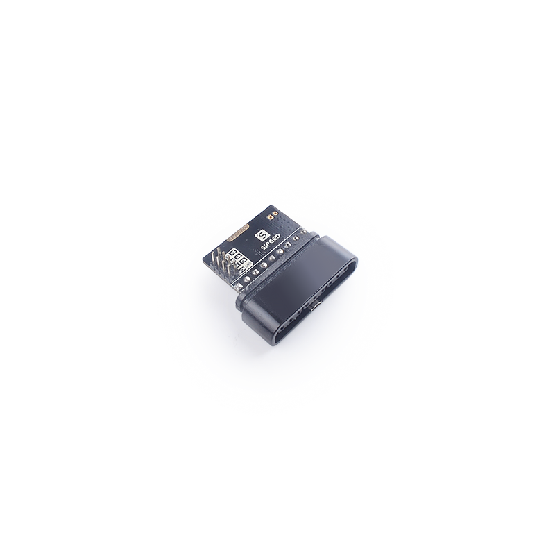
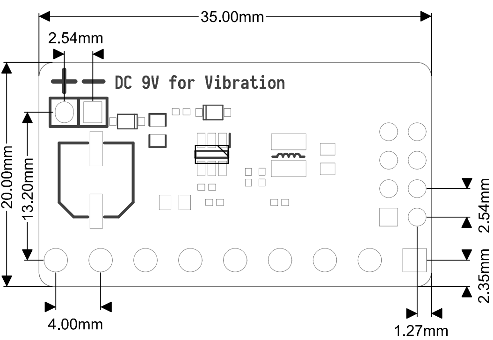

# SPMOD - JoyStick

## 概述

SPMOD_JoyStick (JoyStick模块)。

## SPMOD - JoyStick 介绍

- 采用 **Sipeed-SPMOD** 接口(2.54mm * 8PIN 排针)，统一 MaixPy 开发板接口
- 通过SP-MOD SPI接口连接
- 可通过外部适配器单独连接7.2V~9V DC，为手柄的振动马达供电
- 内置升压电路，轻松驱动手柄
- PSX/PS2兼容
- 模块尺寸：35.0\*20.0\*13.3mm

###  SPMOD_JoyStick 模块引脚定义：

| 引脚序号  | 引脚名称 | 类型  | 引脚说明    |
| -------- | -------- | ---- | ---------- |
| 1 | GND | G | 模块电源地 |
| 2 | CS | I | SPI片选引脚 |
| 3 | SO | I/O | MISO数据引脚，手柄信号输出 |
| 4 | NC | NC | 悬空引脚，无功能 |
| 5 | 3V3 | V | 模块电源输入正 |
| 6 | SCK | I | SPI串行时钟引脚 |
| 7 | SI | I/O | MOSI数据引脚，手柄信号输入 |
| 8 | ACK | O | 确认信号输出引脚 |

## 使用例程

- 待更新

## 参考设计

- SPMOD_JoyStick 尺寸图：

-----

## 资源链接

| 资源 | 链接 |
| --- | --- |
| 官网 | www.sipeed.com |
| SIPEED 官方淘宝店 |[sipeed.taobao.com](sipeed.taobao.com) |
|Github | [https://github.com/sipeed](https://github.com/sipeed) |
|BBS | [http://bbs.sipeed.com](http://bbs.sipeed.com) |
|MaixPy 文档官网 | [http://maixpy.sipeed.com](http://wiki.sipeed.com/maixpy) |
|Sipeed 模型平台 | [https://maixhub.com](https://maixhub.com) |
|SDK 相关信息 | [https://dl.sipeed.com/MAIX/SDK](https://dl.sipeed.com/MAIX/SDK) |
|HDK 相关信息 | [https://dl.sipeed.com/MAIX/HDK](https://dl.sipeed.com/MAIX/HDK) |
|E-mail(技术支持和商业合作) | [Support@sipeed.com](mailto:support@sipeed.com) |
|telgram link | https://t.me/sipeed |
|MaixPy AI QQ 交流群 | 878189804 |
|MaixPy AI QQ 交流群(二群) | 1129095405 |
