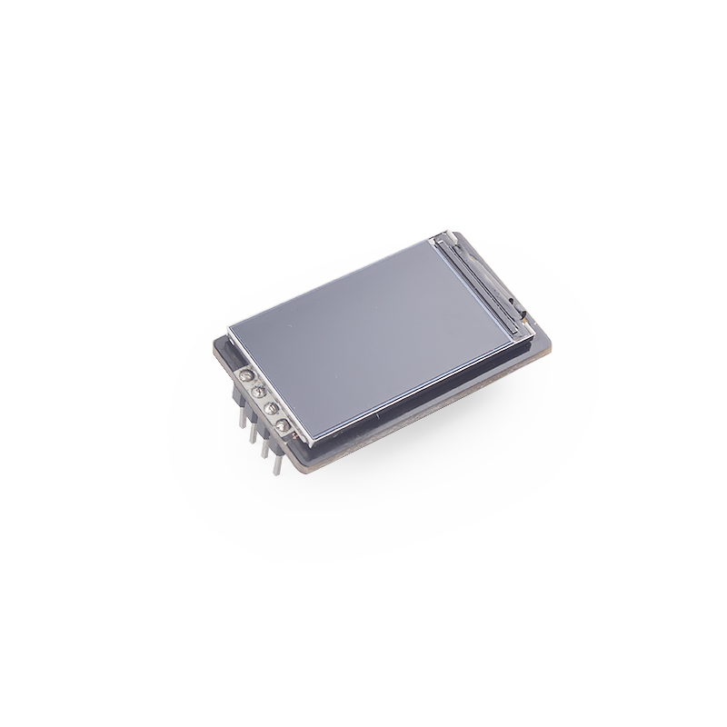

# SPMOD - LCD 1.14


## 概述



SPMOD_LCD1.14(1.14寸 LCD 屏幕模块)采用 ST7735S TFT LCD屏。

## SPMOD - LCD1.14 介绍

- 采用 **Sipeed-SPMOD** 接口(2.54mm * 8PIN 排针)，统一 MaixPy 开发板接口
- 采用常见 LCD 驱动 IC ST7735S(4 线 SPI 通讯)
- 分辨率：240\*135
- 模块尺寸：35.0\*20.0mm

### ST7735S TFT LCD屏 介绍

| 功能特点： | 参数 |
| --- | -- |
| 工作电压 | 2.5V~4.8V |
| 工作电流 | <20mA |
| 工作温度 | -30℃ ~ 85℃ |
| 休眠电流 | <0.1mA |
| 屏幕大小 | 1.14英寸 |
| 有效显示区域 | 1.7mm * 10.8mm |
| 分辨率 | 160*80 |
| 色彩 | 132个RGB通道 |
| 对外接口 | 8P FPC (0.5mm间距) |
> 内部集成电路包含DC / DC转换器、可调VCOM生成器、非易失性（NV）存储器（用于存储初始寄存器设置）、显示时钟的振荡器以及时序控制器


###  SPMOD_LCD1.14 模块引脚定义：

| 引脚序号  | 引脚名称 | 类型  | 引脚说明    |
| -------- | -------- | ---- | ---------- |
| 1 | GND | G  | 模块电源地 |
| 2 | CS | I  | SPI片选引脚 |
| 3 | D/C | I  | 数据/命令输入切换引脚  |
| 4 | RST | I  | 模块复位引脚，低有效 |
| 5 | 3V3 | V  | 模块电源输入正 |
| 6 | SCK | I  | SPI串行时钟引脚 |
| 7 | SI | I/O  | MOSI数据引脚，主机输出从机输入 |
| 8 | BL | I  | 背光控制引脚，低电平关闭背光 |


- 接线方式:

|   MCU:FUN(IO)   | SP_LCD |
| :-------------: | :----: |
|  GPIOHS7(IO_7)  |  RST   |
| GPIOHS15(IO_15) |  D/C   |
| SPI:SS0(IO_20)  |   CS   |
| SPI:SCK(IO_21)  |  SCK   |
| SPI:MOSI(IO_8)  |   SI   |
|  GPIOHS6(IO_6)  |   BL   |
|  2.5~4.8V   |  3.3V  |
|  GND   |  GND   |


## 使用例程

* 流程

  1. 初始化配置
  2. 创建 Image 并填充
  3. 发送图像并刷新

### C 示例：

```c

  fpioa_set_function(SPI_IPS_LCD_CS_PIN_NUM, FUNC_SPI1_SS0);   // SPI_IPS_LCD_CS_PIN_NUM: 20;
  fpioa_set_function(SPI_IPS_LCD_SCK_PIN_NUM, FUNC_SPI1_SCLK); // SPI_IPS_LCD_SCK_PIN_NUM: 21;
  fpioa_set_function(SPI_IPS_LCD_MOSI_PIN_NUM, FUNC_SPI1_D0);  // SPI_IPS_LCD_MOSI_PIN_NUM: 8;
  fpioa_set_function(SPI_IPS_LCD_DC_PIN_NUM, FUNC_GPIOHS0 + SPI_IPS_LCD_DC_GPIO_NUM);   // SPI_IPS_LCD_DC_PIN_NUM: 15; SPI_IPS_LCD_DC_GPIO_NUM: 15;
  fpioa_set_function(SPI_IPS_LCD_RST_PIN_NUM, FUNC_GPIOHS0 + SPI_IPS_LCD_RST_GPIO_NUM); // SPI_IPS_LCD_RST_PIN_NUM: 7; SPI_IPS_LCD_RST_GPIO_NUM: 7;
  fpioa_set_function(SPI_IPS_LCD_BL_PIN_NUM, FUNC_GPIOHS0 + SPI_IPS_LCD_BL_GPIO_NUM);   // SPI_IPS_LCD_BL_PIN_NUM: 6; SPI_IPS_LCD_BL_GPIO_NUM: 6;

  // set gpiohs work mode to output mode
  gpiohs_set_drive_mode(SPI_IPS_LCD_DC_GPIO_NUM, GPIO_DM_OUTPUT);
  gpiohs_set_drive_mode(SPI_IPS_LCD_RST_GPIO_NUM, GPIO_DM_OUTPUT);
  gpiohs_set_drive_mode(SPI_IPS_LCD_BL_GPIO_NUM, GPIO_DM_OUTPUT);

  spi_init(1, SPI_WORK_MODE_0, SPI_FF_STANDARD, DATALENGTH, 0);

  ips_lcd_init(); // init
  LCD_ShowPicture(0, 0, LCD_W, LCD_H, gImage_nanke); // display
```

### MaixPy 例程：

```python

  # 20: SPI_LCD_CS_PIN_NUM;
  fm.register(SPI_LCD_CS_PIN_NUM, fm.fpioa.GPIOHS20, force=True)
  # 15: SPI_LCD_DC_PIN_NUM;
  fm.register(SPI_LCD_DC_PIN_NUM, fm.fpioa.GPIOHS15, force=True)
  # 6: SPI_LCD_BUSY_PIN_NUM;
  fm.register(SPI_LCD_BUSY_PIN_NUM, fm.fpioa.GPIOHS6, force=True)
  # 7: SPI_LCD_RST_PIN_NUM;
  fm.register(SPI_LCD_RST_PIN_NUM, fm.fpioa.GPIOHS7, force=True)

  # set gpiohs work mode to output mode
  cs = GPIO(GPIO.GPIOHS20, GPIO.OUT)
  dc = GPIO(GPIO.GPIOHS15, GPIO.OUT)
  busy = GPIO(GPIO.GPIOHS6, GPIO.OUT)
  rst = GPIO(GPIO.GPIOHS7, GPIO.OUT)

  # 21: SPI_LCD_SCK_PIN_NUM; 8: SPI_LCD_MOSI_PIN_NUM;
  spi1 = SPI(SPI_LCD_NUM, mode=SPI.MODE_MASTER, baudrate=SPI_LCD_FREQ_KHZ * 1000,
              polarity=0, phase=0, bits=8, firstbit=SPI.MSB, sck=SPI_LCD_SCK_PIN_NUM, mosi=SPI_LCD_MOSI_PIN_NUM)

  ips = SPLCD114(spi1, cs, dc, rst, busy, IPS_WIDTH, IPS_HEIGHT, IPS_MODE)

  # create an 'image' and fill it
  img = image.Image()
  img.draw_rectangle(80, 80, 30, 30)

  # display
  ips.display(img)


```

### 运行环境

|  语言  |  开发板  |          SDK/固件版本          |
| :----: | :------: | :----------------------------: |
|   C    | MaixCube | kendryte-standalone-sdk v0.5.6 |
| MaixPy | MaixCube |         maixpy v0.5.1          |

*MaixPy固件建议自行从最新源码编译*

### 运行结果


* C

  

* MaixPy

  

### 移植

修改以下参数即可适配其他 K210 开发板.

* C

```c
  // board_config.h
  #define SPI_INDEX           1
  #define SPI_SCLK_RATE       600*1000
  #define SPI_CHIP_SELECT_NSS 0 // SPI_CHIP_SELECT_0

  #define SPI_IPS_LCD_CS_PIN_NUM      20
  #define SPI_IPS_LCD_SCK_PIN_NUM     21
  #define SPI_IPS_LCD_MOSI_PIN_NUM    8

  #define SPI_IPS_LCD_DC_PIN_NUM     15
  #define SPI_IPS_LCD_BL_PIN_NUM      6
  #define SPI_IPS_LCD_RST_PIN_NUM     7

  #define SPI_IPS_LCD_DC_GPIO_NUM     15
  #define SPI_IPS_LCD_BL_GPIO_NUM     6
  #define SPI_IPS_LCD_RST_GPIO_NUM    7

  #define USE_HORIZONTAL 3    // 0/1 is horizontal, and 2/3 is vertical.
```

* Maixpy

```python
  ################### config ###################
  SPI_LCD_NUM = SPI.SPI1
  SPI_LCD_DC_PIN_NUM = const(15)
  SPI_LCD_BUSY_PIN_NUM = const(6)
  SPI_LCD_RST_PIN_NUM = const(7)
  SPI_LCD_CS_PIN_NUM = const(20)
  SPI_LCD_SCK_PIN_NUM = const(21)
  SPI_LCD_MOSI_PIN_NUM = const(8)
  SPI_LCD_FREQ_KHZ = const(600)
  ##############################################
```


## 参考设计

- SPMOD_LCD1.14 尺寸图：


-----


-----

## 资源链接

| 资源 | --- |
| --- | --- |
| 官网 | www.sipeed.com |
| SIPEED 官方淘宝店 |[sipeed.taobao.com](sipeed.taobao.com) |
|Github | [https://github.com/sipeed](https://github.com/sipeed) |
|BBS | [http://bbs.sipeed.com](http://bbs.sipeed.com) |
|MaixPy 文档官网 | [http://maixpy.sipeed.com](http://wiki.sipeed.com/maixpy) |
|Sipeed 模型平台 | [https://maixhub.com](https://maixhub.com) |
|SDK 相关信息 | [https://dl.sipeed.com/MAIX/SDK](https://dl.sipeed.com/MAIX/SDK) |
|HDK 相关信息 | [https://dl.sipeed.com/MAIX/HDK](https://dl.sipeed.com/MAIX/HDK) |
|E-mail(技术支持和商业合作) | [Support@sipeed.com](mailto:support@sipeed.com) |
|telgram link | https://t.me/sipeed |
|MaixPy AI QQ 交流群 | 878189804 |
|MaixPy AI QQ 交流群(二群) | 1129095405 |
