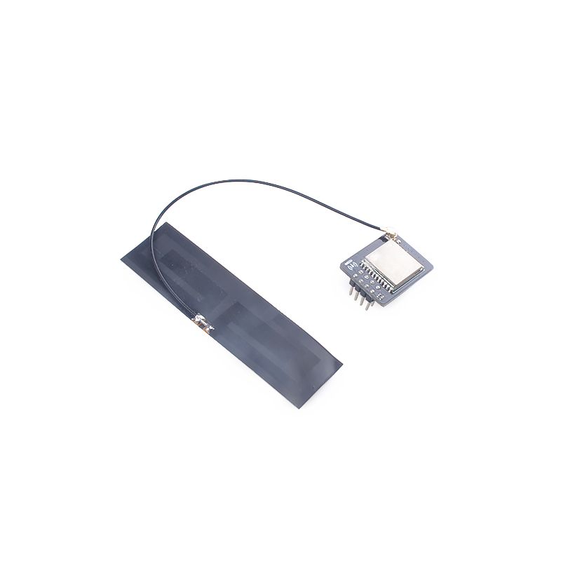
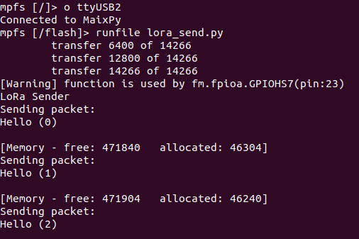
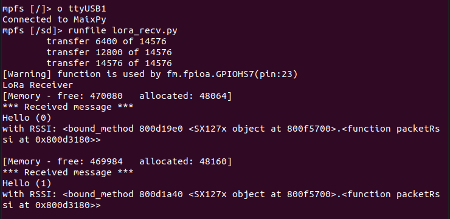

# SPMOD - LoRa


## 概述



SPMOD_LoRa(LoRa 模块)采用 M-XL8 模块。

## SPMOD - LoRa 介绍

- 采用 **Sipeed-SPMOD** 接口(2.54mm * 8PIN 排针)，统一 MaixPy 开发板接口
- 利用 SP-MOD SPI 和 LoRa 模块通讯
- LoRa 模块：M-XL8 SX1276 模块是一个 SPI 接口，内置 LoRaTM 调制解调器和可调功率放大器的 LoRa 模块，它具有高性能和可靠性
- 370MHz-1200MHz, 最大20dBm (100mW)持续发射功率
- 模块尺寸：25.0\*10.0\*4.3mm

### M-XL8 SX1276 LoRa 模块 介绍

| 功能特点： | 参数 |
| --- | -- |
| 工作频段 | 370MHz-1200Mhz |
| 发射功率 | 20dBm（最大） |
| 通信接口 | SPI |
| 工作电压 | 1.8V~6.3V |
| 工作温度 | -40℃ - 80℃ |
| 天线 | 外置天线，IPEX或焊接 |
| 接收灵敏度 | -148dbm |
| RSSI动态范围 | 127dB |
| 最大链路预算 | 168dB |
| 收发状态电流 | 9.9mA |
| 睡眠状态电流 | 50nA |
| 调制方式 | FSK, GFSK, MSK, GMSK, LoRaTM及OOK |
> 内置LoRaTM调制解调器，内置CRC，继承+12dBm可调PA+LNA


###  SPMOD_lora 模块引脚定义：

| 引脚序号  | 引脚名称 | 类型  | 引脚说明    |
| -------- | -------- | ---- | ---------- |
| 1 | GND | G  | 模块电源地 |
| 2 | CS | I/O | SPI片选引脚 |
| 3 | SO | I/O | MISO数据引脚，主机输入从机输出 |
| 4 | RST | I | 模块复位引脚，低有效 |
| 5 | 3V3 | V | 模块电源输入正 |
| 6 | SCK | I | SPI串行时钟引脚 |
| 7 | SI | I/O | MOSI数据引脚，主机输出从机输入 |
| 8 | IRQ | I | 连接至模块DIO0，可编程决定功能 |


- 接线方式:

|   MCU:FUN(IO)   | SP_LCD |
| :-------------: | :----: |
|  GPIOHS7(IO_7)  |  RST   |
| SPI:MISO(IO_15) |   SO   |
| SPI:SS0(IO_20)  |   CS   |
| SPI:SCK(IO_21)  |  SCK   |
| SPI:MOSI(IO_8)  |   SI   |
|   GPIOH(IO_6)  |  IRQ   |
|  1.8-6.3V    |  3.3V  |
|   GND      |  GND   |


## 使用例程

* 流程

  1. 创建 LoRa 对象并初始化
  2. 发送或者接收数据

### C 示例：

  ```c

  fpioa_set_function(SPI_LoRa_SX127X_CS_PIN_NUM, FUNC_SPI1_SS0);   // CS: 20
  fpioa_set_function(SPI_LoRa_SX127X_SCK_PIN_NUM, FUNC_SPI1_SCLK); // SCLK: 21
  fpioa_set_function(SPI_LoRa_SX127X_MOSI_PIN_NUM, FUNC_SPI1_D0);  // MOSI: 8
  fpioa_set_function(SPI_LoRa_SX127X_MISO_PIN_NUM, FUNC_SPI1_D1);  // MISO: 15

  fpioa_set_function(SPI_LoRa_SX127X_IRQ_PIN_NUM, FUNC_GPIOHS0 + SPI_LoRa_SX127X_IQR_GPIO_NUM); // IQR: 6
  fpioa_set_function(SPI_LoRa_SX127X_RST_PIN_NUM, FUNC_GPIOHS0 + SPI_LoRa_SX127X_RST_GPIO_NUM); // RST: 7

  spi_init(SPI_DEVICE_1, SPI_WORK_MODE_0, SPI_FF_STANDARD, DATALENGTH, 0);

  sx1278_begin(&SX1278, SX1278_433MHZ, SX1278_POWER_17DBM, SX1278_LoRa_SF_8,
                 SX1278_LoRa_BW_20_8KHZ, 10);

  if (master == 1)
  {
      printf("====MASTER====\r\n");
      ret = sx1278_LoRaEntryTx(&SX1278, 16, 2000);
  }
  else
  {
      printf("====SALAVE====\r\n");
      ret = sx1278_LoRaEntryRx(&SX1278, 16, 2000);
  }

  ```

### MaixPy 例程：

  ```python

  fm.register(20, fm.fpioa.GPIOHS20, force=True) # RST
  fm.register(7, fm.fpioa.GPIOHS7, force=True) # CS

  # set gpiohs work mode to output mode
  cs = GPIO(GPIO.GPIOHS20, GPIO.OUT)
  rst = GPIO(GPIO.GPIOHS7, GPIO.IN)
  # The other pins are configured at SPI initialization time

  spi1 = SPI(SPI.SPI1, mode=SPI.MODE_MASTER, baudrate=100 * 1000,
               polarity=0, phase=0, bits=8, firstbit=SPI.MSB, sck=21, mosi=8, miso = 15)

  lora = SX127x(spi=spi1, pin_ss=cs)
  lora.init()

  #######receiver###########
  receive(lora)

  ########sender###########
  # send(lora)


  ```

### 运行环境

|  语言  |  开发板  |          SDK/固件版本          |
| :----: | :------: | :----------------------------: |
|   C    | MaixCube | kendryte-standalone-sdk v0.5.6 |
| MaixPy | MaixCube |         maixpy v0.5.1          |

*MaixPy固件建议自行从最新源码编译*

### 运行结果

* C

  <center class="third">
	  
  </center>

* MaixPy

  <center class="third">
	  
  </center>

### 移植

修改以下参数即可适配其他 K210 开发板.

* C

  ```c
    // board_config.h
    #define SPI_INDEX           1
    #define SPI_SCLK_RATE       600*1000
    #define SPI_CHIP_SELECT_NSS 0//SPI_CHIP_SELECT_0

    #define SPI_LoRa_SX127X_CS_PIN_NUM      20
    #define SPI_LoRa_SX127X_SCK_PIN_NUM     21
    #define SPI_LoRa_SX127X_MOSI_PIN_NUM    8
    #define SPI_LoRa_SX127X_MISO_PIN_NUM    15

    #define SPI_LoRa_SX127X_IRQ_PIN_NUM     6
    #define SPI_LoRa_SX127X_RST_PIN_NUM     7

    #define SPI_LoRa_SX127X_IQR_GPIO_NUM    6
    #define SPI_LoRa_SX127X_RST_GPIO_NUM    7
  ```

* MaixPy

  ```python
    ################### config ###################
    LoRa_RST = const(20)
    LoRa_CS = const(7)
    LoRa_SPI_SCK = const(21)
    LoRa_SPI_MOSI = const(8)
    LoRa_SPI_MISO = const(15)
    LoRa_SPI_NUM = SPI.SPI1
    LoRa_SPI_FREQ_KHZ = const(100)
    ##############################################
  ```

## 参考设计

- SPMOD_LoRa 尺寸图：


-----

## 资源链接

| 资源 | --- |
| --- | --- |
| 官网 | www.sipeed.com |
| SIPEED 官方淘宝店 |[sipeed.taobao.com](sipeed.taobao.com) |
|Github | [https://github.com/sipeed](https://github.com/sipeed) |
|BBS | [http://bbs.sipeed.com](http://bbs.sipeed.com) |
|MaixPy 文档官网 | [http://maixpy.sipeed.com](http://wiki.sipeed.com/maixpy) |
|Sipeed 模型平台 | [https://maixhub.com](https://maixhub.com) |
|SDK 相关信息 | [https://dl.sipeed.com/MAIX/SDK](https://dl.sipeed.com/MAIX/SDK) |
|HDK 相关信息 | [https://dl.sipeed.com/MAIX/HDK](https://dl.sipeed.com/MAIX/HDK) |
|E-mail(技术支持和商业合作) | [Support@sipeed.com](mailto:support@sipeed.com) |
|telgram link | https://t.me/sipeed |
|MaixPy AI QQ 交流群 | 878189804 |
|MaixPy AI QQ 交流群(二群) | 1129095405 |
