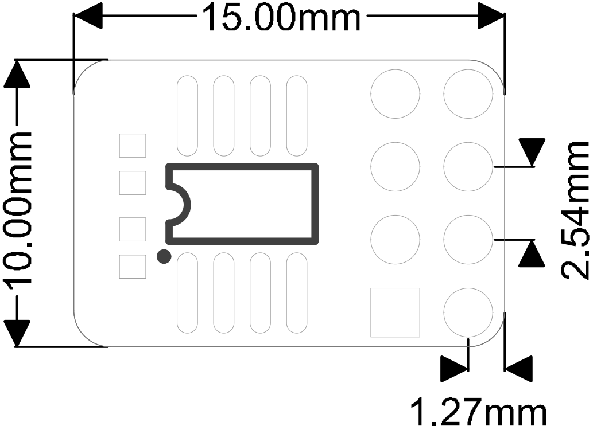

# SPMOD - PSRAM

## 概述

SPMOD_PSRAM(PSRAM模块)采用 IPS6404L-SQ 芯片。

## SPMOD - PSRAM 介绍

- 采用 **Sipeed-SPMOD** 接口(2.54mm * 8PIN 排针)，统一 MaixPy 开发板接口
- 通过SP-MOD SPI/QPI接口连接
- Pseudo−SRAM芯片：IPS6404L-SQ是一个容量为64Mbit，SPI/QPI接口，具有出色的可靠性的和响应时间的伪随机动态存储器芯片。
- 工作频率：104MHz
- SPI读取响应时间：30.3ns
- 模块尺寸：15.0\*10.0\*13.3mm

###  IPS6404L-SQ 迫真静态随机存储器介绍

| 功能特点： | 参数 |
| --- | -- |
| 工作电压 | 2.7V~3.6V |
| 工作电流 | 10mA |
| 工作温度 | -30℃~85℃ |
| 休眠电流 | <250μA |
| 工作频率 | 104Mhz |
| SPI读取响应时间 | 30.3ns |
| 其他操作响应时间 | 9.3ns |
| 对外接口 | PI/QPI可选，默认SPI |

###  SPMOD_PSRAM 模块引脚定义：

| 引脚序号  | 引脚名称 | 类型  | 引脚说明    |
| -------- | -------- | ---- | ---------- |
| 1 | GND  | G | 模块电源地 |
| 2 | CS | I  | SPI片选引脚 |
| 3 | D1 | I/0 | MISO数据引脚，模块数据输出 |
| 4 | D3 | I/O | 无功能 (QSPI模式下为IO3) |
| 5 | 3V3 | V | 模块电源输入正 |
| 6 | SCK | I | SPI串行时钟引脚 |
| 7 | D0 | I/0 | MOSI数据引脚，模块数据输入 (QSPI模式下为IO0) |
| 8 | D2 | I/O | 无功能 (QSPI模式下为IO2) |

## 使用例程

- 待更新

## 参考设计

- SPMOD_PSRAM 尺寸图：

-----

## 资源链接

| 资源 | --- |
| --- | --- |
| 官网 | www.sipeed.com |
| SIPEED 官方淘宝店 |[sipeed.taobao.com](sipeed.taobao.com) |
|Github | [https://github.com/sipeed](https://github.com/sipeed) |
|BBS | [http://bbs.sipeed.com](http://bbs.sipeed.com) |
|MaixPy 文档官网 | [http://maixpy.sipeed.com](http://wiki.sipeed.com/maixpy) |
|Sipeed 模型平台 | [https://maixhub.com](https://maixhub.com) |
|SDK 相关信息 | [https://dl.sipeed.com/MAIX/SDK](https://dl.sipeed.com/MAIX/SDK) |
|HDK 相关信息 | [https://dl.sipeed.com/MAIX/HDK](https://dl.sipeed.com/MAIX/HDK) |
|E-mail(技术支持和商业合作) | [Support@sipeed.com](mailto:support@sipeed.com) |
|telgram link | https://t.me/sipeed |
|MaixPy AI QQ 交流群 | 878189804 |
|MaixPy AI QQ 交流群(二群) | 1129095405 |
