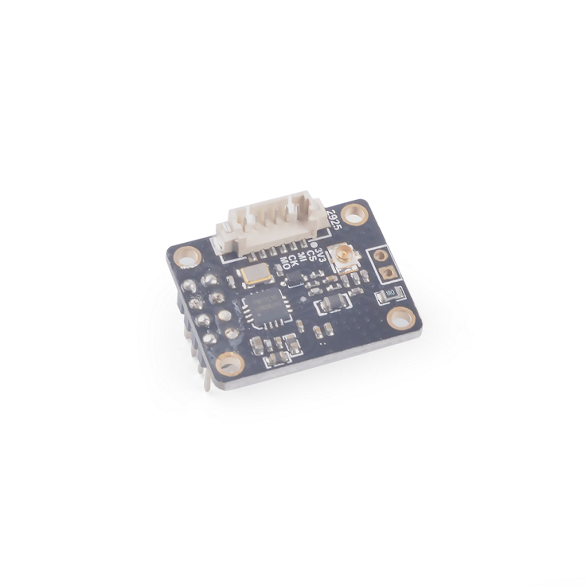
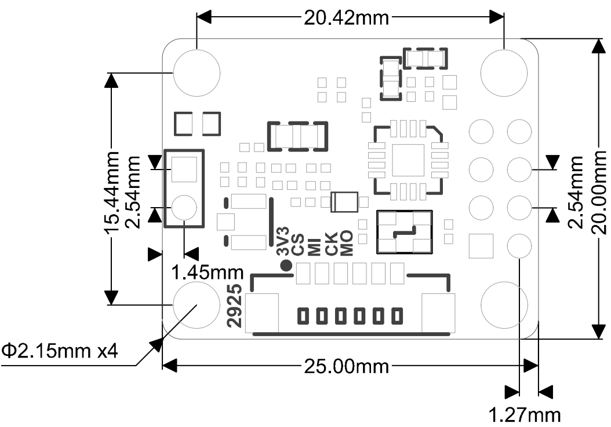

# SPMOD - RFID


## 概述



SPMOD_RFID (NFC 模块)采用复旦微电子 FM17510 高度集成的非接触式（13Mhz）的读写芯片。

## SPMOD - RFID 介绍

- 采用 **Sipeed-SPMOD** 接口(2.54mm * 8PIN 排针)，统一 MaixPy 开发板接口
- 利用SP-MOD SPI和RFID模块通讯
- 64Byte收发缓冲FIFO
- RIFC IC 为 FM17510。
- 模块尺寸：25.0\*20.1\*6.2mm

### FM17510 介绍

FM17510 是一款高度集成的工作在 13.56MHz 下的非接触读写器芯片，支持符合 ISO/IEC 14443 TypeA 协议的非接触读写器模式。

同时提供了低功耗的外部卡片侦测功能，方便电池供电、需要低功耗工作、并且需要实时处理任意 时刻会进入射频场的外部卡片的读写器设备。

FM17510 具有低电压、低功耗、 单端驱动等特点。适用于低功耗、低电压、低成本要求的非接触读。

- FM1750XX 在软硬件层面上兼容 MFRC552，支持工作模式：


| FM17510  功能特点：|
| --- |
| 支持 ISO/IEC 14443 TypeA 读写器模式 |
| 读写器模式支持 M1 加密算法 |
| ISO14443 TYPEA 支持通讯速率 106kbps， 212kbps， 424kbps |
| 支持 SPI 串行接口，最高 10Mbps |
| Host 接口独立电源供电，电压范围 2.2~3.6V |
| 工作温度范围 -40℃ ~ 85℃ |
| 64Byte 收发缓冲 FIFO |
| 中断输出模式灵活可配 |
| 多种低功耗模式 : Soft powerdown模式 , Hard powerdown 模式, Deep powerdown 模式（典型值 1uA） |
| 支持低功耗外部卡片侦测功能 |
| 可编程定时器 |
| 内置振荡电路外接 27.12MHz 晶振 |
| 宽电压工作范围 2.2V~3.6V |
| 内置 CRC 协处理器 |
| 可编程 I/O 引脚|


###  SPMOD_RFID 模块引脚定义：


| 引脚序号 | 引脚名称 | 类型 | 引脚说明 | Note |
| --- | --- | --- | --- | --- |
| 1 | GND | G | 模块电源地 |
| 2 | CS | I | SPI片选引脚 |
| 3 | SO | I/O | MISO数据引脚，主机输入从机输出 |
| 4 | NPD | I | 复位/休眠控制引脚 |
| 5 | 3V3 | V | 模块电源输入正 |
| 6 | SCK | I | SPI串行时钟引脚 |
| 7 | SI | I/O | MOSI数据引脚，主机输出从机输入 |
| 8 | IRQ | O | 模块中断输出引脚 |


> 当 NPD 引脚为低电平时，模块进入休眠状态；当 NPD 引脚输入一个上升沿时，模块复位。


- 接线方式:

|   MCU:FUN(IO)   | SP_RFID |
| :-------------: | :-----: |
|    NC(IO_7)     |   NPD   |
| SPI:MISO(IO_15) |   SO    |
| SPI:SS0(IO_20)  |   CS    |
| SPI:SCK(IO_21)  |   SCK   |
| SPI:MOSI(IO_8)  |   SI    |
|  NC(IO_6)    |   IRQ   |
|  2.2~3.6V    |  3.3V   |
|  GND       |   GND   |


## 使用例程

* 流程
  1. 初始化
  2. 扫描并绑定卡片
  3. 读写数据

### C 示例：

```c

  fpioa_set_function(RFID_CS_PIN, FUNC_GPIOHS0 + RFID_CS_HSNUM); // RFID_CS_PIN: 20;
  fpioa_set_function(RFID_CK_PIN, FUNC_GPIOHS0 + RFID_CK_HSNUM); // RFID_CK_PIN: 21;
  fpioa_set_function(RFID_MO_PIN, FUNC_GPIOHS0 + RFID_MO_HSNUM); // RFID_MO_PIN: 8;
  fpioa_set_function(RFID_MI_PIN, FUNC_GPIOHS0 + RFID_MI_HSNUM); // RFID_MI_PIN: 15;

  gpiohs_set_drive_mode(spi_io_cfg.hs_cs, GPIO_DM_OUTPUT);
  gpiohs_set_drive_mode(spi_io_cfg.hs_clk, GPIO_DM_OUTPUT);
  gpiohs_set_drive_mode(spi_io_cfg.hs_mosi, GPIO_DM_OUTPUT);
  gpiohs_set_drive_mode(spi_io_cfg.hs_miso, GPIO_DM_INPUT);

  // detected card
  PcdRequest(0x52, type)

  // auth and bind...

  // read or write 16 bytes data from sector 0x11
  PcdWrite(0x11, w_buf)
  PcdRead(0x11, &r_buf)

```

### MaixPy 例程：

```python

  # 20: CS_NUM;
  fm.register(20, fm.fpioa.GPIOHS20, force=True)
  # set gpiohs work mode to output mode
  cs = GPIO(GPIO.GPIOHS20, GPIO.OUT)

  # RFID_SCK: 21; RFID_SI:8; RFID_SO: 15;
  spi1 = SPI(SPI.SPI1, mode=SPI.MODE_MASTER, baudrate=600 * 1000,
          polarity=0, phase=0, bits=8, firstbit=SPI.MSB, sck=21, mosi=8, miso=15)

  # Create an object of the class MFRC522
  MIFAREReader = MFRC522(spi1, cs)

  # detected and auth, bind...

  # read or write 16 bytes data from sector 0x11
  MIFAREReader.MFRC522_Write(0x11, data)
  MIFAREReader.MFRC522_Read(0x11)

```
### 运行环境

|  语言  | 开发板   | SDK/固件版本                   |
| :----: | :------- | :----------------------------- |
|   C    | MaixCube | kendryte-standalone-sdk v0.5.6 |
| MaixPy | MaixCube | maixpy v0.5.1                  |

### 运行结果

* C

  

* MaixPy

  

### 移植

修改以下参数即可适配其他 K210 开发板.

* C

  ```c
    // board_config.h
    #define RFID_CS_PIN (20)
    #define RFID_CK_PIN (21)
    #define RFID_MO_PIN (8)
    #define RFID_MI_PIN (15)

    #define RFID_CS_HSNUM (20)
    #define RFID_CK_HSNUM (21)
    #define RFID_MO_HSNUM (8)
    #define RFID_MI_HSNUM (15)
  ```

* MaixPy

  ```python
    ################### config ###################
    CS_NUM = const(20)
    SPI_FREQ_KHZ = const(600)
    SPI_SCK = const(21)
    SPI_MOSI = const(8)
    SPI_MISO = const(15)
    #############################################
  ```


## 参考设计


- SPMOD_RFID 尺寸图：




-----

## 资源链接

| 资源 | --- |
| --- | --- |
| 官网 | www.sipeed.com |
| SIPEED 官方淘宝店 |[sipeed.taobao.com](sipeed.taobao.com) |
|Github | [https://github.com/sipeed](https://github.com/sipeed) |
|BBS | [http://bbs.sipeed.com](http://bbs.sipeed.com) |
|MaixPy 文档官网 | [http://maixpy.sipeed.com](http://wiki.sipeed.com/maixpy) |
|Sipeed 模型平台 | [https://maixhub.com](https://maixhub.com) |
|SDK 相关信息 | [https://dl.sipeed.com/MAIX/SDK](https://dl.sipeed.com/MAIX/SDK) |
|HDK 相关信息 | [https://dl.sipeed.com/MAIX/HDK](https://dl.sipeed.com/MAIX/HDK) |
|E-mail(技术支持和商业合作) | [Support@sipeed.com](mailto:support@sipeed.com) |
|telgram link | https://t.me/sipeed |
|MaixPy AI QQ 交流群 | 878189804 |
|MaixPy AI QQ 交流群(二群) | 1129095405 |
