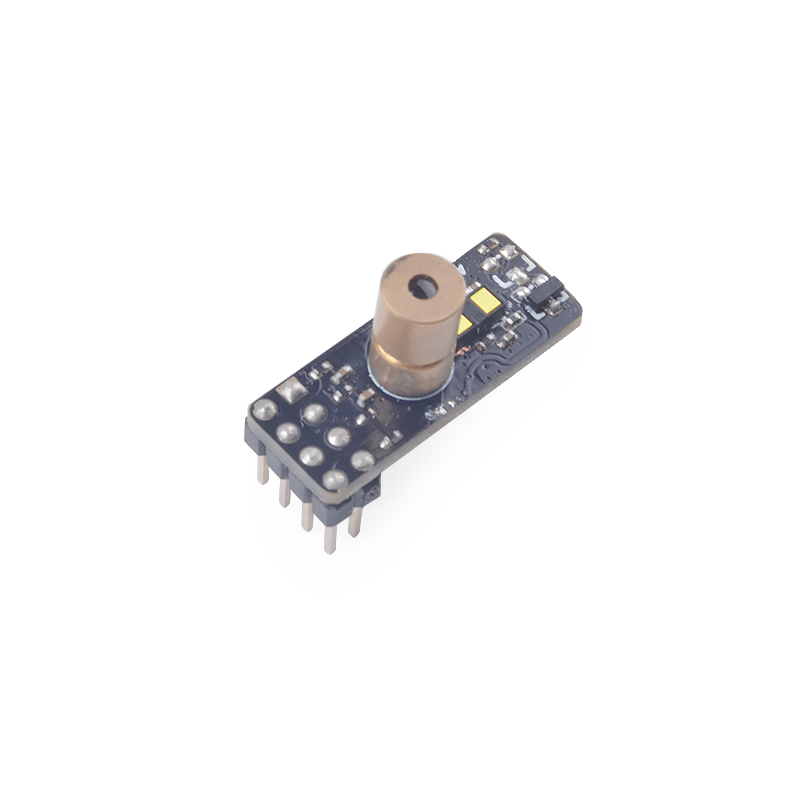

# SPMOD - TOF


## 概述



SPMOD_TOF(TOF 模块) 采用 VL53L0X 模块。

## SPMOD - TOF 介绍

- 采用 **Sipeed-SPMOD** 接口(2.54mm * 8PIN 排针)，统一 MaixPy 开发板接口
- 利用SP-MOD I2C 和 TOF 模块通讯
- ToF模块：VL53L0X模块是一个I2C接口，长距离单点飞行时间测定（ToF）模块，它具有高性能和可靠性
- 最远测量距离4000mm，最高50Hz的测量刷新率。典型前方测量角度27°
- 可选配红色激光器瞄准头，通过XSHUT引脚控制激光器开关
- 模块尺寸：25.0\*10\*3.15mm

### VL53L0X 介绍

| VL53L0X | 功能特性：|
| --- | --- |
| 测量距离 | 最大 4000mm(4m) |
| 工作刷新率 | 50Hz |
| 测量角度（正面）| 27°|
| 通信接口 | I2C |
| 工作电压 | 2.6V~3.5V (选用红色激光时： 2.8V~3.3V) |
| 工作状态电流 | 18mA (选用红色激光时： 20mA) |
| 工作温度 | -40℃ - 80℃ |
| 睡眠状态电流 | 5uA |


###  SPMOD_TOF 模块引脚定义：


| 引脚序号 | 引脚名称 | 类型 | 引脚说明 |
| --- | --- | --- | --- |
| 1 | GND | G  | 模块电源地 |
| 2 | IRQ | I  | 模块中断输入引脚，连接至 VL53L0X 的GPIO1 |
| 3 | NC  | NC | 悬空引脚，无功能 |
| 4 | SDA | I/O | 模块 I2C 串行数据引脚 |
| 5 | 3V3 | V  | 模块电源输入正 |
| 6 | NC  | NC | 悬空引脚，无功能 |
| 7 | SHT | I  | 模块休眠&激光头控制引脚 #注释 |
| 8 | SCL | I  | 模块 I2C 串行时钟引脚 |

> SHT 低电平时，模块休眠 &激光头关闭


- 接线方式:

|  MCU:FUN(IO)  | SP_RFID |
| :-----------: | :-----: |
| I2C:SDA(IO_7) |   SDA   |
|   NC(IO_15)   |   NC    |
|   NC(IO_20)   |   IRQ   |
|   NC(IO_21)   |   NC    |
| GPIOHS(IO_8)  |   SHT   |
| I2C:SCL(IO_6) |   SCL   |
|   2.8~3.5V    |  3.3V   |
|      GND      |   GND   |


## 使用例程

* 流程
  1. 初始化
  2. 校准(可选)
  3. 读取距离(多种模式可选)

### C 示例：

```c

  //set io mux
    fpioa_set_function(VL53L0X_SCL, FUNC_I2C0_SCLK + VL53L0X_I2C_DEVICE * 2);
    fpioa_set_function(VL53L0X_SDA, FUNC_I2C0_SDA + VL53L0X_I2C_DEVICE * 2);
    fpioa_set_function(VL53L0X_SHT, FUNC_GPIOHS0 + VL53L0X_SHT);

    gpiohs_set_drive_mode(VL53L0X_SHT, GPIO_DM_OUTPUT);

    //i2c init
    maix_i2c_init(VL53L0X_I2C_DEVICE, 7, VL53L0X_I2C_FREQ_KHZ * 1000);

    while (vl53l0x_init(&vl53l0x_dev)) {
          printf("VL53L0X init error!!!\r\n");
          msleep(500);
    }

    printf("VL53L0X init success!\r\n");

    // adjusting
    printf("VL53L0X adjusting\r\n");
    vl53l0x_calibration_test(&vl53l0x_dev);

    // get distance
    printf("VL53L0X start work\r\n");
    vl53l0x_general_test(&vl53l0x_dev);

```

### MaixPy 例程：

```python

    fm.register(VL53L0X_SHT, fm.fpioa.GPIOHS0, force=True)
    XSHUT = GPIO(GPIO.GPIOHS0, GPIO.OUT)

    i2c = I2C(VL53L0X_I2C_NUM, freq=VL53L0X_FREQ, scl=VL53L0X_SCL, sda=VL53L0X_SDA)

    # create obj and read distance
	  tof = VL53L0X(i2c)
	  while True:
      mm = tof.read()
      utime.sleep_ms(100)
      print(mm)

```
### 运行环境

|  语言  | 开发板   | SDK/固件版本 |
| :----: | :------- | :--- |
|   C    | MaixCube | kendryte-standalone-sdk v0.5.6 |
| MaixPy | MaixCube | maixpy v0.5.1 |

### 运行结果

* C

  

* MaixPy

  - [None]
## 移植

修改以下参数即可适配其他 K210 开发板.

* C

```c
  // board_config.h
  #define VL53L0X_I2C_DEVICE 0 // i2c device number
  #define VL53L0X_I2C_FREQ_KHZ 100 // i2c frequence
  #define VL53L0X_SCL 6 // scl
  #define VL53L0X_SDA 7 // sda
  #define VL53L0X_SHT 8 // sht
```

* MaixPy

```python
  ################### config ###################
  VL53L0X_I2C_NUM = const(I2C.I2C0)
  VL53L0X_FREQ = const(100000)
  VL53L0X_SCL = const(6)
  VL53L0X_SDA = const(7)
  VL53L0X_SHT = const(8)
  ##############################################
```


## 参考设计

- SPMOD_TOF 尺寸图：


-----

## 资源链接

| 资源 | --- |
| --- | --- |
| 官网 | www.sipeed.com |
| SIPEED 官方淘宝店 |[sipeed.taobao.com](sipeed.taobao.com) |
|Github | [https://github.com/sipeed](https://github.com/sipeed) |
|BBS | [http://bbs.sipeed.com](http://bbs.sipeed.com) |
|MaixPy 文档官网 | [http://maixpy.sipeed.com](http://wiki.sipeed.com/maixpy) |
|Sipeed 模型平台 | [https://maixhub.com](https://maixhub.com) |
|SDK 相关信息 | [https://dl.sipeed.com/MAIX/SDK](https://dl.sipeed.com/MAIX/SDK) |
|HDK 相关信息 | [https://dl.sipeed.com/MAIX/HDK](https://dl.sipeed.com/MAIX/HDK) |
|E-mail(技术支持和商业合作) | [Support@sipeed.com](mailto:support@sipeed.com) |
|telgram link | https://t.me/sipeed |
|MaixPy AI QQ 交流群 | 878189804 |
|MaixPy AI QQ 交流群(二群) | 1129095405 |
