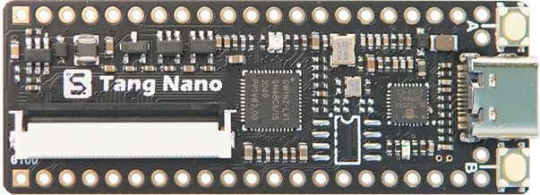
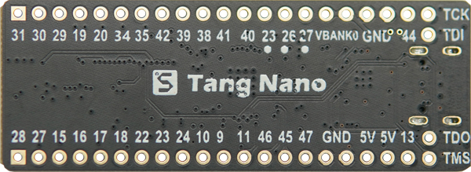
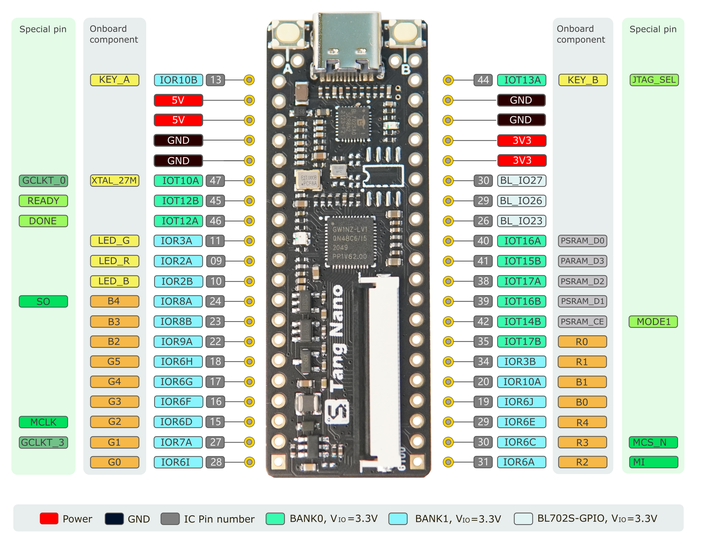

# Tang Nano 1K

> Edit on 2022.08.18

## Introduction

Tang Nano 1K is a core board designed based on [Gowin](https://www.gowinsemi.com/en/) GW1NZ-LV1 FPGA chip. The board is equipped with RGB LCD interface and onboard USG-JTAG debugger, which make it convenient for users to use. User can use this for small digital logic design and experiment.

## Parameters
The Tang Nano 1K development board is equipped with the GW1NZ-LV1QN48C6/I5 FPGA chip, a powerful and versatile device featuring rich logic resources and support for multiple I/O voltage standards. It integrates embedded Block SRAM (BSRAM), Phase-Locked Loops (PLLs), and Flash memory, making it a robust non-volatile FPGA solution. Furthermore, the on-board 27MHz active crystal oscillator provides a highly precise clock source for various FPGA timing operations.

|        item        |     Specs      |
| :----------------: | :------------: |
|        chip        | GW1NZ-LV1 FPGA |
| logic units(LUT4)  |      1152      |
|    Register(FF)    |      864       |
|  Block SRAM(bits)  |      72K       |
|  Number of B-SRAM  |       4        |
|  User flash(bits)  |      64K       |
|   Number of Pll    |       1        |
| Number of I/O Bank |       2        |

### Pinmap

## Informations

- [Datasheet](https://dl.sipeed.com/shareURL/TANG/Nano%201K/1_Specification)
- [Schematic](https://dl.sipeed.com/shareURL/TANG/Nano%201K/2_Schematic)
- [Bit number map](https://dl.sipeed.com/shareURL/TANG/Nano%201K/3_Bit_number_map)
- [Dimensional drawing](https://dl.sipeed.com/shareURL/TANG/Nano%201K/4_Dimensional_drawing)
- [3D File](https://dl.sipeed.com/shareURL/TANG/Nano%201K/5_3D_file)
- [Chip Manual](https://dl.sipeed.com/shareURL/TANG/Nano%201K/6_Chip_Manual)

- [Examples](https://wiki.sipeed.com/hardware/en/tang/common-doc/examples.html)

## Addition

1. If you have trouble with this board, you can join our telegram (t.me/sipeed) or contact us on twitter (https://twitter.com/SipeedIO).

2. For Fpga burning we require using [this](https://dl.sipeed.com/shareURL/TANG/programmer) Programmer application. Because other version Programmer application may fail burning this board.

3. If you meet problems, please visit [problems](./../common-doc/questions.md) first, normally most problems will be solved after using this programmer [Click me](https://dl.sipeed.com/shareURL/TANG/programmer).