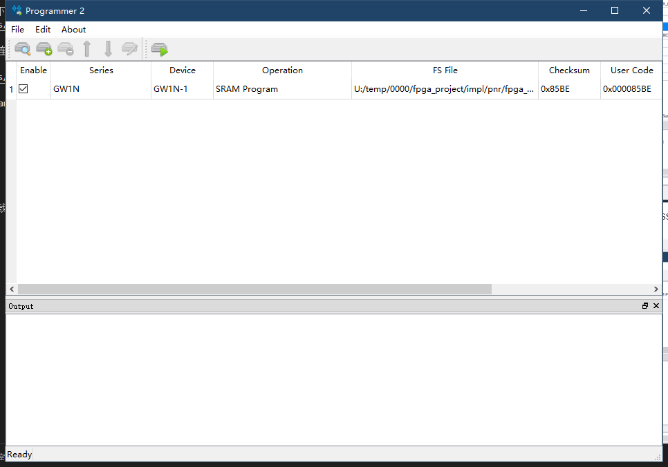

# Blink led

> Edit on 2022.04.19

From this essay we can learn the basic usage of Gowin IDE

## Create project

Create Project：File-->NEW-->FPGA Dsign Project-->OK

Set project name and project path (File name and project path shoule be English)

Choose correct device: 

## Prepare codes

After creating project, we can start editing codes. 
To creat a new file, we can click where the arrow points to in the picture or use shortcut key Ctrl+N.
Then choose Verilog File in the pop-up window.

Name for file (Suggested using English)

Double click the created file, then edit in right window

- We use light led as an example, copy the following "LED example codes" into the created file or edit the created file by yourself.  

~~~v
module led (
    input sys_clk,          // clk input
    input sys_rst_n,        // reset input
    output reg [2:0] led    // 110 B, 101 G,001 R
);

reg [23:0] counter;

always @(posedge sys_clk or negedge sys_rst_n) begin
    if (!sys_rst_n)
        counter <= 24'd0;
    else if (counter < 24'd1349_9999)       // 0.5s delay
        counter <= counter + 1'b1;
    else
        counter <= 24'd0;
end

always @(posedge sys_clk or negedge sys_rst_n) begin
    if (!sys_rst_n)
        led <= 3'b110;
    else if (counter == 24'd1349_9999)       // 0.5s delay
        led[2:0] <= {led[1:0],led[2]};
    else
        led <= led;
end

endmodule
~~~

## Systhesize, constrain, place&route

### Systhesize

After finishing steps above, go to the "Process" interface, systhesize the edited file, which means running "Systhesize". 

If the result is the same as shown below
 

It means that there is no bug in our code, we can continue the next steps. 

If there is some thing wrong, please fix by yourself. 

### Constrain

- Clock constraint is not involved here

To realize function of the code on FPGA, we must bind the ports we define with the chip pins.

Double click the FloorPlanner in the Process interface to set pin constrain(This can be continued if failing systhesize). 

First time open FloorPlanner it will prompt lack of ".cst" file, we just choose ok. 

The led schematic of nano is as shown below:

In this GUI interface we have two ways to constrain pins:
- Drag the corresponding port to the pin of chip
- Type the pin number corresponding to the port in IO constraint

So we can do the ordered operations in the opened window as what the following picture shows:(Just choose one way)
    

### Place&Route

After finishing Running "Place&Route" in the Process interface window, the result will be as same as below

If it shows different from the picture below, please fix by yourself.

## Program

Then connect the board with computer, download firmware.

Double click `Program Device` in Process interface to open programmer application

You can config download mode according to the following picture.
We use download to SRAM as an example.

If you need to store firmware with no power, just choose download to flash mode.

## End

Now the tutorial ends, if you have any suggestions, just leave a message.
