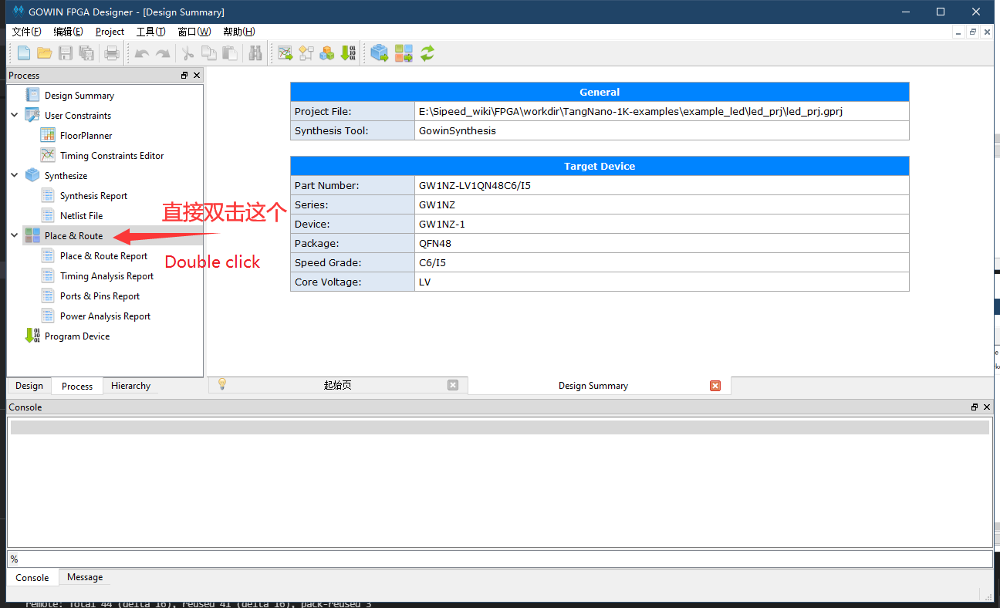
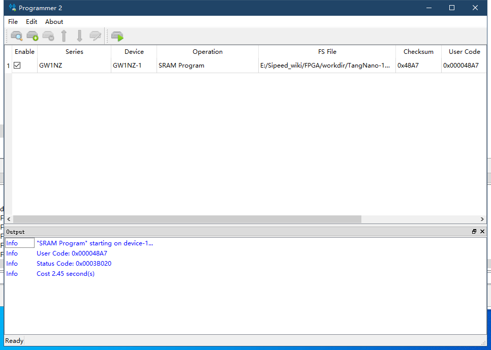

# Blink by github project

- First get sourcecode from github https://github.com/sipeed/TangNano-1K-examples
  
- Open led_prj.gprj file in TangNano-1K-examples\example_led\led_prj path
- Right click clean&Rerun all in process interface
  

- Connet the board and download firmware.
  Double click `Program Device` in Process interface to open programmer tool.
  

- Choose download to SRAM to verify codes quickly
  

    <a href="#" onClick="javascript :history.back(-1);">Previou page</a>

