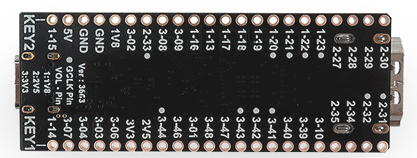
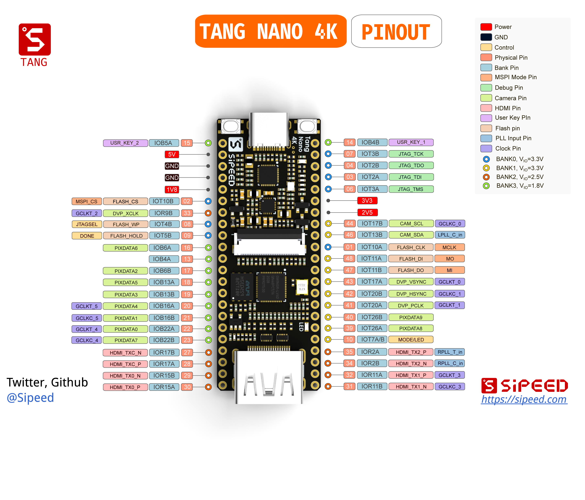

# Tang Nano 4K 

> Edit on 2022.04.06

## Introduction

Tang Nano 4K is a core board designed based on [Gowin](https://www.gowinsemi.com/en/) little GW1NSR-LV4C FPGA chip. The board is equipped with camera interface and HDMI interface. There is also an onboard USG-JTAG debugger, which make it convinent for users to use. Its Cortex-M3 hardcore can help users study mcu.

## Specs

- The sheet below shows difference with previous product

| model               | Tang Nano             | Tang Nano 4K   |
| ------------------- | --------------------- | -------------- |
| FPGA chip           | GW1N-1-LV             | GW1NSR-LV4C    |
| logic units         | 1152                  | 4608           |
| Register            | 864                   | 3456           |
| Hard core           | none                  | Coetex m3      |
| Block SRAM(bits)    | 72K                   | 180K           |
| User flash(bits)    | 96K                   | 256K           |
| Number of PLL       | 1                     | 2              |
| Number of I/O Bank  | 4                     | 4              |
| Number of users I/O | 41                    | 44             |
| Screen interface    | 40P RGB LCD interface | HDMI interface |
| camera interface    | None                  | DVP interface  |
| Size                | 58.4mm\*21.3mm        | 60mm\*22.86mm  |

## Others

- [Examples](./../Tang-Nano-Doc/examples.md)
- [Schematic](https://dl.sipeed.com/shareURL/TANG/Nano%204K/HDK/02_Schematic)
- [Download center](https://dl.sipeed.com/shareURL/TANG/Nano%204K/)

## Support

Email to support@sipeed.com for technical support and Business cooperation.

