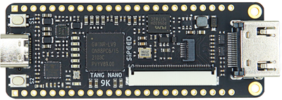
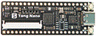
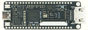

# Tang Nano 9K

>  Edit on 2022.05.13

## Introduction

Tang nano 9K is a development board based on [Gowin](https://www.gowinsemi.com/en/) GW1NR-9 FPGA chip.It equips with HDMI connector, RGB screen interface connector, SPI screen connector, 32Mbit SPI flash and 6 LEDs, so users can use it for FPGA verification, risc-v soft core verification and basic function verification easily and quickly. Its 8640 LUT4 logic units can not only be used for various complex logic circuits designing, but also used for running a complete PicoRV soft core. It also meets various needs of users, such as learning FPGA, verifying soft core and further design.

## Comparison

Tang Nano 9K is the 5th product of Sipeed Tang series. Before purchasing, you can compare and choose from the following table according to your demands:

| Model               | Tang Nano 1K                             | Tang Nano 4K                             | Tang Nano 9K                                            |
| :------------------ | :--------------------------------------- | :--------------------------------------- | :------------------------------------------------------ |
| Appearance          |  |  |                 |
| Logic Units (LUT4)  | 1152                                     | 4608                                     | 8640                                                    |
| Hard core processor | /                                        | Cortex m3                                | /                                                       |
| Crystal oscillator  | 27MHZ                                    | 27MHZ                                    | 27MHZ                                                   |
| Display interface   | RGB screen interface                     | HDMI                                     | HDMI,  RGB screen interface, SPI screen interface |
| Camera              | /                                        | Support OV2640                           | /                                                       |
| External SPI FLASH  | Reserved pads only                       | 32Mbits SPI flash                        | 32Mbits SPI flash                                       |
| TF card slot        | /                                        | /                                        | Yes                                                     |
| Debugger            | Onboard USB-JTAG                         | Onboard USB-JTAG                         | Onboard USB-JTAG & USB-UART                             |

## Characteristic

This form shows detail specs of Tang Nano 9K

| Item                                                                                                       | value                                                                   |
| ---------------------------------------------------------------------------------------------------------- | ----------------------------------------------------------------------- |
| Logic units(LUT4)                                                                                          | 8640                                                                    |
| Registers(FF)                                                                                              | 6480                                                                    |
| ShadowSRAM SSRAM(bits)                                                                                     | 17280                                                                   |
| Block SRAM BSRAM(bits)                                                                                     | 468K                                                                    |
| Number of B-SRAM                                                                                           | 26                                                                      |
| User flash(bits)                                                                                           | 608K                                                                    |
| SDR SDRAM(bits)                                                                                            | 64M                                                                     |
| 18 x 18 Multiplier                                                                                         | 20                                                                      |
| SPI FLASH                                                                                                  | 32M-bit                                                                 |
| Number of PLL                                                                                              | 2                                                                       |
| Display interface                                                                                          | HDMI interface, SPI screen interface and RGB screen interface           |
| Debugger                                                                                                   | Onboard BL702 chip provides USB-JTAG and USB-UART functions for GW1NR-9 |
| IO                                                                                                         | • support 4mA、8mA、16mA、24mA other driving capabilities  • Provides independent Bus Keeper, pull-up/pull-down resistors, and Open Drain output options for each I/O |
| Connector                                                                                                  | TF card slot, 2x24P 2.54mm Header pads                                  |
| Button                                                                                                     | 2 programmable buttons for users                                        |
| LED                                                                                                        | Onboard 6 programmable LEDs                                             |

| Usage           | FPGA                     | MCU                                                                               | FPGA+MCU                                                              |
| :-------------- | :----------------------- | :-------------------------------------------------------------------------------- | :-------------------------------------------------------------------- |
| Language        | Verilog HDL/Verilog      | C/C++                                                                             | Verilog HDL/Verilog ，  C/C++                                         |
| summary         | verify HDL design        | After flashing the softcore bitstream,  this board can be used as a normal microcontroller unit | After flashing the softcore bitstream, it can be used as two chips |
| suitable people | beginner，FPGA developer | RISC-V developers，Cortex-M developers                                            | Senior engineer                                 |

## User guide

1. Download our packaged user guide document : [Click me](https://dl.sipeed.com/shareURL/TANG/Nano%209K/6_Chip_Manual/EN/General%20Guide) (All PDFs mentioned below are here)
   
2. Install IDE and configure license : [Click me](./../Tang-Nano-Doc/install-the-ide.md)
   
3. Read this file (in the file downloaded in step 1) : [SUG100-2.6E_Gowin Software User Guide.pdf](https://dl.sipeed.com/fileList/TANG/Nano%209K/6_Chip_Manual/EN/General%20Guide/SUG100-2.6E_Gowin%20Software%20User%20Guide.pdf)

4. Read this [tutorial](./examples/led.md) (LEDs lighting experiment).
   We suggest you recreate a project ang light the led by yourself, this can help you know more about the steps about fpga.
   We recommended you read the following tips during this process:
   - Verilog code specifications (please search by yourself. It is very necessary to obey good code specifications from beginning)
   
	The following documents are very useful for learning FPGA, so we should read them.
	   - SUG949-1.1E_Gowin HDL Coding User Guide.pdf
	   - UG286-1.9.1E_Gowin Clock User Guide.pdf
	The documents mentioned above can be downloaded from our [Download station](https://dl.sipeed.com/shareURL/TANG/Nano%209K/6_Chip_Manual/EN/General%20Guide)
   	And there has been a compressed package contains all documents

   Online tutorial:  
   We suggest two excellent learning sites about verilog : [HDLBITs](https://hdlbits.01xz.net/wiki/Main_Page) and [Verilog Page](https://www.asic-world.com/verilog/index.html)

5. Read this [tutorial](./examples/rgb_screen.md) (5-inch RGB screen Display turtial). If you can't complete this experiment, you can download our [9K examples](https://github.com/sipeed/TangNano-9K-example) (adapted to 9K + 5-inch screen) to see which step goes wrong.
   **Note: for screen wiring, pay attention to the 1-pin silk screen next to the connector corresponding to 1-pin of the cable**
   Documents to read:
   - rPLL IP core reference: Click the menubar Tools>IP Core Generator>Hard Module>CLOCK>rPLL
        

        
Click to see reference

        
        

   - [SUG284-2.1E_Gowin IP Core Generator User Guide.pdf](https://dl.sipeed.com/fileList/TANG/Nano%209K/6_Chip_Manual/EN/General%20Guide/SUG284-2.1E_Gowin%20IP%20Core%20Generator%20User%20Guide.pdf) (Page 28)
   - [Datasheet of 5inch screen](https://dl.sipeed.com/fileList/TANG/Nano%209K/6_Chip_Manual/EN/LCD_Datasheet/5.0inch_LCD_Datashet%20_RGB_.pdf)
   
6. Explanation of HDMI display (to be updated)

7. PicoRV soft core test ([Source code](https://github.com/sipeed/TangNano-9K-example))

## Reference examples summary

- LED drive / RGB LCD display : https://github.com/sipeed/TangNano-9K-example  
- GameBOY HDMI : https://github.com/Martoni/GbHdmi 
- PicoRV : https://github.com/YosysHQ/picorv32 
- PicoRV project running on Tang Nano 9K : https://github.com/sipeed/TangNano-9K-example
- HDMI Display : coming soon

## Summary of hardware files

- [Datasheet](https://dl.sipeed.com/shareURL/TANG/Nano%209K/6_Chip_Manual/EN)
- [Schematic](https://dl.sipeed.com/shareURL/TANG/Nano%209K/2_Schematic)
- [Size](https://dl.sipeed.com/shareURL/TANG/Nano%209K/4_Dimensional_drawing)
- [3D file](https://dl.sipeed.com/shareURL/TANG/Nano%209K/5_3D_file)

## Matters need attention

1. It is recommended to use Gowin V1.9.8.03 Education Edition : [Click me](https://www.gowinsemi.com/en/support/download_eda/)
But if you want to use more IP cores, you need to download other version of IDE, and apply for license : [Click me](https://wiki.sipeed.com/hardware/en/tang/Tang-Nano-Doc/install-the-ide.html)
2. This version of programmer is recommended : [Click me](https://dl.sipeed.com/shareURL/TANG/programmer)
3. Avoid using JTAG, MODE0/1 and DONE pins. If you really need to use these pins, please refer to the [SUG100-2.6E_Gowin Software User Guide.pdf](https://dl.sipeed.com/fileList/TANG/Nano%209K/6_Chip_Manual/EN/General%20Guide/SUG100-2.6E_Gowin%20Software%20User%20Guide.pdf) to see how to enable IO mux.
4. Please avoid static electricity hitting PCBA; Please release the static electricity from the hand before contacting PCBA
5. The working voltage of each GPIO has been marked in the schematic . Please do not let the actual working voltage of GPIO exceed the rated value, because it will cause permanent damage to PCBA
6. When connecting FPC flexible cable, make sure the cable is completely inserted into the base with on offset
7. Avoid any liquid or metal touching the pads of components on PCBA during working, because this will cause short circuit and damage PCBA

## Others

- [Download center](https://dl.sipeed.com/shareURL/TANG/Nano%209K)
- [Examples](./../Tang-Nano-Doc/examples.md)

## Support

Email to support@sipeed.com for technical support and Business cooperation.
