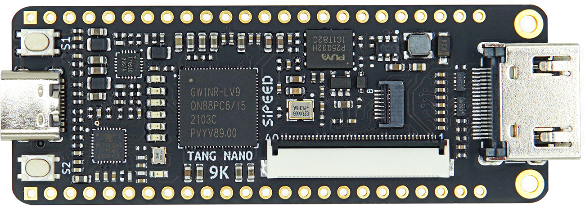
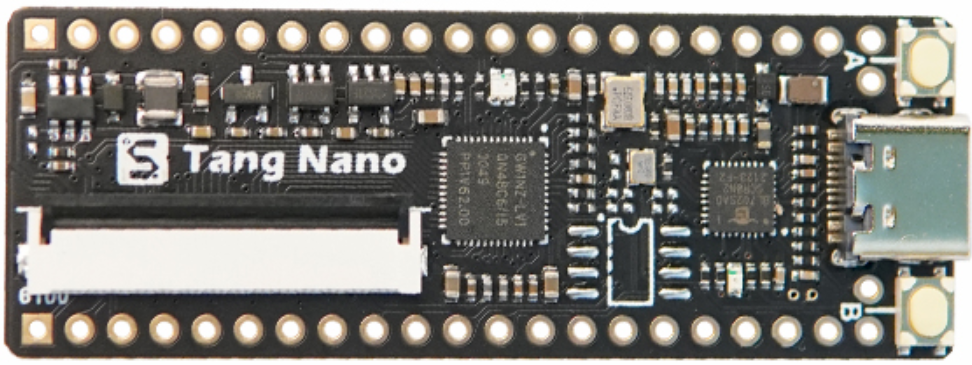
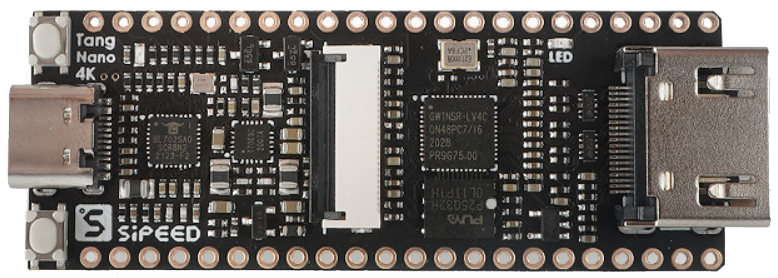
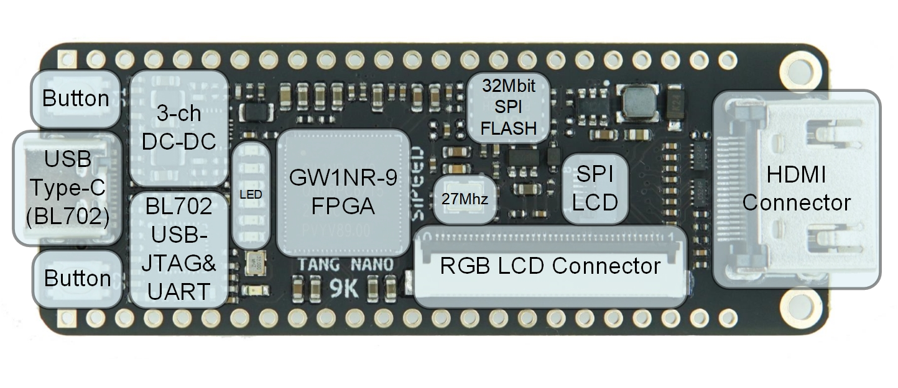

# Tang Nano 9K

## Brief introduction
Tang nano 9K is an exquisite development board based on Gowin GW1NR-9 FPGA chip.It is equipped with HDMI connector, RGB interface screen connector, SPI screen connector, 32Mbit SPI flash and 6 LEDs, so that users can easily and quickly carry out FPGA verification, risc-v soft core verification and functional prototype verification.The 8640 LUT4 logic unit built in GW1NR-9 can not only be used to design various complex logic circuits, but also run a complete PicoRV soft core. It meets various needs of users, such as learning FPGA, verifying soft core and in-depth design.

## Contrast
Tang Nano 9K is the 5th product of Sipeed Tang series. Before purchase, you can choose according to your needs and the following table:

| Moedel | Tang Nano 1K | Tang Nano 4K | Tang Nano 9K |
| --- | --- | --- | --- |
| Appearance |  |  |  |
| Logic Units（LUT4） | 1152 | 4608 | 8640 |
| Hard core processor | / | Cortex-M3 | / |
| Crystal oscillator | 27Mhz | 27Mhz | 27Mhz |
| Display interface | Common RGB screen interfaces | HDMI | HDMI, Common RGB screen interfaces, SPI screen interface |
| Camera | / | Support OV2640 | / |
| External SPI FLASH | Reserved pads only | 32Mbit SPI flash | 32Mbit SPI flash |
| TF card slot | / | / | Yes |
| Downloader | Onboard USB-JTAG Downloader | Onboard USB-JTAG Downloader | Onboard USB-JTAG&UART Downloader |

## Characteristic

| Features | Parameter |
| --- | --- |
| Logical unit (LUT4) | 8640 |
| Flip-Flop (FF) | 6480 |
| Shadow SRAM  SSRAM(bits) | 17280 |
| Block SRAM  BSRAM | 468K |
| BSRAM quantity BSRAM | 26 |
| User Flash(bits) | 608K |
| PSRAM(bits) | 64M |
| High performance DSP | Support 9x9,18x18,36x36bits multiplier and 54bits accumulator |
| 18 x 18 Multiplier | 20 |
| SPI FLASH | 32M-bit |
| PLLs | 2 |
| Display interface | Screen connector, RGB interface connector, SPI interface connector |
| Debugger | Onboard BL702，which provides USB-JTAG and USB-UART for GW1NR-9 |
| IO |  •  Support 4mA, 8mA, 16mA, 24mA and other driving capabilities   • Independent bus keeper, pull-up / pull-down resistor and open drain utput options are provided for each I/O |
| Connector | TF card slot , 2x24P 2.54mm IO pad |
| Button | Onboard 2 user buttons |
| LED | Onboard 6 LEDs |

## Applicable users

| Usage | FPGA | MCU | FPGA+MCU |
| --- | --- | --- | --- |
| Language | Verilog HDL/Verilog | C/C++ | Verilog HDL/Verilog ，C/C++ |
| Brief introduction | Users use hardware description language to design logic circuits | Users can download the hardware bitstream file of PicoRV to GW1NR-9 and use GW1NR-9 as a common MCU. It can run risc-v code and carry out risc-v soft core experiment | Based on PicoRV's IP core, users use Verilog to write custom hardware functions, and use C language to write the code running on PicoRV core |
| Applicable person | Beginner,FPGA developer | RISC-V developer,Embedded Engineer | Senior Engineer |

## User Guide
1. Download our packaged user guide document : [Click here](https://dl.sipeed.com/shareURL/TANG) (The PDFs mentioned below are all here)

2. Install IDE (V1.9.6.02 to avoid download errors) and correctly configure license:[Click here](https://wiki.sipeed.com/soft/Tang/zh/Tang-Nano-Doc/get_started/install-the-ide.html)

3. Read this file (in the file downloaded in step 1) : SUG100-2.6E_Gowin Software User Guide.pdf

4. Read this [tutorial](https://wiki.sipeed.com/soft/Tang/zh/Tang-Nano-Doc/examples/1_led.html) (LED lighting experiment).Note that the schematic of 9K and 1K are different, so you need to modify the floorplaner.It is recommended that novices download our [9K example](https://github.com/sipeed/TangNano-9K-example) directly without any modification. After the project is opened, the firmware can be obtained by synthesis / place & route. Then we download the firmware to the board, and we can observe the effect.
    Note: in the synthesis step, if you encounter "license check failed", you need to right-click synthesis, select configurations, and then select synthesis tool as GowinSynthesis.
    It is suggested that after completing this step, novices should independently create new projects, write code, complete this experiment, and modify the lighting program according to your ideas. This can enhance our understanding of FPGA and hardware description language.

    We recommended that you read the following documents during this process:
    Verilog code specifications (please search by yourself. It is very necessary to cultivate good code specifications from the beginning)
    SUG949-1.1E_Gowin HDL Coding User Guide.pdf
    UG286-1.9.1E_Gowin Clock User Guide.pdf
    SUG114-2.5E_Gowin Analyzer Oscilloscope User Guide.pdf
    FPGA related books
    Online tutorial:  [Verilog language](https://www.asic-world.com/verilog/index.html)

5. Read this [tutorial](https://wiki.sipeed.com/soft/Tang/zh/Tang-Nano-Doc/examples/1_led.html) (RGB screen Display experiment). If you really can't complete this experiment by yourself, you can download our [9K routine (adapted to 9K + 5-inch screen)](https://github.com/sipeed/TangNano-9K-example) to see which steps are not done correctly
    Note: for screen wiring, pay attention to the 1-pin silk screen next to the connector corresponding to 1-pin of the cable
    Documents to read:
    SUG284-2.1E_Gowin IP Core Generator User Guide.pdf (Page 28)
    Datasheet of 5inch screen:[Click AT050TN43***.pdf](https://dl.sipeed.com/shareURL/LICHEE/Zero/HDK/) (mainly to obtain the information that CLK is 33.3mhz)

6. Explanation of  HDMI display (to be updated)

7. PicoRV soft core test (to be updated, users can also follow the official guide in the PicoRV folder in the guide document downloaded in the first step)
 

## Reference code summary
LED drive / RGB LCD display : <https://github.com/sipeed/TangNano-9K-example>
GameBOY HDMI : <https://github.com/Martoni/GbHdmi> 
PicoRV : <https://github.com/YosysHQ/picorv32> 
PicoRV project running on Tang Nano 9K : coming soon
HDMI Display : coming soon

## Summary of hardware files
Datasheet,  User Guide, Schemaitc, Size, Designator, 3D file : [Click here](https://dl.sipeed.com/shareURL/TANG/Nano%209K)

## Matters needing attention
1. It is recommended to use the following version of IDE: 1.9.6.02 (43263) to avoid failure to download.Download link on Gowin official website = > Support = > GOWIN EDA home = >Download GOWIN EDA = > V1.9.6
2. Avoid using JTAG, MODE0/1 and DONE pins. If you must use these pins, please refer to the <UG284-1.8E : schematic manual.pdf>
3. Please pay attention to avoid static electricity hitting PCBA; Please release the static electricity from the hand before contacting PCBA
4. The working voltage of each GPIO has been marked in the schematic . Please do not let the actual working voltage of GPIO exceed the rated value, otherwise it will cause permanent damage to PCBA
5. When connecting FPC flexible cable, please ensure that the cable is completely inserted into the cable without offset
6. Please avoid any liquid or metal touching the pads of components on PCBA during power on, otherwise it will cause short circuit and burn PCBA