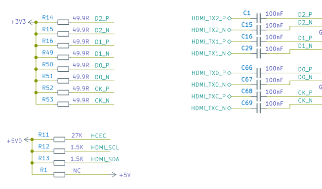

# Tang Nano 9K

## Introduction

The Tang Nano 9K, powered by [Gowin's](https://www.gowinsemi.com/en/) GW1NR-9 FPGA chip, is a versatile and feature-rich development board. It features several often used connectors, including HDMI, RGB screen, and SPI screen interfaces, as well as a 32Mbit SPI flash and six LEDs. It has 8640 LUT4 logic units, an onboard 27MHz clock and 2 PLLs meaning, as well as basic FPGA designs, it can also be used for full risc-v softcores such as PicoRV.

## Comparison

Tang Nano 9K is the 5th product of Sipeed Tang series. Several Tang FPGA products are compared in the table below, if you need a more feature-rich board consider the [Tang Nano 20K](../tang-nano-20k/nano-20k.md).

| Model               | Tang Nano 1K                                                                   | Tang Nano 4K                                                                   | Tang Nano 9K                                                                   |
| :------------------ | :----------------------------------------------------------------------------- | :----------------------------------------------------------------------------- | :----------------------------------------------------------------------------- |
| Appearance          |  |  |  |
| Logic Units (LUT4)  | 1152                                                                           | 4608                                                                           | 8640                                                                           |
| Hard core processor | /                                                                              | Cortex m3                                                                      | /                                                                              |
| Crystal oscillator  | 27MHZ                                                                          | 27MHZ                                                                          | 27MHZ                                                                          |
| Display interface   | RGB screen interface                                                           | HDMI                                                                           | HDMI,  RGB screen interface, SPI screen interface                        |
| Camera              | /                                                                              | Support OV2640                                                                 | /                                                                              |
| External SPI FLASH  | Reserved pads only                                                             | 32Mbits SPI flash                                                              | 32Mbits SPI flash                                                              |
| TF card slot        | /                                                                              | /                                                                              | Yes                                                                            |
| Debugger            | Onboard USB-JTAG                                                               | Onboard USB-JTAG                                                               | Onboard USB-JTAG & USB-UART                                                    |

## Specifications

Indepth specifications of the tang nano 9k.

| Item                   | value                                                                                                                                                                    |
| ---------------------- | ------------------------------------------------------------------------------------------------------------------------------------------------------------------------ |
| Logic units(LUT4)      | 8640                                                                                                                                                                     |
| Registers(FF)          | 6480                                                                                                                                                                     |
| ShadowSRAM SSRAM(bits) | 17280                                                                                                                                                                    |
| Block SRAM BSRAM(bits) | 468K                                                                                                                                                                     |
| Number of B-SRAM       | 26                                                                                                                                                                       |
| User flash(bits)       | 608K                                                                                                                                                                     |
| SDR SDRAM(bits)        | 64M                                                                                                                                                                      |
| 18 x 18 Multiplier     | 20                                                                                                                                                                       |
| SPI FLASH              | 32M-bit                                                                                                                                                                  |
| Number of PLL          | 2                                                                                                                                                                        |
| Display interface      | HDMI interface, SPI screen interface and RGB screen interface                                                                                                            |
| Debugger               | Onboard BL702 chip provides USB-JTAG and USB-UART functions for GW1NR-9                                                                                                  |
| IO                     | • support 4mA、8mA、16mA、24mA other driving capabilities  • Provides independent Bus Keeper, pull-up/pull-down resistors, and Open Drain output options for each I/O |
| Connector              | TF card slot, 2x24P 2.54mm Header pads                                                                                                                                   |
| Button                 | 2 programmable buttons for users                                                                                                                                         |
| LED                    | Onboard 6 programmable LEDs                                                                                                                                              |

### On-board Function block

### Pinmap

| Usage        | FPGA                     | MCU                                                                                                | FPGA+MCU                                                              |
| :----------- | :----------------------- | :------------------------------------------------------------------------------------------------- | :-------------------------------------------------------------------- |
| Language     | Verilog HDL/Verilog      | C/C++                                                                                              | Verilog HDL/Verilog ，  C/C++                                         |
| Introduction | verify HDL design        | After flashing the softcore bitstream,  this board can be used as a normal microcontroller unit | After flashing the softcore bitstream, it can be used as two chips |
| User         | Beginner，FPGA developer | RISC-V developers，Cortex-M developers                                                             | Senior engineer                                                       |

## Getting Started

1. **[Download User Guide](https://dl.sipeed.com/shareURL/TANG/Nano%209K/6_Chip_Manual/EN/General%20Guide)**: Access all necessary PDF documents by downloading our comprehensive user guide package.

2. **[Install IDE & License Configuration](./../Tang-Nano-Doc/install-the-ide.md)**: Set up your Integrated Development Environment (IDE) and configure your license by following this guide.

3. **[Software User Guide](https://dl.sipeed.com/fileList/TANG/Nano%209K/6_Chip_Manual/EN/General%20Guide/SUG100-2.6E_Gowin%20Software%20User%20Guide.pdf)**: Refer to the "SUG100-2.6E_Gowin Software User Guide.pdf" in the downloaded package for detailed software instructions.

4. **[LED Tutorial](./examples/led.md)**: A simple project to get you acquainted to FPGAs and the tangnano9k.
   - **Verilog Code Standards**: It's crucial to adhere to good coding practices.
   - **Recommended Reading**:
     - SUG949-1.1E_Gowin HDL Coding User Guide.pdf
     - UG286-1.9.1E_Gowin Clock User Guide.pdf

   These, and other important, documents are available at our [Download Station](https://dl.sipeed.com/shareURL/TANG/Nano%209K/6_Chip_Manual/EN/General%20Guide).

   **Online Resources**: We recommend two excellent learning sites for Verilog: [HDLBITs](https://hdlbits.01xz.net/wiki/Main_Page) and [ASIC World's Verilog Page](https://www.asic-world.com/verilog/index.html).

5. **[RGB Screen Tutorial](./examples/rgb_screen.md)**: Follow this step-by-step guide for setting up a 5-inch RGB screen display. If you encounter difficulties, refer to our [9K examples](https://github.com/sipeed/TangNano-9K-example) adapted for 9K + 5-inch screens.
   - **Screen Wiring Note**: Ensure correct alignment of the 1-pin silk screen on the connector with the 1-pin of the cable.
   - **Key Documents for Reference**:
     - rPLL IP core reference: Navigate to Tools > IP Core Generator > Hard Module > CLOCK > rPLL.
     - [SUG284-2.1E_Gowin IP Core Generator User Guide.pdf](https://dl.sipeed.com/fileList/TANG/Nano%209K/6_Chip_Manual/EN/General%20Guide/SUG284-2.1E_Gowin%20IP%20Core%20Generator%20User%20Guide.pdf) (Page 28)
     - [Datasheet of 5-inch Screen](https://dl.sipeed.com/fileList/TANG/Nano%209K/6_Chip_Manual/EN/LCD_Datasheet/5.0inch_LCD_Datashet%20_RGB_.pdf)

6. **Examples in the source code [repository](https://github.com/sipeed/TangNano-9K-example)** includes a PicoRV softcore and a HDMI display example, among other examples.

## Reference and Examples

You can access several example projects on our [Examples Page](./../Tang-Nano-Doc/examples.md).

## Hardware Resources

- Access all necessary hardware files at [Hardware Files](https://dl.sipeed.com/shareURL/TANG/Nano%209K/).
  - [Datasheet](https://dl.sipeed.com/shareURL/TANG/Nano%209K/6_Chip_Manual/EN)
  - [Schematic](https://dl.sipeed.com/shareURL/TANG/Nano%209K/2_Schematic)
  - [Bit map](https://dl.sipeed.com/shareURL/TANG/Nano%209K/3_Bit_number_map)
  - [Size](https://dl.sipeed.com/shareURL/TANG/Nano%209K/4_Dimensional_drawing)
  - [3D file](https://dl.sipeed.com/shareURL/TANG/Nano%209K/5_3D_file)
  - [Some manuals](https://dl.sipeed.com/shareURL/TANG/Nano%209K/6_Chip_Manual)

## Attention and Best Practices

1. **Support and Community**: For assistance, join our Telegram group (t.me/sipeed) or contact us on Twitter ([@SipeedIO](https://twitter.com/SipeedIO)). You can also leave a message below.

2. **Troubleshooting**: If you encounter any issues, consult our [Tang Questions](https://wiki.sipeed.com/hardware/en/tang/Tang-Nano-Doc/questions.html) page first.

3. **Avoid using JTAG, MODE0/1, and DONE pins unless necessary**. For details, refer to [SUG100-2.6E_Gowin Software User Guide.pdf](https://dl.sipeed.com/fileList/TANG/Nano%209K/6_Chip_Manual/EN/General%20Guide/SUG100-2.6E_Gowin%20Software%20User%20Guide.pdf).

4. **Static Electricity Precautions**: Always discharge static electricity before handling the PCBA to prevent damage.

5. **GPIO Voltage Compliance**: Ensure that the actual working voltage of GPIOs does not exceed their rated value as indicated in the schematic. Exceeding these limits can cause permanent damage to the PCBA.

6. **FPC Cable Connection**: When connecting FPC flexible cables, ensure that the cable is fully inserted into its base without any offset.

7. **Avoid Short Circuits**: Prevent liquids or metals from coming into contact with the component pads on the PCBA while it's operating, as this could cause a short circuit and damage the PCBA.

8. **Handling Multiplexed IO and HDMI Ports**: Be aware that the HDMI IO ports are pulled up. When using IOs routed to pin headers, they may not operate as intended.

