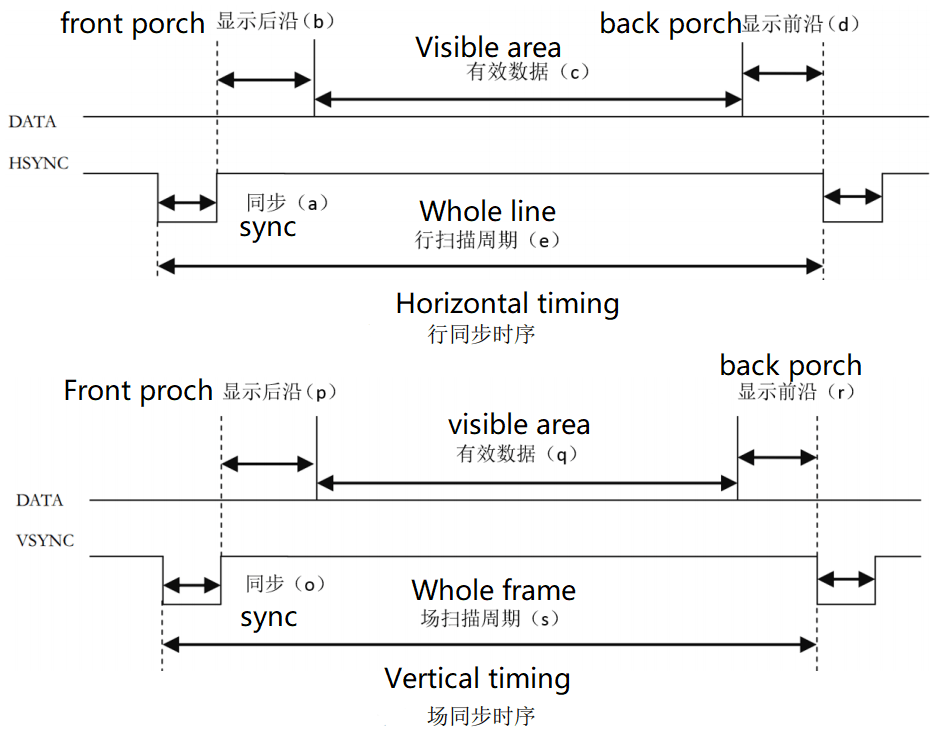
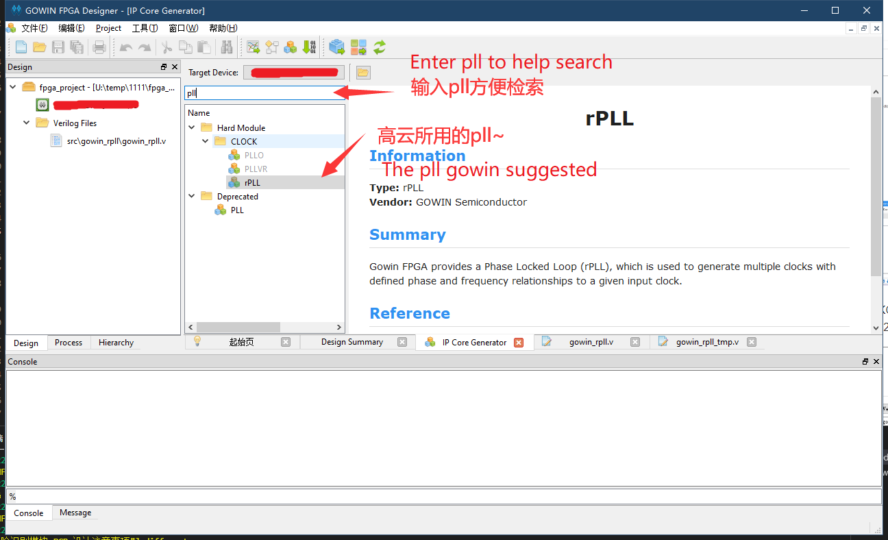
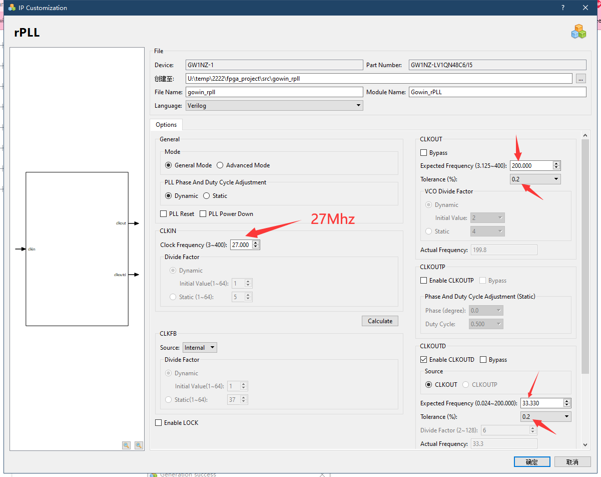
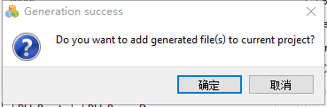
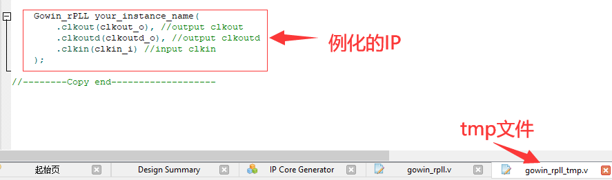

> Edit on 2022.04.12

## Introduce timing 

RGB LCD display protocol is similar to VGA protocol, both have horizon  synchronization signal line and vertical synchronization signal line. The main difference is that RGB LCD display protocol transfers by digital signal while VGA protocol transfers by analog signal.

Here we introduce VGA timing.



There shows horizon synchronization timing and vertical synchronization timing in the picture above.

From the timing picture, we know both display a horizon of data or display a vertical of data, data transfers during the two synchronization signal pulses. 

Each horizon of data contains back porch, visible data **(this is normally  thought as active data)** and front porch.

The visible data is resolution we normally think, while the parameter of back porch and front porch depends on the resolution and frame rate. Its typical parameters can be found at <http://www.tinyvga.com/vga-timing>.

The timing of this 5-inch screen we sell is a bit different, its parameters can be downloaded [here (PDF)](https://dl.sipeed.com/fileList/TANG/Nano%209K/6_Chip_Manual/EN/LCD_Datasheet/5.0inch_LCD_Datashet%20_RGB_.pdf).

For other size screen parameters, they can be downloaded [here](https://dl.sipeed.com/TANG/Nano%209K/6_Chip_Manual/EN/LCD_Datasheet/).

The following picture shows the screenshot about this LCD timing.


The first picture form shows parameters of the screen and the the following picture is its timing. 

From its timing picture, we can know we don't need to set front porch time and back proch time, we just need to set blanking time. 

## Create project 

Please refer to this [article](./../led/led.md) to see how to create project.

## Generate screen clock

- Here we use gowin official IP

The crystal oscillator onboard is 27MHz, but our screen needs 33.3MHZ clock, so we need to use the corresponding ip core to generate the corresponding clock. 

Here we use `IP Core Generate` which can be find in *Tools -> IP Core Generate*.



Double click `rPLL` and select `Verilog` in the pop-up window language, set CLKIN 27MHz, CLKOUT to 33.00MHz.
Also config the tolerance.



After clicking OK it asks whether to add it to the current project - choose `yes`.



Then a tmp file will appear, we can use it to generate the ip, like what is shown below. 



## Screen driver

- **To start this we should create a verilog file first**

### Port definition

First define ports which are needed to drive screen

```verilog
module VGAMod
(
    input                   CLK,
    input                   nRST,

    input                   PixelClk,

    output                  LCD_DE,
    output                  LCD_HSYNC,
    output                  LCD_VSYNC,

	output          [4:0]   LCD_B,
	output          [5:0]   LCD_G,
	output          [4:0]   LCD_R
);
```

We use RGB565 driver mode.

### Timing constants

Then we define the constants according to the timing form picture

```verilog

localparam      V_BackPorch = 16'd6; //0 or 45
localparam      V_Pluse 	= 16'd5; 
localparam      HightPixel  = 16'd480;
localparam      V_FrontPorch= 16'd62; //45 or 0

localparam      H_BackPorch = 16'd182; 	
localparam      H_Pluse 	= 16'd1; 
localparam      WidthPixel  = 16'd800;
localparam      H_FrontPorch= 16'd210;

localparam      PixelForHS  =   WidthPixel + H_BackPorch + H_FrontPorch;  	
localparam      LineForVS   =   HightPixel + V_BackPorch + V_FrontPorch;

```

First we define front porch, back porch and valid pixel data.

As for the front porch timing and back porch timing which have been mentioned earlier, it can be combined into an erasing time, that is, one can be set to 0, and the other can be set to the erasing time.
Anyway, the front porch timing and back porch timing can be added up to meet the timing requirements in the table is ok.

### Define variables

- Define some variables helps us to meet timing requirement
  
```verilog 

reg [15:0] LineCount;
reg [15:0] PixelCount;

reg	[9:0]  Data_R;
reg	[9:0]  Data_G;
reg	[9:0]  Data_B;

```

### Synchronization signals

This code generates synchronization signals.
It should be noted that the synchronization signals of this screen enabled by negative polarity.

```verilog
    always @(  posedge PixelClk or negedge nRST  )begin
        if( !nRST ) begin
            LineCount       <=  16'b0;    
            PixelCount      <=  16'b0;
            end
        else if(  PixelCount  ==  PixelForHS ) begin
            PixelCount      <=  16'b0;
            LineCount       <=  LineCount + 1'b1;
            end
        else if(  LineCount  == LineForVS  ) begin
            LineCount       <=  16'b0;
            PixelCount      <=  16'b0;
            end
        else
            PixelCount      <=  PixelCount + 1'b1;
    end

   always @(  posedge PixelClk or negedge nRST  )begin
        if( !nRST ) begin
			Data_R <= 9'b0;
			Data_G <= 9'b0;
			Data_B <= 9'b0;
            end
        else begin
			end
	end

//Here note the negative polarity of HSYNC and VSYNC
assign  LCD_HSYNC = (( PixelCount >= H_Pluse)&&( PixelCount <= (PixelForHS-H_FrontPorch))) ? 1'b0 : 1'b1;
assign  LCD_VSYNC = ((( LineCount  >= V_Pluse )&&( LineCount  <= (LineForVS-0) )) ) ? 1'b0 : 1'b1;
```

### Enable signal

- This code decides whether display image. 

This driver needs a port which is set to 1 when the 800*480 data of the image is valid to enable display.
  
```verilog
assign  LCD_DE = (  ( PixelCount >= H_BackPorch )&&
                    ( PixelCount <= PixelForHS-H_FrontPorch ) &&
                    ( LineCount >= V_BackPorch ) &&
                    ( LineCount <= LineForVS-V_FrontPorch-1 ))  ? 1'b1 : 1'b0;
                    //It will shake if there not minus one
```

### Test color bars

- This code generate color bars to test LCD

```verilog
    localparam          Colorbar_width   =   WidthPixel / 16;

    assign  LCD_R     = ( PixelCount < ( H_BackPorch +  Colorbar_width * 0  )) ? 5'b00000 :
                        ( PixelCount < ( H_BackPorch +  Colorbar_width * 1  )) ? 5'b00001 : 
                        ( PixelCount < ( H_BackPorch +  Colorbar_width * 2  )) ? 5'b00010 :    
                        ( PixelCount < ( H_BackPorch +  Colorbar_width * 3  )) ? 5'b00100 :    
                        ( PixelCount < ( H_BackPorch +  Colorbar_width * 4  )) ? 5'b01000 :    
                        ( PixelCount < ( H_BackPorch +  Colorbar_width * 5  )) ? 5'b10000 :  5'b00000;

    assign  LCD_G    =  ( PixelCount < ( H_BackPorch +  Colorbar_width * 6  )) ? 6'b000001: 
                        ( PixelCount < ( H_BackPorch +  Colorbar_width * 7  )) ? 6'b000010:    
                        ( PixelCount < ( H_BackPorch +  Colorbar_width * 8  )) ? 6'b000100:    
                        ( PixelCount < ( H_BackPorch +  Colorbar_width * 9  )) ? 6'b001000:    
                        ( PixelCount < ( H_BackPorch +  Colorbar_width * 10 )) ? 6'b010000:    
                        ( PixelCount < ( H_BackPorch +  Colorbar_width * 11 )) ? 6'b100000:  6'b000000;

    assign  LCD_B    =  ( PixelCount < ( H_BackPorch +  Colorbar_width * 12 )) ? 5'b00001 : 
                        ( PixelCount < ( H_BackPorch +  Colorbar_width * 13 )) ? 5'b00010 :    
                        ( PixelCount < ( H_BackPorch +  Colorbar_width * 14 )) ? 5'b00100 :    
                        ( PixelCount < ( H_BackPorch +  Colorbar_width * 15 )) ? 5'b01000 :    
                        ( PixelCount < ( H_BackPorch +  Colorbar_width * 16 )) ? 5'b10000 :  5'b00000;
```

**Do not forget to add `endmodule` in the end of the driver file.**

Up to now we have finished the driver module.

## Instantiated in the top

- **Create a new verilog file**
- Just copy the content below and save it.

```verilog
module TOP //Name TOP module
(
	input			nRST,
	input           XTAL_IN,

	output			LCD_CLK,
	output			LCD_HYNC,
	output			LCD_SYNC,
	output			LCD_DEN,
	output	[4:0]	LCD_R,
	output	[5:0]	LCD_G,
	output	[4:0]	LCD_B

); // list ports

	wire		CLK_SYS;	
	wire		CLK_PIX;
    
    //instantiate pll
    Gowin_rPLL chip_pll(
        .clkout(CLK_SYS),  //output clkout     //200M
        .clkoutd(CLK_PIX), //output clkoutd   //33.00M
        .clkin(XTAL_IN)    //input clkin
    );	

	VGAMod	VGAMod_inst //instantiate vga driver
	(
		.CLK		(	CLK_SYS     ),
		.nRST		(	nRST		),

		.PixelClk	(	CLK_PIX		),
		.LCD_DE		(	LCD_DEN	 	),
		.LCD_HSYNC	(	LCD_HYNC 	),
		.LCD_VSYNC	(	LCD_SYNC 	),

		.LCD_B		(	LCD_B		),
		.LCD_G		(	LCD_G		),
		.LCD_R		(	LCD_R		)
	);

	assign		LCD_CLK		=	CLK_PIX;

endmodule
```

## Synthesize, constrain, Place&Route

### Synthesize

After finishing steps above, go to the "Process" interface, synthesize the edited file, which means running "Synthesize". 


If the result is the same as shown below
 

It means that there is no bug in our code, we can continue the next steps. 

If there is some thing wrong, please fix by yourself. 

### Constrain

- Here we only constraint pins

The corresponding pins and ports are as follows form shows

The way to constain pins can refer to the [Light led](./../led/led.md), it contains a way to constain pins.

If you feel troublesome about the method above, you can copy the content from this [page](./../../../../zh/tang/Tang-Nano-9K/examples/lcd_constrains.md)， and paste it in ".cst" file in this project (if there is no ".cst" file, just create a "physicsl constrains file").

| PORT        | I/O    | PIN | PORT         | I/O    | PIN |
| ----------- | ------ | --- | ------------ | ------ | --- |
| LCD_B[4]    | output | 41  | LCD_B[3]     | output | 42  |
| LCD_B[2]    | output | 51  | LCD_B[1]     | output | 53  |
| LCD_B[0]    | output | 54  | LCD_G[5]     | output | 55  |
| LCD_G[4]    | output | 56  | LCD_G[3]     | output | 57  |
| LCD_G[2]    | output | 68  | LCD_G[1]     | output | 69  |
| LCD_G[0]    | output | 70  | LCD_R[4]     | output | 71  |
| LCD_R[3]    | output | 72  | LCD_R[2]     | output | 73  |
| LCD_R[1]    | output | 74  | LCD_R[0]     | output | 75  |
| LCD_DEN     | output | 33  | LCD_SYNC     | output | 34  |
| LCD_HYNC    | output | 40  | LCD_CLK      | output | 35  |
| XTAL_IN     | input  | 52  | nRST         | input  | 4   |

### Place&Route

After constraining, we need to open IO mux to complete Place&Route.

Tick *Project -> Configuration -> Place&Route -> Dual-Purpose Pin* in the Menu Bar.


Then we can run Place&Route.

## Program

Finishing Place&Route, we can download the generated `.fs` file to the development board to see color bar.

## End

If you have any suggestions, just leave a message.

<p id="back">
    <a href="#" onClick="javascript :history.back(-1);">Back to the previous page</a>
</p>

