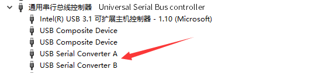
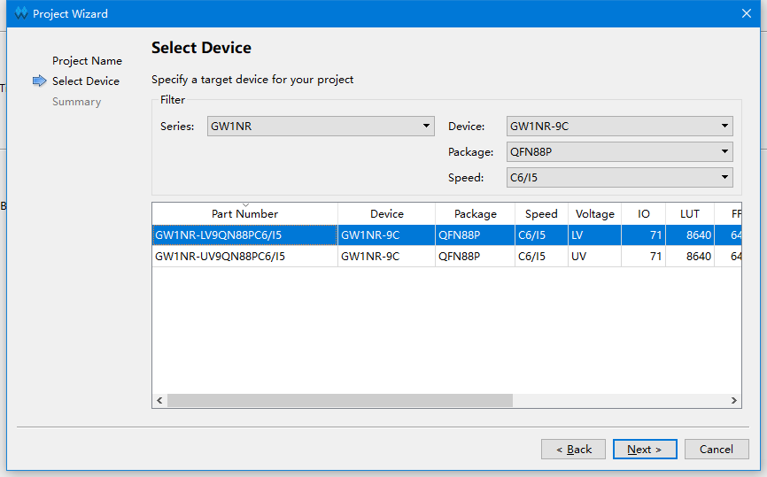
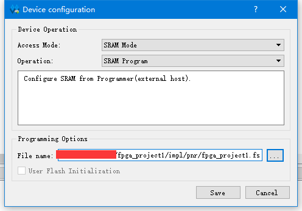

# Note

> Edit on 2022.05.12

- This is for Windows users only

## Troubles with programmer

**Make sure there are 2 converters in Device Manager before reading.**

If there are two converters, this means computer and board succeed connectting. And if there is no converter, try another USB port or reinstall driver.

### Trouble downloading

**If you have any problems programming or flashing FPGA development board, it's suggested to use the programmer which can be downloaded at this page https://dl.sipeed.com/shareURL/TANG/programmer instead of what is installed with the IDE.**

### ID code mismatch

This error means wrong device choice. All that refers chip model(like he project device, pin constrain, IP modules and programmer device choose) need to be changed. 

For Nano 9K it should be choose as follow:

  
Click to see the choice of 9K

  

For other boards, just make sure your device selection corresponds to the laser mark on chip package.

### Download slowly

Don't choose Operation containing Verify

### Can't find download file

Normally the download file whose extension name is fs is in the impl/pnr folder under the project path.

  
Click to see steps by picture

  
  
From the picture above we can know the path of this download file is fpga_project1/impl/pnr/fpga_project1.fs 

  

  
 The fpga_project1 is the project dictionary, the impl is generated by IDE, and the download is in the folder named pnr

  

  
 The file whose extension name is fs is what we will burn into fpga

### No Gowin devices found

This can be solved by replacing Programmer as mentioned in **[Trouble downloading](#trouble-downloading)**

### Cabel open failed

After finishing replacing **programmer** as mentioned previously,Do following steps in programmer application.

Click Edit->Cable Setting->Cable->Query in the top menu bar,then save.

  
Click to see steps by pictures

  
  
Click Query in the following picture

  
  
Click Save

## Troubles with IDE

### Using GAO

It's tested IDE version before V1.9.8.1 and V1.9.8.1 is ok, the newer version is not ok.

### View IP reference

  
Click to see instructions

    

### Reconfigure generater IP

  
Click to see instructions

    

