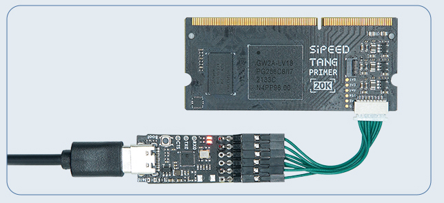

Here are some normal questions.

## Programmer 

Make sure there are 2 `converter` and 1 `COM` device, this means the debugger works well.

### Only 2 `converter` devices

If there is no `COM` device but 2 `converter` devices, right click `converter B` -> `Properties` -> `Advanced` -> `Load VCP` , then Click `OK` and reconnect your USB device.

### No `convertor` device

It takes 10 seconds for debugger loading the driver. And you can install the driver manually. [Click me to download driver](https://dl.sipeed.com/shareURL/TANG/programmer)

### Download frequency

Make sure the frquency is equal or lower than `2.5MHz`, otherwise it may lead some troubles like burnning bitstream file really slow or failed burnning bitstream file.

  
Click to see steps

  
  
Choose Frequency equal to or lower than 2.5MHz

  
  
Then cilck Save

### Error found

This error means the Programmer application does detect debugger or your driver is wrong. 
Visit [this programmer](https://dl.sipeed.com/shareURL/TANG/programmer) compressed file, download it and extract it, replace the programmer folder install with GOWIN IDE by this extracted file.
If you don't know how to replace the programmer folder, just excute the programmer application in the extracted folder to download bisdtream file instead of the programmer application installed with GOWIN IDE.

If this problem still occurs after you use our recommended programmer application, try to rerun this application. If all attemps fail, see the begin of this documents about `converter`.

### Cabel open failed

This means the programmer application does not detect the debugger, try this programmer application mentioned in [Error found](#error-found).

If this problem still occurs after you use our recommended programmer application, try to rerun this application. If all attemps fail, see the begin of this documents about `converter`.

<!-- 
After finishing replacing **programmer** as mentioned previously,Do following steps in programmer application.

Click Edit->Cable Setting->Cable->Query in the top menu bar,then save.

  
Click to see steps by pictures

  
  
Click Query in the following picture

  
  
Click Save

 
-->

### No Gowin devices found

This means the debugger does not detect the gowin chip, try this programmer application mentioned in [Error found](#error-found).

For 20K Dock kits, it's necessary to enable the core board before using debugger debug the chip, just put the 1 switch on the dip switch down, otherwise this error occurs.

| Enable Core Board | Disable state | Additional comments |
| --- | --- | --- |
|| | When disabled, the LDE0 and LED1 is on, and core board doesn't work.|

When using RV Debugger Plus burnning firmware into 20K core board this error occurs, possibly the order of connectting wire is wrong, make sure your connectting order is same as following sheet, or you can check your core board jtag connector inside pins, make sure none of them are crooked(One time we get problem connecting Debugger with core board and finnaly check out that there is a crooked pin in the jtag connector, this maybe because of doing wrong connection operations when connecting)

The JTAG pin orders can be found in the back of 20K core board.

<table>
    <tr>
        <td>Core Board</td>
        <td>5V0</td>
        <td>TMS</td>
        <td>TDO</td>
        <td>TCK</td>
        <td>TDI</td>
        <td>RX</td>
        <td>TX</td>
        <td>GND</td>
    </tr>
    <tr>
        <td>Debugger</td>
        <td>5V0</td>
        <td>TMS</td>
        <td>TDO</td>
        <td>TCK</td>
        <td>TDI</td>
        <td>TX</td>
        <td>RX</td>
        <td>GND</td>
    </tr>
</table>

### ID code mismatch

This means the selected device in the project mismatch your burnning chip. All that refers chip model(The project device, pin constrain, IP modules and programmer device choose) need to be reset.

| Board name | Series | Device | Package | Speed |
| --- | --- | --- | --- | --- |
| Tang Nano | GW1N | GW1N-1 | QFN48 | C6/I5 |
| Tang Nano 1K | GW1NZ | GW1NZ-1 | QFN48 | C6/I5 |
| Tang Nano 4K | GW1NSR | GW1NSR-4C | QFN48P | C6/I5 or C7/I6 |
| Tang Nano 9K | GW1NR | GW1NR-9C | QFN88P | C6/I5 |
| Tang Primer 20K | GW2A | GW2A-18C | PBGA256 | C8/I7 |

<!-- For Nano 9K it should be choose as follow: -->
<!-- 

  
Click to see the choice of 9K

  

For other boards, just make sure your device selection corresponds to the laser mark on chip package. -->

### spi flash selected mismatch

The board using GOWIN Semiconductor LittleBee product family (Series of chip names beginning with GW1N) incorporates embedded FLASH in main chip, so when burning firmware we burn into embedded FLASH, and reagrd the external FLASH as a peripheral. 

The board using GOWIN Semiconductor Arora product family (Series of chip names beginning with GW1N) does not incorporate embedded FLASH, so when burning firmware we burn into external FLASH, and the operations are as followed . 

<table>
  <tr>
    <td rowspan="2"></td>
    <td style="white-space:nowrap">Operation is <code>exFlash Erase,Program thru GAO-Bridge</code></td>
  </tr>
  <tr>
    <td>Flash Device we choose <code>Generic Flash</code></td>
  </tr>
</table>

### Download slowly

Don't choose Operation containing Verify

Make sure the frquency is equal or lower than `2.5MHz`, normally `2.5MHz` everything is ok.

  
Click to see steps

  
  
Choose Frequency equal to or lower than 2.5MHz

  
  
Then cilck Save

### Can't find download file

Normally the download file with extension name `.fs` is in the impl/pnr folder under the project path.

  
Click to see steps by picture

  
  
From the picture above we can know the path of this download file is fpga_project1/impl/pnr/fpga_project1.fs 

  

  
 The fpga_project1 is the project directory, the impl is generated by IDE, and the download is in the folder named pnr

  

  
 The file  with extension name `.fs` is the firmware we will burn into fpga

## IDE

### See IP manual

In the IP Core generate interface of IDE, click your target IP, then choose your language reference to see the IP manual.

  
Click to see instructions

    

### Reconfigure generated IP

In the IP Core generate interface of IDE, click the folder icon next to device selection at the top to open the generated IP configuration interface.

  
Click to see instructions

    

### Set top module

For project containning muti-projects, if you succeed generating your module, right-click the module you want to set as the top module IDE -> Hierarchy interface.

If your Hierarchy interface is the same as what is in the left picture, this means there are logic errors in the code, such as syntax errors or generate errors. Click 'RTL Anakysis Error' in the upper right corner then you can see the error type code and location of the error in the dialog box that pops up, as shown in the right picture in the following table.

<table>
<tr>
<td align="center">RTL Analysis Error</td>
<td align="center">Error type and details</td>
</tr>
<tr>
<td></td>
<td></td>
</tr>
</table>

### Using GAO

GAO is Gowin Analyzer Oscilloscope, its document can be found in the path like what is shown below

Using this [programmer application](https://dl.sipeed.com/shareURL/TANG/programmer) instead of the programmer application installed with, then you can use GAO.(GAO need run by IDE, so you need to replace the Programmer bin folder by your downloaded one)