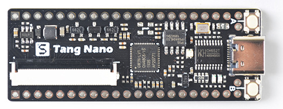
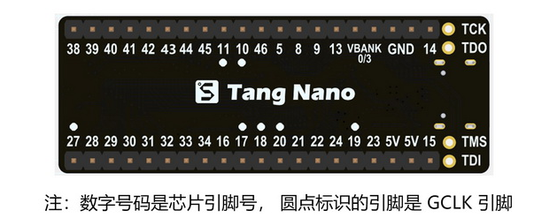
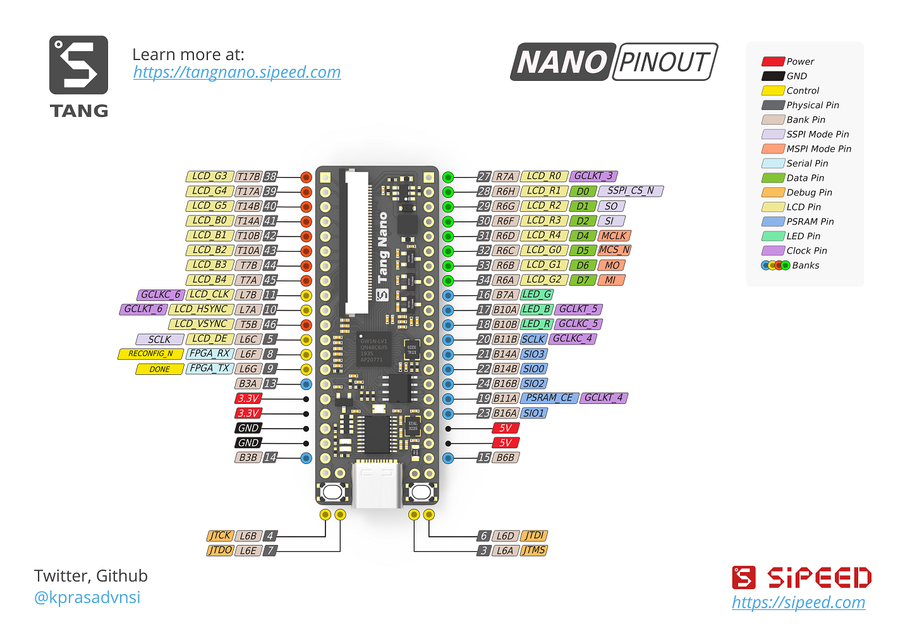

# Tang Nano

> Edit on 2022.03.23

## Introduction

Tang Nano is a core board designed based on [Gowin](https://www.gowinsemi.com/en/) GW1N-1 FPGA chip.The board is equipped with PSRAM, RGB LCD interface and onboard USG-JTAG debugger, which make it convinent for users to use.

## Parameters

**Note** :
- The Numeric number matches PIN number
- Numeric number with dot matches gclk pins

| Items             | Specs  |
| ----------------- | ----------- |
| Core              | GW1N-1 FPGA |
| Logic units(LUT4) | 1152        |
| Registers(FF)     | 864         |
| Block SRAM(bits)  | 72K         |
| B-SRAM block      | 4           |
| User flash(bits)  | 96K         |
| PLL               | 1           |
| I/O Bank          | 4           |
| I/O numbers       | 41          |
| Core quantity     | 1.2V        |
| Usb-Jtag          | ch552       |
| Onboard PSRAM     | 64Mbits     |

## Support

Email to support@sipeed.com for technical support and Business cooperation.

## Resources

- [Schematic](https://dl.sipeed.com/shareURL/TANG/Nano/HDK)
- [Download center](https://dl.sipeed.com/shareURL/TANG/Nano)
- [Examples](./../Tang-Nano-Doc/examples.md)

