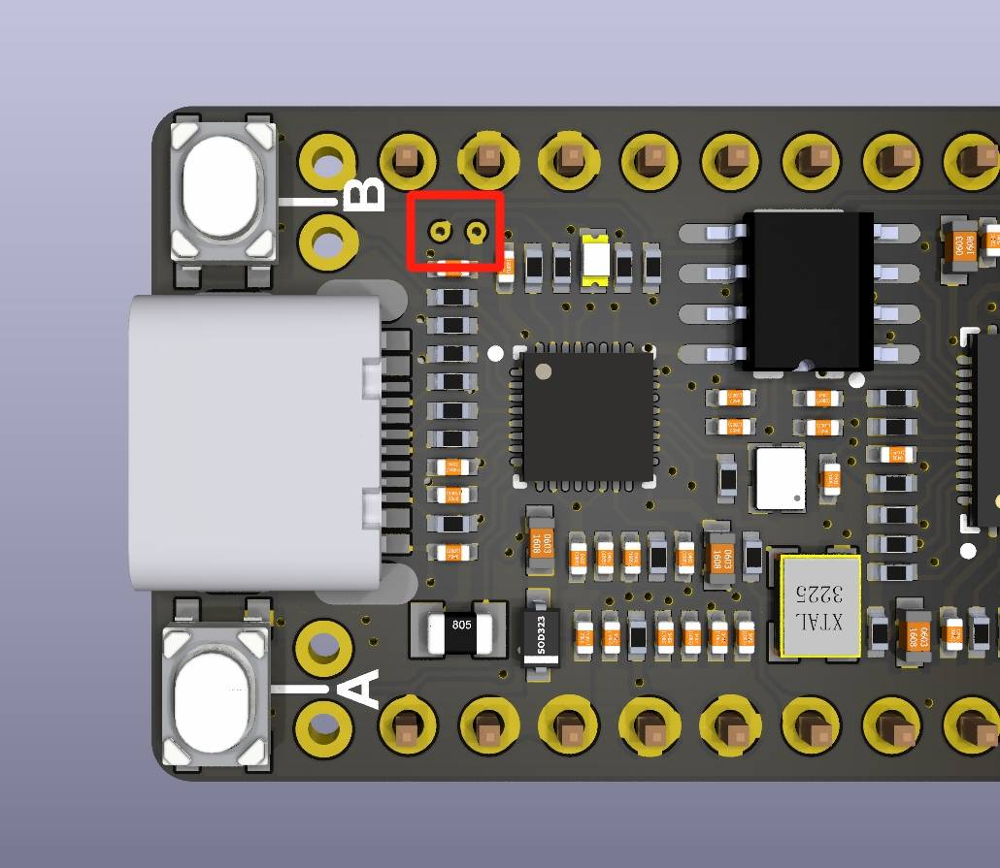
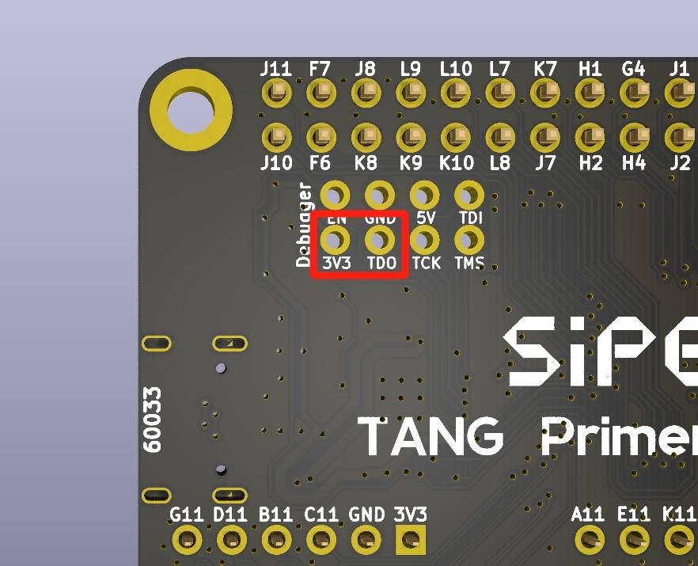
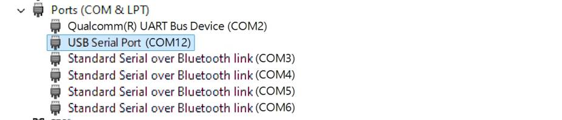
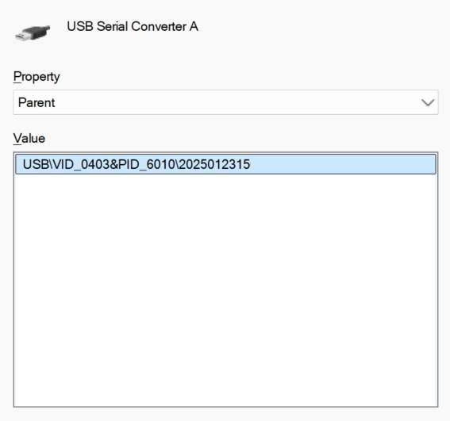

## Overview

All Sipeed Tang series have onboard debugger (except standalone SOM). The debuggers are separate MCUs with their own firmware. Users could update the firmware for these debuggers to get feature updates and bug fixes.

We need to use the [**BouffaloLabDevCube**](https://dev.bouffalolab.com/download/) to program these onboard debugger chips,  and documentation about the ***chips & tools*** can be found [here](https://dev.bouffalolab.com/document/).

Here is a brief step-by-step guide:
- Download and install the corresponding edition of the ***tools*** according to your OS.
- Get the updated debugger firmware for your board from [**Sipeed Download Station**](https://dl.sipeed.com/shareURL/TANG/Debugger/onboard).
- Refer to the official documentation of [**BouffaloLabDevCube**](https://dev.bouffalolab.com/download/) to update the firmware of the onboard debugger.
- For Windows users, there are detailed step-by-step tutorial below. Also, the steps for other operating systems are similar.

***

## Tutorial
  ### Preparation for Hardware

  To put the onboard debugger into **DFU mode**, press the ***Update Button*** or short the corresponding ***Test Points*** before power on the board or connecting the board's debug USB port with a cable. 
  
  Please refer to the below for the corresponding ***Update Button*** and ***Test Points***.

  #### Tang nano series
  
  - Tang nano 1k

    The 2 **`Test Points`** is in the upper left corner of the board **TOP** side, behind the `KEY-B`.
    
    

    
Click for details

     
    
    

     
  
  - Tang nano 4k

    The 2 **`Test Points`** is in the upper left corner of the board **TOP** side, behind the USB-C connector.
        
    

    
Click for details

     
    
    

     
  
  - Tang nano 9k

    The 2 **`Test Points`** is in the middle left of the board **TOP** side, behind the USB-C connector.
  
    

    
Click for details

     
    
    

     
  
  - Tang nano 20k
    
    The **`Update Button`** behind the HDMI connector on the **TOP** side has the silkscreen **`UPDATE`**.
  
    

    
Click for details

     
    
    

     

  #### Tang Primer series
  
  - Tang Primer 25k Dock

    The 2 **`Test Points`** is in the upper left corner of the board **BOT** side, marked as `3V3` & `TDO`.
    
    

    
Click for details

     
    
    

     
  
  - Tang Primer 20k Dock

    The white **`Update Button`** is on the lower right side of the TOP side of the Dock board between USB-C debug port and HDMI port, marked as **`702-BOOT`**
  
    

    
Click for details

     
    
    

     
  
  - ~~Tang Primer 15k Dock~~ (**Not yet released**)
  
    TBD

  #### Tang Mega series(include Tang Console)
  
  - Tang Mega Neo Dock(inclede Tang Mega 138K Dock)

    The **`Update Button`** is blow the USB-C connector marked as **DEBUG-USB2** on the **TOP** side.
    
    

    
Click for details

     
    
    

     

  - Tang Mega 138K Pro Dock

    The **`Update Button`** is on the left of the USB-C connector marked as **JATG|UART** on the **TOP** side.

    

    
Click for details

     
    
    

     

  
  - Tang Console
  
    The **`Update Button`** is on the other side the USB-C connector on the **TOP** side, the shorter of the 2 buttons marked ad **`BOOT`**.

    

    
Click for details

     
    
    

     

  ***

  ### Preparation for Software

  - First, download **BouffaloLabDevCube** from [**BouffaloLab Official Website**](https://dev.bouffalolab.com/download/), The latest version is **`1.9.0`** (February 10, 2025).

    

    
Click for details

     
    
    

     
  
  - Unzip the downloaded content and execute the corresponding executable file, for Windows this is **`BLDevCube.exe`**

    

    
Click for details

     
    
    

     

  - In the pop-up window, select Chip model as BL616/618.

    

    
Click for details

     
    
    

     

  - In the new window, check the **`Enable`** checkbox in blow the ***Single download option***. Click the **`Browse`** button to select the firmware file to be updated.

    

    
Click for details

     
    
    

     

  - Let the onboard debugger into [**DFU mode**](#preparation-for-hardware), it should be a CDC-ACM device for both BL702 or BL616. On Windows, this registers a new COM port, in this example is **`COM12`**. For Linux users, CDC-ACM usual register as `/dev/ttyACMx`. For macOS users, it may register as `/dev/tty.usbmodemxxxx` or `/dev/cu.usbmodemxxxx`. (Each `x` represents a digit)

    

    
Click for details

     
    
    

     

  - Now, set the **BLDevCube** up as shown below. Set the firmware file location, the port for DFU mode, then click **`Open UART`**, and finally click **`Create & Download`**.

    

    
Click for details

     
    
    

     

  - Wait for the download to complete as shown in the image below.

    

    
Click for details

     
    
    

     

  ***

  ### Confirm the results

  After completing the above steps, we need to confirm that the firmware of the onboard debugger is successfully burned. Usually replug the USB cable or re-poweron the board will confirm it.

  - In Windows, you can see two new devices in the device manager: **`USB Converter A`** and **`USB Converter B`**.

    

  - To confirm the debugger firmware version, double-click any **`USB Converter`** and go to the Details tab. Then select **`Parent`** Options from the drop-down menu:

    

    
Click for details

     
    
    

     

  - As shown in the figure below, the last 10 digits **`2025102315`** are the serial number of the debugger firmware version. Linux & macOS users could use command **`dmesg`** to check the serial number in kernel log.

    

    
Click for details

     
    
    

     

  ### Additional notes for **Tang Core** 
  
  

    
Click for details

     
  
  For development boards that support [**Tang Core**](https://nand2mario.github.io/tangcore/) (such as the [Tang Console](../tang-console/mega-console)), the proper execution of [**Tang Core**](https://nand2mario.github.io/tangcore/) functionality requires both the [**Debugger Firmware**](#latest-firmware) and the secondary boot [**TangCore firmware for BL616**](https://github.com/nand2mario/firmware-bl616/).

  The [**Debugger Firmware**](#latest-firmware) can be found at the bottom of this page, while the secondary boot [**TangCore firmware for BL616**](https://github.com/nand2mario/firmware-bl616/) is currently maintained by **[nand2mario](https://github.com/nand2mario)**. The latest version is available in the [**TangCore Release Package**](https://github.com/nand2mario/tangcore/releases).

  The [**Debugger Firmware**](#latest-firmware) should be written to the **flash** starting address `0x0`, whereas the [**TangCore firmware for BL616**](https://github.com/nand2mario/firmware-bl616/) should be written to the **flash** address `0x40000`.

  The original installation documentation can be found [**here**](https://nand2mario.github.io/tangcore/user-guide/installation/#firmware-installation).

  Please note: For **BL616**, only [**Debugger Firmware**](#latest-firmware) versions **`2025030317`** and later support the secondary boot functionality.
  
  

  ### Latest firmware

  The latest firmware serial numbers of all Tang series onboard debuggers are recorded here:

  | Board         | MCU model  | Download                                                                                                     |Serial num.|  Firmware SHA256 Checksum                                                                                                                     |
  | ------------- | ---------- | -------------------------------------------------------------------------------------------------------------| --------- |-----------------------------------------------------------------------------------------------------------------------------------------------|
  | nano 1K       | BL702      | N/A                                                                                                          | N/A       |N/A                                                                                                                                            |
  | nano 4K       | BL702      | N/A                                                                                                          | N/A       |N/A                                                                                                                                            |
  | Nano 9K       | BL702      | N/A                                                                                                          | N/A       |N/A                                                                                                                                            |
  | Primer 20K    | BL702      | N/A                                                                                                          | N/A       |N/A                                                                                                                                            |
  |               |            |                                                                                                              |           |                                                                                                                                               |
  | nano 20K      | BL616      | [Click](https://api.dl.sipeed.com/TANG/Debugger/onboard/BL616/2025030317/bl616_fpga_partner_20kNano.bin)     |2025030317 |[bl616_fpga_partner_20kNano.sha256](https://api.dl.sipeed.com/TANG/Debugger/onboard/BL616/2025030317/bl616_fpga_partner_20kNano.sha256)        |
  | Primer 25K    | BL616      | [Click](https://api.dl.sipeed.com/TANG/Debugger/onboard/BL616/2025030317/bl616_fpga_partner_25kDock.bin)     |2025030317 |[bl616_fpga_partner_25kDock.sha256](https://api.dl.sipeed.com/TANG/Debugger/onboard/BL616/2025030317/bl616_fpga_partner_25kDock.sha256)        |
  | Mega NEO      | BL616      | [Click](https://api.dl.sipeed.com/TANG/Debugger/onboard/BL616/2025030317/bl616_fpga_partner_NeoDock.bin)     |2025030317 |[bl616_fpga_partner_NeoDock.sha256](https://api.dl.sipeed.com/TANG/Debugger/onboard/BL616/2025030317/bl616_fpga_partner_NeoDock.sha256)        |
  | Mega 138K Pro | BL616      | [Click](https://api.dl.sipeed.com/TANG/Debugger/onboard/BL616/2025030317/bl616_fpga_partner_138kproDock.bin) |2025030317 |[bl616_fpga_partner_138kproDock.sha256](https://api.dl.sipeed.com/TANG/Debugger/onboard/BL616/2025030317/bl616_fpga_partner_138kproDock.sha256)|
  | Console       | BL616      | [Click](https://api.dl.sipeed.com/TANG/Debugger/onboard/BL616/2025041420/bl616_fpga_partner_Console.bin)     |2025041420 |[bl616_fpga_partner_Console.sha256](https://api.dl.sipeed.com/TANG/Debugger/onboard/BL616/2025041420/bl616_fpga_partner_Console.sha256)        |

  

  ### Troubleshooting
    
  If you encounter any problems during use, or have any comments or suggestions on the document, please feel free to give us your feedback. Contact details are below.
  
  In most cases, BouffaloLab's official documentation is sufficient for troubleshooting. Click [here](https://dev.bouffalolab.com/document/) to get them.

  #### Communication Methods

  - **Reddit** : [reddit.com/r/GowinFPGA/](reddit.com/r/GowinFPGA/)
  - **Telegram** : [t.me/sipeed](t.me/sipeed)
  - Discussion forum: [maixhub.com/discussion](https://maixhub.com/discussion)
  - QQ discussion group: [834585530](https://jq.qq.com/?_wv=1027&k=wBb8XUan)
  - Leave a message directly below this page
  - Business email : [support@sipeed.com](support@sipeed.com)

  ### FAQ

  #### After updating the firmware, **`USB Converter A`** and **`USB Converter B`** do not appear, and only a single **`COM`** port is displayed.

  1. This may be caused by abnormal efuse content on the BL616. Please contact after-sales support for assistance with replacement-related services.

