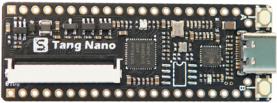
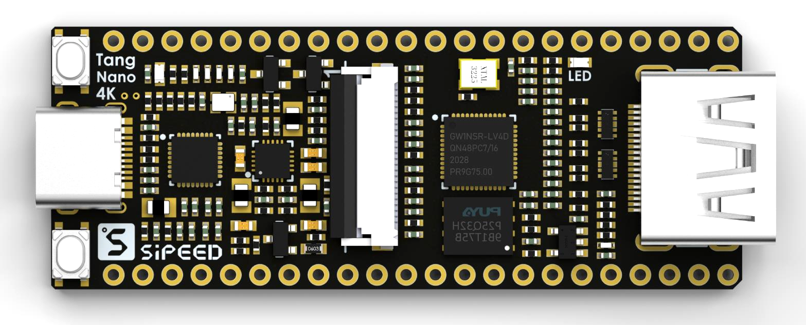

# Tang Serial Development Board

> Overview

Tang Serial development board have  Tang Nano serial and Tang Primer serial.

Tang Nano board is tiny and delicate for new user.
Tang Primer board with more on-chip resources help users do more things.

## Tang Primer 20K(Building)

- Updating

## Tang Nano 1K

## Tang Nano 4K

## Tang Nano 9K

## Tang Nano(Sold out) 

## Tang Primer(Sold out)

