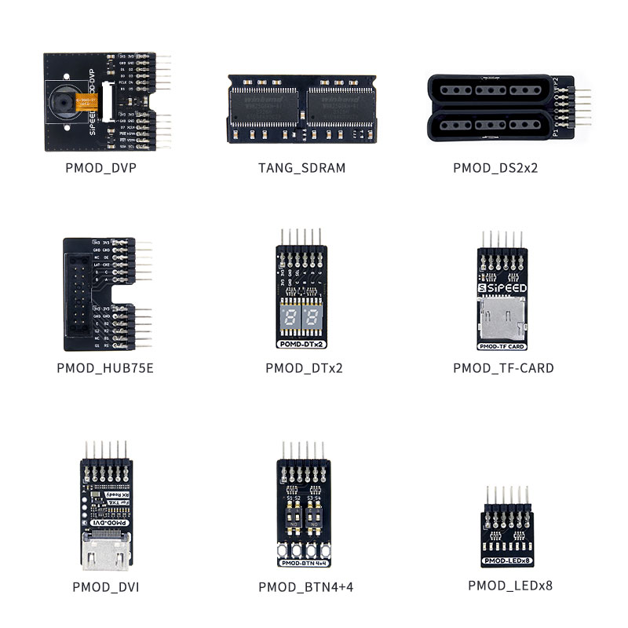
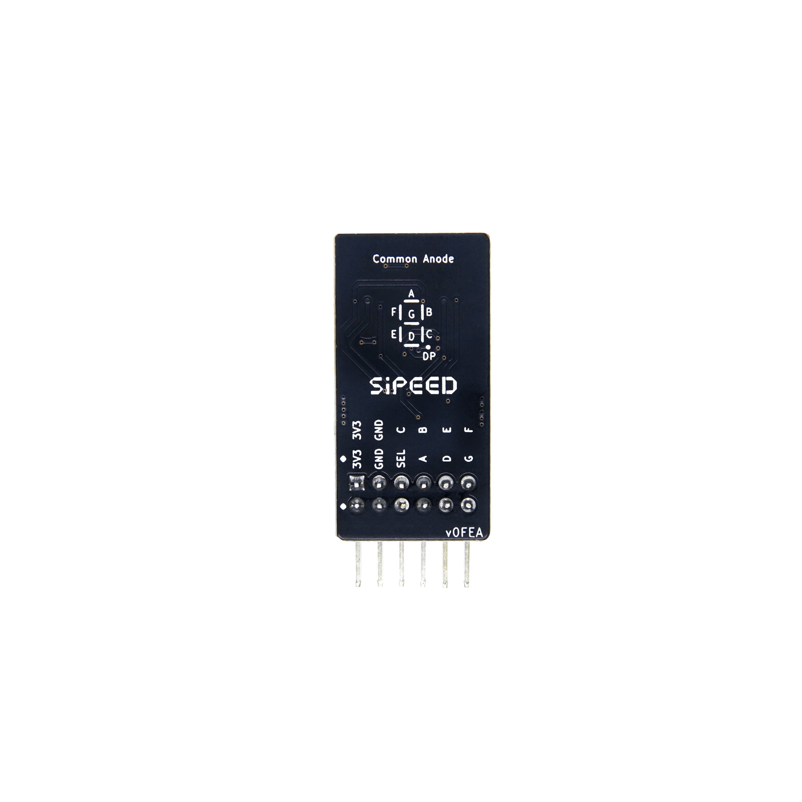
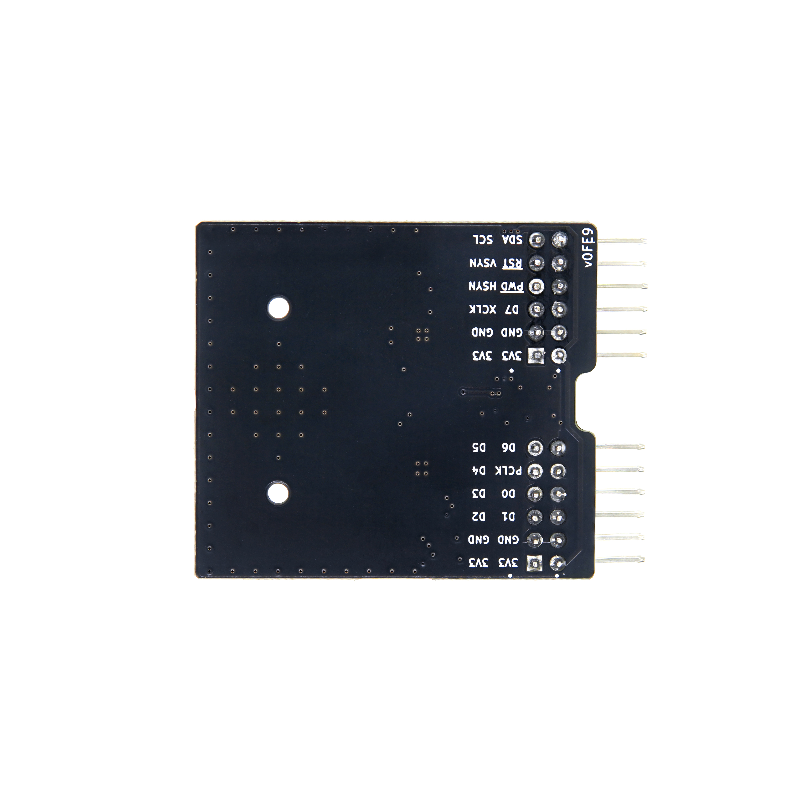
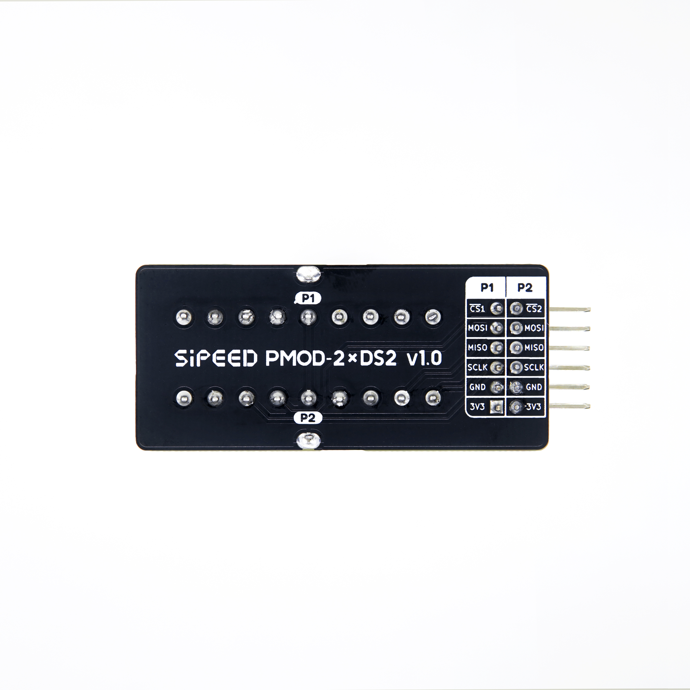

# TANG PMOD

## Overview

The TANG PMOD module is a FPGA expansion module compatible with the **Digilent Pmod™** interface standard. It can be used to extend the capabilities of FPGA development boards that include this interface, such as the [Tang Mega 138K Pro Dock](https://chatkit.app/?chat=RM8cVJL7YDE2HbRYtsBQU) and [Tang Primer 25K Dock](https://chatkit.app/?chat=RM8cVJL7YDE2HbRYtsBQU).

Different modules provide various expansion functions, and they can be combined freely to achieve the required functionalities.

    

Purchase link: [AliExpress](https://www.aliexpress.us/item/1005006265716790.html?pdp_npi)

## PMOD_LEDx8

### Introduction

This module features 8 LEDs, each corresponding to one of the 8 IOs.
Example: [pmod_digitalTube-2bit](https://github.com/sipeed/TangPrimer-25K-example/tree/main/pmod_digitalTube-2bit)

   

## PMOD_BTN4+4

### Introduction

The module includes 4 push buttons and a 4-position DIP switch.
Example: [pmod_digitalTube-2bit](https://github.com/sipeed/TangPrimer-25K-example/tree/main/pmod_digitalTube-2bit)

## PMOD_DTx2

### Introduction

A 2-digit 7-segment display module.
Example: [pmod_digitalTube-2bit](https://github.com/sipeed/TangPrimer-25K-example/tree/main/pmod_digitalTube-2bit)

   

## PMOD_DVI

### Introduction

A module for HDMI output/input, which requires the use of LVDS differential pairs.
Example: [nestang-25k](https://github.com/sipeed/TangPrimer-25K-example/tree/main/nestang-25k)

## PMOD_DVP

### Introduction

An 8-bit Digital Video Port (DVP) module compatible with M12 lenses.
Example: [Coming soon..](https://github.com/sipeed/TangPrimer-25K-example/tree/main)

   

## PMOD_TF-CARD

### Introduction

A module that supports standard TF cards and includes card detection functionality.
Example: [nestang-25k](https://github.com/sipeed/TangPrimer-25K-example/tree/main/nestang-25k)

   

## PMOD_HUB75E

### Introduction

A module that supports the HUB75E standard for LED matrix displays.
Example: [pmod_hub75e](https://github.com/sipeed/TangPrimer-25K-example/tree/main/pmod_hub75e)

## PMOD_DS2x2

### Introduction

A module that supports two DS2 controllers (without vibration).
Example: [nestang-25k](https://github.com/sipeed/TangPrimer-25K-example/tree/main/nestang-25k)

   

# TANG 40P MODULE

## Overview

The TANG 40P MODULE is a FPGA expansion module that is **partially compatible** with the DE10-Nano 40P interface standard. It can be used to extend the capabilities of FPGA development boards that include this interface. With more pins available, it allows the connection of more complex modules such as dual-particle SDRAM modules and *DVP stereo camera modules.

## TANG_SDRAM

### Introduction

32MB x2 16bit 143MHz SDRAM modules.
Example: [nestang-25k](https://github.com/sipeed/TangPrimer-25K-example/tree/main/nestang-25k)
Schematic: [Tang_sdram_xsds_V1.1_Schematic](https://github.com/sipeed/TangPrimer-25K-example/tree/main/Tang_sdram_xsds_V1.1_Schematic)

*Note: This module is not compatible with Mister SDRAM V3.0, please carefully check the corresponding schematic.
(The difference lies in pins 29 and 30 of the 40P female connector)

  

## Hardware Information

Schematics and other documentation can be found here: [Click here](https://dl.sipeed.com/shareURL/TANG/Pmod)

### Public Examples

GitHub link: https://github.com/sipeed/TangPrimer-25K-example

## Communication Channels

- **Discussion Forum: [maixhub.com](https://maixhub.com/discussion)**
- **QQ Group: [834585530](https://jq.qq.com/?_wv=1027&k=wBb8XUan)**
- Leave a message at the bottom of this page
- Business Email: [support@sipeed.com](mailto:support@sipeed.com)

## Related Issues

For more questions and their solutions, visit [Related Issues](https://github.com/sipeed/TangPrimer-25K-example/tree/main/Tang-Nano-Doc/questions.md).
