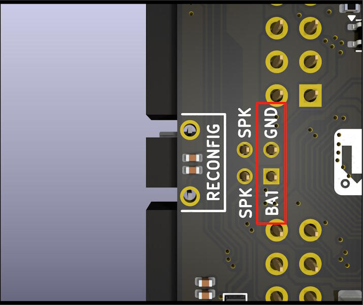

## Errata Record

### PCB Version: 32001 

  
Click for details

     
    
1. **BOT side** The silkscreen markings on the **battery connector** are wrong. The markings **`GND`** and **`BAT`** in the figure below should be swapped (the markings on the **TOP side** are correct);
    
    

 

### PCB Version: 32001B 

  
Click for details

     
    
1. **BOT side** The silkscreen markings on the **battery connector** are wrong. The markings **`GND`** and **`BAT`** in the figure below should be swapped (the markings on the **TOP side** are correct);
    
    

 

### PCB Version: 32001C 

  
Click for details

     
    
1. **BOT side** The silkscreen markings on the **battery connector** are wrong. The markings **`GND`** and **`BAT`** in the figure below should be swapped (the markings on the **TOP side** are correct);
    
    

 

## Update Record

### PCB Version: 32001C 

  TBD