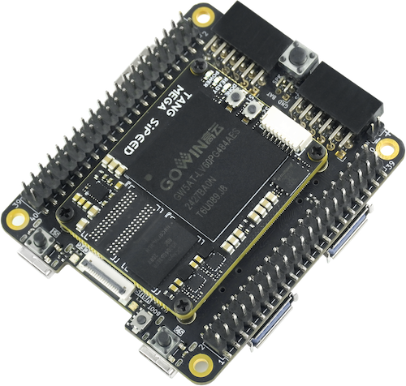

## Overview

  **Tang Console** is an another dock board for **[Tang Mega 138k](./../tang-mega-138k/mega-138k.md) SOM** and **[Tang Mega 60k](./../tang-mega-60k/mega-60k.md) SOM**. It is designed to be small and compact, and is mechanically compatible with the **Raspberry Pi 5b** **`PCIe HAT`**. In addition, it also contains two 5Gbps USB3 device interfaces and two **2x20-pin header connectors**, two **PMOD connectors**. It can meet the needs of IO expansion and high-speed communication at the same time.
  
  At the same time, it is also specially designed for retro games. Maybe you can turn it into a retro game console, or even a handheld, whatever you like.

  - Date to Release: Late March , 2025

  - Pre-sale link: [Click me](https://sipeed.com/tangconsole)

## Board Features

  - Compatible with various SOMs (**[Mega 138k](./../tang-mega-138k/mega-138k.md)** & **[Mega 60k](./../tang-mega-60k/mega-60k.md)**)
  - More compact size, more budget choice
  - Compatible with Raspberry Pi 5b PCIe HAT
  - PCIe 2.0 x 1
  - USB3 x 2(5Gbps)
  - HDMI TX x 1
  - Soft-PHY USB2 x1(480Mbps)
  - Onboard 3.7V Li-on battery(1-Series) charge/discharge management

## Product Appearance

## Block Diagram

TBD

## Hardware Parameters

### SOM Board Parameters

Please refer to the link below:
  - **[Tang Mega 138k](./../tang-mega-138k/mega-138k.md#hardware-parameters) SOM** 
  -  **[Tang Mega 60k](./../tang-mega-60k/mega-60k.md#hardware-parameters) SOM**

### Dock board Parameters

| Item                 | Quantity | Remarks                                           |
| :------------------  | ----     | ------------------------------------------------- |
| LEDs                 | 2(3+3)   | 3x Battery-Indicator + 3x User LED (2x RGB LED)   |
| Buttons              | 2+1      | 2x User-KEY + 1x Reconfig-KEY                     |
| PCIe                 | 1        | 1-lane @ 8/5Gbps (Depends on SOM)                 |
| USB3                 | 2        | SERDES lane, SuperSpeed @ 5Gbps (Device mode)     |
| USB2                 | 1        | IO Soft-PHY, HighSpeed @ 480Mbps (Device mode)    |
| DVI(HDMI)            | 1        | Compatible with HDMI, supports TX, can also be modified to RX |
| PMOD                 | 2        | Multiplexed with the the DVP CONN. & 2x20P header at the top of the Dock board |
| ADC                  | 2        | 2x differential input channels (One is used to measure the battery voltage)   |
| RGB Interface        | 1        | Supports RGB888 screen                            |
| SD Slot              | 1        | 4-bit SDIO/MMC or SPI mode                        |
| BATT CONN.           | 1        | Supports 3.7V li-on battery, with built-in charge management |
| FAN CONN.            | 1        | Supports a 5V fan                                 |
| Speaker CONN.        | 1        | Support mono output, 1x 2W Speaker                |
| MS5351               | 1        | Provides RefClk for Serdes; control output via onboard UART |
| USB JTAG & UART      | 1        | Supports FPGA programming and provides UART function  |
| 2x20P headers        | 2        | 2x20P header at the top of the Dock board multiplexed with the the PMOD & DVP CONN. |

## Hardware Resources

- ~~[Specification](https://dl.sipeed.com/shareURL/TANG/Console/01_Specification)~~
- [Schematics](https://dl.sipeed.com/shareURL/TANG/Console/02_Schematic)
- [PCB BOM](https://dl.sipeed.com/shareURL/TANG/Console/03_Designator_drawing)
- [Dimension Diagram](https://dl.sipeed.com/shareURL/TANG/Console/04_Mechanical_drawing)
- [3D Model](https://dl.sipeed.com/shareURL/TANG/Console/05_3D_file)
- [Some Chip Manuals](https://dl.sipeed.com/shareURL/TANG/Console/07_Datasheet)
- [All PIN Constraints](https://dl.sipeed.com/shareURL/TANG/Console/08_Misc)

## Getting Started

Note that **`Tang Mega 60k`** & **`Tang Mega 138k`** is currently not supported by the education version, and you need to download V1.9.11 or a newer version of the commercial IDE for use.  
Lic can be applied on the Gowin official website, or you can use the online Lic service provided by Sipeed. In the IDE, select Float Lic and fill in the following information:

~~~
---Server 01---
ip: 45.33.107.56
port: 10559

---Server 02---
ip: 106.55.34.119
port: 10559
~~~

if the ip not work, try use "gowinlic.sipeed.com" domain's IP.

Install IDE [Click me](https://wiki.sipeed.com/hardware/zh/tang/Tang-Nano-Doc/get_started/install-the-ide.html)

Example code [github](https://github.com/sipeed/TangMega-60K-example)

- Other Learning Resources

  - Free online tutorial: [Verilog Tutorial](https://www.runoob.com/w3cnote/verilog-tutorial.html) (Learn Verilog)
  - Free online FPGA tutorial: [Verilog](https://www.asic-world.com/verilog/index.html) (English website)
  - Verilog practice website: [HDLBits](https://hdlbits.01xz.net/wiki/Main_Page) (English website)
  - Online Gowin Semiconductor reference video tutorials: [Click here](http://www.gowinsemi.com.cn/video_complex.aspx?FId=n15:15:26)

  ## Communication Methods

  - **Reddit** : [reddit.com/r/GowinFPGA/](reddit.com/r/GowinFPGA/)
  - **Telegram** : [t.me/sipeed](t.me/sipeed)
  - Discussion forum: [maixhub.com/discussion](https://maixhub.com/discussion)
  - QQ discussion group: [834585530](https://jq.qq.com/?_wv=1027&k=wBb8XUan)
  - Leave a message directly below this page
  - Goto**[GitHub project page](https://github.com/sipeed/TangMega-60K-example)**and submit issues
  - Business email : [support@sipeed.com](support@sipeed.com)

## Precautions

<table>
    <tr>
        <th>Item</th>
        <th>Precautions</th>
    </tr>
    <tr>
        <td>Chip Model</td>
        <td>The specific model of the FPGA chip used by Tang Mega 60K is <b>GW5AT-LV60PG484A, and Tang Mega 138K is <b>GW5AST-LV138FPG676A</b>.</b>  Please select the package model <b>PBG484A</b> in the IDE.</td>
    </tr>
    <tr>
        <td>Static Electricity</td>
        <td>Please avoid static electricity hitting the PCBA; release the static electricity from your hands before touching the PCBA.</td>
    </tr>
    <tr>
        <td>Tolerance Voltage</td>
        <td>When using GPIO pin headers for external communication, ensure that the IO voltage is <b>3.3V</b>. Excessive voltage will permanently damage the PCBA.</td>
    </tr>
    <tr>
        <td>FPC Socket</td>
        <td>When connecting the FPC soft cable, please ensure that the cable is completely and correctly inserted into the socket without any deviation.</td>
    </tr>
    <tr>
        <td>Plug and Unplug</td>
        <td>Please completely power off before plugging and unplugging.</td>
    </tr>
    <tr>
        <td>Avoid Short Circuit</td>
        <td>Please avoid any liquid or metal touching the solder pads of the components on the PCBA during the power-on process, otherwise it may cause a short circuit and burn the PCBA.</td>
    </tr>
</table>

## Contact

Tang Console can meet different needs of customers in various scenarios. For technical support and business cooperation, please contact [support@sipeed.com](support@sipeed.com)

## Frequently Asked Questions (FAQs)

### How to update the firmware for the onboard debugger

- See [Update the debugger](./../common/update_debugger.md) for details.

### IDE cannot find the model 

1. The educational version does not support 60K and 138K, please switch to the commercial version. The following image shows the educational version (which does not support 60K);

2. IDE version is too low to use, update the IDE version ≥ **1.9.9**.

### How to burn the bitstream to FLASH {#burn_flash}

1. Setting the **Programmer** as shown in the figure below:

2. Check the position of the DIP switch; the correct position is shown in the figure below:

### No Response or Undesirable Pin Phenomenon After Burning

1. First, ensure that the IDE has selected the correct model **GW5AT-LV60PG484AC1/10**; every parameter in the figure below **MUST** be consistent.

2. Then, check your code and the corresponding simulation waveforms to meet the requirements. The GAO tools in GOWIN IDE maybe helpful. For more information, please refer to the GOWIN document [SUG100](https://www.gowinsemi.com/upload/database_doc/1885/document/660bb2366d0b3.pdf)(require login).

### For more questions and solutions, go to [Related Questions](./../Tang-Nano-Doc/questions.md) to view