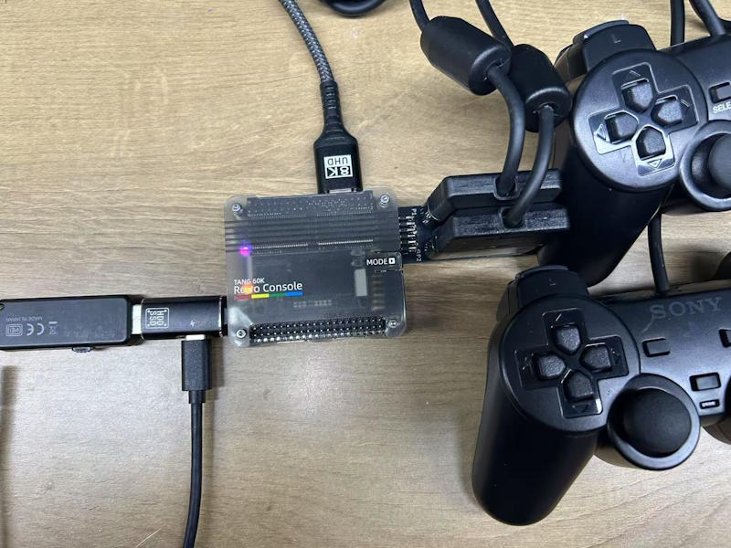
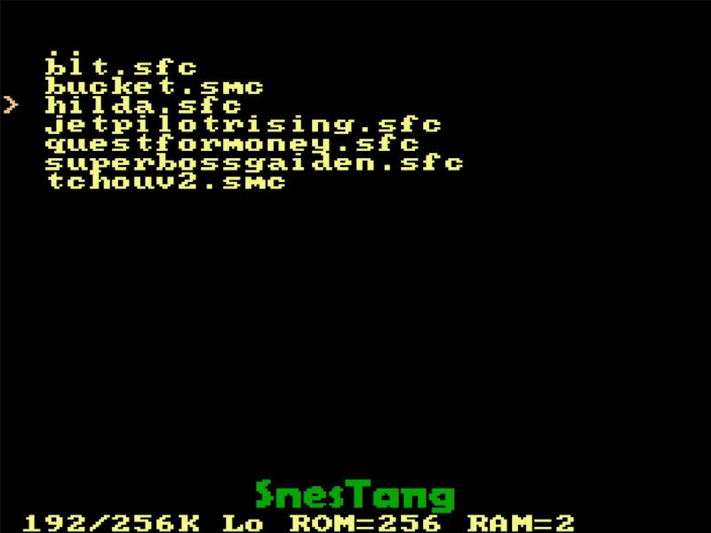

## Product Overview

- Release Date: Late-April 2025  
- ~~Pre-order Link: [**Click Here**](https://sipeed.com/tangconsole)~~ (Pre-order has ended, retail version coming soon)  
- **Development Board Documentation:** [**Click Here**](./mega-console.md)  
- **Tang Core** Developer Documentation: [**Click Here**](https://nand2mario.github.io/tangcore/)  

## Board Features  
<details>  
  <summary><font color="#4F84FF">Click for Details</font></summary>  
  <br>

- Compatible with multiple SOMs (**[Mega 138k](./../tang-mega-138k/mega-138k.md)** & **[Mega 60k](./../tang-mega-60k/mega-60k.md)**)  

- Supports multiple [**Tang Core**](https://github.com/nand2mario/tangcore) emulator cores:  
    - **NESTang** - Nintendo Entertainment System  
    - **SNESTang** - Super Nintendo Entertainment System  
    - **GBATang** - Game Boy Advance  
    - **MDTang** - Sega Genesis/Mega Drive  
    - **SMSTang** - Sega Master System  
    - **More cores are under development and will be released soon**  

- Onboard BL616 MCU  
    - Runs [**TangCore firmware for BL616**](https://github.com/nand2mario/firmware-bl616/)  
    - Supports quick emulator core switching  
    - ~~uSD card storage support~~ (currently under debugging)  
    - **Supports USB OTG** (currently requires OTG adapters or hubs with power pass-through)  
        - **USB OTG Storage** (for storing game ROMs, emulator cores, and emulator BIOS)  
        - **USB HID Controller Support**  
    - Can be used as an FPGA debugger  
- Two onboard USB-A ports for direct connection with compatible USB controllers  

- Supports DS2 controllers (requires [**PMOD_DS2x2**](../tang-PMOD/FPGA_PMOD.md#pmod_ds2x2))  

</details>  

## Product Appearance  

<details>  
  <summary><font color="#4F84FF">Click for Details</font></summary>  
  <br>  

  - **Tang Retro Console Premium** (60k version)  
      

  - **Tang Retro Console** (60k version)  
      
</details>  

## Block Diagram  

<details>  
  <summary><font color="#4F84FF">Click for Details</font></summary>  
  <br>  

  Here we take 60k SOM as an example, and the same is true for 138k
  
  

  
    
    

</details>  

## Hardware Specifications  

<details>  
  <summary><font color="#4F84FF">Click for Details</font></summary>  

  ### SOM Specifications  

  Please refer to the following links based on the installed SOM:  
  - **[Tang Mega 138k](./../tang-mega-138k/mega-138k.md#SOM-Specifications)**  
  - **[Tang Mega 60k](./../tang-mega-60k/mega-60k.md#SOM-Specifications)**  

  ### Baseboard Specifications  

  - Please refer to the **Development Board Documentation:** [**Click Here**](./mega-console.md#Baseboard-Specifications)  

</details>  

***  

## Getting Started  

Using the **Tang Retro Console** as an example, here’s how to play games with the Tang Console:  

### Preparation  

  Items needed:  

  - [x] Tang Console, either 138k or 60k version  
  - [x] USB 2.0 drive, or SD card + card reader (Recommended format: FAT32/exFAT, ≤32GB)  
  - [x] USB-C OTG adapter with power pass-through (Recommended: USB-C card reader included in the bundle)  
  - [x] Available GBA BIOS (gba_bios.bin)  
  - [x] Latest [**TangCore Release Package**](https://github.com/nand2mario/tangcore/releases)  
  - [x] Game ROMs you want to play (Demo games are preloaded on the uSD card included in the Tang Retro Console Premium bundle)  

### Installing MCU Firmware  

   - For users who purchased any Tang Console bundles, this step is not necessary, as it has been pre-installed at the factory.  

   - If firmware updates are needed in the future, please refer to the guide here: [**Click Here**](../common-doc/update_debugger.md#additional-notes-for-tang-core)  

```
  📁 /                
  ├── 📁 cores/        # `cores` directory from release
  │    ├── 📁 console60k/
  │    └── 📁 console138k/
  ├── 📁 nes/          # .nes rom files
  ├── 📁 snes/         # .smc/.sfc files
  ├── 📁 gba/
  │    └── 🗎 gba_bios.bin  # GBA BIOS
  ├── 📁 genesis/      # .bin/.md files
  └── 📁 sms/          # .sms files
  
```
  > ⚠ Console will filter the suffix of the game ROM, please be sure to change the game ROM to the corresponding suffix ⚠

### Storage Media Content

The contents of the storage media are not differentiated between the **138k console** and the **60k console**. However, the **`gba_bios.bin`** must be downloaded by the user and added manually.  

Place the game ROMs you wish to play into their corresponding directories.

### Hardware Assembly

❗Note: Please assemble all accessories before connecting the power!

1. **Early Bird Ver. Recommended Method** (All accessories for this method are included in the **Tang Console Retro Premium** package):  

     

   > Left: USB-OTG card reader + USB-C power supply | Bottom: USB controller **P1** | Top: HDMI output  

   - **Pros**: Simple to setup.  
   - **Cons**: USB controller connection may be unstable in this configuration.  

   - If the USB controller is not recognized (especially after switching emulator cores), users may need to repeatedly reconnect the USB controller several times.  

   - ***Retail Ver.**  of Tang Console does not need to use OTG card reader, just insert the uSD card into the built-in card slot. Because the built-in card slot of **Retail Ver.** is connected to **BL616** through a MUX.*

   <br>

2. **Recommended Method for Retail Version**

     

   > Bottom Left: USB-OTG | Top Left: USB-C Power Supply | Bottom: USB Controller **P1** | Top Right: HDMI Output  

   - **Pros**: MOST Simple setup.  
   - **Cons**: USB controller connection may be unstable in this configuration.  

   - If the USB controller is not recognized (especially after switching emulator cores), users may need to repeatedly reconnect the USB controller several times.  

   - The controller can be connected directly to the Console's USB port or via USB-OTG to the BL616. 
   
   - USB OTG is not necessary to assemble, depends on your use.

   <br>  

3. **The nand2mario Method**  

   <details>  
   <summary><font color="#4F84FF">Click to View Details</font></summary>  
   <br>  
     

   > Left: OTG USB drive + USB-C power supply | Right: DS2 PMOD + DS2 controller | Top: HDMI output  

   - **Pros**: Stable configuration.  
   - **Cons**: Bulky setup.  

   - For a more compact connection, try using a wireless DS2 controller and replacing the USB drive with a smaller one.  

   </br>  
   </details>  
   <br>

4. **USB OTG HUB Method** {#USB_OTG_HUB}  

   <details>  
   <summary><font color="#4F84FF">Click to View Details</font></summary>  
   <br>  
     

   > Left: USB-C OTG HUB + USB drive + USB-C power supply + USB controller **P1** | Top: HDMI output  

   - **Pros**: Stable connection.  
   - **Cons**: Bulky setup & potential USB HUB compatibility issues.  

   - Tested USB HUB compatibility list: [Click Here](https://github.com/nand2mario/tangcore/wiki/Compatible-USB-Hubs)  

   </br>  
   </details>  
   <br>

### Powering On & playing

1. Assemble the hardware as described in the previous step, then connect the power supply.  

2. Wait a moment for the main menu to appear.  

   <details>  
   <summary><font color="#4F84FF">Click to View Details</font></summary>  
      <br>  
        
   </details>  
   <br>

3. Use the game controller to navigate the menu:  
   - Move the cursor up and down.  
   - Use left and right for page navigation.  
   - Press `B` or `3` to confirm.  
   - Press `A` or `2` to go back.  
   - Navigate cursor to on `..`, press `B` to return to the previous menu.  

   <details>  
   <summary><font color="#4F84FF">Click to View Details</font></summary>  
      <br>  
        
   </details>  
   <br>

4. Select an emulator title, such as **SNES**, press `B` to access the submenu, select the game ROM you wish to play, and press `B` again to launch the game.  

   <details>  
   <summary><font color="#4F84FF">Click to View Details</font></summary>  
      <br>  
        
   </details>  
   <br>

5. The HDMI output will briefly disappear. After a short moment, the ROM loading screen will appear, and the title at the bottom of the screen will switch to the corresponding emulator's name (e.g., **SnesTang** in this example).  

   <details>  
   <summary><font color="#4F84FF">Click to View Details</font></summary>  
      <br>  
        
   </details>  
   <br>

6. Wait for the ROM to finish loading, then press the `start` button to begin the game.  

   <details>  
   <summary><font color="#4F84FF">Click to View Details</font></summary>  
      <br>  
        
   </details>  
   <br>

7. During gameplay, press `→` + `select` to return to the main menu.  

8. Some game ROMs may not be fully compatible with the emulator. If issues arise, power cycle the console to reset it.  

---

### Additional Resources  

- Original Installation Documentation: [**Click Here**](https://nand2mario.github.io/tangcore/user-guide/installation/)  
- Special Thanks: **[nand2mario](https://github.com/nand2mario)**  

---

### Contact & Support  

  For technical support and business inquiries, please contact us via email: [support@sipeed.com](mailto:support@sipeed.com)  

  - **Reddit** : [reddit.com/r/GowinFPGA/](reddit.com/r/GowinFPGA/)
  - **Telegram** : [t.me/sipeed](t.me/sipeed)
  - Discussion forum: [maixhub.com/discussion](https://maixhub.com/discussion)
  - Discord: [https://discord.gg/V4sAZ9XWpN](https://discord.gg/V4sAZ9XWpN)
  - QQ discussion group: [834585530](https://jq.qq.com/?_wv=1027&k=wBb8XUan)
  - Leave a message directly below this page
  - Goto **[GitHub project page](https://github.com/sipeed/TangMega-60K-example)** and submit issues
  - Business email : [support@sipeed.com](support@sipeed.com)

---

### Important Notes  

| Item             | Details                                                                                                      |
|------------------|-------------------------------------------------------------------------------------------------------------|
| **Power Supply** | Use a power adapter with at least **5V/2A**. Avoid exceeding **+5.5V** or dropping below **+3.4V**.          |
| **Static**       | Avoid static discharge on the PCBA. Ground yourself before touching.                                         |
| **Voltage**      | Ensure GPIO pins are at **3.3V** levels; higher voltages can damage the PCBA.                                |
| **FPC Connector**| Insert FPC cables carefully. Ensure the 1st PIN direction is correct.                                        |
| **Connecting**   | Only handle connections with the device fully powered off, except USB-A controller and drives.               |
| **USB Controller** | If the controller is unresponsive, reconnect several times.                                               |
| **Short Circuits**| Avoid liquid or metal contact with the PCBA during power-on to prevent damage.                              |

---


## FAQ  

### USB Controller Not Responding  

<details>  
<summary><font color="#4F84FF">Click to View Details</font></summary>  
<br>  

1. Please unplug and replug the USB controller, then try again.  
2. The stability issue with USB-A controllers connected to the front of the Console will be resolved in future firmware updates.  
3. The most stable connection method currently is the PMOD DS2 controller.
4. Please pay attention to the silkscreen mark on the USB port. The USB port on the right is marked as P2. Some games can only be operated with the P1 controller(The same applies when using a DS2 controller).

</details>  

---

### UI Disappears After Pressing the MODE Key  

<details>  
<summary><font color="#4F84FF">Click to View Details</font></summary>  
<br>  

1. This is a known issue and will be resolved in future firmware updates.  
2. If the cursor `>` is still visible, try using the controller to navigate pages or return to the previous menu to force a UI refresh.  

</details>  

---

### "Waiting for USB drive..." Message After Powering On  

<details>  
<summary><font color="#4F84FF">Click to View Details</font></summary>  
<br>  

1. If using a USB HUB, this might indicate HUB incompatibility.  
2. Ensure the USB drive/card reader is properly connected.  
3. Make sure the USB drive/card reader is **≤32GB** and formatted as **FAT32/exFAT**.  

     

</details>  

---

### GBATang Error: `Cannot find /gba_bios.bin...`  

<details>  
<summary><font color="#4F84FF">Click to View Details</font></summary>  
<br>  

1. This indicates that the **`/GBA` directory** on the USB drive or storage card is missing the original GBA BIOS, which may cause compatibility issues with certain ROMs.  
2. Due to copyright restrictions, we cannot provide this file. You need to obtain the `gba_bios.bin` yourself and place it in the correct location.  

     

</details>  

---

### For More Questions  

Refer to the [Troubleshooting](https://nand2mario.github.io/tangcore/user-guide/troubleshooting/) page in the Tang Core documentation for additional solutions.  

If you encounter a new issue, please feel free to provide feedback.  

Feedback methods can be found [**here**](#contact--support). 

