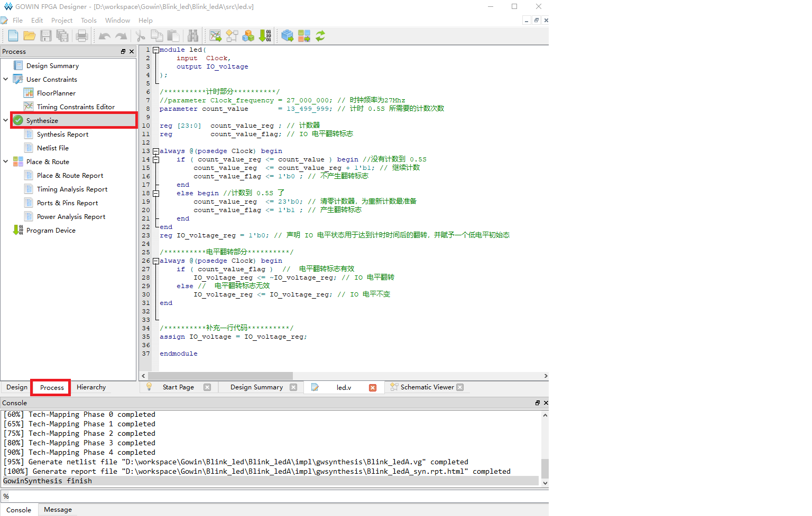

Here we take blinking a led on Tang Nano 20K as the example to know the usage of GOWIN IDE.

To know a programming language, we start with `hello world`. But in hardware development, we start by blinking a led.

## Install IDE

Visit [install IDE](https://wiki.sipeed.com/hardware/en/tang/Tang-Nano-Doc/install-the-ide.html) to prepare the development environment.

For linux user we suggest using [openfpgaLoader](https://wiki.sipeed.com/hardware/zh/tang/Tang-Nano-Doc/get_started/flash_in_linux.html) to burn the firmware into fpga.

## New Project

New Project：File-->NEW-->FPGA Design Project-->OK


Set Project Name and path, Project Name and project path should be English.


Select Device we choose GW2AR-LV18QN88C8/I7, use filter like below to help us choose device more easily. Note that the Device is GW2AR-18C.


Then click OK to preview the project. After confirming no error, the project is created.

## New file

Gowin IDE contains 3 ways to create file. Here we use shortcut keys `Ctrl + N` to new a file. The other 2 ways to new file are not mentioned here,

In the pop-up windows, we choose `Verilog File`, you can also choose `VHDL File` if you are good at it. Here we just use Verilog as example.


    
Then click OK to set the file name, here we take `led` as the verilog file name as example.


Up to now we have finished creating file, then we need to prepare our code.


### Verilog introduction

Verilog is a kind of Hardware Description Language(HDL), it's used to describe digital circuits.

The basic unit in Verilog is module.

A module is composed of two parts: one describes the interface, and the other describes the internal logic function, that is, defines how the input affects the output.

A module is like this:

```v
module module_name
#(parameter)
(port) ;
    function   
endmodule
```

The module starts from module and ends by endmodule. The module is followed by the module name (module_name), transitable variable parameters (parameter), port and direction declaration (port), followed by internal logic function description (function), and finally, endmodule is used to represent this module.

The internal logic function is usually composed by the assign and always blocks; The assign statement describes logical circuit, and the always block is used to describe timing circuit.

### Blocking and Non-blocking assignments

In timing logic, there are two assignment symbols: `=` and `<=`. Note that `<=` means less than or equal to in the if statement, and is not an assignment symbol in the if statement.

Visit the [difference between Blocking and Non-blocking assignments](#difference-between-blocking-and-non-blocking-assignments)

### Think storm

Before coding, we need to think our purpose: The led flashes every 0.5S.

Then we draw a demand block diagram as follows:


Then we need a counter to time of every 0.5S, LED flashes means IO flip.


Put the thought diagram into practical use, then it will look like this:


The Clock is the clock source, providing the accurate time for the time counter.

### Code description

From the verilog introduction and think storm diagram above, we can see the module we will create contains 2 ports:

```v
module led(
    input  Clock,
    output IO_voltage
);

endmodule
```

For time counter inside module, crystal oscillator on the Primer 20K core board is 27MHZ, so we have 27 million times rising edges per second, and we just need to count 13500000 times rising edges to get 0.5 seconds. The counter starts from `0`, and to count 13500000 times rising edges, we count to 13499999. When counted to 0.5S, we set a flag to inform LED IO to flip its voltage. The overall count code is as follows:

```v
//parameter Clock_frequency = 27_000_000; // Crystal oscillator frequency is 27Mhz
parameter count_value       = 13_499_999; // The number of times needed to time 0.5S

reg [23:0]  count_value_reg ; // counter_value
reg         count_value_flag; // IO chaneg flag

always @(posedge Clock) begin
    if ( count_value_reg <= count_value ) begin //not count to 0.5S
        count_value_reg  <= count_value_reg + 1'b1; // Continue counting
        count_value_flag <= 1'b0 ; // No flip flag
    end
    else begin //Count to 0.5S
        count_value_reg  <= 23'b0; // Clear counter,prepare for next time counting.
        count_value_flag <= 1'b1 ; // Flip flag
    end
end
```

The code to change IO voltage are as follows:

```v
reg IO_voltage_reg = 1'b0; // Initial state

always @(posedge Clock) begin
    if ( count_value_flag )  //  Flip flag 
        IO_voltage_reg <= ~IO_voltage_reg; // IO voltage filp
    else //  No flip flag
        IO_voltage_reg <= IO_voltage_reg; // IO voltage constant
end
```

Combined with the codes above, it goes like this:

```v
module led(
    input  Clock,
    output IO_voltage
);

/********** Counter **********/
//parameter Clock_frequency = 27_000_000; // Crystal oscillator frequency is 27Mhz
parameter count_value       = 13_499_999; // The number of times needed to time 0.5S

reg [23:0]  count_value_reg ; // counter_value
reg         count_value_flag; // IO chaneg flag

always @(posedge Clock) begin
    if ( count_value_reg <= count_value ) begin //not count to 0.5S
        count_value_reg  <= count_value_reg + 1'b1; // Continue counting
        count_value_flag <= 1'b0 ; // No flip flag
    end
    else begin //Count to 0.5S
        count_value_reg  <= 23'b0; // Clear counter,prepare for next time counting.
        count_value_flag <= 1'b1 ; // Flip flag
    end
end

/********** IO voltage flip **********/
reg IO_voltage_reg = 1'b0; // Initial state

always @(posedge Clock) begin
    if ( count_value_flag )  //  Flip flag 
        IO_voltage_reg <= ~IO_voltage_reg; // IO voltage filp
    else //  No flip flag
        IO_voltage_reg <= IO_voltage_reg; // IO voltage constant
end

/***** Add an extra line of code *****/
assign IO_voltage = IO_voltage_reg;

endmodule
```

Because the `IO_voltage` is declared in the port position, which is wire type by default. To connect it to the reg variable `IO_voltage_reg`, we need to use assign. 

## Synthesize, constrain, place&route

### Synthesize

After finishing the code, go to the "Process" interface and double click "Synthesize" to synthesize our code to convert the verilog code content to netlist.



### Constraint

After Synthesizing our code, we need to set constrains to bind the ports defined in our code to fpga pins, by which we can realize our module function on fpga. 

Click the FloorPlanner in the top of Synthesize to set constrains.


Since this is the first time we create it, the following dialog box will pop up. Click OK and the graphical constraint interface will pop up.


The ways to constraint the file can be get from this docs: [SUG935-1.3E_Gowin Design Physical Constraints User Guide.pdf](https://dl.sipeed.com/fileList/TANG/Nano%209K/6_Chip_Manual/EN/General%20Guide/SUG935-1.3E_Gowin%20Design%20Physical%20Constraints%20User%20Guide.pdf)

Here we only use the IO Constranins method shown below to constrain the pins:


According to [Schematic of core board](https://dl.sipeed.com/fileList/TANG/Primer_20K/02_Schematic/), we can know the input pin of crystal oscillator is PIN04。


结合原理图上 LED 所连接的引脚，这里只对 LED0 进行操作


因此对于在 FloorPlanner 交互窗口下面的 IO Constranins 中将 PORT（端口）与 Location（引脚） 分别填入下面的值：


输入完毕后快捷键 Ctrl + S 来保存一下引脚约束，然后接可以关闭 FloorPlanner 的交互图形界面了。

接着发现在工程项目里面多出来刚刚创建的 cst 文件了，里面的内容也比较好理解。


### 布局布线

完成约束后就要开始运行布局布线了，目的是为了把综合所生成的网表与我们自己定义的约束来通过 IDE 算出最优解然后将资源合理地分配在 FPGA 芯片上。

双击下图红框处的 Place&Route 就开始运行了。

。

紧接着没有报错，全部通过。就可以开始进行烧录了。

## 烧录固件

Tang Nano 20K 板卡上搭载了 BL616 芯片，用来烧录 FPGA 固件到板卡中。

在 [安装IDE](https://wiki.sipeed.com/hardware/zh/tang/Tang-Nano-Doc/get_started/install-the-ide.html) 的时候已经安装了驱动。因此我们将板子与电脑连接起来就行。


### 扫描设备

双击下图中的下载程序(Program Device) 来运行 Programmer 软件


然后在打开的页面中点击一下 scan_device 来扫描到我们的设备。


点击 OK 后就可以接下来对 FPGA 进行操作了。

烧录相关的文档可以参考 [SUG502-1.3_Gowin_Programmer用户指南.pdf](http://cdn.gowinsemi.com.cn/SUG502-1.3_Gowin_Programmer%E7%94%A8%E6%88%B7%E6%8C%87%E5%8D%97.pdf)

### 下载到 SRAM

一般来说这个模式是以用来快速验证所生成的固件是否满足自己目的的。

因为其烧录快的特性所以使用的较多，然是当然断电会丢失数据，所以如果想上电运行程序的话是不能选这个的。

点击 Operation 下面的功能框来打开设备设置界面，接着在 Operation 框中选择 SRAM Program 选项来设置为下载到 SRAM ，最后点击下面的那三个点点框来选择我们所生成的 .fs 下载固件。通常来说下载固件生成与工程文件目录下的 impl -> pnr 目录下。


接着来点击红框处开始进行烧录 


有问题的话可以前往 [常见问题](https://wiki.sipeed.com/hardware/zh/tang/Tang-Nano-Doc/questions.html) 自行排查。

到这里就下载完成了。

### 下载到 Flash

上面说过下载到 SRAM 是为了快速验证，但是不能上电运行程序。
所以想要上电运行的话我们需要设置下载到 Flash。

和上面下载到 SRAM 的步骤几乎类似，先点开 Operation 下面的功能框来打开设备设置界面，接着在 Operation 框中选择 External Flash Mode 选项来设置为下载到外部 Flash ，最后点击下面的那三个点点框来选择我们所生成的 .fs 下载固件，通常来说下载固件生成与工程文件目录下的 impl -> pnr 目录下。最后在下面的外部 Flash 选项中选择设备为 Generic Flash 。


接着来点击红框处开始进行烧录 


然后我们的程序重新上电也能照样运行了。

## 代码结果

如图所示，只有一个灯在闪。


## 结语

到这里我们就已经完成了 FPGA 的 “Hello world” 了。以后的示例工程不会再叙述新建文件等操作了。

## 阻塞赋值与非阻塞赋值区别

以下内容搬运自 `大猪蹄子` （有改动）：

编写一段简单的代码，对它进行简单的仿真：

```v
module test(
    input      CLK,
    input      [3:0] A,
    output reg [3:0] B,C,D,E
);

always@(posedge CLK)
begin
    B <= A;
    C <= B;

    D  = A;
    E  = D;
end
endmodule
```


根据仿真结果我们可以看出阻塞和非阻塞赋值的差别。这里对比 `B` `C` `D` `E` 四种结果。`<=` 叫做非阻塞赋值，同一个 `always` 中的 `<=` 会同时执行。这就造成了绿框内的情况：`B` 直接被赋予 `A` 的值同时 `C` 被赋予 `B` 的值。由于这两步是同时进行的，就导致 `C` 被赋予的值是 `B` 的旧值，也就造成了图中所示，`C` 的数据变化时钟要慢 `B` 一个时钟周期。再说阻塞赋值 `=`，也就是说同一个 `always` 中上一个 `=` 语句执行完才会执行下一个 `=` 语句。在这个代码中，上一个语句 `D` 已经被赋予了 `A` 的值，才执行把 `D` 的值赋给 `E`，所以 `D` 、`E` 的值在仿真中始终保持一致。

> 不过一般来说，不建议在时序逻辑中使用阻塞赋值 `=`。

也得出了额外两个结论：
- 第一，输入的数据不是完全有效，以时钟边沿时刻的输入数据为准。`posedge` 就是以上升沿执行，`negedge` 就是以下降沿执行。如果数据维持的时间小于一个时钟周期，就很有可能采集不到（如红框所示）。
- 第二、每次触发特定时钟边沿，对应的 `always` 块就会从头到尾执行一次代码（如绿框所示），而不是从中间某处执行。

## 常见问题

前往 [Gowin 板卡常见问题查看](./../../Tang-Nano-Doc/questions.md)