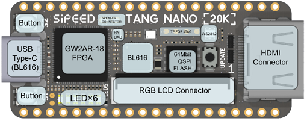
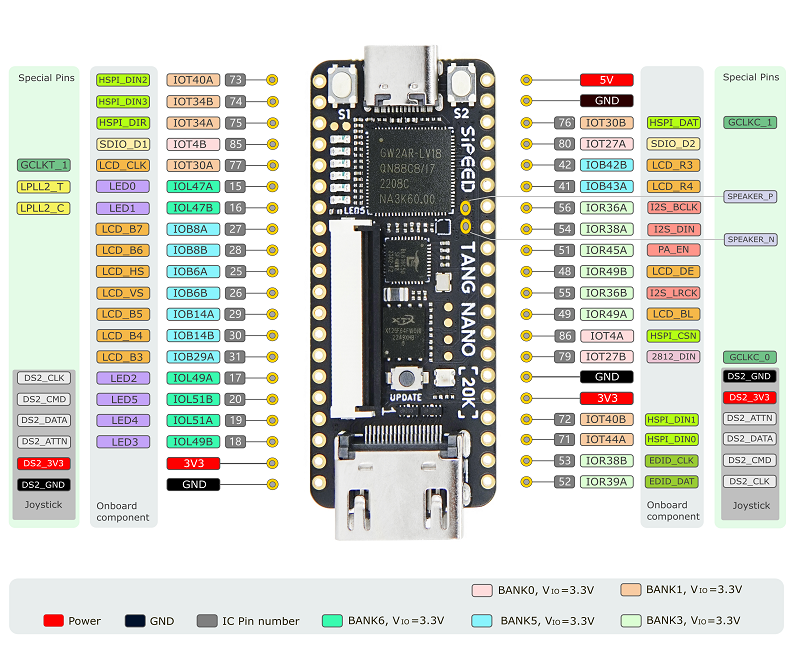

## Introduction

Tang Nano 20K is a development board, using the [GW2AR-18 QN88](http://www.gowinsemi.com.cn/prod_view.aspx?TypeId=10&FId=t3:10:3&Id=167#GW2AR) FPGA, containing 20736 LUT4 logic cells and 15552 Flip-Flops. There are 2 PLL in this FPGA chip, and many DSP units supporting 18 bit x 18 bit multiplication. Onboard [BL616](https://bouffalolab.com/product/?type=detail&id=21) is used for downloading bitstream into FPGA, and it's also used as USB to serial convertor to communicate FPGA with computer via UART. The 27MHz crystal generates the clock for HDMI display, onboard MS5351 clock generating chip also provides multiple clocks.

## Rendering appearance

## Parameters

<table>
    <thead>
    	<tr>
    		<th style="text-align:center">Item</th>
    		<th style="text-align:center">Detail</th>
    		<th style="text-align:center">Others</th>
    	</tr>
    </thead>
    <tbody>
    	<tr>
    		<td style="text-align:left">FPGA Chip</td>
    		<td style="text-align:left"><a href="http://www.gowinsemi.com.cn/prod_view.aspx?TypeId=10&amp;FId=t3:10:3&amp;Id=167#GW2AR">GW2AR-LV18QN88C8/I7</a>
    		</td>
    		<td style="text-align:left">
    			<table>
    				<tbody>
					<tr>
    					<td>Logic units(LUT4)</td>
    					<td>20736</td>
    				</tr>
    				<tr>
    					<td>Flip-Flop(FF)</td>
    					<td>15552</td>
    				</tr>
    				<tr>
    					<td>Shadow SRAM (S-SRAM)(bits)</td>
    					<td>41472</td>
    				</tr>
    				<tr>
    					<td>Block SRAM (B-SRAM)(bits)</td>
    					<td>828K</td>
    				</tr>
    				<tr>
    					<td>Numbers of B-SRAM</td>
    					<td>46</td>
    				</tr>
    				<tr>
    					<td>32bits SDR SDRAM</td>
    					<td>64M bits</td>
    				</tr>
    				<tr>
    					<td>Numbers of 18x18 Multiplier</td>
    					<td>48</td>
    				</tr>
    				<tr>
    					<td>Numbers of PLLs</td>
    					<td>2</td>
    				</tr>
    				<tr>
    					<td>I/O Bank</td>
    					<td>8</td>
    				</tr>
    			</tbody></table>
    		</td>
    	</tr>
    	<tr>
    		<td style="text-align:left">Onboard debugger</td>
    		<td style="text-align:left">BL616</td>
    		<td style="text-align:left">· JTAG for FPGA · USB to UART for FPGA · USB to SPI for FPGA communication · Control MS5351 generate frequency</td>
    	</tr>
    	<tr>
    		<td style="text-align:left">Clock generator</td>
    		<td style="text-align:left">MS5351</td>
    		<td style="text-align:left">Provide extra 3 clocks for FPGA 
			<a href="https://wiki.sipeed.com/hardware/en/tang/tang-nano-20k/example/unbox.html#pll_clk">CLick me to see how to config MS5351</a>
			</td></td>
    	</tr>
    	<tr>
    		<td style="text-align:left">Display interface</td>
    		<td style="text-align:left">· 40Pins RGB lcd connector · HDMI interface</td>
    		<td style="text-align:left"></td>
    	</tr>
    	<tr>
    		<td style="text-align:left"> LED </td>
    		<td style="text-align:left"> 6 </td>
    		<td style="text-align:left"> Low voltage level enable</td>
    	</tr>
    	<tr>
    		<td style="text-align:left"> RGB LED </td>
    		<td style="text-align:left"> 1 </td>
    		<td style="text-align:left"> WS2812 </td>
    	</tr>
    	<tr>
    		<td style="text-align:left"> User key </td>
    		<td style="text-align:left"> 2 </td>
    		<td style="text-align:left"> </td>
    	</tr>
    	<tr>
    		<td style="text-align:left"> TF Card Slot </td>
    		<td style="text-align:left"> 1 </td>
    		<td style="text-align:left">  </td>
    	</tr>
    	<tr>
    		<td style="text-align:left"> PCM Amplifier </td>
    		<td style="text-align:left"> 1 </td>
    		<td style="text-align:left"> MAX98357A，for audio driving</td>
    	</tr>
    	<tr>
    		<td style="text-align:left"> Storage </td>
    		<td style="text-align:left"> 64Mbits Flash </td>
    		<td style="text-align:left"> To save bitstream </td>
    	</tr>
    	<tr>
    		<td style="text-align:left"> Size </td>
    		<td style="text-align:left"> 22.55mm x 54.04mm </td>
    		<td style="text-align:left"> Visit 3D file for more information </td>
    	</tr>
    </tbody>
</table>

## Function diagram

Detailed Function diagram

## Pin diagram

## FPGA Jtag test point

We reserved jtag test point on Tang Nano 20K, for those who want to use their own debugger.

Note: There is onboard Jtag for download FPGA firmware, so this Jtag test point is only for those who want to use their own debugger.

## Hardware information

[Datesheet](https://dl.sipeed.com/shareURL/TANG/Nano_20K/1_Datasheet)
[Schematic](https://dl.sipeed.com/shareURL/TANG/Nano_20K/2_Schematic)
[PCB BOM](https://dl.sipeed.com/shareURL/TANG/Nano_20K/3_Bit_number_map)(Visit the `html` file in your board version)
[Board Size](https://dl.sipeed.com/shareURL/TANG/Nano_20K/4_Dimensional_drawing)
[Bosrd 3D File](https://dl.sipeed.com/shareURL/TANG/Nano_20K/4_Dimensional_drawing)
[Part of chip datasheet](https://dl.sipeed.com/shareURL/TANG/Nano_20K/6_Chip_manual)

## Using guide

Install IDE -> Prepare your code -> Burn into board

- Install IDE [Click me](https://wiki.sipeed.com/hardware/en/tang/Tang-Nano-Doc/install-the-ide.html)
- [Unbox](https://wiki.sipeed.com/hardware/en/tang/tang-nano-20k/example/unbox.html)
- Blink the leds [Click me](https://wiki.sipeed.com/hardware/en/tang/tang-nano-20k/example/led.html)

More example codes [Github](https://github.com/sipeed/TangNano-20K-example)

### Studying resource

- Verilog tutorial:[Verilog](https://www.asic-world.com/verilog/index.html)
- Verilog Practice：[HDLBits](https://hdlbits.01xz.net/wiki/Main_Page)

## Contact

  - **Reddit** : [reddit.com/r/GowinFPGA/](reddit.com/r/GowinFPGA/)
  - **Telegram** : [t.me/sipeed](t.me/sipeed)
  - Discussion forum: [maixhub.com/discussion](https://maixhub.com/discussion)
  - QQ discussion group: [834585530](https://jq.qq.com/?_wv=1027&k=wBb8XUan)
  - Leave message in the end of this page
  - Business email : [support@sipeed.com](support@sipeed.com)

## Questions

### The system does not recognize the onboard debugger

- Try connecting directly to the computer instead of through a USB HUB.
- Try using a better quality USB cable.
- Try another computer to rule out the computer being the problem. 
- Try [update to the latest firmware](#how-to-update-the-firmware-for-the-onboard-debugger) and try again.

### The UART of the onboard debugger cannot be used

- Try reinstall FTDI drivers.
- IF the actual baudrate is always four times the set baudrate or the UART continuously outputs garbled characters. try [update to the latest firmware](#how-to-update-the-firmware-for-the-onboard-debugger) and try again.

### OpenFPGAloader not work

- Try [update to the latest firmware](#how-to-update-the-firmware-for-the-onboard-debugger) and try again.

### How to update the firmware for the onboard debugger

- See [Update the debugger](./../common/update_debugger.md) for details.

### How to store bitstream

Tang Nano 20K uses the external Flash to save the firmware, we need to download the bitstream to store the firmware.

### Visit [Tang Questions](/hardware/en/tang/Tang-Nano-Doc/questions.html) to find more solutions
