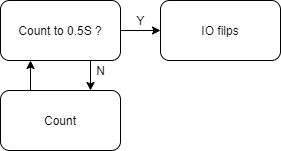
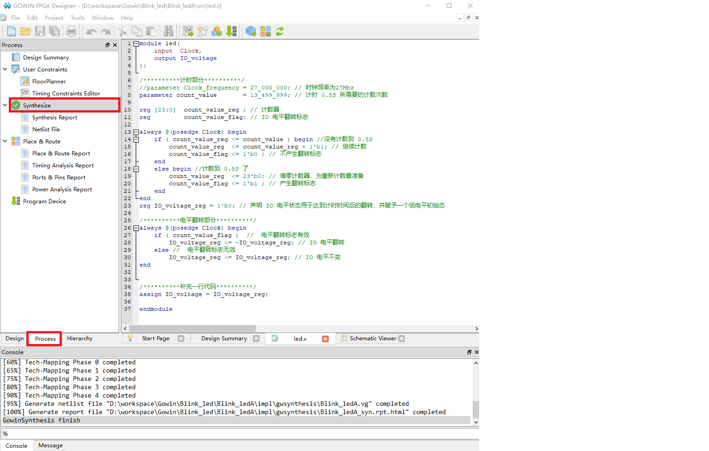
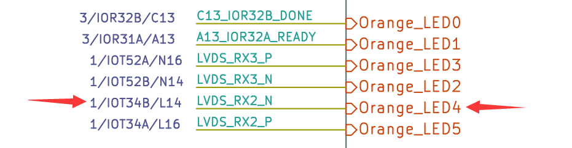
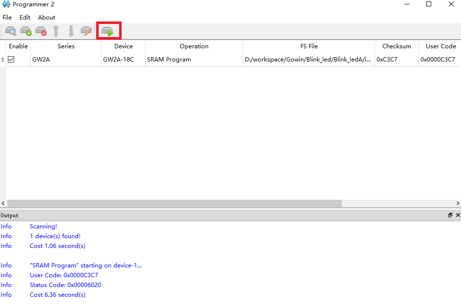

To know a programming language, we start with `hello world`. But in hardware development, we start by blinking a led.

## Install IDE

Visit [install IDE](https://wiki.sipeed.com/hardware/en/tang/common-doc/install-the-ide.html) to prepare the development environment.

For linux user we suggest using [openfpgaLoader](https://wiki.sipeed.com/hardware/zh/tang/common-doc/get_started/flash_in_linux.html) to burn the firmware into fpga.

## New Project

New Project：File-->NEW-->FPGA Design Project-->OK


Set Project Name and path, Project Name and project path should be English.


Select Device we choose GW2A-LV18PG256C8/I7, use filter like below to help us choose device more easily. Note that the Device is GW2A-18C.


Then click OK to preview the project. After confirming no error, the project is created.

## New file

Gowin IDE contains 3 ways to create file. Here we use shortcut keys `Ctrl + N` to new a file. The other 2 ways to new file are not mentioned here,

In the pop-up windows, we choose `Verilog File`, you can also choose `VHDL File` if you are good at it. Here we just use Verilog as example.


    
Then click OK to set the file name, here we take `led` as the verilog file name as example.


Up to now we have finished creating file, then we need to prepare our code.


### Verilog introduction

Verilog is a kind of Hardware Description Language(HDL), it's used to describe digital circuits.

The basic unit in Verilog is module.

A module is composed of two parts: one describes the interface, and the other describes the internal logic function, that is, defines how the input affects the output.

A module is like this:

```v
module module_name
#(parameter)
(port) ;
    function   
endmodule
```

The module starts from module and ends by endmodule. The module is followed by the module name (module_name), transitable variable parameters (parameter), port and direction declaration (port), followed by internal logic function description (function), and finally, endmodule is used to represent this module.

The internal logic function is usually composed by the assign and always blocks; The assign statement describes logical circuit, and the always block is used to describe timing circuit.

### Blocking and Non-blocking assignments

In timing logic, there are two assignment symbols: `=` and `<=`. Note that `<=` means less than or equal to in the if statement, and is not an assignment symbol in the if statement.

Visit the [difference between Blocking and Non-blocking assignments](#difference-between-blocking-and-non-blocking-assignments)

### Think storm

Before coding, we need to think our purpose: The led flashes every 0.5S.

Then we draw a demand block diagram as follows:


Then we need a counter to time of every 0.5S, LED flashes means IO flip.



Put the thought diagram into practical use, then it will look like this:


The Clock is the clock source, providing the accurate time for the time counter.

### Code description

From the verilog introduction and think storm diagram above, we can see the module we will create contains 2 ports:

```v
module led(
    input  Clock,
    output IO_voltage
);

endmodule
```

For time counter inside module, crystal oscillator on the Primer 20K core board is 27MHZ, so we have 27 million times rising edges per second, and we just need to count 13500000 times rising edges to get 0.5 seconds. The counter starts from `0`, and to count 13500000 times rising edges, we count to 13499999. When counted to 0.5S, we set a flag to inform LED IO to flip its voltage. The overall count code is as follows:

```v
//parameter Clock_frequency = 27_000_000; // Crystal oscillator frequency is 27Mhz
parameter count_value       = 13_499_999; // The number of times needed to time 0.5S

reg [23:0]  count_value_reg ; // counter_value
reg         count_value_flag; // IO change flag

always @(posedge Clock) begin
    if ( count_value_reg <= count_value ) begin //not count to 0.5S
        count_value_reg  <= count_value_reg + 1'b1; // Continue counting
        count_value_flag <= 1'b0 ; // No flip flag
    end
    else begin //Count to 0.5S
        count_value_reg  <= 23'b0; // Clear counter,prepare for next time counting.
        count_value_flag <= 1'b1 ; // Flip flag
    end
end
```

The code to change IO voltage are as follows:

```v
reg IO_voltage_reg = 1'b0; // Initial state

always @(posedge Clock) begin
    if ( count_value_flag )  //  Flip flag 
        IO_voltage_reg <= ~IO_voltage_reg; // IO voltage flip
    else //  No flip flag
        IO_voltage_reg <= IO_voltage_reg; // IO voltage constant
end
```

Combined with the codes above, it goes like this:

```v
module led(
    input  Clock,
    output IO_voltage
);

/********** Counter **********/
//parameter Clock_frequency = 27_000_000; // Crystal oscillator frequency is 27Mhz
parameter count_value       = 13_499_999; // The number of times needed to time 0.5S

reg [23:0]  count_value_reg ; // counter_value
reg         count_value_flag; // IO change flag

always @(posedge Clock) begin
    if ( count_value_reg <= count_value ) begin //not count to 0.5S
        count_value_reg  <= count_value_reg + 1'b1; // Continue counting
        count_value_flag <= 1'b0 ; // No flip flag
    end
    else begin //Count to 0.5S
        count_value_reg  <= 23'b0; // Clear counter,prepare for next time counting.
        count_value_flag <= 1'b1 ; // Flip flag
    end
end

/********** IO voltage flip **********/
reg IO_voltage_reg = 1'b0; // Initial state

always @(posedge Clock) begin
    if ( count_value_flag )  //  Flip flag 
        IO_voltage_reg <= ~IO_voltage_reg; // IO voltage flip
    else //  No flip flag
        IO_voltage_reg <= IO_voltage_reg; // IO voltage constant
end

/***** Add an extra line of code *****/
assign IO_voltage = IO_voltage_reg;

endmodule
```

Because the `IO_voltage` is declared in the port position, which is wire type by default. To connect it to the reg variable `IO_voltage_reg`, we need to use assign. 

## Synthesize, constrain, place&route

### Synthesize

After finishing the code, go to the "Process" interface and double click "Synthesize" to synthesize our code to convert the verilog code content to netlist.



### Constraint

After Synthesizing our code, we need to set constrains to bind the ports defined in our code to fpga pins, by which we can realize our module function on fpga. 

Click the FloorPlanner in the top of Synthesize to set constrains.


Since this is the first time we create it, the following dialog box will pop up. Click OK and the graphical constraint interface will pop up.


The ways to constraint the file can be get from this docs: [SUG935-1.3E_Gowin Design Physical Constraints User Guide.pdf](https://dl.sipeed.com/fileList/TANG/Nano%209K/6_Chip_Manual/EN/General%20Guide/SUG935-1.3E_Gowin%20Design%20Physical%20Constraints%20User%20Guide.pdf)

Here we only use the IO Constraints method shown below to constrain the pins:


According to [Schematic of core board](https://dl.sipeed.com/shareURL/TANG/Primer_20K/02_Schematic), we can know the input pin of crystal oscillator is H11。


Taking into consideration the IO screen printing on the ext_board, we decide to use the L14 pin on the ext_board for flashing.



So for the IO Constraints under the FloorPlanner interactive window, we fill in the following values for PORT and Location:


Finishing filling, use `Ctrl + S` to save constraints file, then close FloorPlanner interactive graphical interface.

Then we see there is a .cst file in our project, and its content are easy to understand. 


### Place & Route

After finishing constraining, we run Place & Route. The purpose is to synthesize the generated netlist and our defined constraints to calculate the optimal solution through IDE, then allocate resources reasonably on the FPGA chip.

Double click Place&Route marked with red box to run.


Then there is no error, everything works well, we can burn our fpga.

## Burn bitstream

There is onboard programmer for downloading bitstream, and drivers have been installed when [install IDE](https://wiki.sipeed.com/hardware/en/tang/common-doc/install-the-ide.html), we connect dock ext-board with computer.


### Scan device

Make sure you have enabled the core board first, put the 1 switch on the dip switch down.


Double click `Program Device` to run Programmer application


Click scan_device to scan device


Click OK to finish selecting device.

### Burn to SRAM

Normally this mode is used to verify biststream.

Because of its fast burning characteristics so the use of more, but of course the power will lose data, so if you want to power on the running program you can't choose this mode.

Click the function box below Operation to open the device configuration interface, then select the SRAM Mode option in Access Mode to set to download to SRAM, and finally click the three dots box below to select our generated `.fs` bitstream file . Generally speaking, bitstream firmware file is in the impl -> pnr directory.


Click where the red box is to burn firmware.



Go to [Questions](https://wiki.sipeed.com/hardware/en/tang/common-doc/questions.html) if you have any trouble。

Here we finished downloading into SRAM。

### Burn into Flash

Burning into sram is used for verifying bitstream, but can't store program.
If we want to run application at startup, we need to burn into flash.

This steps are similar to the steps above of burning to SRAM.

Click the function box below Operation to open the device configuration interface, then select the External Flash Mode in the Access Mode to burn into external Flash. Finally click the three dots below to select the.fs we generated to download the firmware. Choose the three dots box below to select our generated `.fs` bitstream file. Generally speaking, bitstream firmware file is in the impl -> pnr directory. Finally, select the Generic Flash device from the following external Flash options.


Click where the red box is to burn firmware.


Then we can run our program when power on.

### Result

One led flashes like below.


## End

Up to now we have finished blinking led on fpga, and know how to use GOWIN IDE with fpga.。

## Difference between Blocking and Non-blocking assignments

Write a simple codes and simulate it:

```v
module test(
    input      CLK,
    input      [3:0] A,
    output reg [3:0] B,C,D,E
);

always@(posedge CLK)
begin
    B <= A;
    C <= B;

    D  = A;
    E  = D;
end
endmodule
```


According to the simulation results, we can see the difference between blocking and non-blocking assignments by comparing the `B` `C` `D` `E` four results. `<=` is non-blocking assignments, and all `<=` in a `always` run at the same time, this lead the result in green box, `B` is assigned the value of `A` while `C` is assigned the value of `B`, this happens at the same time, so `C` is assigned the old value of `B`, the value of `C` is one clock delay of `B`. `=` is blocking assignments, all `=` in a `always` runs sequentially. In this code, `D` is assigned the value of `A`, then `D` is assigned the value of `E`, so `D` and `E` are the same value.

> In general, however, blocking assignment is not recommended in timing logic.

And we get two results:
- Input data is not always valid, it depends on the clock edge. If the data is maintained for less than one clock cycle, it may regard useless data.
- Every time Triggering the edge clock, the `always` block runs from begin to the end, not runs from the middle.

## Questions

### No Cable found

Check if there are two converters in device manager, reinstall programmer driver if there are no two converters in device manager.


### No gowin device found

Make sure you have enabled the core board.

### Other questions

Visit [Gowin errors to solve this problem](https://wiki.sipeed.com/hardware/en/tang/common-doc/questions.html)