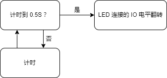

Let's blink a led after getting the Tang Primer 20K Lite suits.

## Preread

This document is writen for guiding user start preparing GOWIN development enviroment and use the Tang Primer 20K.

The default firmware function in the Core board is as followings:
- All IO port routed to pin 2.54mm pad toggles regularly, including spi_lcd connector ports and sd_card connector ports on Core Board
- DDR test; Test result print_out by serial port connector on Core Board and we can use serial tool in computer to see

Because of the DDR test function, Core Board will be very hot. you can erase the firmware in the Core Board if you mind this. And default firmware project can be found here: [github](https://github.com/sipeed/TangPrimer-20K-example/tree/main/Lite-bottom%20test%20project/test_board)

## Install IDE

Visit [Install IDE](./../../../Tang-Nano-Doc/install-the-ide.md) to prepare the enviroment for this FPGA.

For windows users, we recommend use this [Programmer](https://dl.sipeed.com/shareURL/TANG/programmer) application install the Programmer application installed with IDE, this can reduce many trobules we will meet.

For Linux users, if it's difficult to run Programmer application to burn firmware into fpga, please visit [OpenFpgaloader](https://wiki.sipeed.com/hardware/en/tang/Tang-Nano-Doc/flash-in-linux.html) to see how to use it.

## New Project

New Project：File-->NEW-->FPGA Dsign Project-->OK

<div>
    
    
</div>

Set Project Name and path, Project Name and project path should be English.


Select Device we choose GW2A-LV18PG256C8/I7, use filter like below to help us choose device more easy. Note that the Device is GW2A-18C.


Then click OK to preview the project. After confirming no error, the project is created.

## New file

Gowin IDE contains 3 ways to create file. Here we use shortcuts keys `Ctrl + N` to new a file. The other 2 ways to new file are not mentioned here,

In the pop-up windows, we choose `Verilog File`, you can also choose `VHDL File` if you are good at it. Here we just use Verilog as example.


Then click OK to set the file name, here we take `led` as the verilog file name as example.


Up to now we have finished creating file, then we need to prepare our code.


### Verilog introduction

Verilog is a kind of Hardware Description Language(HDL), it's used to describe digital circuits.

The basic unit in Verilog is module.

A module is composed of two parts: one describes the interface, and the other describes the internal logic function, that is, defines how the input affects the output.

A module is like this:

```v
module module_name
#(parameter)
(port) ;
    function   
endmodule
```

The module starts from module and ends by endmodule. The module is followed by the module name (module_name), transitable variable parameters (parameter), port and direction declaration (port), followed by internal logic function description (function), and finally, endmodule is used to represent this module.

The internal logic function is usually composed by the assign and always blocks; The assign statement describes logical circuit, and the always block is used to describe timing circuit.

### Think storm

Before coding, we need to think our purpose: The led flashes every 0.5S.

Then we draw demand block diagram as follows:


然后对于 0.5S 我们需要一个计数器来计时，LED 灯闪就是 IO 翻转



把上面的思维框图具体到实际使用的话，就变成下面的样式了:


其中 Clock 为时钟源，用来给计时器提供准确的时间。