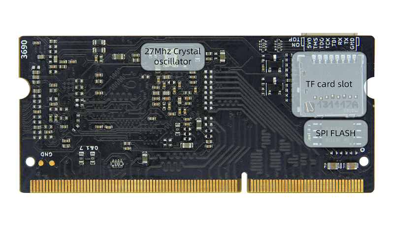

## Introduction

Tang Primer 20K is a core board with DDR3 sodimm shape based on [GW2A-LV18PG256C8/I7](https://www.gowinsemi.com/en/product/detail/38/) as the main chip, with 2 ext-boards are prepared, the Dock and the Lite.

    
    

Buy it: [Aliexpress](https://www.aliexpress.com/item/1005004653308809.html)

## Parameters

<table>
	<thead>
		<tr>
			<th style="text-align:center">Item</th>
			<th style="text-align:center">Parameter</th>
			<th style="text-align:center">Addition</th>
		</tr>
	</thead>
	<tbody>
		<tr>
			<td style="text-align:left">FPGA Chip</td>
			<td style="text-align:left"><a href="https://www.gowinsemi.com/en/product/detail/38/">GW2A-LV18PG256C8/I7</a>
			</td>
			<td style="text-align:left">
				<table>
					<tr>
						<td>Logic units(LUT4)</td>
						<td>20736</td>
					</tr>
					<tr>
						<td>Flip-Flop(FF)</td>
						<td>15552</td>
					</tr>
					<tr>
						<td>Shadow SRAM S-SRAM(bits)</td>
						<td>41472</td>
					</tr>
					<tr>
						<td>Block SRAM B-SRAM(bits)</td>
						<td>828K</td>
					</tr>
					<tr>
						<td>Number of B-SRAM</td>
						<td>46</td>
					</tr>
					<tr>
						<td>18x18 Multiplier</td>
						<td>48</td>
					</tr>
					<tr>
						<td>PLLs</td>
						<td>4</td>
					</tr>
					<tr>
						<td>I/O Bank</td>
						<td>8</td>
					</tr>
				</table>
			</td>
		</tr>
		<tr>
			<td style="text-align:left">Memory</td>
			<td style="text-align:left">128M DDR3</td>
			<td style="text-align:left"></td>
		</tr>
		<tr>
			<td style="text-align:left">Flash</td>
			<td style="text-align:left">32Mbits NOR Flash</td>
			<td style="text-align:left">Read <a href="#burn_flash">burn Flash</a></td>
		</tr>
		<tr>
			<td style="text-align:left">Debugger</td>
			<td style="text-align:left">Jtag + Uart</td>
			<td style="text-align:left">JST SH1.0 8Pins connector</td>
		</tr>
		<tr>
			<td style="text-align:left">SD card slot</td>
			<td style="text-align:left">1</td>
			<td style="text-align:left">Push-pull type</td>
		</tr>
		<tr>
			<td style="text-align:left">Display</td>
			<td style="text-align:left">8Pins spi lcd connector</td>
			<td style="text-align:left"></td>
		</tr>
		<tr>
			<td style="text-align:left">Package</td>
			<td style="text-align:left">204P DDR3</td>
			<td style="text-align:left"></td>
		</tr>
		<tr>
			<td style="text-align:left">Avaliable IO</td>
			<td style="text-align:left">117</td>
			<td style="text-align:left"></td>
		</tr>
	</tbody>
</table>

## Comparison between ext-board

### Dock ext-board appearance

The corresponding pins numbering of LED2 and LED3 is N16 and N14. See the mark on left of the right picture.

### Lite ext-board appearance

The corresponding pin numbering between R8 and P9 is P8. See the mark on the top left of the right picture.

### Comparison between peripherals of ext-board

<table>
	<thead>
		<tr>
			<th rowspan="2" colspan="2">Item</th>
			<th colspan="2">Dock</th>
			<th colspan="1">Lite</th>
		</tr>
		<tr>
			<th>Number</th>
			<th>Addition</th>
			<th>Number</th>
		</tr>
	</thead>
	<body>
		<tr>
			<td colspan="2">RGB Interface</td>
			<td>1</td>
			<td>RGB565 40P FPC Connector</td>
			<td></td>
		</tr>
		<tr>
			<td colspan="2">DVP Interface</td>
			<td>1</td>
			<td>24P FPC Connector</td>
			<td></td>
		</tr>
		<tr>
			<td colspan="2">Mic array Interface</td>
			<td>1</td>
			<td>10P FPC Connector</td>
			<td></td>
		</tr>
		<tr>
			<td colspan="2">Touch Interface</td>
			<td>1</td>
			<td>4P FPC Connector</td>
			<td></td>
		</tr>
		<tr>
			<td colspan="2">PMOD Interface</td>
			<td>4</td>
			<td></td>
			<td>4</td>
		</tr>
		<tr>
			<td colspan="2">3.5mm headphone Jack</td>
			<td>1</td>
			<td>LPA4809MSF driver</td>
			<td></td>
		</tr>
		<tr>
			<td colspan="2">DIP switch</td>
			<td>1</td>
			<td>5P DIP switch</td>
			<td></td>
		</tr>
		<tr>
			<td colspan="2">Slide switch</td>
			<td>1</td>
			<td>Switch USB function</td>
			<td>2</td>
		</tr>
		<tr>
			<td style="white-space:nowrap" rowspan="2">Type-C</td>
			<td style="white-space:nowrap">USB-JTAG&UART</td>
			<td>1</td>
			<td>Onboard BL702 used to download bitstream file and provide serial communication</td>
			<td></td>
		</tr>
		<tr>
			<td style="white-space:nowrap">User-defined USB</td>
			<td>1</td>
			<td>USB3317 with Slide switch to change USB Interface function</td>
			<td></td>
		</tr>
		<tr>
			<td colspan="2">Wireless antenna</td>
			<td>1</td>
			<td>BL702 wireless function</td>
			<td></td>
		</tr>
		<tr>
			<td colspan="2">Key</td>
			<td>6</td>
			<td>One used for burning BL702, five for Users</td>
			<td>2</td>
		</tr>
		<tr>
			<td colspan="2">LED</td>
			<td>6</td>
			<td></td>
			<td></td>
		</tr>
		<tr>
			<td colspan="2">HDMI Interface</td>
			<td>1</td>
			<td></td>
			<td></td>
		</tr>
		<tr>
			<td colspan="2">Ethernet Interface</td>
			<td>1</td>
			<td>RTL8201F</td>
			<td></td>
		</tr>
		<tr>
			<td colspan="2">RGB LED</td>
			<td>1</td>
			<td>WS2812</td>
			<td></td>
		</tr>
	</body>
</table>

## Hardware information

- [Datasheet](https://dl.sipeed.com/shareURL/TANG/Primer_20K/01_Specification)
- [Schematic](https://dl.sipeed.com/shareURL/TANG/Primer_20K/02_Schematic)
- [Bit map](https://dl.sipeed.com/shareURL/TANG/Primer_20K/03_Bit_number_map)
- [Net Length](https://dl.sipeed.com/shareURL/TANG/Primer_20K/04_Net_Length)
- [Dimension](https://dl.sipeed.com/shareURL/TANG/Primer_20K/05_Dimensional_drawing)
- [Core board package](https://dl.sipeed.com/shareURL/TANG/Primer_20K/06_Footprint) (KICAD)

- [Chip manual](https://dl.sipeed.com/shareURL/TANG/Primer_20K/07_Chip_manual)
- [3D model](https://dl.sipeed.com/shareURL/TANG/Primer_20K/08_Dimensions)

## User guide

`Install IDE` -> `Learn coding programmer` -> `Read Tutorial` -> `Program by yourself` -> `Read more official documents`

1. Install IDE: [Click me](./../Tang-Nano-Doc/install-the-ide.md).

2. Visit [Start to use](https://wiki.sipeed.com/hardware/en/tang/tang-primer-20k/start.html) to avoid some problems, and we can start coding for FPGA there.

3. After coding for FPGA, if you think it difficult, here we collect some useful learning resource.
   + Online FPGA tutorial: [Verilog](https://www.asic-world.com/verilog/index.html)
   + Online Verilog exercise：[HDLBits](https://hdlbits.01xz.net/wiki/Main_Page)

	If you have trouble using IDE, we have packed all documents about IDE, visit [Download station](https://dl.sipeed.com/shareURL/TANG/Primer_20K/07_Chip_manual/EN/General%20Guide) and download what you need.

## Reference examples summary

### Examples

github ：https://github.com/sipeed/TangPrimer-20K-example

### Tutorial

- Lite ext-board blink ：[Click me](./examples/lite/blink.md)
<!-- - Dock ext-board examples summary : [Click me](./example.md) -->
- Dock ext-board blink : [Click me](./examples/led.md) 

## Communication

- **Reddit** : [reddit.com/r/GowinFPGA/](reddit.com/r/GowinFPGA/)
- **Telegram** : [t.me/sipeed](t.me/sipeed)
- Leave message in the end of this page
- Business email : [support@sipeed.com](support@sipeed.com)

## Additional message

The default bank voltage of bank 0、bank 1、bank 7 on the core board is 3.3V, so their bank IO voltage is 3.3V output. If you want to custom the input IO bank voltage, please remove R5 and R9, see Assembly [Click me](https://dl.sipeed.com/shareURL/TANG/Primer_20K/03_Bit_number_map) to see where is R5 and R9.

And the corresponding golden finger on core board are as following:

## Questions

### Dock ext-board not work

For 20K Dock kits, it's necessary to enable the core board before using debugger debug the chip, just put the 1 switch on the dip switch down, otherwise LED0 and LED1 are on and core board dose not work.

| Enable Core Board | Disable state | Additional comments |
| --- | --- | --- |
|| | When disabled, the LDE0 and LED1 is on, and core board doesn't work.|

### How to burn into flash {#burn_flash}

Do following configurations:

### No reaction after burning or phenomenon is wrong

Make sure you hace selected right device, and all parameters are the same as following.

Then make sure your code logic is right and your 

### Successfully burned once, but can't burn after that

Note that the description is there was a successful Flash burnt one time.

In this case, the default reason is that the wrong Dual-Purpose pin is enabled and the debugger can no longer scan the FPGA's JTAG. You can short pin 1 and pin 4 of Flash, by which the chip cannot read FLASH normally when it is powered on.

Besides, if you have dock ext-board, this can be solved by the enable pin of dip switch. Here art the steps

Firstlt, enable the core board, put the 1 switch on the dip switch down, then do something (like burnning fpga or erasing FPGA) in Programmer application, when the progress bar shows, switch the 1 switch on the dip switch up and down, after which you will find the progress bar works and finish your operations on fpga.

<table>
	<tr>
		<td></td>
		<td> Enable the core board first </td>
	</tr>
	<tr>
		<td></td>
		<td> Do operation on board, when progress bar shows, switch the 1 switch on the dip switch up and down</td>
	</tr>
	<tr>
		<td>
		
		
		</td>
		<td> put the 1 switch on the dip switch up and down </td>
	</tr>
	<tr>
		<td></td>
		<td> Progress bar works and finish your operations on fpga </td>
	</tr>
</table>

### Visit [Questions](./../Tang-Nano-Doc/questions.md) for more