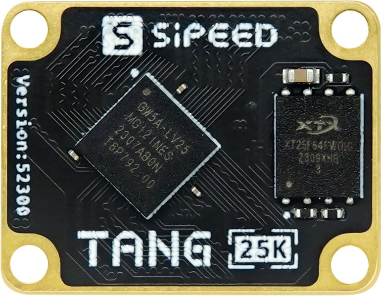

# Tang Primer 25K

## Overview

Tang Primer 25K is a minuscule core board (23x18mm) designed based on [GW5A-LV25MG121](http://www.gowinsemi.com.cn/prod_view.aspx?TypeId=74&FId=t3:10:3&Id=188), accompanied by a 25K Dock base board that exposes all pins (excluding MIPI high-speed pins).

The ultra-small core board size can be applied in any volume-restricted scenarios.
The simple base board can connect a USB joystick, plug in a 40Pin SDRAM module, and three PMOD interfaces can connect to an HDMI display, PS2 joystick to form a typical RetroGame console configuration.
It can also be paired with the series of PMOD modules produced by Sipeed, for use in FPGA university teaching.

   

Purchase link: [ALIEXPRESS](https://www.aliexpress.us/item/3256806038278266.html?gatewayAdapt=glo2usa4itemAdapt)

## Core Board Overview

   

## Basic Parameters

<table> <thead> <tr> <th style="text-align:center">Item</th> <th style="text-align:center">Parameter</th> <th style="text-align:center">Supplement</th> </tr> </thead> <tbody> <tr> <td style="text-align:left">FPGA Chip</td> <td style="text-align:left"><a href="http://www.gowinsemi.com.cn/prod_view.aspx?TypeId=74&FId=t3:10:3&Id=188">GW5A-LV25MG121</a> </td> <td style="text-align:left"> <table> <tr> <td>Logic Unit (LUT4)</td> <td>23040</td> </tr> <tr> <td>Register (FF)</td> <td>23040</td> </tr> <tr> <td>Distributed Static Random Access Memory S-SRAM (bits)</td> <td>180K</td> </tr> <tr> <td>Block Static Random Access Memory B-SRAM (bits)</td> <td>1008K</td> </tr> <tr> <td>Number of Block Static Random Access Memory B-SRAM</td> <td>56</td> </tr> <tr> <td>Multiplier (18x18 Multiplier)</td> <td>28</td> </tr> <tr> <td>Phase-Locked Loop (PLLs)</td> <td>6</td> </tr> <tr> <td>Total I/O Bank</td> <td>8</td> </tr> </table> </td> </tr> <tr> <td style="text-align:left">Flash</td> <td style="text-align:left">64Mbits NOR Flash</td> <td style="text-align:left">See <a href="#burn_flash">Burning to Flash</a></td> </tr> <tr> <td style="text-align:left">Overall Packaging</td> <td style="text-align:left">2x60P BTB Core Board</td> <td style="text-align:left"></td> </tr> <tr> <td style="text-align:left">General IO</td> <td style="text-align:left"> 75</td> <td style="text-align:left"></td> </tr> <tr> <td style="text-align:left"> MIPI IO </td> <td style="text-align:left"> 4lane Data</td> <td style="text-align:left"></td> </tr> </tbody> </table>

## Dock Base Board Product Image

   

## Board Parameters

<table> <thead> <tr> <th style="text-align:center">Item</th> <th style="text-align:center">Parameter</th> <th style="text-align:center">Remark</th> </tr> </thead> <tbody> <tr> <td style="text-align:left">Debugger</td> <td style="text-align:left">Onboard high-speed debugger, supports JTAG+UART, uses USB-C port for programming</td> <td style="text-align:left"></td> </tr> <tr> <td style="text-align:left">USB-A</td> <td style="text-align:left">One, can be used as a USB1.1 Host to connect game controllers and other HID devices</td> <td style="text-align:left"></td> </tr> <tr> <td style="text-align:left"> IO Pin </td> <td style="text-align:left"> One 2x20Pin 2.54 pin</td> <td style="text-align:left">Supports SDRAM module</td> </tr> <tr> <td style="text-align:left"> PMOD </td> <td style="text-align:left"> 3</td> <td style="text-align:left"></td> </tr> <tr> <td style="text-align:left">Button</td> <td style="text-align:left">2</td> <td style="text-align:left"></td> </tr> <tr> <td style="text-align:left">Size</td> <td style="text-align:left">64x40mm</td> <td style="text-align:left"></td> </tr> </tbody> </table>

## Hardware Information

Specifications, schematics, dimension drawings, etc. can be found here: [Click here](https://dl.sipeed.com/shareURL/TANG/Primer_25K)

- [Board Specification](https://dl.sipeed.com/shareURL/TANG/Primer_25K/01_Specification)
- [Board Schematic](https://dl.sipeed.com/shareURL/TANG/Primer_25K/02_Schematic)
- [Board Designator Drawing](https://dl.sipeed.com/shareURL/TANG/Primer_25K/03_Designator_drawing)
- [Board Dimension Drawing](https://dl.sipeed.com/shareURL/TANG/Primer_25K/04_Mechanical_drawing)
- [3D Model File](https://dl.sipeed.com/shareURL/TANG/Primer_25K/05_3D_file)
- [Core Board Packaging](https://dl.sipeed.com/shareURL/TANG/Primer_25K/06_PCB_Lib) 
- [Chip Part Information](https://dl.sipeed.com/shareURL/TANG/Primer_25K/07_Datasheet)
- [Routing Length Table](https://dl.sipeed.com/shareURL/TANG/Primer_25K/08_Pin_Length_table)

3. Getting Started
   
	`Prepare Development Environment` -> `Learn Relevant Syntax` -> `View Unboxing Guide` -> `Basic Code Writing` -> `View Official Documentation`
	
	1. Install IDE: [Click here](./../Tang-Nano-Doc/get_started/install-the-ide.md)
	
   2. Check out the [Getting Started Guide](https://wiki.sipeed.com/hardware/zh/tang/tang-primer-20k/start.html) to avoid some problems, and you can start coding from there.
   
   3. If you feel pressured after completing the above lighting operation, you can fill in the gaps yourself:
      You can learn Verilog on the following websites:
   
      + Online free tutorial: [Verilog Tutorial](https://www.runoob.com/w3cnote/verilog-tutorial.html) (Learn Verilog)
      + Online free FPGA tutorial: [Verilog](https://www.asic-world.com/verilog/index.html) (English website)
      + Verilog problem-solving website: [HDLBits](https://hdlbits.01xz.net/wiki/Main_Page) (English website)
      + Online Gowin Semiconductor reference video tutorial: [Click here](http://www.gowinsemi.com.cn/video_complex.aspx?FId=n15:15:26)
   
      If you have questions about using the IDE, you can check out some official documents to familiarize yourself with the relevant content
   
      - [SUG100-2.6_Gowin Cloud Source Software User Guide.pdf](http://cdn.gowinsemi.com.cn/SUG100-2.6_Gowin%E4%BA%91%E6%BA%90%E8%BD%AF%E4%BB%B6%E7%94%A8%E6%88%B7%E6%8C%87%E5%8D%97.pdf)
      - [SUG949-1.1_Gowin_HDL Coding Style User Guide.pdf](http://cdn.gowinsemi.com.cn/SUG949-1.1_Gowin_HDL%E7%BC%96%E7%A0%81%E9%A3%8E%E6%A0%BC%E7%94%A8%E6%88%B7%E6%8C%87%E5%8D%97.pdf)
      - [UG286-1.9.1_Gowin Clock Resource User Guide](http://cdn.gowinsemi.com.cn/UG286-1.9.1_Gowin%E6%97%B6%E9%92%9F%E8%B5%84%E6%BA%90(Clock)%E7%94%A8%E6%88%B7%E6%8C%87%E5%8D%97.pdf)
      - [SUG940-1.3_Gowin Design Timing Constraint User Guide.pdf](http://cdn.gowinsemi.com.cn/SUG940-1.3_Gowin%E8%AE%BE%E8%AE%A1%E6%97%B6%E5%BA%8F%E7%BA%A6%E6%9D%9F%E7%94%A8%E6%88%B7%E6%8C%87%E5%8D%97.pdf)
      - [SUG502-1.3_Gowin_Programmer User Guide.pdf](http://cdn.gowinsemi.com.cn/SUG502-1.3_Gowin_Programmer%E7%94%A8%E6%88%B7%E6%8C%87%E5%8D%97.pdf)
      - [SUG114-2.5_Gowin Online Logic Analyzer User Guide.pdf](http://cdn.gowinsemi.com.cn/SUG114-2.5_Gowin%E5%9C%A8%E7%BA%BF%E9%80%BB%E8%BE%91%E5%88%86%E6%9E%90%E4%BB%AA%E7%94%A8%E6%88%B7%E6%8C%87%E5%8D%97.pdf)
   
      All the above documents have been packaged into the download station [click me to jump](https://dl.sipeed.com/shareURL/TANG/Primer_20K/07_Chip_manual/CN/%E9%80%9A%E7%94%A8%E6%8C%87%E5%BC%95), if needed, you can click the compressed package to download them all.

- Example Summary

  Please note that 25K requires the use of V1.9.9Beta-4 or newer IDE version.
  http://www.gowinsemi.com.cn/faq.aspx

  ### Public Examples

  Github link: https://github.com/sipeed/TangPrimer-25K-example

  ## Communication Methods

  - **Discussion Forum: [maixhub.com](maixhub.com/discussion)**
  - **QQ Discussion Group: [834585530](https://jq.qq.com/?_wv=1027&k=wBb8XUan)**
  - Leave a message directly below this page
  - Business email: [support@sipeed.com](support@sipeed.com)

## Related Questions

### How to Download to External FLASH {#burn_flash}

Set the following options:

### No Response or Incorrect Pin Phenomenon After Burning

First, make sure the correct model is selected, each parameter in the figure below is required to be consistent

Then check whether your code and the corresponding simulation waveform meet the requirements

### For more questions and solutions, go to [Related Questions](./../Tang-Nano-Doc/questions.md) to view
