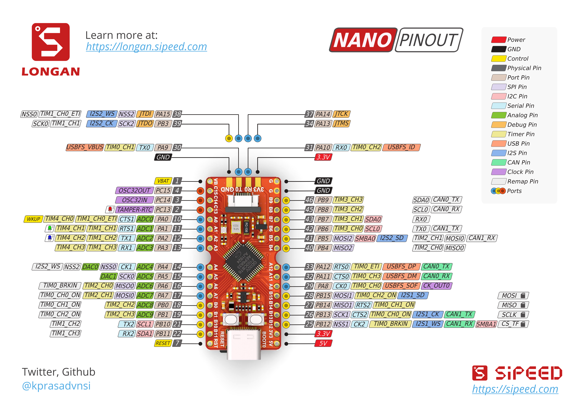

Longan Documentation
======

      

## What is Longan

Longan Nano is a GD32VF103CBT6 based minimal development board based on GigaDevice's latest RISC-V 32-bit core microcontroller. Convenient for students, engineers, geeks and enthusiasts to access the latest generation of RISC-V processors.

In the heart of Longan Nano is a GigaDevice's GD32VF103CBT6, based on [Nucleisys](http://www.nucleisys.com/) Bumblebee kernel (support RV32IMAC instruction sets and ECLIC rapid interrupt). You can download instruction set documents here: [http://dl.sipeed.com/LONGAN/Nano/DOC/](http://dl.sipeed.com/LONGAN/Nano/DOC/).

The chip has built-in 128KB Flash, 32KB SRAM, and peripherals listes below:
* 4 x universal 16-bit timer
* 2 x basic 16-bit timer
* 1 x advanced 16-bit timer
* Watchdog timer
* RTC
* Systick
* 3 x USART
* 2 x I2C
* 3 x SPI
* 2 x I2S
* 2 x CAN
* 1 x USBFS(OTG)
* 2 x ADC(10 channel)
* 2 x DAC

Longan Nano development board is breadboard friendly. It has onboard 8M passive crystal, 32.768KHz RTC low-speed crystal, mini TF card slot, and use the latest Type-C USB interface.

## How to develop

Longan Nano supports development using the VS CODE-based under PlatformIO IDE environment, supporting one-click project configuration, compilation, download and debugging. See the installation and tutorial here: [PIO configuration](./get_started/pio.md).

## PIN Map

