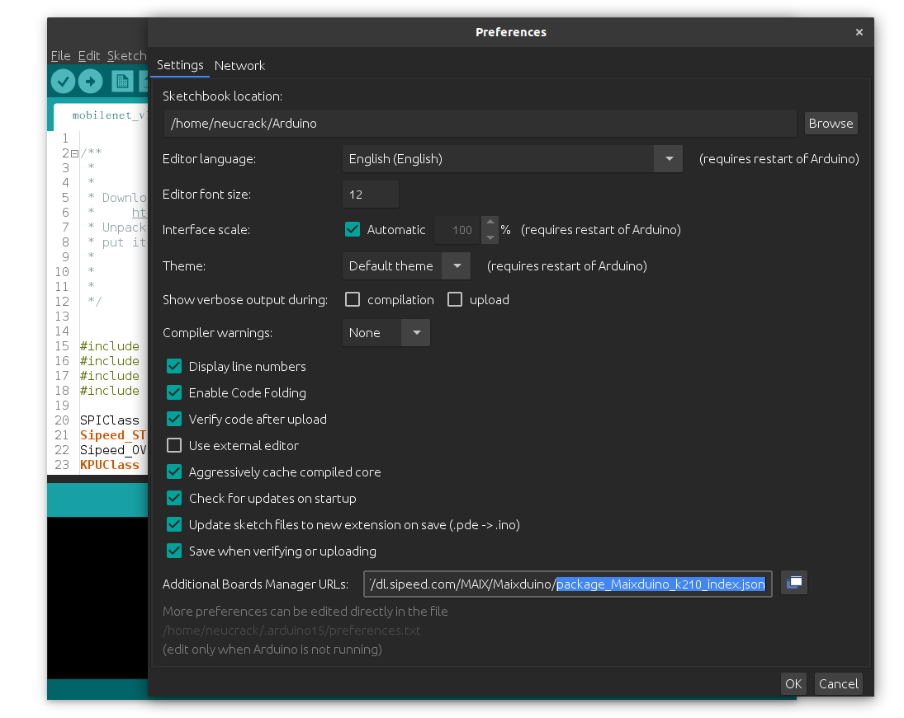

安装 Arduino 环境
================

! 请使用**最新版本**的 Arduino IDE, 旧版本 IDE 无法解析 HTTP301，导致无法正确下载开发板元信息。 

## Linux

### 下载 Arduino IDE

Arduino IDE可以在 [官方下载页面](https://www.arduino.cc/en/Main/Software)找到。

### 安装

对于Ubuntu, 在终端执行以下命令：

```shell
sudo usermod -a -G dialout $(whoami)
sudo apt install python3 python3-pip
sudo pip3 install pyserial
```

注意，设置后你需要**注销** 或者 **重启** ,否则设计不会生效。
### 在Arduino IDE中添加开发板

* 添加URL

打开 Arduino IDE, 选择 `文件` -> `首选项`, 

在`附加开发板管理器网址`中添加以下URL, 如果已经存在，请不要忘记要用逗号分隔。

`http://dl.sipeed.com/MAIX/Maixduino/package_Maixduino_k210_index.json`

如果下载过慢，也可以尝试这个链接。

`http://dl.sipeed.com/MAIX/Maixduino/package_Maixduino_k210_dl_cdn_index.json`




* 安装开发板工具和库

选择 `工具` -> `开发板` -> `开发板管理器`， 搜索 `Maixduino`, 选择最新版本然后点击 `安装`。


### 更改开发板设置

更改开发板设置，在Arduino IDE顶栏中的 `工具`栏下面可以找到。
* `开发板`:选择你的开发板。
* `烧录固件`:仅支持Maix GO, 默认 `open-ec`。
* `烧录波特率`:如果烧录失败请降低波特率。
* `端口`: 串口端口, e.g. `/dev/ttyUSB0`
* **`程序员`**: 烧录工具,你 **必须** 选择 **`k-flash`**


## Windows


### 下载Arduino IDE

[official download page](https://www.arduino.cc/en/Main/Software)

然后双击安装包进行安装


### 在 Arduino IDE中添加开发板

* 添加 URL

打开Arduino IDE, 选择 `文件` -> `首选项`, 

添加 `附加开发板管理器网址`: 

`http://dl.sipeed.com/MAIX/Maixduino/package_Maixduino_k210_index.json` (推荐)

或者

`http://dl.sipeed.com/MAIX/Maixduino/package_Maixduino_k210_dl_cdn_index.json` (如果上面的链接下载过慢，请尝试这个链接)


* 安装开发板工具和库

选择`工具` -> `开发板` -> `开发板管理器`， 搜索 `Maixduino`, 点击 `安装`


### 重新设置开发板

在Arduino IDE顶部的 `工具` 栏中重新设置开发板

* `开发板`:选择你的开发板。
* `烧录固件`:仅支持Maix GO, 默认 `open-ec`。
* `烧录波特率`:如果烧录失败请降低波特率。
* `端口`: 串口端口, e.g. `/dev/ttyUSB0`
* **`程序员`**: 烧录工具,你 **必须** 选择 **`k-flash`**


