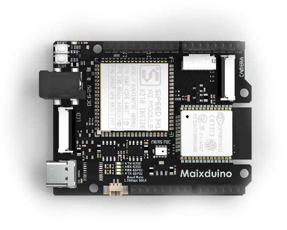

# MaixDuino 开发板

## 概述

  SIPEED MaixDuino 是基于我们 M1 模块(主控:Kendryte K210)开发的一款外形兼容 Arduino 的开发板
   MaixDuino 集成摄像头、TF卡槽、用户按键、TFT显示屏、MaixDuino 扩展接口等, 用户可使用 MaixDuino 轻松搭建一款人脸识别门禁系统, 同时还预留开发调试接口, 也能将其作为一款功能强大的 AI 学习开发板.

## MaixDuino 外观及功能介绍

### 外观一览

### 板载功能介绍

- 电源输入 DC05: 6~12V 直流
- 电源输入 + 程序下载调试接口: USB Type-C 接口
- DVP 24PIN: 标准 Camera DVP 24PIN 接口
- TF 扩展槽:
- ESP32: ESP32 SPI 连接(ESP32 支持 WIFI 与 蓝牙)
- I2C DAC
- PA PAM8403A

MaixDuino 引脚图

### 资料相关链接

- [MaixDuino 原理图](https://dl.sipeed.com/MAIX/HDK/Sipeed-Maixduino)

