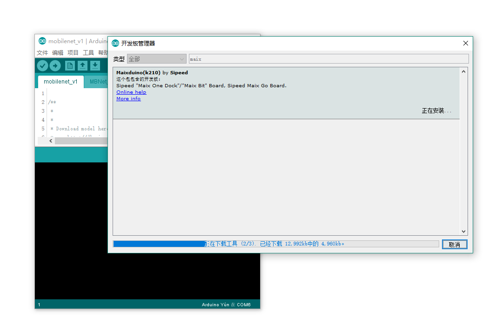

Install Arduino Environment
================

## Linux

### Download Arduino IDE

The Arduino IDE can be found on the [official download page](https://www.arduino.cc/en/Main/Software)

### Install dependencies

For Ubuntu, enter the following commands in a terminal:

```shell
sudo usermod -a -G dialout $(whoami)
sudo apt install python3 python3-pip
sudo pip3 install pyserial
```

Note that after setting the dialout group you need to **logout** or **reboot** , else the new settings won't take effect!
### Add board in Arduino IDE

* Add URLs

Open Arduino IDE, select `File` -> `Preferences`, 

Add one of the folowing URLs in `Additional Boards Manager URLs`, if there already are board manager URLs do not forget to separate them with a comma.

`http://dl.sipeed.com/MAIX/Maixduino/package_Maixduino_k210_index.json`

or try this URL if the download speed is too slow:

`http://dl.sipeed.com/MAIX/Maixduino/package_Maixduino_k210_dl_cdn_index.json`


* Install board tools and libs

Select `Tools` -> `Board` -> `Boards Manager`， search for `Maixduino`, select the latest version, and click `Install`





### Change settings about board

Change board settings in `Tools`  section on the top of Arduino IDE.

* `Board`: Choose your dev board
* `Burn Tool Firmware`: just for Maix Go Board, default `open-ec`
* `Burn Baudrate`: Decrease the baudrate if the download fails
* `Port`: Serial port, e.g. `/dev/ttyUSB0`
* **`Programmer`**: Burn tool, you **MUST** select **`k-flash`**


## Windows


### Download Arduino IDE

[official download page](https://www.arduino.cc/en/Main/Software)

Then double click pack to install


### Add board in Arduino IDE

* Add URLs

Open Arduino IDE, select `File` -> `Preferences`, 

Add `Additional Boards Manager URLs`: 

`http://dl.sipeed.com/MAIX/Maixduino/package_Maixduino_k210_index.json` (Recommended)

or 

`http://dl.sipeed.com/MAIX/Maixduino/package_Maixduino_k210_dl_cdn_index.json` (if download fails or the speed is too low, try this URL)


* Install board tools and libs

Select `Tools` -> `Board` -> `Boards Manager`， search `Maixduino`, click `Install`


### Change settings about board

Change board settings in `Tools`  section on the top of Arduino IDE.

* `Board`: The same as your dev board
* `Burn Toolfirmware`: just for Maix Go Board, default `open-ec`
* `Burn Baudrate`: Decrease it if download fails
* `Port`: Serial port, e.g. `/dev/ttyUSB0`
* **`Programmer`**: Burn tool, you **MUST** select **`k-flash`**


