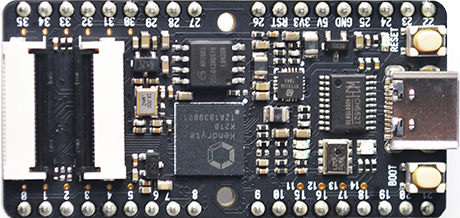
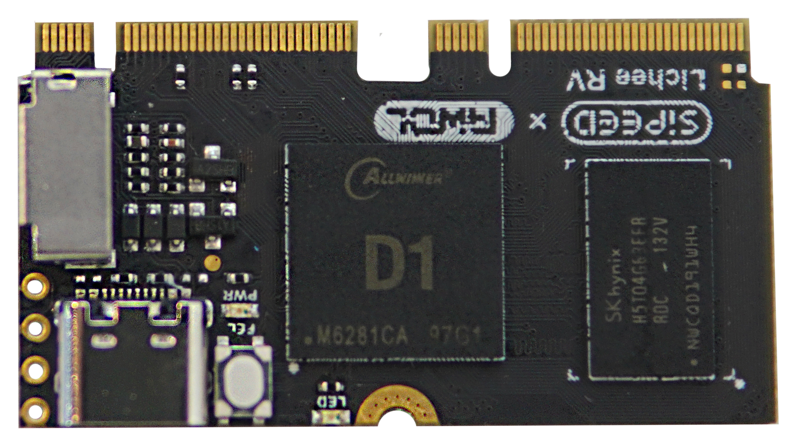
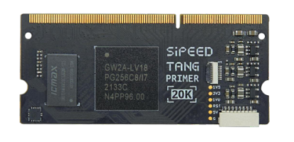

## 总览

- [Maix-I & Zero](#maix-i--zero) 以 MCU 为主控的 AI 开发板
- [Maix II & III](#maix-ii--iii-系列)： 基于 Linux 系统的 AI 开发板
- [LicheePI](#licheepi-系列)： Linux 开发板
- [Tang](#tang-fpga-系列)：FPGA 开发板
- [MaixSense](#maixsense-系列)：3D TOF 模组
- [Longon](#longon-系列)：MCU 开发板
- [MaixFace](#maixface-模组)：商业项目板卡
- [其他外设](#外设模组)

## Maix-I & Zero 

| 项目     | M1/M1w                             | M1n                                | M1s                                                | M0                                          |
| :------- | :--------------------------------- | :--------------------------------- | :------------------------------------------------- | :------------------------------------------ |
| 主控     | K210                               | K210                               | BL808                                              | BL702                                       |
| 核心     | RV64@400MHz * 2                    | RV64@400MHz * 2                    | RV64GCV@480MHz RV32GCP@320MHz RV32EMC@160MHz | RV32@144MHz                                 |
| RAM      | 8MB                                | 8MB                                | 64MB                                               | 132KB                                       |
| 无线     | M1w 支持 Wifi                      |                                    | · Wifi · 蓝牙 · Zigbee                       | 蓝牙                                        |
| 封装样式 | 邮票孔                             | 金手指                             | 邮票孔                                             |                                             |
| 模型平台 | [MaixHub](https://www.maixhub.com) | [MaixHub](https://www.maixhub.com) | [MaixHub](https://www.maixhub.com)                 | [MaixHub](https://www.maixhub.com)          |
| 尺寸     | 25.4(L)x25.4(W)mm                  | 25.0(L)x22.0(W)mm                  | 31.0(L)x18.0(W)mm                                  |                                             |
| 详情页   | [点我](./maix/core_module.md)      | [点我](./maix/M1n.md)              | [点我](./maix/m1s/m1s_module.md)                   | [点我](./maixzero/sense/maix_zero_sense.md) |

### Maix-I S

这是一款以博流 808 为主控所制作的 AIOT 模组与核心板

|      | [M1s](./maix/m1s/m1s_module.md)                                                                                                                                                                                   | [M1s Dock](./maix/m1s/m1s_dock.md)                                                                                                                                                                                   |
| ---- | ----------------------------------------------------------------------------------------------------------------------------------------------------------------------------------------------------------------- | -------------------------------------------------------------------------------------------------------------------------------------------------------------------------------------------------------------------- |
| 图片 |  |  |

### Maix-I

这是 2019 年以 K210 为核心所制作的一系列 AIOT 开发板。

<table role="table" class="center_table">
    <tbody>
        <tr>
            <th scope="col"></th>
            <th scope="col">Maix Bit</th>
            <th scope="col">Maix Dock</th>
            <th scope="col">Maix Duino</th>
            <th scope="col">Maix nano</th>
        </tr>
        <tr>
             <td style="white-space:nowrap">图片</td>
            <td>  </td>
            <td></td>
            <td></td>
            <td></td>
        </tr>
        <tr>
            <th scope="col"></th>
            <th scope="col">Maix Cube</th>
            <th scope="col">Maix Amigo</th>
            <th scope="col">Maix HAT</th>
            <th scope="col">Maix Go</th>
        </tr>
        <tr>
             <td style="white-space:nowrap">图片</td>
            <td></td>
            <td></td>
            <td></td>
            <td></td>
        </tr>
    </tbody>
</table>

### Maix Zero

这是一款以博流 702 为主控所制作的极小开发板

详情页 ：[点我](./maixzero/sense/maix_zero_sense.md)

### 产品支持

Maix 系列产品可以在多种场景实现客户不同方面的需要，在 AIoT 上已经广泛的使用，品质和性能在行业内已经有非常好的口碑，专业的技术团队为广大客户解决硬件设计和软件功能上的各种各样问题。商业合作可以联系 <support@sipeed.com>。

## Maix-II & III 系列

| 项目     | MaixII-Dock                                                                                                                                                            | MaixII-Sense                                                                                                                                                            | MaixII-S                                                                                                                                                            | MaixIII-axpi                                                                                                                                                            |
| :------- | :--------------------------------------------------------------------------------------------------------------------------------------------------------------------- | :---------------------------------------------------------------------------------------------------------------------------------------------------------------------- | :------------------------------------------------------------------------------------------------------------------------------------------------------------------ | :---------------------------------------------------------------------------------------------------------------------------------------------------------------------- |
| 主控     | V831                                                                                                                                                                   | R329                                                                                                                                                                    | V833                                                                                                                                                                | Ax620a                                                                                                                                                                  |
| 核心     | Cortex A7@800MHz                                                                                                                                                       | Cortex A53\*2@1.5GHz                                                                                                                                                    | Cortex A7@1.2GHz                                                                                                                                                    | Cortex A7\*4@1.0GHz                                                                                                                                                     |
| RAM      | 64MB                                                                                                                                                                   | 256MB                                                                                                                                                                   | 默认128MB                                                                                                                                                           | 默认 1GB                                                                                                                                                                |
| 无线     | Wifi                                                                                                                                                                   | · Wifi · 蓝牙                                                                                                                                                        | · Wifi                                                                                                                                                              | · Wifi · 蓝牙                                                                                                                                                        |
| 模型平台 | [MaixHub](https://www.maixhub.com)                                                                                                                                     |                                                                                                                                                                         |                                                                                                                                                                     | [MaixHub](https://www.maixhub.com)                                                                                                                                      |
| 外观图   |  |  |  |  |
| 详情页   | [点我](http://wiki.sipeed.com/m2dock)                                                                                                                                       | [点我](./maixii/m2a/maixsense.md)                                                                                                                                       | [点我](./maixii/M2S/V833.md)                                                                                                                                        | [点我](./maixIII/ax-pi/axpi.md)                                                                                                                                         |
| 备注     |                                                                                                                                                                        |                                                                                                                                                                         | 仅支持商业                                                                                                                                                          |                                                                                                                                                                         |

### Maix-II

MAIX-II 系列包含多款硬件产品，目前有三款产品，分别如下：

<table>
<thead>
<tr>
  <th>产品名称</th>
  <th>板卡简述</th>
</tr>
</thead>
<tbody>
<tr>
  <td style="white-space:nowrap"><strong>Maix-II Dock</strong></td>
  <td><strong>推荐产品</strong>，主控芯片为全志 V831, 高性价比能跑 Linux 的SOC，同时支持硬件 AI 加速（0.2Tops 算力），目前软件支持最容易入门，提供 C SDK 和 Python SDK， 以及在线模型训练服务(<a href="https://maixhub.com" target="_blank">MaixHub</a>)</td>
</tr>
<tr>
  <td style="white-space:nowrap"><strong>Maix-II Sense</strong></td>
  <td>芯片为全志R329，也有提供硬件 AI 加速，0.25Tops 算力。</td>
</tr>
<tr>
  <td style="white-space:nowrap"><strong>Maix-II-S</strong></td>
  <td>芯片为全志 V833，V831 升级版， 主要用于商业定制用途，个人用户慎重选择。</td>
</tr>
</tbody>
</table>

### MaixIII

目前 MaixIII axpi 是最新款的 AI 开发板，强烈推荐

详情页：[点我跳转](./maixIII/ax-pi/axpi.md)

## LicheePi 系列

| 类别     | Lichee RV    | Lichee Zero Plus                           | Lichee Zero                    | Lichee nano         |
| :------- | :----------- | :----------------------------------------- | :----------------------------- | :------------------ |
| SOC      | Allwinner D1 | Allwinner S3                               | Allwinner V3s                  | Allwinner F1c100s   |
| CPU架构  | 玄铁 C906    | Cortex™-A7                                 | Cortex™-A7                     | ARM 926EJS          |
| 运行频率 | 1GHz         | 1.2GHz                                     | 1.2GHz(max)                    | 600MHz(max)         |
| RAM      | 512MB DDR3   | 128Mbyte DDR3                              | 64MB DRAM                      | 32MB DDR            |
| FLASH    | 可选SD-nand  | 可选SD Nand、 SPI Nor Flash 或者eMMC | 预留 SOP8 SPI Flash 焊盘 | 板载 16MB NOR FLASH |
| TF连接器 | 有           | 有                                         | 有                             | 有                  |

- LicheePI 是为了能让用户获得优廉的 linux设备，实战linux底层相关的内容的产品。

<table>
<thead>
<tr>
<th style="text-align:center">Lichee Zero</th>
<th style="text-align:center">Lichee Nano</th>
</tr>
</thead>
<tbody>
<tr>
<td style="text-align:center"></td>
<td style="text-align:center"></td>
</tr>
</tbody>
<thead>
<tr>
<th style="text-align:center">Lichee Zero Plus</th>
<th style="text-align:center">Lichee RV</th>
</tr>
</thead>
<tbody>
<tr>
<td style="text-align:center"></td>
<td style="text-align:center"></td>
</tr>
</tbody>
</table>

## Tang FPGA 系列

| 项目            | 
Tang Primer 20K
 | 
Tang Nano 9K
 | 
Tang Nano 4K
 | 
Tang Nano 1K
 |
| :-------------- | :------------------------------------------------ | :--------------------------------------------- | :--------------------------------------------- | ---------------------------------------------- |
| 逻辑单元(LUT4)  | 20736                                             | 8640                                           | 4608                                           | 1152                                           |
| 寄存器（FF）    | 15552                                             | 6480                                           | 3456                                           | 864                                            |
| S-SRAM (bits)   | 41472                                             | 17280                                          |                                                |                                                |
| B-SRAM (bits)   | 828K x 46                                         | 468K x 26                                      | 180K x 10                                      | 72K x 4                                        |
| 用户闪存 (bits) |                                                   | 608K                                           | 256K                                           | 96K                                            |
| 锁相环 (PLL)    | 4                                                 | 2                                              | 2                                              | 1                                              |
| 板载 Flash      | 32Mbits NOR Flash                                 | 32Mbits NOR Flash                              | 32Mbits NOR Flash                              | 预留焊盘                                       |
| 硬核处理器      |                                                   |                                                | Cortex-M3                                      |

- Tang FPGA 系列开发板主要分为 Tang Nano 和 Tang Primer 两个系列。

<table>
<thead>
<tr>
<th style="text-align:center">Tang Primer 20K（核心板）</th>
<th style="text-align:center">Tang Nano 1K</th>
</tr>
</thead>
<tbody>
<tr>
<td style="text-align:center"></td>
<td style="text-align:center"></td>
</tr>
</tbody>
<thead>
<tr>
<th style="text-align:center">Tang Nano 4K</th>
<th style="text-align:center">Tang Nano 9K</th>
</tr>
</thead>
<tbody>
<tr>
<td style="text-align:center"></td>
<td style="text-align:center"></td>
</tr>
</tbody>
</table>

### 售罄产品

|                                       Tang Nano                                       |                                              Tang Primer                                               |
| :-----------------------------------------------------------------------------------: | :----------------------------------------------------------------------------------------------------: |
|  |  |

## MaixSense 系列

- 基于 TOF 技术的深度相机

|                                                | Maixsense-a010                               | MaixSense-a075V                             |
| ---------------------------------------------- | -------------------------------------------- | ------------------------------------------- |
| 图片                                           |  |     |
| 接口                                           | 1.25mm 串口连接器 \*1 Type-C USB2.0 \*1   | 1.25mm 串口连接器 \*1  Type-C USB2.0 \*1 |
| 分辨率                                         | TOF：100x100@30fps                           | RGB：1600x1200@30fps TOF：320x240@60fps  |
| 视场角                                         | RGB：无 TOF：70°(H) * 60°(V)              | RGB：120° TOF：55°(H)*72°(H)             |
| 
TOF 像素尺寸
 |                                              | 15um                                        |
| 激光发射器                                     | 40nm VCSEL                                   | 940nm,3W                                    |
| 测量范围                                       | 0.2-2.5m                                     | 0.15-1.5m                                   |
| 测量精度                                       | &lt;=1%/cm                                   | &lt;=1%/cm                                  |

## Longon 系列

MCU 开发板

详情页：[点我](./longan/Nano/assets/readme.md)

## MaixFace 模组

- 商业合作模组，无个人支持

前往首页商业方案板块查看对应设备

## 外设模组

前往首页外设模组板块查阅对应设备
