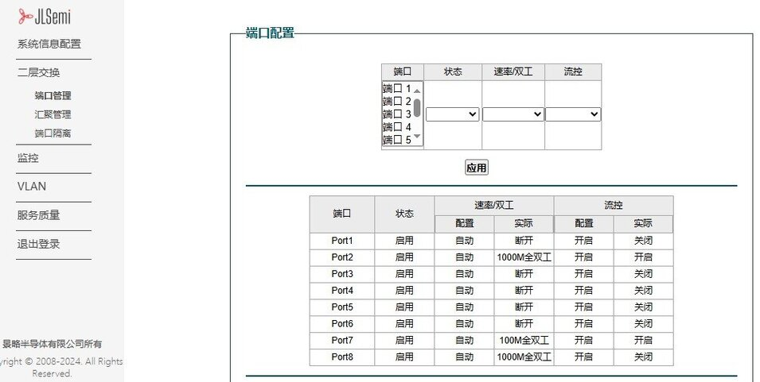
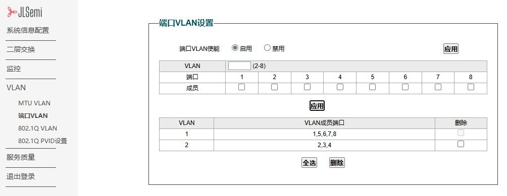

## 简介

NanoCluster 搭载 JL6108 千兆交换机芯片，该芯片基于 **RISC-V** 架构，既可作为即插即用的傻瓜交换机使用，也可作为可本地管理的二层交换机，支持通过 Web 进行配置。主要功能包括：

- **系统管理**：显示系统信息、支持重启、恢复出厂设置、固件升级  
- **网络配置**：支持静态 IP 和 DHCP 动态 IP 配置  
- **端口管理**：端口启用/禁用、链路速率设置、流控管理  
- **端口汇聚**：支持端口绑定，提高带宽利用率  
- **安全与隔离**：端口隔离、防止数据泄露  
- **流量监控**：端口 MIB 统计、流量分析  
- **环路保护**：防止网络环路，提升网络稳定性  
- **VLAN 配置**：支持 MTU VLAN、基于端口的 VLAN、802.1Q VLAN、PVID 设置  
- **QoS 配置**：基于端口、PCP、DSCP 进行流量优先级管理  
- **带宽与风暴控制**：支持基于端口的带宽限制与广播风暴抑制

> 默认固件的管理界面为英文，可通过 OTA 更新切换为中英文界面。

>! 目前交换机管理界面在 Linux 上存在响应异常。为获得更佳兼容性，建议优先通过 Windows 登录交换机管理界面。

## 端口分配

集群底板通过 JL6108 交换机连接各个核心板（SOM），端口分配如下：

| 交换机端口 | 连接设备                             |
|------------|--------------------------------------|
| Port 1     | Slot 7                               |
| Port 2     | Slot 6                               |
| Port 3     | Slot 5                               |
| Port 4     | Slot 4                               |
| Port 5     | Slot 3                               |
| Port 6     | Slot 2                               |
| Port 7     | Slot 1                               |
| Port 8     | 集群底板 RJ45 接口（用于连接外部网络）   |

## 使用教程

1. **确保设备连接**  
   确保 NanoCluster 已上电，并通过网线将板载网口与管理主机相连。

2. **配置 IP 地址**  
   交换机的默认 IP 地址为 **10.10.11.10/24**，请确保管理主机的 IP 地址与其处于同一网段，例如 **10.10.11.x**（x 取值范围：1-254，且不能为 10），子网掩码设为 **255.255.255.0**。  

   

3. **访问管理界面**  
   在浏览器地址栏输入 `http://10.10.11.10` 并回车，即可进入交换机的登录界面。  

   

4. **登录管理系统**  
   在登录界面输入 **管理员账号和密码**（默认均为 `admin`），然后点击 **登录**，进入交换机管理界面首页。  

   

## 基本配置

### 端口管理
JL6108 交换机提供端口状态管理功能，支持 **端口启用/禁用**、**速率设置**、**流控管理**。
- **启用/禁用端口**：可在 **端口管理** 页面找到目标端口，选择“启用”或“禁用”  
- **修改端口速率**：支持 10Mbps / 100Mbps / 1000Mbps 三种模式  
- **流控**：可开启端口流控，防止数据丢失  

### VLAN 配置
VLAN（虚拟局域网）用于划分不同的网络区域，防止广播风暴，提高网络安全性。

#### 配置端口 VLAN

1. **进入端口 VLAN 界面**  
   在 Web 管理界面，依次进入：`VLAN` >> `端口 VLAN`，进入 VLAN 配置页面。

2. **启用端口 VLAN 功能**  
   勾选 **“端口 VLAN 使能”** 选项，并点击 **`应用`** 按钮。

3. **创建 VLAN 2 并配置端口成员**  
   - 在 **VLAN ID** 输入框中输入 **`2`**  
   - 勾选 **端口 2 ~ 4**  
   - 点击 **`应用`** 按钮以保存配置  

4. **查看端口成员表**  
   配置完成后，**端口 2 ~ 4 将自动从 VLAN 1 中移除**，并加入 VLAN 2。  

   

### QoS 配置（流量优先级）
QoS 用于保障高优先级流量（如视频会议、VoIP）的稳定性：
1. **进入“QoS 设置”**  
2. 选择 **基于端口/802.1P/DSCP** 的 QoS 策略  
3. 设置 **高/中/低优先级队列**  
4. **保存设置**，QoS 规则生效  

### OTA 更新

固件下载地址：[点击下载 OTA 固件](./assets/firmware.zip)

1. 打开 Web 管理界面，依次进入：`系统信息配置` → `系统升级`
2. 点击 **选择文件**，选择匹配的固件文件进行升级：
   - **英文界面固件**：`lms_ota_en.fw`
   - **中文界面固件**：`lms_ota_zh.fw`
3. 点击 **升级**，系统将显示升级进度并自动进行校验。
4. 升级完成后，设备将自动重启以应用新固件。
5. 若升级失败，可断电重启设备，重新输入管理地址进入升级页面，重复升级操作。

## 更多配置

JL6108 交换机还支持更多高级功能，详细配置说明，请参考官方手册。

[点击此处查看完整手册](https://dl.sipeed.com/shareURL/Cluster/NanoCluster/06_Switch_JL6108)

我们提供基于 **RISC-V** 架构的 **JL6108 SDK**，用户可以从以下链接下载 SDK 并进行自主开发。

[JL6108 SDK](https://dl.sipeed.com/shareURL/Cluster/NanoCluster/06_Switch_JL6108)