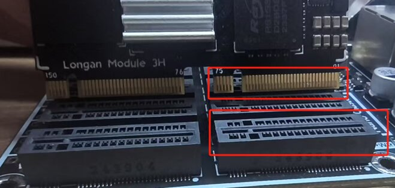
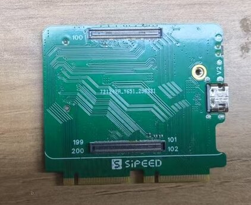
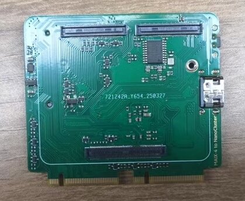
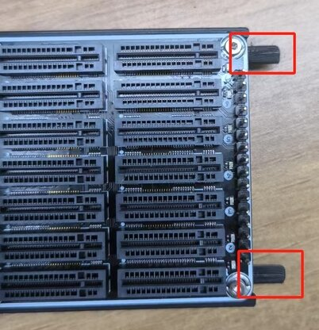
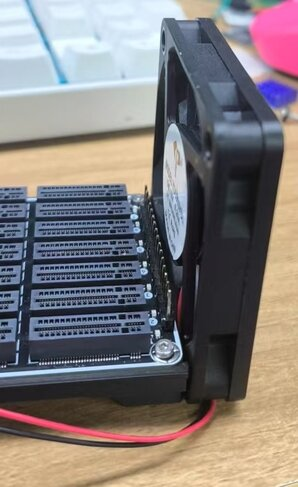
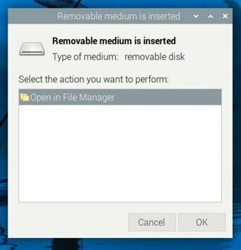
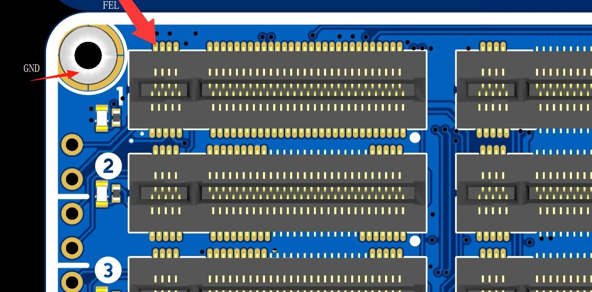

## 硬件安装

### LM3H 安装

先将散热片粘贴到主控芯片上，以提升散热效果。安装核心板时，请确保方向正确，以免损坏设备。



对准核心板上的金手指缺口与主板卡槽，使其对齐后轻轻放入，并均匀向下按压，直至听到 “喀哒” 声，确认核心板已牢固插入且无歪斜或松动。


如需拆卸核心板，请双手均匀握住核心板两侧，轻轻向上施力，避免单侧用力过大导致损坏。若核心板较紧，可先左右轻微晃动后再拔出，切勿生拉硬拽，以防损坏金手指或主板卡槽。

### CM4、CM5 安装

- 先将 CM4 / CM5 安装到转接板上；



- 再将转接板插入主板插槽。


>若使用 **CM5** 且需支持 **USB3.0**，请间隔一个槽位安装，确保 USB3 通道正常工作。

### M4N 安装

- 先将 M4N 核心板安装到转接板上；



- 再将转接板插入主板插槽。


### 风扇安装

将风扇对准底板上预留的安装孔位插入：



请确保风扇朝向正确，风向应朝向网口方向，以便更有效地带走 SOM 的热量：



使用螺丝将风扇牢固固定在底板上：


将风扇的电源排线插入底板上的风扇供电接口。请注意插头方向，确保红线为正极：


## 电源供应

NanoCluster 支持 USB-C PD 与 PoE 两种供电方式，支持双路热插拔 —— 即可同时连接 PD 与 PoE，在断开其中任意一方后系统依然稳定运行，支持在任意时刻插入或拔出任一电源。

默认支持 60W（20V/3A）PD 供电，使用带 e-Marker 的线材可达 65W（20V/3.25A）。推荐使用标配的 PD 适配器及优质 USB-C 线缆，以确保稳定供电。可选配 60W 峰值功率的 PoE 模块，持续输出功率约为 50W，适用于无独立供电接口的网络部署环境。 

### 最大支持配置（参考推荐功率）：

| 供电方式 | 最大支持配置                     |
|----------|----------------------------------|
| PD       | 支持 7× LM3H / CM4 / CM5 / M4N   |
| PoE      | 支持 7× LM3H / CM4；6× CM5 / M4N |
| SSD 安装 | 最多支持 4 个带 SSD 的 SOM（因空间限制）|
<br>

> **注：** CM5 / M4N 模块因功耗更高，在 PoE 模式下建议最多连接 6 个。

---

### PD 接口说明

设备通过 USB-C 接口支持 PD 协议供电，最大功率 65W。请使用原装适配器或符合 20V/3A 以上规格的电源适配器，确保设备正常启动并满载运行。


---

### PoE 模块安装说明

NanoCluster 可选配 PoE 模块，实现网络线供电，简化布线部署。请参考下图进行正确安装：


将 PoE 模块与主板插槽对齐后小心插入，确保连接牢靠，不松动。


>请使用符合标准的 PoE 交换机或 PoE 适配器，以保证稳定性和安全性。

## 烧录镜像

##### 核心板默认已预装系统，如需重新烧录系统，可按照以下步骤进行操作：

### LM3H 烧录

下载所需的固件镜像，并准备一台支持 USB OTG 的计算机及 USB 线。NanoCluster 目前使用的镜像与 Longan Pi 3H 兼容，可在此获取：[点击下载](https://wiki.sipeed.com/hardware/zh/longan/h618/lpi3h/3_images.html)。

将核心板插入 slot1 槽位后，使用 USB 线 连接 主板 OTG 接口（下方的接口）与计算机。按住 BOOT 按键，然后 上电或复位设备，即可进入 UMS 烧录模式。



准备好固件镜像后，打开 balenaEtcher，选择要烧录的镜像文件，确保核心板被识别为 U 盘，然后在 balenaEtcher 中选择目标设备。点击 “Flash” 按钮开始烧录，等待烧录完成后，安全弹出设备，断开 USB 连接并重启设备，即可进入新系统。


### CM4/CM5 烧录

1. 按照 [官方文档](https://www.raspberrypi.com/documentation/computers/compute-module.html#set-up-the-host-device) 安装 `rpiboot` 工具。

2. 按住转接板上的 BOOT 按键，将 USB OTG 接口连接到主机。

3. 主机识别到 **BCM2711 (BCM2712) Boot** 设备后，运行 `rpiboot`，稍等片刻会自动弹出一个 U 盘设备。

4. 打开 [Raspberry Pi Imager](https://www.raspberrypi.com/software/)，选择所需镜像并烧录到该设备上即可。

### M4N 烧录

可参考[系统烧录指南](https://wiki.sipeed.com/hardware/zh/maixIV/m4ndock/system-update.html)进行烧录

## 远程管理

主板配备一个网口用于连接交换机，集群内部设备通过交换机互联，并可通过 IP 地址进行控制和管理。

**如何获得设备的IP地址（以 LM3H 核心板为例）**:

先将网线连接至主板的网口，然后上电。预装的固件已启用 mDNS 服务，可在 PC 上启用 Avahi 服务，并使用 mDNS 扫描整个网络，即可获取 lpi3h 设备的 mDNS 域名信息。

``` bash
avahi-browse -art | grep lpi3h
```

然后使用:

``` bash
ssh sipeed@lpi3h-xxxx.local
```

即可连接（将 xxxx 替换为使用 avahi-browse 命令查看到的主机名）

> lpi3h 为 LM3H 默认的 mDNS 主机名前缀，若使用的是 CM4 或 CM5，请根据所烧录的系统镜像自行调整主机名。

## 串口连接

每个 SOM 都将系统串口引出至 2.54mm 插针，可通过串口转 USB 模块进行连接调试。

如需同时调试或控制多个 slot，推荐使用我们提供的 USB 转四串口扩展板。该扩展板将 slot3、slot5、slot6 和 slot7 的串口信号统一接入 slot1 的 USB 接口，便于集中管理与操作。


> ⚠️ 由于串口扩展模块会部分遮挡风道，且模块本身仅支持 4 路串口，建议在使用该模块时，仅插入 4～5 个 SOM，以保证系统散热与调试稳定性。

## 电源控制  

slot1~7 的复位脚由 slot1 通过 **I2C 扩展的 IO** 进行控制，可实现远程开关机。  

**使用 LM3H 控制复位方法示例：**

```bash
# 复位交换机芯片（GPIO 0）
sudo gpioset gpiochip2 0=0 && sudo gpioset gpiochip2 0=1

# 复位 slot2（LM3H）
# 长按 8 秒实现关机
sudo gpioset gpiochip2 2=0 && sleep 8 && sudo gpioset gpiochip2 2=1

# 快速触发实现开机
sudo gpioset gpiochip2 2=0 && sleep 1 && sudo gpioset gpiochip2 2=1

# 复位 slot2（CM4）
sudo gpioset gpiochip2 2=0 && sleep 1 && sudo gpioset gpiochip2 2=1

# 复位 slot2（CM5）
# 使用 GPIO 电平变化模拟按下 CM5 的电源按键，可实现开关机：
# - 若系统为 Raspberry Pi OS Lite（无桌面）：短按一次即可关机。
# - 若系统为 Raspberry Pi Desktop（有桌面）：需短按两次以触发关机。

# 模拟短按两次（Desktop 系统关机）
sudo gpioset gpiochip2 2=0 && sleep 1 && sudo gpioset gpiochip2 2=1
sudo gpioset gpiochip2 2=0 && sleep 1 && sudo gpioset gpiochip2 2=1

# 模拟短按一次（开机）
sudo gpioset gpiochip2 2=0 && sleep 1 && sudo gpioset gpiochip2 2=1
```

>! 已知问题：若通过长按按键实现强制硬关机 CM5，系统将无法通过短按方式启动，需重新上电才能恢复。

> `gpiochip2` 表示 GPIO 控制器编号，后面的 `x=0` 表示将编号为 x 的 IO 设置为低电平，`x=1` 设置为高电平。

| GPIO 编号 | 对应功能         |
|-----------|------------------|
| 0         | 交换机芯片复位   |
| 1~7       | slot1~slot7 复位 |

**使用 CM4/CM5 控制复位方法示例：**

在 CM4 或 CM5 上启用 I2C 并加载 PCA9557 驱动，即可使用相同方式控制：

编辑 /boot/firmware/config.txt，添加以下内容：

``` txt
dtparam=i2c_arm=on
dtoverlay=pca953x,addr=0x18,pca9557
```

保存并重启后，即可通过 gpioset 方法控制 slot 的复位。

> - **CM4** 对应的 GPIO 控制器编号为：`gpiochip2`  
> - **CM5** 对应的 GPIO 控制器编号为：`gpiochip14`  

控制方法与 LM3H 相同，只需将 gpiochip 替换为实际平台对应的编号。

## 风扇调速

LM3H / CM4 / CM5 均支持风扇调速，默认情况下 LM3H 会根据 CPU 温度自动调节转速, CM4 和 CM5 官方镜像默认风扇全速运行。以下为各平台的控制方法。

如果需要手动调节风扇，可通过 SSH 连接到 slot1 设备，并执行以下命令：

### LM3H 调速

``` bash
echo disabled | sudo tee /sys/class/thermal/thermal_zone2/mode

echo 4 | sudo tee /sys/class/thermal/cooling_device0/cur_state
```

`cur_state` 取值范围为 0 ~ 4，对应不同转速。

如果要恢复自动调节，可使用以下命令:

``` bash
echo enabled | sudo tee /sys/class/thermal/thermal_zone2/mode
```

### CM4 调速

将以下内容添加到 /boot/firmware/config.txt:

```bash
dtoverlay=pwm-2chan,pin=12,func=4,pin2=13,func2=4
```

重启后执行：

``` bash
sudo pigpiod
```

Python 控制风扇：

```python
import pigpio

pi = pigpio.pi()

# 设置 PWM 频率和范围
pi.set_PWM_frequency(13, 50)
pi.set_PWM_range(13, 200)

# 设置风扇转速
pi.set_PWM_dutycycle(13, 0)     # 不转
pi.set_PWM_dutycycle(13, 200)   # 满速
```

### CM5 调速

Python 控制风扇：
```python
import RPi.GPIO as GPIO

GPIO.setmode(GPIO.BCM)
GPIO.setup(13, GPIO.OUT)

pwm = GPIO.PWM(13, 50)  # 50Hz 频率
pwm.start(0)            # 不转
pwm.start(100)          # 满速
```

## 散热控制

1. 建议将整机放置在通风良好、温度低于 **30 摄氏度** 的环境中，以减轻整体散热负担。

2. 推荐整机持续工作功率控制在 **50W 以内**，峰值功率不超过 **60W**，以匹配电源输出能力与系统散热性能。

3. 若未安装 SSD，整机空间与散热能力可支持 **最多 7 个 SOM 同时运行**。若安装 SSD，为确保良好的散热风道，建议 **间隔安装 SOM，最多 4 个**。

4. Slot7 处于机壳边缘，风扇风量较小，但具备充足的空间安装散热片。建议为该位置安装较大的散热片以增强散热效果。

## 常见问题排查（FAQ）

### 设备无法开机 / 无法进入系统
确保使用至少支持 PD 20V 输出的电源适配器，避免使用主机 USB 供电，否则可能导致设备无法正常启动。检查电源输入接口旁的绿色指示灯是否亮起，若无反应，可能是电源适配器或供电线路问题。观察每个 slot 对应的蓝色电源指示灯，判断系统是否正常启动。

如果 **LM3H** 无法进入系统，可按住 BOOT 按键后上电或复位设备，检查是否进入 UMS 模式，并通过磁盘管理确认是否识别为 U 盘。若系统损坏或无法进入，可以重新[烧录镜像](https://wiki.sipeed.com/hardware/zh/cluster/NanoCluster/use.html#烧录镜像)；若无法进入 UMS 模式，请尝试[异常刷机](https://wiki.sipeed.com/hardware/zh/cluster/NanoCluster/use.html#异常刷机（LM3H）)。

若 **CM4/CM5** 无法正常启动系统，可参考[烧录镜像](https://wiki.sipeed.com/hardware/zh/cluster/NanoCluster/use.html#烧录镜像)部分重新烧录后再进行测试。

### 网络连接异常（无法获取 IP）
如果成功进入系统但网络连接异常，无法获取 IP，请确保先插入网线再上电。交换机会在设备上电时检测网络接口，若上电后再插网线，可能导致接口无法正常识别。

### 异常刷机（LM3H）

如果因某些原因导致 U-Boot 损坏，设备无法正常进入 UMS 模式，可以通过 Fel 模式 手动恢复。使用 sunxi-fel 或 xfel 工具，将 U-Boot 加载至内存并启动 UMS 模式，然后进行刷机。

#### 进入 fel 模式

短接 slot1 的该处引脚与 GND，然后上电即可进入 FEL 模式（后续版本可能增加按键控制）。



#### 安装 awusb 驱动

需要先安装全志的 [sunxi-awusb](https://github.com/916BGAI/sunxi-awusb) 驱动，用于识别 H618 芯片。

``` bash
sudo apt update
sudo apt install dkms
cd sunxi-awusb
sudo cp -r ./ /usr/src/sunxi-awusb-0.5
sudo dkms add -m sunxi-awusb -v 0.5
sudo dkms build -m sunxi-awusb -v 0.5
sudo dkms install -m sunxi-awusb -v 0.5
sudo modprobe awusb
sudo cp udev/50-awusb.rules /etc/udev/rules.d/
sudo udevadm control --reload-rules
```

``` bash
Bus 002 Device 005: ID 1f3a:efe8 Allwinner Technology sunxi SoC OTG connector in FEL/flashing mode
```

#### 获取 uboot 文件

下载已经编译好的 U-Boot 文件：[点击下载](./assets/uboot.tar.gz)

#### 使用 sunxi-fel

编译安装
``` bash
git clone https://github.com/linux-sunxi/sunxi-tools.git
cd sunxi-tools
make tools
sudo make install
```

烧录 U-Boot
``` bash
sudo sunxi-fel uboot /path/u-boot-sunxi-with-spl.bin
```

执行完成后，设备应能正常进入 UMS 模式，此时可继续烧录系统镜像。

#### 使用 xfel

编译安装
``` bash
sudo apt install libusb-1.0-0-dev
git clone https://github.com/xboot/xfel.git
cd xfel
make
sudo make install
```

烧录 U-Boot
``` bash
xfel ddr lpddr4
xfel write 0x4a000000 /path/u-boot-dtb.bin
xfel exec 0x4a000000
```

执行完成后，设备应能正常进入 UMS 模式，然后进行系统镜像烧录。

### CM4 Lite 复位后无法启动

首批版本的 CM4 转接板在使用 CM4 Lite（无 eMMC）时，按照[电源控制](https://wiki.sipeed.com/hardware/zh/cluster/NanoCluster/use.html#电源控制)指引操作，可能导致复位后无法正常启动。此问题将在下一版硬件中修复。如遇该情况，建议使用 reboot 命令进行重启，替代复位操作。
