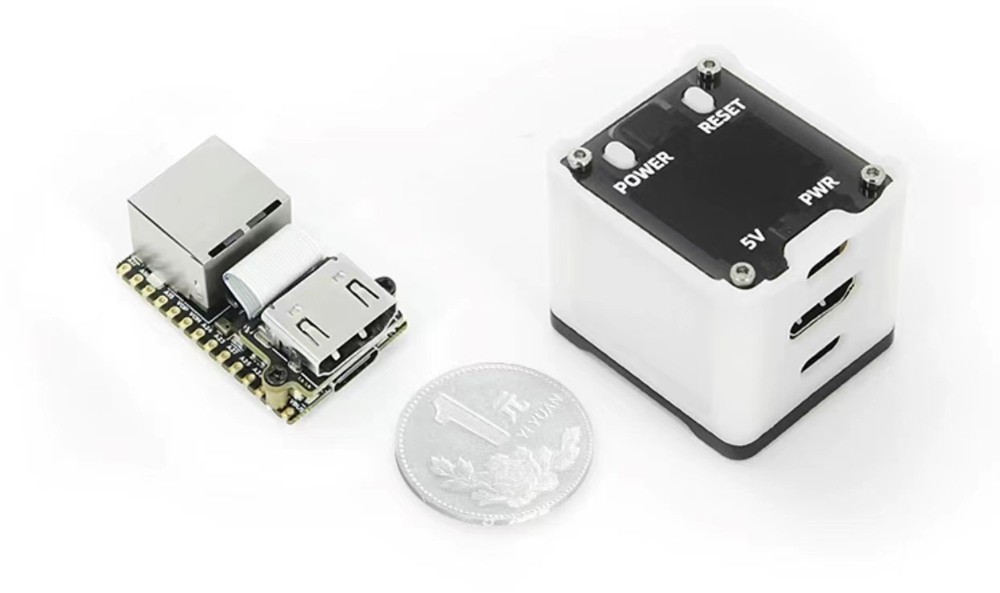
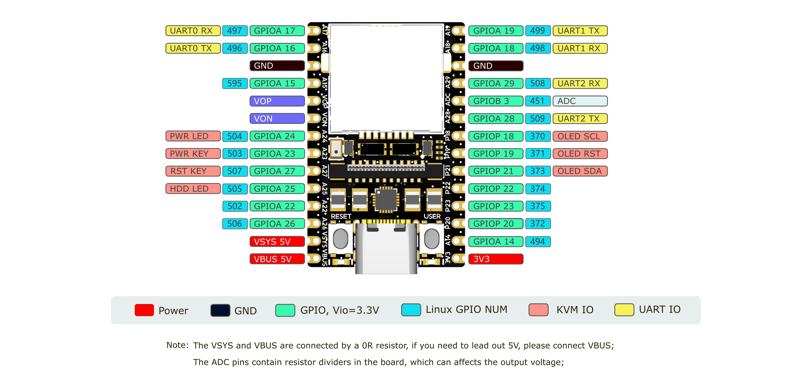

## 简介

Lichee NanoKVM 是基于 LicheeRV Nano 的 IP-KVM 产品，继承了 LicheeRV Nano 的极致体积 和 强大功能。

NanoKVM 包含一个 HDMI 输入接口，可以被电脑识别为显示器，捕捉电脑画面；一个 USB2.0 接口连接电脑主机，可被识别为键盘鼠标触摸板等HID设备，同时使用TF卡多余存储空间，挂载为一个U盘设备；全系标配一个百兆网口，用于视频和控制信号等的网络传输。另外Full版还带有ATX电源控制接口（USB-C形态）方便远程控制和查看主机开关机状态；Full 版外壳下还带一个 OLED 显示屏，用于显示本机 IP 和 KVM 相关状态。

为满足用户不同需求，NanoKVM 提供两个版本：
NanoKVM Lite 为基础版配置，适合 具有一定DIY能力的个人用户 和 有批量需求的企业用户。
NanoKVM Full 为完整版配置，带精致外壳和完整配件，内置开机即用的系统镜像卡，推荐个人用户购买。

## 使用场景

+ 服务器管理：用于实时监控服务器，获取服务器运行状态，并对其加以控制；
+ 远程桌面、开关机：NanoKVM 摆脱主机必须联网和系统软件的限制，作为主机外置硬件，直接提供远程控制的功能；
+ 远程装机：NanoKVM模拟U盘设备，可挂载装机镜像安装系统，也可进入BISO对电脑设置；
+ 远程串口（Full内测版暂未引出至接口）：NanoKVM引出两组串口，可配合IPMI使用，用户可自行拓展更多配件
+ 更多玩法功能将在后续开放（如直播推流机），敬请期待

## 参数

| 产品 | NanoKVM (Lite) | NanoKVM (Full) | PiKVM V4 |
| --- | --- | --- | --- |
| 计算单元                | LicheeRV Nano(RISCV) | LicheeRV Nano(RISCV) | CM4 (ARM) |
| 分辨率                  | 1080P @ 60fps | 1080P @ 60fps | 1080P @ 60fps |
| 视频编码                | MJPEG, H264(developing) | MJPEG, H264(developing) | MJPEG, H264 |
| 视频延迟                | 90～230ms | 90～230ms | 100～230ms |
| UEFI/BIOS               | ✓ | ✓ | ✓ |
| 模拟USB键鼠  | ✓ | ✓ | ✓ |
| 模拟USB存储  | ✓ | ✓ | ✓ |
| IPMI      | ✓ | ✓ | ✓ |
| Wake-on-LAN | ✓ | ✓ | ✓ |
| ATX电源控制 | 无，用户可自行连接 | USB接口IO控制板 | RJ45接口IO控制板 |
| OLED显示 | 无，用户可自行扩展 | 128x64 0.96" white | 128x32 0.91" white |
| 外接串口 | 2路 | 2路 | 1路 |
| TF卡 | 无，用户自备 | 有，开机即用 | 有 |
| 扩展配件 | 无 | WiFi 或 PoE | WiFi/LTE |
| 功耗 | 0.2A@5V | 0.2A@5V | Peak 2.6A@5V |
| 电源输入 | PC USB即可供电 | PC USB即可供电   也支持额外辅助供电 | 需要DC 5V 3A供电 |
| 散热 | 静音无风扇 | 静音无风扇 | 需要风扇主动散热 |
| 尺寸 | 23x37x15mm   ～1/30 PiKVM V4 体积 | 40x36x36mm   ～1/7 PiKVM V4 体积 | 120x68x44mm |

## NanoKVM 软硬件资料

NanoKVM 基于 Sipeed [LicheeRV Nano](https://wiki.sipeed.com/hardware/zh/lichee/RV_Nano/1_intro.html) 核心板搭建，这部分硬件的规格书、原理图、尺寸图等均可在这里找到：[点击这里](http://cn.dl.sipeed.com/shareURL/LICHEE/LicheeRV_Nano)

NanoKVM Lite 由 LicheeRV Nano E 和 HDMItoCSI 小板构成，NanoKVM FULL 在 NanoKVM Lite 基础上增加 NanoKVM-A/B 板和外壳。HDMItoCSI板用于转换HDMI信号；NanoKVM-A 包含 OLED、ATX控制输出（TypeC接口形式）、辅助供电（TypeC接口）以及ATX开关机、复位按键；NanoKVM-B 一端连接A板，一端连接电脑ATX针脚，用于电脑的远程开关机。

NanoKVM 镜像在LicheeRV Nano SDK 和 MaixCDK 基础上构建，可以兼容使用 LicheeRV Nano 的资料，反之LicheeRV Nano 或其他 SG2002 产品无法使用KVM软件。如果您想在 NanoKVM 上构建 HDMI 输入相关应用，请与我们联系，以获得技术支持。

+ [NanoKVM-A 原理图](https://cn.dl.sipeed.com/fileList/KVM/nanoKVM/HDK/02_Schematic/SCH_RV_Nano_KVM_A_30111.pdf)
+ [NanoKVM-B 原理图](https://cn.dl.sipeed.com/fileList/KVM/nanoKVM/HDK/02_Schematic/SCH_HDMI_MIPI_31011.pdf)
+ [NanoKVM 镜像下载](https://github.com/sipeed/NanoKVM/releases/tag/NanoKVM)

## 购买入口

[淘宝官方购买地址](https://item.taobao.com/item.htm?id=811206560480)
[速卖通购买地址]()
[预售页面](sipeed.com/nanokvm)

## 产品反馈

如果您在使用过程中有任何问题或建议，请通过以下渠道和我们反馈：

+ [Github issues](https://github.com/sipeed/NanoKVM) 
+ [MaixHub 论坛](https://maixhub.com/discussion/nanokvm)
+ QQ 交流群: 703230713

