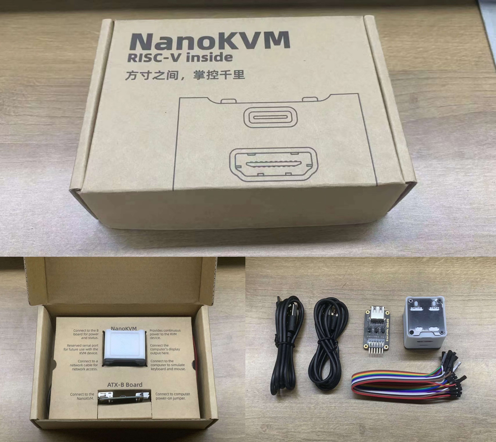
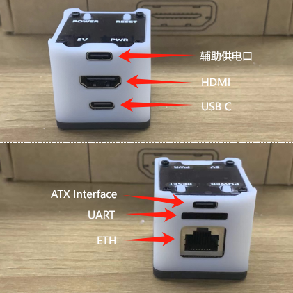
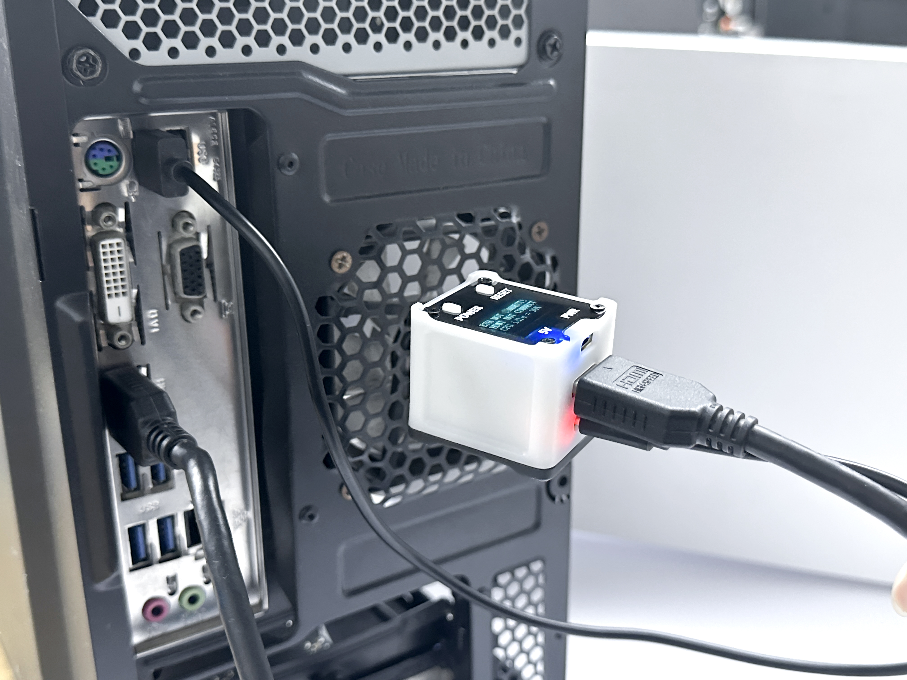
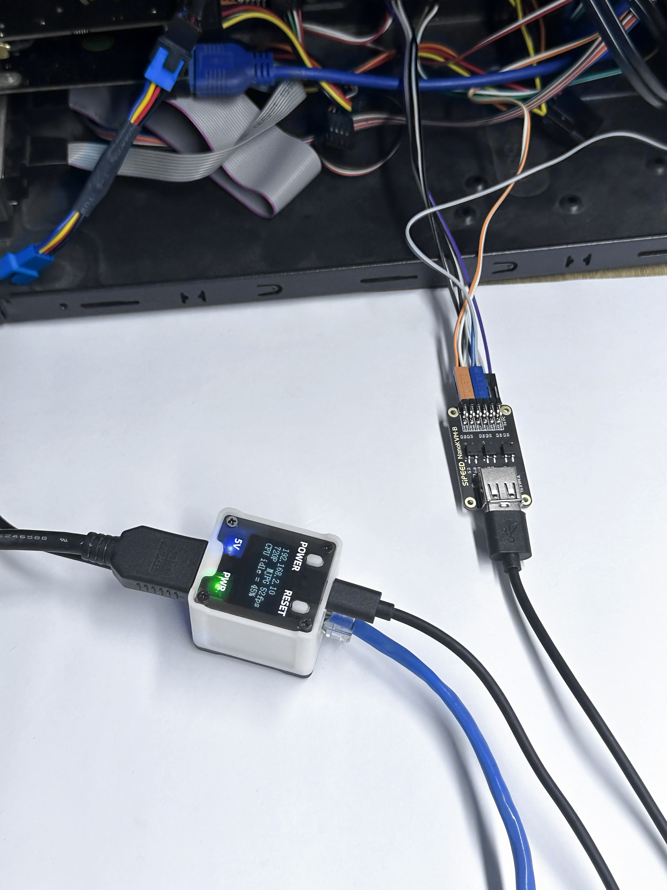

## 开箱

Full版包含Nano KVM（带外壳，带卡）、KVM-B板、USB A to C 线 *2、杜邦线

## 接线

NanoKVM-Full版接口示意图如下：

+ 使用一条 USB C to A 数据线连接远程主机和 NanoKVM 的 USB C 口

+ 一条HDMI（标准尺寸）连接远程主机和 NanoKVM 的 HDMI 接口

  

+ 使用网线连接路由器/交换机与 NanoKVM

+ 再使用一条 USB C to A 数据线连接 KVM-B 板和 NanoKVM 的 ATX 接口

  

  KVM-B板与主机9针接口连线如下图，双排排针上下联通，另一排可连接机箱的开机按键、Power LED 等接口

  

## 如何获取IP地址

Full版NanoKVM自带OLED显示屏，联网之后会在显示屏第一行显示IP地址；

Lite版用户在插入镜像卡启动后，可在路由器/交换机后台查看IP。用户也可按照[LicheeRV NANO](https://wiki.sipeed.com/hardware/zh/lichee/RV_Nano/5_peripheral.html#usb-rndis-%E7%BD%91%E5%8F%A3)的联网方式登录到板子，使用`ifconfig`查看`eth0`的地址

## 浏览器查看远程桌面

浏览器直接输入获取的IP，进入登录页面，默认账号密码为admin、admin，登陆后就可以看到远程桌面了

## 如何进行远程装机

Nano KVM的 USB-C 端口除模拟键鼠设备外，还模拟了一个U盘设备，挂载了TF卡内的一部分存储空间，用于装机等需求，该U盘默认格式化为exFAT格式，Full版NanoKVM内置TF卡，模拟出的U盘大小约21G。

首先用户需要下载待安装的镜像（通常以.iso结尾），将NanoKVM USB-C 插入电脑，直接将下载好的镜像复制到U盘内（可复制多个系统），即可拔出。

按上述步骤连接远程主机与Nano KVM，在浏览器登录系统后，点击光盘图标，选中待安装的系统

然后点击`开机（短按）`，迅速按键盘上的F11键（不同主机按键可能不同，请参照主机说明），选择对应的系统启动。

注：

+ 虚拟U盘也可以当作普通U盘，使用常规的烧卡方式烧录镜像。

## 如何在外网访问

Todo

## 串口使用

Todo

