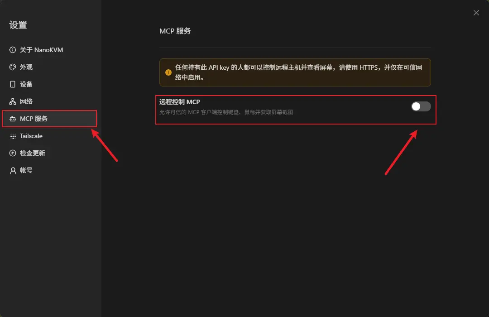
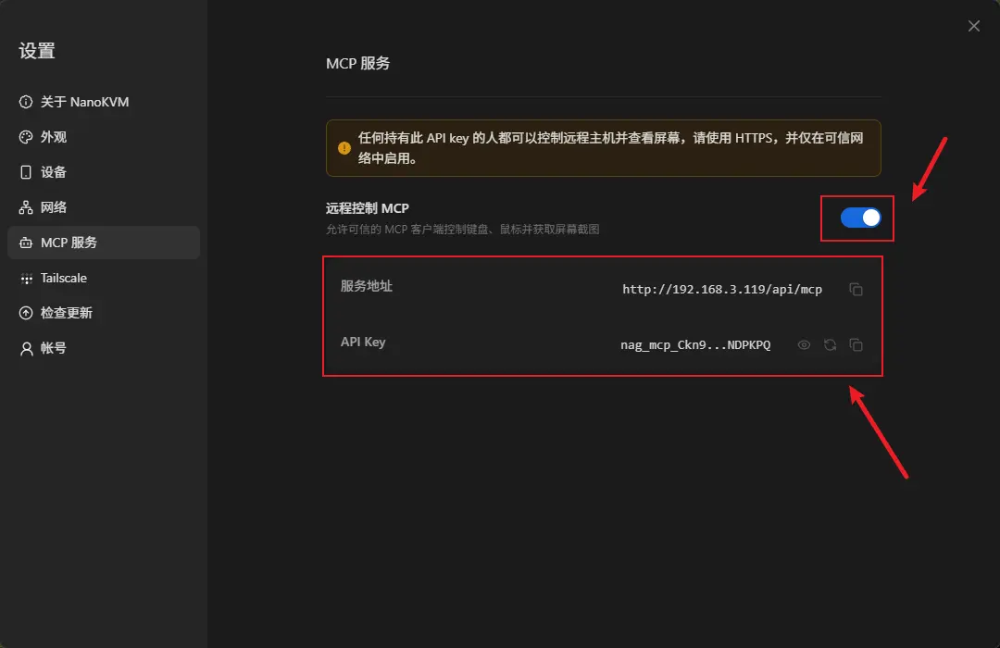
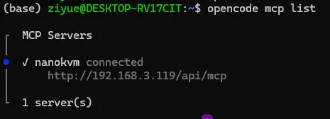
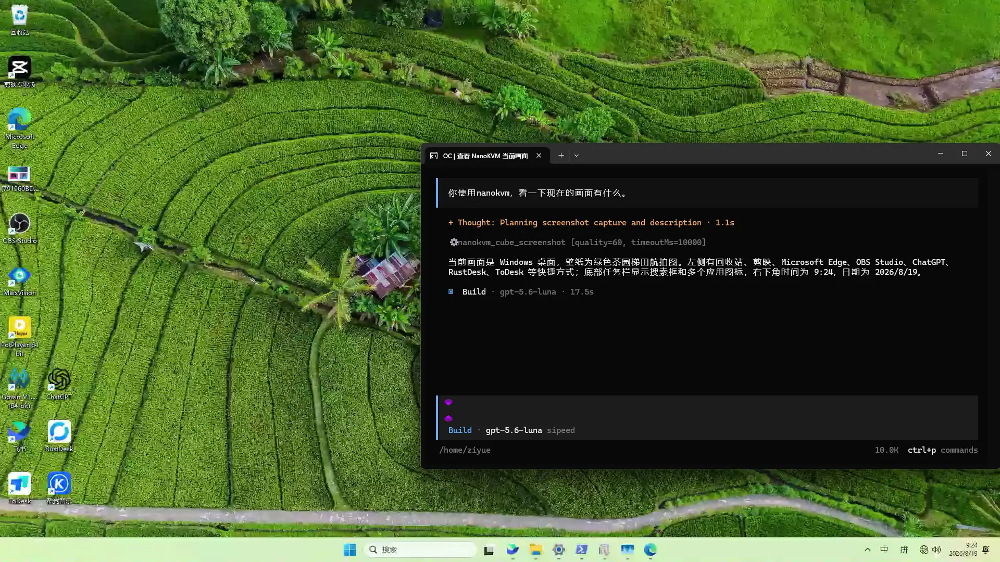

## 简介

NanoKVM Cube 的 MCP 功能用于将 NanoKVM Cube 接入支持 MCP 的 AI 工具，使 AI 工具可以通过 NanoKVM Cube 查看并控制被控设备。

连接完成后，AI 工具可以根据被控设备的屏幕内容，辅助执行点击、输入、打开应用、修改设置、排查问题等操作。该功能适合远程运维、系统配置、故障排查和重复性操作辅助等场景。

> MCP 功能会让 AI 工具具备操作被控设备的能力。使用前请确认 AI 工具来源可信，并避免在不可信网络中开放 MCP 服务。

## 工作原理

NanoKVM Cube 开启 MCP 服务后，控制设备上的 AI 工具可以通过页面显示的 `服务地址` 和 `API Key` 连接到 MCP 服务。AI 工具并不直接连接被控设备，而是通过 NanoKVM Cube 间接获取画面并发送控制操作。

连接关系如下：

```text
AI 工具（控制设备）
        |
        | MCP
        v
NanoKVM Cube
        |
        | KVM 控制
        v
被控设备
```

其中：

+ 被控设备通过 HDMI 接口向 NanoKVM Cube 输出画面，并通过 PC USB（HID）接口接收键盘、鼠标等控制操作；
+ NanoKVM Cube 负责采集被控设备画面，并向被控设备发送键盘、鼠标等控制操作；
+ 控制设备上的 AI 工具通过 MCP 连接 NanoKVM Cube；
+ 用户在 AI 工具中发出指令后，AI 工具通过 NanoKVM Cube 辅助控制被控设备。

## 使用前准备

使用 MCP 功能前，请先确认：

+ NanoKVM Cube 已正常连接被控设备；
+ NanoKVM Cube 网页控制端可以正常显示被控设备画面；
+ NanoKVM Cube 已连接网络，并且已获得 IP 地址；
+ 控制设备可以访问 NanoKVM Cube 页面显示的 MCP 服务地址；
+ 控制设备上已安装支持 MCP 的 AI 工具，例如 [OpenCode](https://opencode.ai/download) 或其他 MCP Client；
+ NanoKVM Cube 的系统和应用版本支持 MCP 功能。

> 如果页面中没有 MCP 相关选项，请先检查 NanoKVM Cube 系统和应用是否已经更新到支持 MCP 的版本。

## 开启 MCP 功能

1. 将 NanoKVM Cube 接入被控设备，并确认被控设备画面可以正常显示。
2. 在浏览器地址栏输入 NanoKVM Cube 的 IP 地址，打开 NanoKVM Cube 网页控制端。
3. 登录 NanoKVM Cube。
4. 进入设置页面。


5. 找到 MCP 功能选项。



6. 打开 MCP 功能开关。
7. 记录页面显示的 `服务地址` 和 `API Key`。

## 在 AI 工具中添加 MCP

不同 AI 工具的 MCP 配置方式不同。本节以 OpenCode 为例，演示如何在控制设备上添加 NanoKVM Cube MCP。

### 获取服务地址和 API Key

在 NanoKVM Cube 中开启 MCP 功能后，页面会显示 `服务地址` 和 `API Key`。



其中：

+ `服务地址` 是 NanoKVM Cube MCP Server 的完整访问地址，例如 `http://<NanoKVM-IP>/api/mcp` 或 `https://<NanoKVM-IP>/api/mcp`；
+ `API Key` 是访问 NanoKVM Cube MCP Server 时使用的认证凭据。

配置 AI 工具时，请直接复制页面中显示的服务地址，不需要手动拆分 IP、端口或修改协议。

### OpenCode 添加 MCP

OpenCode 支持通过全局配置文件添加远程 MCP Server。

新建或编辑以下配置文件：

```bash
~/.config/opencode/opencode.json
```

配置示例：

```json
{
  "$schema": "https://opencode.ai/config.json",
  "mcp": {
    "nanokvm": {
      "type": "remote",
      "url": "<Endpoint>",
      "oauth": false,
      "headers": {
        "Authorization": "Bearer <API-Key>"
      }
    }
  }
}
```

将：

+ `<Endpoint>` 替换为 NanoKVM Cube MCP 页面显示的 `服务地址`；
+ `<API-Key>` 替换为 NanoKVM Cube MCP 页面显示的 `API Key`。

页面显示的服务地址可能以 HTTP 或 HTTPS 开头，请按页面内容原样填写。建议只在可信局域网中使用 MCP，并优先通过 HTTPS 连接。

如果服务地址以 HTTPS 开头，且 OpenCode 因 NanoKVM Cube 的本地证书而无法连接，可以在 Linux 环境中设置以下环境变量后启动 OpenCode：

```bash
export NODE_TLS_REJECT_UNAUTHORIZED=0
opencode
```

如果使用一条命令启动，也可以写成：

```bash
NODE_TLS_REJECT_UNAUTHORIZED=0 opencode
```

> `NODE_TLS_REJECT_UNAUTHORIZED` 环境变量会关闭当前 OpenCode 进程中的 TLS 证书验证，只建议在可信局域网内连接 NanoKVM Cube MCP 时使用。不要在不可信网络中长期使用该环境变量。

保存配置后，重新启动 OpenCode。然后查看 MCP Server 是否连接成功：

```bash
opencode mcp list
```

如果使用 HTTPS 服务地址时遇到本地证书验证错误，可以使用：

```bash
NODE_TLS_REJECT_UNAUTHORIZED=0 opencode mcp list
```

如果 `nanokvm` 显示为已连接，说明 OpenCode 已经成功接入 NanoKVM Cube MCP。



连接成功后，可以给 OpenCode 发送指令，让 OpenCode 通过 NanoKVM Cube MCP 查看并操作被控设备。



如果需要恢复默认安全行为，关闭当前终端窗口后重新打开即可。也可以在当前终端中执行：

```bash
unset NODE_TLS_REJECT_UNAUTHORIZED
```

### 其他 AI 工具

其他支持 MCP 的 AI 工具也可以尝试连接 NanoKVM Cube MCP。不同工具对远程 MCP、HTTPS 证书和工具调用权限的支持程度不同，请以实际版本为准。

如果某个 AI 工具无法处理 HTTPS 服务地址所使用的证书，可能需要通过 Nginx 等方式做反向代理并处理证书。但该方案配置步骤较多，不适合作为普通用户的首选使用方式。

## 使用示例

连接成功后，可以在 AI 工具中通过自然语言描述希望执行的操作。例如：

```text
使用 NanoKVM Cube，查看当前屏幕内容，并告诉我被控设备停在哪个界面。
```

```text
使用 NanoKVM Cube，帮我点击屏幕上的设置按钮。
```

```text
使用 NanoKVM Cube，帮我打开终端，并输入 ifconfig 查看网络信息。
```

```text
使用 NanoKVM Cube，根据当前屏幕内容，帮我继续完成系统安装流程。
```

建议从简单、可确认的操作开始使用，例如查看屏幕内容、点击明确按钮或输入短命令。涉及删除文件、格式化磁盘、修改系统配置等高风险操作时，请先确认 AI 即将执行的动作。

## 常见问题

### AI 工具连接不上 NanoKVM Cube MCP

请检查：

+ NanoKVM Cube MCP 开关是否已经打开；
+ MCP 服务地址是否填写正确；
+ `API Key` 是否填写正确；
+ 控制设备和 NanoKVM Cube 是否处于可互相访问的网络中；
+ 使用 HTTPS 服务地址时，当前 AI 工具是否支持处理 NanoKVM Cube 的本地证书；
+ 防火墙、路由器、VPN 或安全软件是否阻止了连接；
+ NanoKVM Cube 是否已经正常联网并显示 IP 地址。

### AI 工具可以连接 MCP，但无法控制被控设备

请检查：

+ NanoKVM Cube 网页控制端是否可以正常显示被控设备画面；
+ 被控设备是否已经正确连接 NanoKVM Cube；
+ 当前被控设备界面是否需要解锁、登录或人工确认；
+ AI 工具是否允许调用 MCP 工具；
+ NanoKVM Cube 的键盘、鼠标控制功能是否正常。

### 页面中找不到 MCP 开关

请检查：

+ NanoKVM Cube 系统或应用版本是否过旧；
+ 当前版本是否支持 MCP 功能；
+ 是否需要先在网页控制端中更新 KVM 应用；
+ 更新完成后是否已经重新打开设置页面。

## 安全注意事项

+ MCP 功能会让 AI 工具具备操作被控设备的能力，请只连接可信 AI 工具；
+ 不要将 MCP 服务直接暴露到公网；
+ 不要在不可信网络中开放 MCP 服务地址；
+ 使用完成后，如暂时不需要 MCP 功能，建议关闭 MCP 开关；
+ 操作重要设备前，请确认 AI 即将执行的动作；
+ 不要泄露 NanoKVM Cube MCP 的 `API Key`；
+ 输入密码、密钥、令牌等敏感信息时，请确认当前 AI 工具和网络环境可信。
