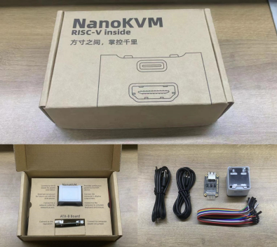
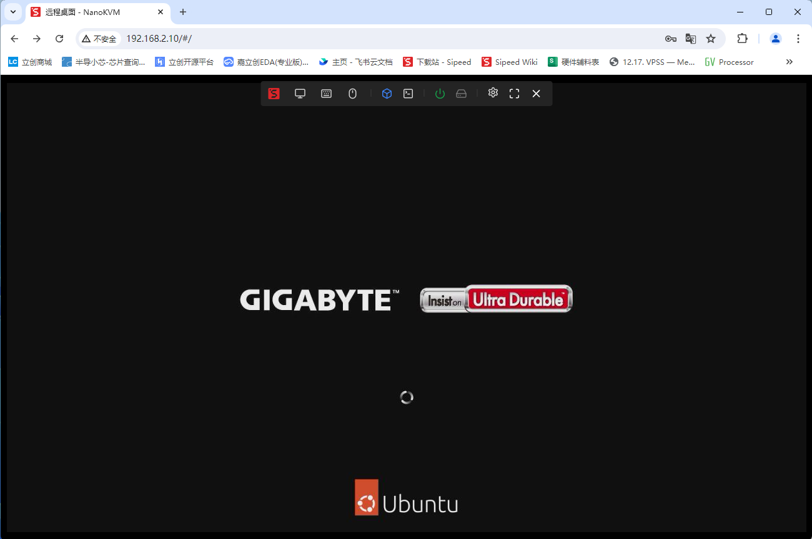
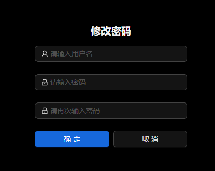
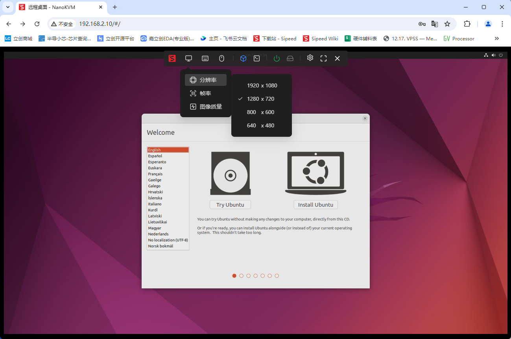

## 开箱

Full版包含 NanoKVM（带外壳，带卡）、KVM-B板、USB A to C 线 *2、杜邦线。

Lite版包含 NanoKVM（不带外壳和TF卡） 、散热片。

## 接口介绍

## 接线

NanoKVM-Full版接口示意图如下，Lite版仅包含 USB-C、HDMI和网口，可以参考Full版接线。

+ 使用一条 USB C to A 数据线连接远程主机和 NanoKVM 的 PC USB 接口

+ 一条HDMI（标准尺寸）连接远程主机和 NanoKVM 的 HDMI 接口

  

+ 使用网线连接路由器/交换机与 NanoKVM

+ 再使用一条 USB C to A 数据线连接 KVM-B 板和 NanoKVM 的 ATX 接口

  

  KVM-B板与主机9针接口连线如下图，双排排针上下联通，另一排可连接机箱的开机按键、Power LED 等接口

  

## 更新

### 更新镜像

> **Lite 版本需要准备 TF 卡并且烧录镜像后才能开始使用！**

Full 版本出厂时已经烧录了镜像，可以跳过此步骤。

镜像会不定期更新。建议更新到最新版本镜像，以获取更好的使用体验。

具体操作方式请参考 [烧录镜像](https://wiki.sipeed.com/hardware/zh/kvm/NanoKVM/system/flashing.html)。

### 更新应用

目前应用还处于快速迭代阶段，使用前请先将应用更新到最新版本。具体操作方式请参考 [更新应用](https://wiki.sipeed.com/hardware/zh/kvm/NanoKVM/system/updating.html)。

## 基础操作

### 如何获取IP地址

Full版NanoKVM自带OLED显示屏，联网之后会在显示屏第一行显示IP地址；

Lite版用户在插入镜像卡启动后，可在路由器/交换机后台查看IP。用户也可按照[LicheeRV NANO](https://wiki.sipeed.com/hardware/zh/lichee/RV_Nano/5_peripheral.html#usb-rndis-%E7%BD%91%E5%8F%A3)的联网方式登录到板子，使用`ifconfig`查看`eth0`的地址

### 查看远程桌面

浏览器直接输入获取的IP，进入登录页面，默认账号密码为admin、admin，登录后请**先检查更新**（设置 -> 检查更新），详细步骤可参考 [更新应用](https://wiki.sipeed.com/hardware/zh/kvm/NanoKVM/system/updating.html)。

Lite版用户，或Full用户重新烧卡登录后页面上无远程画面，请先升级应用后刷新网页，即可开始使用

### 修改账号密码

**为保障您的信息安全，请在测试功能正常后修改账号密码**

### 如何进行远程装机

请参考[ISO镜像挂载](https://wiki.sipeed.com/hardware/zh/kvm/NanoKVM/3_user_guide.html)

然后点击`开机（短按）`，迅速按键盘上的F11键（不同主机按键可能不同，请参照主机说明），选择对应的系统启动。

### ATX电源控制

Full 版套餐内包含了 NanoKVM-A/B 板，用于控制和查看主机开关机状态。

+ 顶板上的 5V LED（蓝色）指示 NanoKVM 的供电情况；
+ PWR LED（绿色）为主机的电源指示；
+ POWER按键作用同主机的电源按键，可以控制主机的开关机；
+ RESET按键用主机的重启按键，开机状态下按下RESET将强制重启主机

注意：部分主板 BIOS 可能默认设置为关机 USB 断电，为确保 NanoKVM 常供电，请在 AUX-Power 接口上额外供一路5V电源。NanoKVM功耗较小，需5V/0.2A的供电，第一批内测版 AUX-Power 接口不带 CC 的下拉电阻，无法使用 C-C 的 PD 充电头供电，请使用常规 5V USB 电源适配器。
