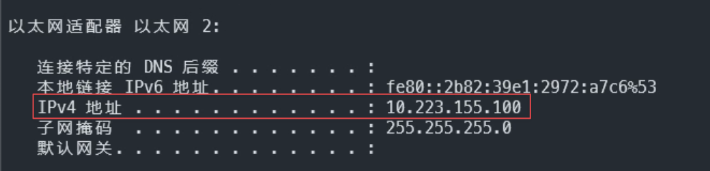
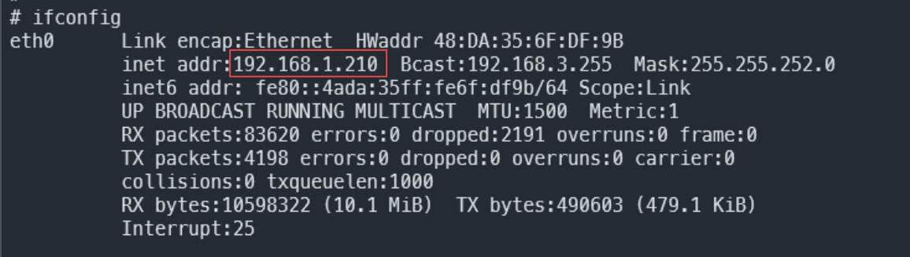
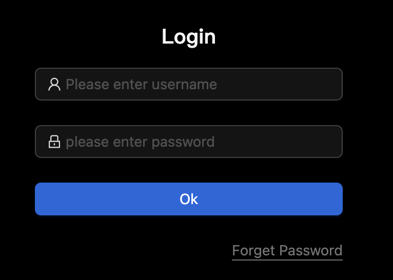

## 开机

1. 使用网线连接 NanoKVM 的有线网口；
2. 使用标准尺寸的 HDMI 线，连接远程主机和 NanoKVM 的 HDMI 接口；
3. 使用 USB C to A 的数据线，连接远程主机和 NanoKVM 的 PC USB 接口。

接好线之后， NanoKVM 就会自动开机。开机启动需要等待一到两分钟。

## 获取 IP

NanoKVM Full 版本在开机启动后，屏幕上会自动显示 IP，可以跳过此步骤。
NanoKVM Lite 版本可以通过以下方式获取 IP。

### 在路由器或交换机上查看

NanoKVM 启动后会通过 DHCP 获取 IP。可以在路由器或交换机上找到 NanoKVM 分配的 IP。

### 通过串口查看

使用串口工具连接 NanoKVM 后获取其 IP。

### 通过 usb rndis 网口获取

> 如果远程主机是 Windows 系统，请先参考 [usb rndis 网口](https://wiki.sipeed.com/hardware/zh/lichee/RV_Nano/5_peripheral.html#usb-rndis-网口) 安装驱动

1. 在远程主机中打开终端软件；
1. 执行 `ifconfig` （在 Windows 系统中是 `ipconfig`）命令；
1. 在显示的网络列表中找到 IPv4 地址为 10 开头的网址，示例如下：

    

1. 通过 SSH 登录 NanoKVM：`ssh root@10.223.155.1` （注意，不是 10.223.155.100），密码为 `root` ：

    

1. 进入 NanoKVM 后，执行 `ifconfig` ，从网络列表中找到 `eth0` 网卡的地址，该地址就是 NanoKVM 的 IP：

    

1. 获取到 IP 后，接下来就可以通过该 IP 访问 NanoKVM 了。

## 检查更新

1. 使用任意电脑，连接到与 NanoKVM 相同的网络；
1. 打开浏览器（推荐使用 Chrome），在地址栏中输入刚刚获取到的 IP 并访问；
1. 浏览器会进入一个登录页面，输入默认账号 `admin` 和默认密码 `admin` 进行登录;

    

1. 登录成功后，点击检查更新：

    

1. 如果有更新，则点击开始更新：

    

1. 等待应用更新完成后，浏览器会自动刷新并重新进入登录页面，再次登录即可。

## 更新完成

大功告成！
现在镜像和应用都已经更新到了最新版本。
只要在浏览器中输入 NanoKVM 的 IP 地址，就可开始操控远程主机了。
