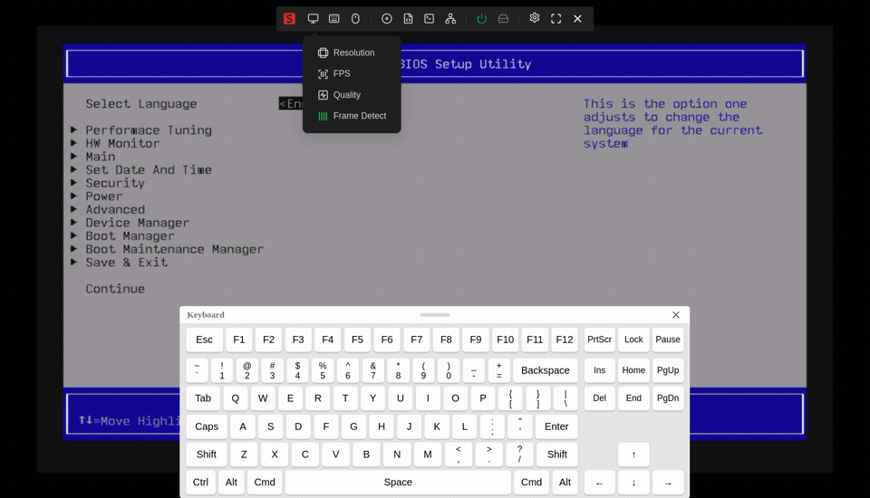
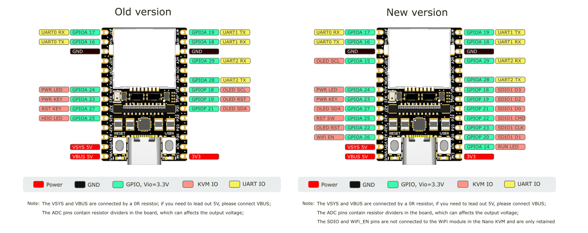
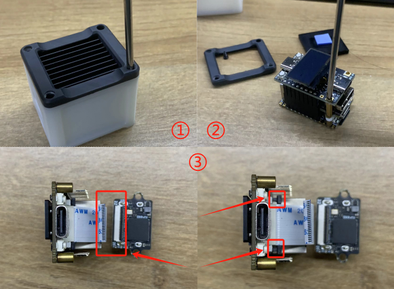

## OLED界面

+ 显示网线、USB、HDMI 连接状态，连接后图标将反色显示;
+ IP:连接网线后 NanoKVM 默认自动获取IP，并显示在 OLED 上，若无法Ping通网关，将在IP前显示`!`;
+ RES: 显示当前传输的分辨率，默认720P
+ TYPE: 显示传输的方式，暂时只支持MJPG，H264开发中
+ STREAM: 显示实时传输帧率，系统默认开启了帧差检测（画面静止时停止发送），画面静止时FPS显示为 0
+ QUALITY: 显示压缩质量，50-100%，默认为80%

## 管理页面功能

悬浮栏从左到右依次为：图像设置、屏幕键盘、鼠标样式、镜像挂载、自定义脚本、KVM网页终端、WOL、ATX控制/指示、设置、全屏、隐藏悬浮栏。

### 分辨率、帧率、图像质量设置

+ NanoKVM 支持 1080P、720P、600P、480P 的图像传输，在图像设置->分辨率中可以选择不同的分辨率。越大的分辨率所占用带宽越大、实时帧率越小。
  + 注：此处仅修改图像的传输大小，不会改变 HDMI 输入的图像尺寸，如需修改，请前往主机系统的设置菜单进行设置。

+ 帧率设置选项用于修改传输的最大帧率，可以限制网络带宽的占用，但帧率越低，画面越卡，请根据网络情况合理配置。Full版用户在OLED上可看到视频的实时帧率。

+ 图像质量选项可以修改画面的压缩比例，当您认为画面较卡，延迟较高时，可以适当调低图像质量。

+ 帧差检测
  + NanoKVM 默认打开帧差检测功能，即画面静止时停止传输图像，用于节省流量。
  + 此功能产生约占用2.5%的CPU占用，从静止到画面变化存在 0.2s 的延迟，点击`显示`->`帧差检测`即可关闭或开启此功能。

### 虚拟键鼠使用

+ NanoKVM 的 USB 接口模拟出了键鼠设备。打开浏览器页面后，系统将自动捕获键鼠输入，并将操作实时同步到 NanoKVM 连接的主机。用户可以选择隐藏鼠标或改变在画面上显示的样式。
+ 对于不方便使用键盘的用户，我们提供了屏幕键盘，点击悬浮栏的键盘图标即可唤出屏幕键盘。

### ISO镜像挂载以及远程装机

+ Nano KVM的 USB-C 端口除模拟键鼠设备外，还模拟了一个U盘设备，挂载了TF卡内的一部分存储空间，用于装机等需求，该U盘默认格式化为exFAT格式，Full版NanoKVM内置TF卡，模拟出的U盘大小约21G。

+ 与普通U盘不同，NanoKVM的虚拟U盘内可同时存放多个镜像，开机之前可以通过 web 页面的选项选择要安装的系统镜像进行挂载。

用户需提前下载待安装的镜像（通常以.iso结尾），将 NanoKVM USB-C 插入电脑，将下载好的镜像直接复制到U盘内（可复制多个系统），即可拔出。

按上述步骤连接远程主机与Nano KVM，在浏览器登录系统后，点击光盘图标，选中待安装的系统，即可实现ISO挂载

接下来开始装机操作，点击`开机（短按）`，迅速按键盘上的F11键（不同主机按键可能不同，请参照主机说明），选择对应的镜像启动并完成装机流程。

注：

+ 虚拟U盘功能默认打开，如果不需要可通过点击`设置`->`虚拟U盘`关闭。
+ 请先在主机上安全弹出原有的21G虚拟U盘后再挂载镜像,以免数据丢失
+ 虚拟U盘也可以当作普通U盘使用，web界面未选中任何镜像时，默认挂载整个21G的虚拟U盘。
+ 用户也可使用常规的烧卡方式烧录镜像，不推荐
+ 镜像拷入 NanoKVM 的速度受到 USB2.0 传输速度和 SG2002 写卡速度的限制，可能会比较慢，用户可将TF卡取出，插入电脑，[解除隐藏](https://jingyan.baidu.com/article/e4511cf34faece2b845eaf34.html)TF卡的第三个分区，直接将镜像拷入其中。
+ 虚拟U盘同时挂载到NanoKVM的 `/data` 目录，用户可在 NanoKVM 终端内直接读写该分区
+ 设置中的取消虚拟U盘操作将强制弹出U盘,请先安全弹出U盘后再设置,以免数据丢失

### 网页终端

+ 用户点击悬浮栏的`终端`->`NanoKVM 终端`图标，即可打开网页终端，无需ssh直接访问 NanoKVM 系统
+ 当 NanoKVM 断网重连或系统重启后，网页终端界面会提示重新登录，账号`root`，密码`root`

### 串口终端

NanoKVM 基于 LicheeRV Nano 构建，RVNano 核心板共有3个串口，UART0默认用于输出系统log，在 NanoKVM Full 版中，引出了 UART1/2，用户可自行拓展功能（第一批内测版仅在外壳处开孔）

点击管理页面的`终端`，选择`串口终端`，选择使用的串口，填写波特率，点击开始后即可使用

注：串口终端功能使用 WebSSH + picocom 搭建，用法同 picocom

### RNDIS

NanoKVM 的 USB 会默认虚拟出 RNDIS USB网卡（从设备），当 NanoKVM 服务异常时可用于系统维护，请参照[这里](https://wiki.sipeed.com/hardware/zh/kvm/NanoKVM/system/updating.html#%E9%80%9A%E8%BF%87-usb-rndis-%E7%BD%91%E5%8F%A3%E8%8E%B7%E5%8F%96)连接电脑，更多用法请自行探索。

若不使用 RNDIS 功能，可点击`设置`->`RNDIS`关闭。

### ATX电源控制

+ 在悬浮栏右侧，有电源和硬盘图标，正常情况下是灰色状态，开机后电源图标变绿。
+ 点击电源图标可看到重启键、电源键（长/短按）
+ Full版的ATX控制板受延长线芯数限制，只引出电源、重启按键和电源灯。Lite用户可根据原理图自行扩展。

注：
+ 正式版 NanoKVM-A 硬件保留 WiFi 模块引脚，修改了OLED和部分的ATX引脚，固件会自动检测硬件版本并自适应。
+ Lite 版 NanoKVM 不包含 NanoKVM-A/B ，固件会直接识别为正式版

### 设置

+ 切换中英文
+ 关于NanoKVM：点击打开Wiki
+ 检查更新：当有可用更新时，用户可点击更新，约15s左右，网页自动刷新重新登录即可更新完成。

### 更多功能敬请期待

## 网络延迟测算

主机连接KVM和一个普通屏幕，播放秒表计时视频，拍照捕捉远程桌面和显示屏，计算差值即可估算网络延迟。

## 硬件与结构

### 拆解

Full 版 NanoKVM 在重新烧卡时需要对外壳拆解，请按下图提示拆开外壳

1. 拆下底部4颗螺丝
2. 借助HDMI和网口将 NanoKVM 推出外壳
3. 取下散热器即可拔出TF卡

### 内测版和正式版的硬件差别

正式版硬件预留 WiFi 模块相关引脚，修改了 OLED 和 ATX 的引脚分配，如下所示

为兼容前后两种硬件，软件上做了自适应设计，内测用户和正式版用户可以放心更新。

### 重启问题

早期内测版 Full NanoKVM 在 reboot 系统时会短暂拉高 RST_SW 引脚，导致连接的主机复位，正式版硬件已修复这个问题。

如果您使用早期内测版 Full NanoKVM 并受次问题的困扰，可以拆机后按上图内测版引脚定义，在 RST_KEY 和 PWR_KEY 上添加1K下拉电阻

## 异常恢复

+ OLED上正常显示信息，但无法打开网页
  1. 参考[这里](https://wiki.sipeed.com/hardware/zh/kvm/NanoKVM/system/updating.html#%E8%8E%B7%E5%8F%96-IP)连接开发板
  2. 输入指令`rm /etc/kvm/server.yaml`
  3. 执行 `reboot` 重启系统
+ 登录浏览器界面后，无画面
  1. 进入网页终端，执行 `/etc/init.d/S95nanokvm restart` 重启服务。
  2. 如果上述方式无法恢复正常，点击界面上的检查更新，更新应用
+ 早期内测版 Full NanoKVM 使用普通排线连接 HDMI 采集板，可能因接触不良导致检测不到 HDMI 信号，可按下图所示拆解，并重新连接排线
  
+ 更新过程中如果出现断网等异常情况，可能导致更新失败，若旧应用也无法启动时，请参照以下解决方法：
  1. 参考[这里](https://wiki.sipeed.com/hardware/zh/kvm/NanoKVM/system/updating.html#%E8%8E%B7%E5%8F%96-IP)连接开发板
  2. 执行 `rm -r /kvmapp && cp -r /root/old/ / && mv /old/kvmapp`
  3. 执行 `reboot` 重启系统
+ 尝试断电重启解决未知问题
+ 若上述方法不能解决异常，请在论坛或QQ群提出您的问题，我们会耐心解答
  * MaixHub 论坛：https://maixhub.com/discussion/nanokvm
  * GitHub ：https://github.com/sipeed/NanoKVM
  * QQ group: 703230713
