# 自定义 APP

## 自定义 APP 简介

自定义 APP 是运行在 NanoKVM Go 触摸屏上的全屏 Python 应用。它通过设备提供的 `appbase` SDK 在 RGB565 framebuffer 上绘制界面、读取触摸事件，可以把 NanoKVM Go 的屏幕扩展成状态面板、计时器、行情看板或其他交互工具。

NanoKVM Go 提供了完整的 APP 管理和运行流程：

```text
App Server 或本地 ZIP → 网页安装和管理 → 设备 Apps 页面启动
```

普通用户可以直接安装和使用现成 APP；开发者也可以编写自己的 Python APP，打包为 ZIP 后上传到设备。本文先介绍如何安装和使用 APP，再以 `Hello World` 为例说明开发和部署流程。

## 使用前准备

开始操作前，请确认：

- NanoKVM Go 的系统和应用已更新至最新版本；
- 可以在局域网内正常访问 NanoKVM Go 网页；
- 设备触摸屏可以正常操作，并且主界面中有 `Apps` 页面；
- 从 App Server 安装 APP 时，NanoKVM Go 可以访问对应的应用仓库；
- 开发自定义 APP 时，电脑上已准备文本编辑器、Python 基础环境和 ZIP 打包工具。

> 如果网页设置中没有 `Apps` 选项，或设备端没有 `Apps` 页面，请先检查并更新 NanoKVM Go 的系统和应用版本。

## 安装和使用 APP

### 运行内置 APP

在设备触摸屏上进入 `Apps` 页面，选择一个内置 APP 即可启动。可以先通过这些示例了解 APP 的全屏显示、动画和触摸交互效果：

<video src="./../../../assets/NanoKVM/go/custom_app/apps-demo.mp4" aria-label="NanoKVM Go 内置 APP 运行演示" style="width: 100%; max-width: 568px;" playsinline controls autoplay loop muted preload="metadata"></video>

| APP 目录 | 页面名称 | 主要功能 |
| --- | --- | --- |
| `conways-game-of-life` | Conway | 运行限帧动画 |
| `crypto-candlestick` | Crypto | 显示行情数据并支持滑动翻页 |
| `nyan-cat` | Nyan Cat | 显示像素精灵动画 |
| `pomodoro-timer` | Pomodoro | 提供按钮、点击和倒计时功能 |

Crypto 使用公开行情接口；网络不可用时会回退到模拟数据，仅用于展示网络 APP 的实现方式。

### 从 App Store 安装 APP

App Server 是供 NanoKVM Go 浏览和下载 APP 的应用仓库。网页 `设置 > 应用` 中包含两个区域：

- `已安装`（`Installed`）：管理已安装的 APP，可以编辑配置、下载或移除 APP；
- `应用商店`（`Store`）：浏览官方仓库或用户添加的仓库，并直接安装 APP。

无论使用官方仓库还是其他 App Server，都需要先打开 NanoKVM Go 网页，点击顶部工具栏中的设置图标进入 `设置`。

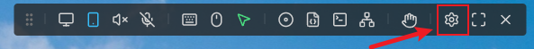

#### 选择 App Server

Sipeed 官方仓库 [NanoKVM-Go-Apps](https://github.com/sipeed/NanoKVM-Go-Apps) 已预置在设备中，使用官方仓库时不需要额外配置 App Server。

如果需要使用其他 APP 仓库，请先进入 `设置 > 应用`，点击 `应用商店 > 应用源`。

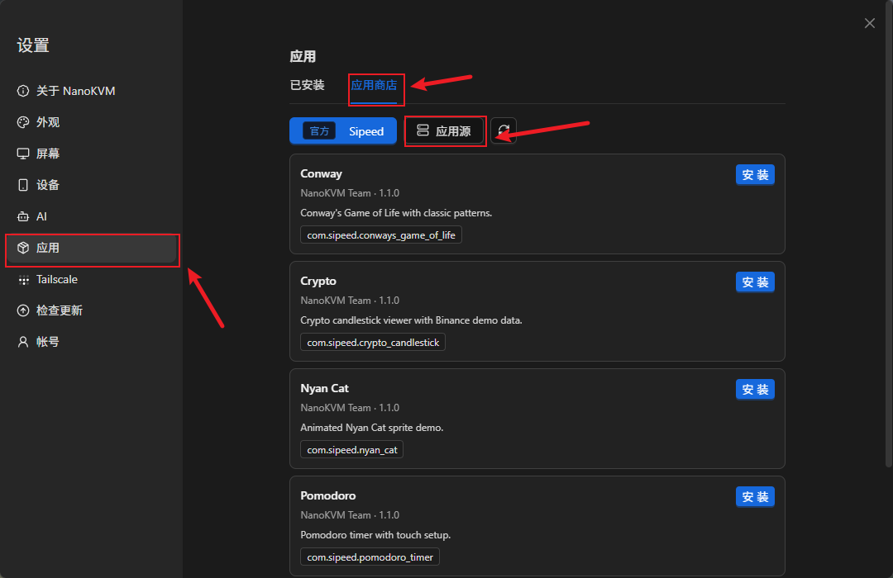

点击添加服务器，填写服务器名称和 URL 后保存。添加完成后，可以在应用商店中切换至该仓库。

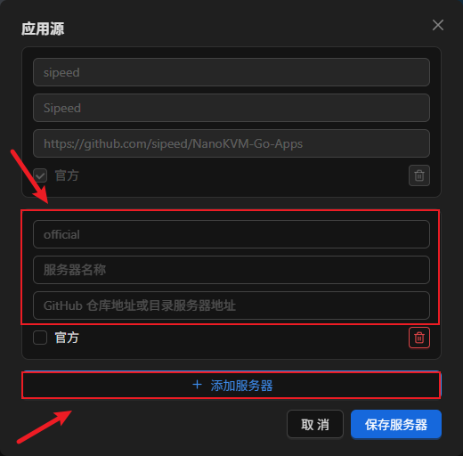

> 只添加可信的应用仓库。APP 的安装脚本会以 root 权限运行；如果页面提示 APP 包含安装脚本，请先检查其源码、配置项和实际功能。

#### 安装 APP

选择好 App Server 后，按照以下步骤安装 APP：

1. 在设置页面中进入 `应用 > 应用商店`。

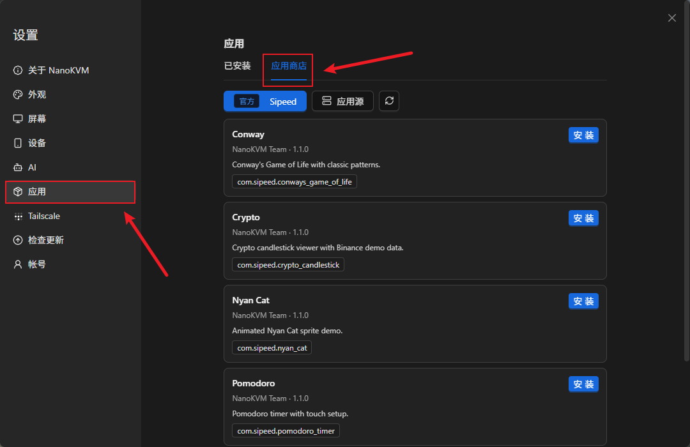

2. 选择 App Server 和需要安装的 APP，然后点击 `安装`。

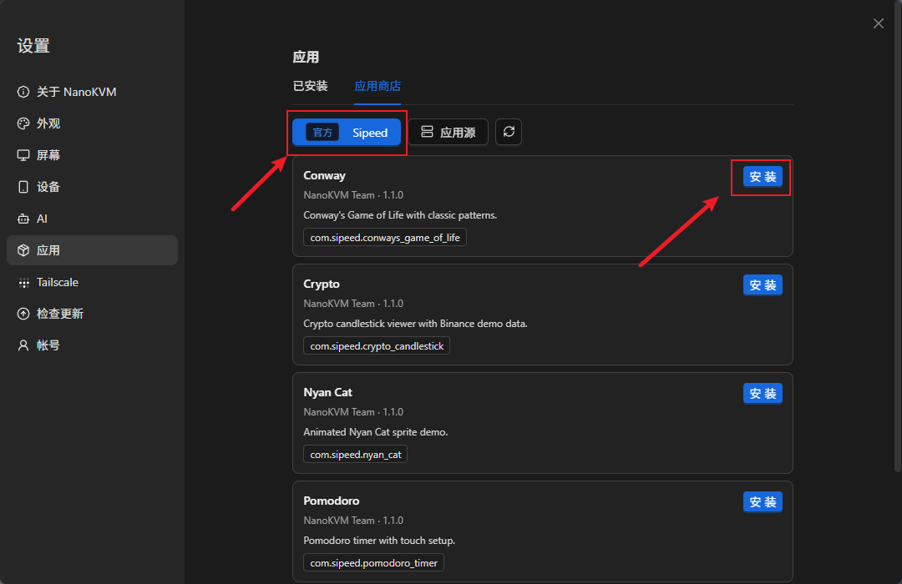

3. 如果 APP 需要配置环境变量，按照页面提示填写，然后确认安装。

4. 在 `安装日志`（`Installation log`）窗口中等待安装完成。显示安装成功后再关闭窗口。

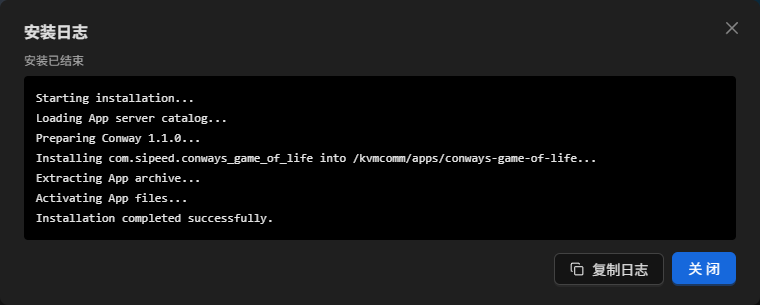

安装日志会显示仓库读取、校验、解压、安装脚本和最终结果。如果安装失败，请先复制或截图保存日志末尾的错误信息。

5. 回到设备触摸屏的 `Setting` 页面，点击应用图标进入 `Apps` 页面。

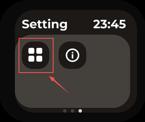

6. 然后选择刚安装的 APP 启动。

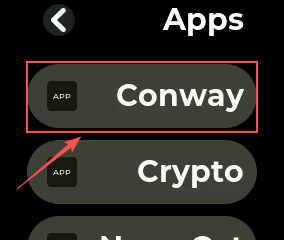


<a id="upload-zip-install-app"></a>

### 上传 ZIP 安装 APP

从其他渠道取得 APP，或需要安装自己开发的 APP 时，可以上传 ZIP 文件。ZIP 内必须只有一个顶层 APP 目录，例如：

```text
example-app.zip
└── example-app/
    ├── app.json
    ├── main.py
    └── assets/       # 可选资源
```

安装步骤如下：

1. 打开 NanoKVM Go 网页，进入 `设置 > 应用 > 已安装`；

2. 点击 `上传 ZIP`，选择 APP 的 ZIP 文件；

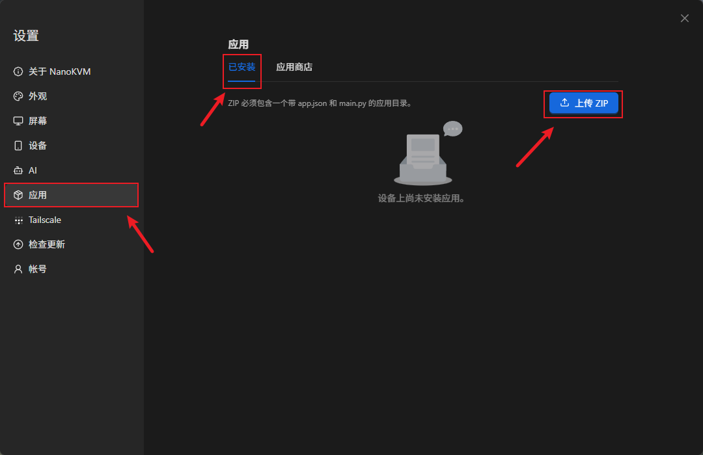

3. 网页完成 ZIP 和 `app.json` 校验后，按提示填写 APP 配置；

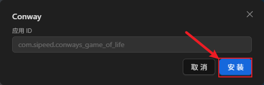

4. 点击 `安装`，在 `安装日志` 窗口中等待安装成功；

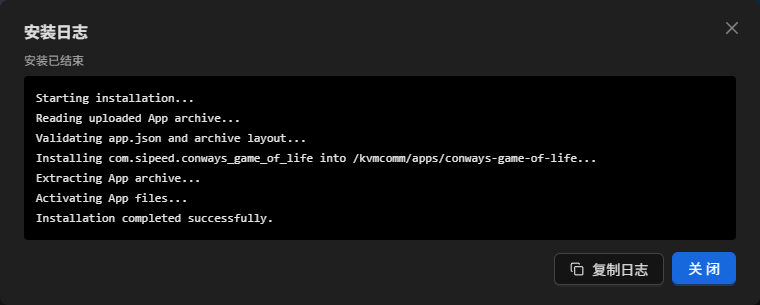

5. 回到设备触摸屏的 `Apps` 页面，选择对应 APP 启动。

<a id="exit-app"></a>

### 退出 APP

APP 全屏运行时，可以使用设备保留的左边缘手势返回 `Apps` 页面：

1. 在屏幕左边缘按住手指，向右滑到屏幕中部；
2. 保持手指不动，等待左边缘的上下两段进度条逐渐靠近并填满；
3. 进度条填满后松开手指，退出 APP。


如果想取消退出，请在松手前将手指向左移回去，等进度条重新分开后再松手，APP 会继续运行：


### 管理已安装的 APP

在网页 `设置 > 应用 > 已安装` 中，可以编辑 APP 的环境变量、下载 ZIP 或移除 APP。安装、删除、重命名 APP，或修改 `app.json` 后，设备端列表通常会在约 10 秒内自动刷新，不需要重启 `kvmcomm`。

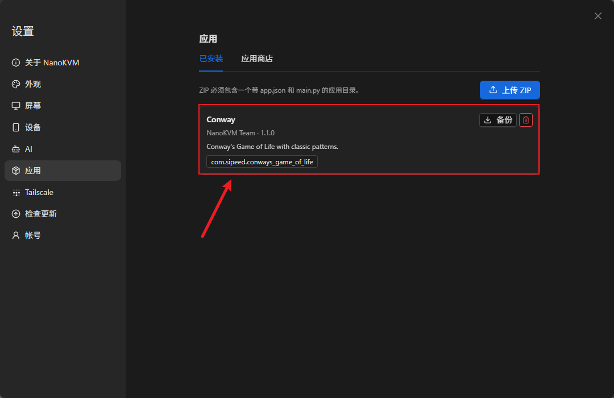

## 开发自定义 APP

### 获取 SDK 和示例

公开内容位于 [NanoKVM-Go-Apps](https://github.com/sipeed/NanoKVM-Go-Apps)，仓库按用途分为两个独立分支：

- [`main`](https://github.com/sipeed/NanoKVM-Go-Apps/tree/main)：App Store 使用的应用目录、各 APP 源码和 `_utils`；
- [`base`](https://github.com/sipeed/NanoKVM-Go-Apps/tree/base)：共享 `appbase.py`、`appbase.pyi`、中英文开发文档和 `_utils`。

开发 APP 时从 `base` 获取 SDK 和接口文档；浏览、安装或参考现有 APP 时使用 `main`。两个分支都保留 `_utils`，录屏等通用工具可从任一分支获取。

<details>
<summary>录制 NanoKVM Go 的设备屏幕画面</summary>

如果需要把 APP 的实际操作过程录成视频，可以使用开源仓库 `_utils/record-nanokvm-fb0.sh`。它从设备的 `fb0` 读取屏幕画面，在本机编码为视频，适合录制 APP 演示或问题复现过程。

脚本只通过 `ssh` 从 NanoKVM Go 读取 framebuffer，不使用 `scp`。本机需要准备 Bash、`ssh` 和 `ffmpeg`；使用前还要确认本机可以免密登录设备：

```sh
ssh root@<设备IP> 'echo ok'
```

如果还没有本机 SSH 密钥，先在**本机终端**生成一个：

```sh
ssh-keygen -t ed25519
```

然后把公钥复制到 NanoKVM Go，并再次验证登录：

```sh
ssh-copy-id root@<设备IP>
ssh root@<设备IP> 'echo ok'
```

最后一条命令输出 `ok`，并且不再要求输入密码时，说明免密登录已经可用。

1. 在**本机终端**获取脚本并进入 `_utils` 目录：

   ```sh
   git clone https://github.com/sipeed/NanoKVM-Go-Apps.git
   cd NanoKVM-Go-Apps/_utils
   ```

2. 确认本机可以找到脚本所需的命令：

   ```sh
   command -v ssh
   command -v ffmpeg
   ```

   如果任一命令没有输出路径，请先在本机安装对应工具。
3. 通过 `NANOKVM_HOST` 指定 NanoKVM Go 的实际地址，然后执行脚本：

   ```sh
   chmod +x record-nanokvm-fb0.sh
   NANOKVM_HOST=root@<设备IP> ./record-nanokvm-fb0.sh xxx.mp4
   ```

   脚本开始后，在设备触摸屏上操作 APP。录制结束时在本机终端按 `Ctrl-C`，脚本会结束采集并保存视频文件；终端会显示保存位置。

   `NANOKVM_HOST` 只对本次命令生效，不需要修改脚本源码。Windows 10/11 用户请通过 Git Bash 或 WSL 执行 Bash 脚本，并在同一环境中安装 `ssh` 和 `ffmpeg`。

</details>

### 创建第一个 Hello World

#### APP 目录结构

每个 APP 使用独立目录。目录名建议使用小写英文和连字符，例如 `hello-world`：

```text
hello-world/
├── app.json
├── main.py
├── assets/          # 可选资源，例如 icon.png
├── pre-install.sh   # 可选；仅在 app.json 声明 pre_script 时需要
└── post-install.sh  # 可选；仅在 app.json 声明 post_script 时需要
```

启动器扫描 `launcher.apps_dir` 的直接子目录（默认 `/kvmcomm/apps`）。一个目录要出现在 Apps 页面，必须同时满足：

1. 目录名不以 `_` 开头；
2. 有普通文件 `main.py`；
3. 有合法的 `app.json`；
4. `app.json.app_id` 是合法的倒置域名包名，并与目录名对应；
5. `app.json.name` 是非空字符串。

Apps 列表会自动刷新，新增、删除、重命名 APP 或修改 `app.json` 通常等待约 10 秒即可，不需要重启 `kvmcomm`。

#### 编写清单和入口文件

在 `hello-world/app.json` 中写入最小 APP 清单：

```json
{
  "app_id": "com.example.hello_world",
  "name": "Hello World",
  "creator": "Your Name",
  "create_time": "2026-07-30",
  "version": "1.0.0",
  "desc": "A minimal NanoKVM App.",
  "category": "demo"
}
```

`app_id`、`name`、`creator`、`create_time` 和 `version` 是必填字段；`desc`、`category` 和 `icon` 可选。`app_id` 至少包含三段，最后一段必须等于目录名将 `-` 替换为 `_` 后的结果，例如 `hello-world` 对应 `com.example.hello_world`。为了先跑通最小示例，这里暂不配置图标；以后添加图标时，`icon` 应填写相对于 APP 目录的资源路径。

如果 APP 需要配置环境变量，把它们写在 `app.json.env` 对象中。网页会根据它自动生成配置表单，APP 通过 `ctx.env` 读取。不要再单独创建 `.env` 文件。

如果 APP 在首次安装时需要安装依赖或生成配置，可以在同一个 `app.json` 中声明可选的安装生命周期脚本。下面继续以 `hello-world` 为例，展示包含环境变量和生命周期脚本的完整清单：

```json
{
  "app_id": "com.example.hello_world",
  "name": "Hello World",
  "creator": "Your Name",
  "create_time": "2026-07-30",
  "version": "1.0.0",
  "desc": "A configurable NanoKVM App.",
  "category": "demo",
  "env": {
    "GREETING": {
      "label": "问候语",
      "default": "Hello",
      "required": true,
      "secret": false,
      "description": "显示在屏幕上的文字"
    }
  },
  "pre_script": "pre-install.sh",
  "post_script": "post-install.sh"
}
```

> 注意：`env`、`pre_script` 和 `post_script` 不是单独的 JSON 文件，也不能写在 `app.json` 最外层大括号后面。它们必须和 `app_id`、`name` 等字段一起放在同一个 `{ ... }` 中，并用逗号分隔。如果你的 APP 不需要这些功能，就不要把这些字段写进清单。

清单声明 `pre_script` 或 `post_script` 后，APP 目录中必须存在对应脚本，打包 ZIP 时也必须包含这些文件；否则安装会失败。如果不需要安装脚本，请从清单中删除对应字段。

- `pre_script` 在 APP 正式部署前运行，失败时不会安装 APP；
- `post_script` 在 APP 文件部署后运行，失败时会回滚本次安装；
- 路径必须是 APP 目录内的安全相对路径，脚本工作目录也是 APP 目录；
- 脚本可以读取 `app.json.env` 中的配置，以及 `NANOKVM_APP_DIR`、`NANOKVM_APP_ID` 和 `NANOKVM_APP_PHASE`；
- 脚本通过 `/bin/bash` 以 root 权限执行，因此只能安装来源可信的 APP。

依赖安装、目录初始化等一次性工作应放在生命周期脚本中，不要再要求普通用户登录 SSH 后手动执行 `apt install` 或 `pip install`。脚本应支持重复执行，并使用非交互模式，避免安装页面一直等待输入。

在 `hello-world/main.py` 中写入最小程序：

```python
#!/usr/bin/env python3

from appbase import AppContext, WHITE, app


@app()
def main(ctx: AppContext) -> None:
    greeting = ctx.env.get("GREETING", "Hello")

    def tick(dt: float) -> None:
        ctx.fb.clear(0)
        ctx.fb.text_center(
            ctx.width // 2,
            ctx.height // 2,
            greeting,
            WHITE,
            2,
        )

    ctx.run(tick, fps=10)


if __name__ == "__main__":
    main()
```

`@app()` 会读取同目录的 `app.json`，打开 framebuffer 和触摸设备，创建 `AppContext`，并在 APP 退出时清理资源。保留 `if __name__ == "__main__"`，这样其他工具导入模块时不会意外打开硬件设备。

#### 打包、上传和启动

先从 [NanoKVM-Go-Apps](https://github.com/sipeed/NanoKVM-Go-Apps) 获取示例，或在本机创建 `hello-world` 目录。网页上传要求 ZIP 内只有一个顶层 APP 目录：

```text
hello-world.zip
└── hello-world/
    ├── app.json
    ├── main.py
    ├── assets/          # 可选
    ├── pre-install.sh   # 仅在 app.json 声明时需要
    └── post-install.sh  # 仅在 app.json 声明时需要
```

在**本机终端**打包：

```bash
zip -r hello-world.zip hello-world
```

然后按照[上传 ZIP 安装 APP](#upload-zip-install-app)中的流程安装 `hello-world.zip`。安装时请注意：

- 如果声明了 `app.json.env`，网页会在安装前显示环境变量表单；
- `Installation log` 会实时显示上传、校验、解压和生命周期脚本的输出，请等日志显示安装成功后再关闭窗口；
- 安装失败时，请保存完整日志，并根据末尾的错误信息修正 APP 或配置；
- 安装成功后，回到设备触摸屏的 `Apps` 页面并选择 `Hello World`。

> 📷 **待补截图：** NanoKVM Go 触摸屏上运行 `Hello World` 的最终效果，用于确认示例已成功安装并启动。

安装日志只记录本次操作，遇到问题时建议复制或截图保存末尾几行。

<details>
<summary>进阶：通过 SSH/SCP 命令行部署</summary>

如需调试或自动化，也可以在本机终端通过 SSH/SCP 直接复制目录；设备端目标仍是 `launcher.apps_dir`（默认 `/kvmcomm/apps`）：

```bash
scp -r hello-world root@<设备IP>:/kvmcomm/apps/
ssh root@<设备IP> 'python3 -m py_compile /kvmcomm/apps/hello-world/main.py'
```

直接复制后同样等待 Apps 列表自动刷新。不要覆盖设备已有的共享 `appbase.py` 和 `appbase.pyi`，除非你确认 SDK 与 APP 版本匹配。

</details>

## 认识常用 API

### AppContext、生命周期和主循环

在前面的 Hello World 示例中，`main()` 函数接收了一个名为 `ctx` 的参数：

```python
@app()
def main(ctx: AppContext) -> None:
    ...
```

`ctx` 是英文 `context`（上下文）的常用缩写，它的类型是 `AppContext`。这里的“上下文”可以理解为 APP 运行期间所需资源的集合，其中包含 framebuffer 绘图对象、触摸输入、屏幕尺寸和网页配置的环境变量。

`ctx` 不需要开发者手动创建，也不是全局变量。`@app()` 装饰器会把原始的 `main(ctx)` 包装成一个无参数入口。程序加载和运行时的完整顺序如下：

```text
加载 main.py 并定义 main(ctx)
  → @app() 读取、校验 app.json 和环境变量配置，并生成无参数入口
  → 文件末尾调用装饰后的 main()
  → 打开 framebuffer 和触摸设备
  → 创建 AppContext 对象
  → 将该对象作为 ctx 传给原始 main(ctx)
  → APP 结束后关闭触摸设备和 framebuffer
```

参数名并非必须写成 `ctx`，改成 `context` 也可以；本文和官方示例统一使用更常见的 `ctx`。

`AppContext` 的常用成员如下：

| API | 作用 |
| --- | --- |
| `ctx.width`、`ctx.height` | 旋转后的完整逻辑 framebuffer 尺寸 |
| `ctx.fb` | 绘图对象 |
| `ctx.touch` | 底层触摸读取对象，通常通过下方辅助方法使用 |
| `ctx.env` | 从 `app.json` 的 `env` 字段和 Launcher 配置生成的只读环境变量映射 |
| `ctx.poll()` | 返回尚未处理的 `(kind, x, y)` 触摸事件列表 |
| `ctx.taps()` | 只返回点击坐标，忽略滑动事件 |
| `ctx.button(rect, label, bg, fg, scale)` | 绘制按钮并返回用于触摸命中检测的同一个 `Rect` |
| `ctx.flush()` | 把后备缓冲提交到屏幕 |
| `ctx.run(tick, fps, on_tap, on_swipe)` | 限帧、分发触摸并自动刷新 |

大多数 APP 可以直接调用 `ctx.run()` 运行主循环。它会在每一帧依次完成：

1. 读取触摸事件，并将点击和滑动分别交给 `on_tap`、`on_swipe`；
2. 调用一次 `tick(dt)` 更新状态并绘制当前画面；
3. 自动调用 `ctx.flush()`，把后备缓冲显示到屏幕；
4. 根据 `fps` 等待下一帧，避免循环占满 CPU。

`tick(dt)` 中的 `dt` 表示距上一帧经过的秒数，适合用来计算动画或倒计时。让 `tick()` 返回 `False` 可以结束主循环；`main(ctx)` 随后返回，`@app()` 会清理硬件资源。

因此，使用 `ctx.run()` 时不需要在 `tick()` 中再次调用 `flush()`，也不要独立打开或关闭同一个 framebuffer 和触摸设备。如果 APP 不需要持续刷新，也可以直接使用 `ctx.poll()` 和 `ctx.flush()` 自行组织流程。

### 绘图、颜色和按钮

`ctx.fb` 提供 `clear()`、`put_pixel()`、`fill_rect()`、`draw_line()`、`draw_text()`、`text_center()`、`draw_sprite()` 和 `flush()`。颜色可以使用 `rgb565(r, g, b)` 或 SDK 内置常量：

```text
BLACK WHITE RED GREEN BLUE YELLOW GRAY DKGRAY
ORANGE CYAN MAGENTA NAVY
```

按钮可以用同一个 `Rect` 绘制和命中检测：

```python
from appbase import AppContext, GREEN, RED, Rect, app


@app()
def main(ctx: AppContext) -> None:
    state = {"count": 0}
    add_button = Rect(70, 80, 100, 48)

    def on_tap(x: int, y: int) -> None:
        if add_button.contains(x, y):
            state["count"] += 1

    def tick(dt: float) -> None:
        ctx.fb.clear(0)
        ctx.button(add_button, "ADD", GREEN)
        ctx.fb.text_center(ctx.width // 2, 145, str(state["count"]), RED, 2)

    ctx.run(tick, fps=20, on_tap=on_tap)


if __name__ == "__main__":
    main()
```

### 资源和相对路径

启动器会把当前工作目录切换到 APP 目录，因此 `assets/icon.png` 这样的相对路径可以直接使用。需要兼容从其他目录导入或测试时，建议根据 `__file__` 计算路径：

```python
from pathlib import Path

APP_DIR = Path(__file__).resolve().parent
icon_path = APP_DIR / "assets" / "icon.png"
```

## 开发时注意这些

### 屏幕尺寸和不可见区域

物理 framebuffer 为 `284×240`，左侧 14 列不会显示。主机通常以 `rotate=90` 启动 APP，逻辑画布是 `240×284`，底部 14 行不可见；屏幕反转时使用 `rotate=270`，隐藏区域移动到顶部。

| `rotate` | 逻辑尺寸 | 不可见区域 | 可见逻辑区域 |
| ---: | --- | --- | --- |
| `0` | `284×240` | 左 14 列 | `x=14..283, y=0..239` |
| `90` | `240×284` | 底部 14 行 | `x=0..239, y=0..269` |
| `180` | `284×240` | 右 14 列 | `x=0..269, y=0..239` |
| `270` | `240×284` | 顶部 14 行 | `x=0..239, y=14..283` |

布局始终依据 `ctx.width`、`ctx.height` 和 `ctx.fb.rotate`，不要硬编码固定画布。需要计算可见区域时，可按上述表格处理。

### 触摸交互

`ctx.poll()` 返回的事件包括 `tap`、`up`、`down`、`left`、`right`，坐标已经转换到旋转后的逻辑坐标系。

主机保留了[左边缘退出手势](#exit-app)。APP 自己定义横向滑动操作时，建议不要把控件放在左边缘区域，以免用户退出 APP 时同时触发其他操作。触摸设备不可用时，主机会拒绝启动 APP。

### 运行环境和安全

运行前提包括可用的 `/dev/fb0`、触摸设备 `/dev/input/event0`、Python 3，以及设备配置中已启用的 launcher。非默认设备路径可通过环境变量配置：

| 变量 | 默认值 | 作用 |
| --- | --- | --- |
| `APPBASE_FB_DEVICE` | `/dev/fb0` | framebuffer 设备 |
| `APPBASE_FB_ROTATE` | `0` | 旋转角度；主机通常设置为 `90` 或 `270` |
| `APPBASE_TOUCH_DEVICE` | `/dev/input/event0` | 触摸设备 |

APP 可能以高权限运行，可以访问设备配置、凭据和网络。只部署可信代码，不要在源码中保存密钥，也不要随意安装来源不明的依赖。设备上的 `appbase.py` 和 `appbase.pyi` 必须保持版本匹配。

### 模拟器和 AI 开发

x86 SDL 模拟器只读取目录并展示 Apps 列表，不会真正执行 Python、映射 framebuffer、读取触摸或模拟退出手势。画面、颜色、方向和帧率必须在 NanoKVM Go 实机验证。

让 AI 编写 APP 前，先把设备上的 README、现有 APP 源码和需求一起提供给它：

<details>
<summary>进阶：从设备读取运行说明</summary>

```bash
ssh root@<设备IP> 'cat /kvmcomm/apps/README.md'
```

</details>

明确要求 AI 遵循目录式架构：生成 `app.json` 和 `main.py`，不要把 APP 写成散落在目录中的单个 Python 文件，也不要覆盖共享 SDK。

## 完成发布

一个 APP 通过下面的检查，就可以交给其他人使用：

- `app.json` 字段完整，目录名和资源路径正确；
- `main.py` 能通过 `py_compile`；
- Apps 页面可以显示并启动；
- 画面没有落入 14 像素不可见区；
- 点击、滑动和左边缘退出手势正常；
- APP 退出后主界面和触摸控制恢复；
- 没有把密钥、真实 IP 或设备隐私数据写进代码和资源。
