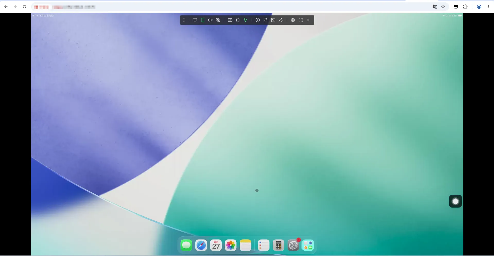
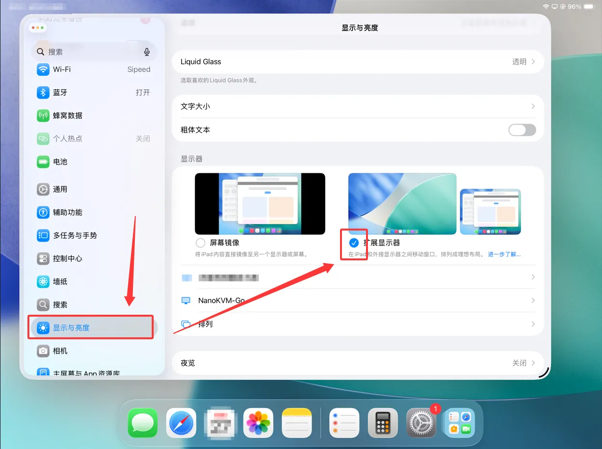
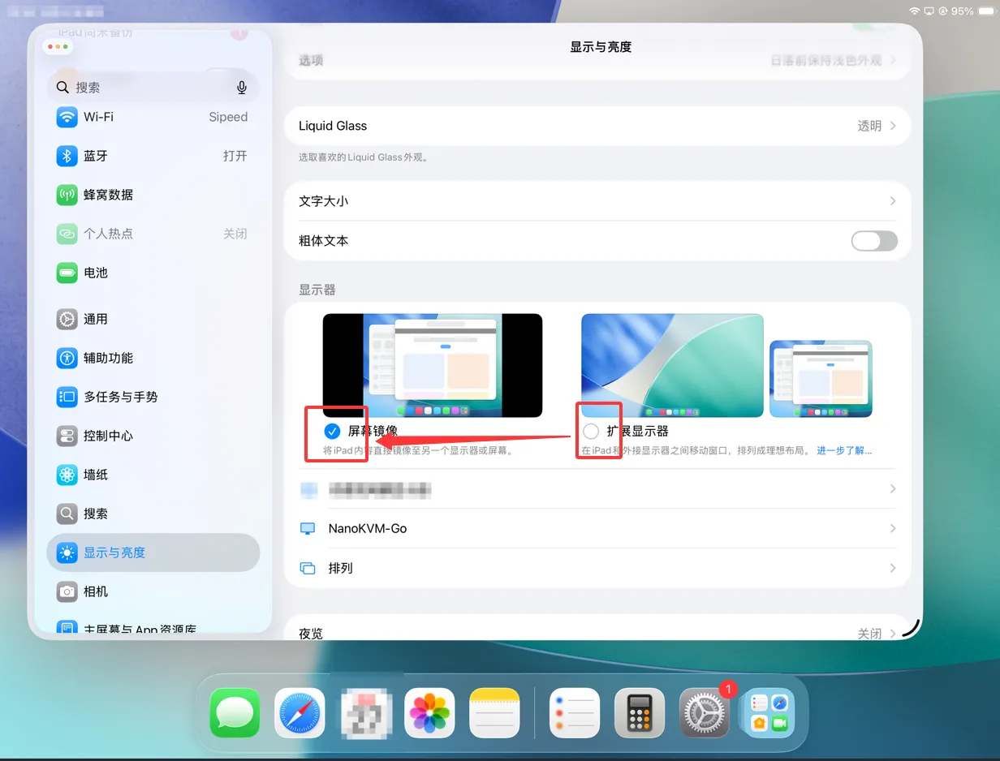
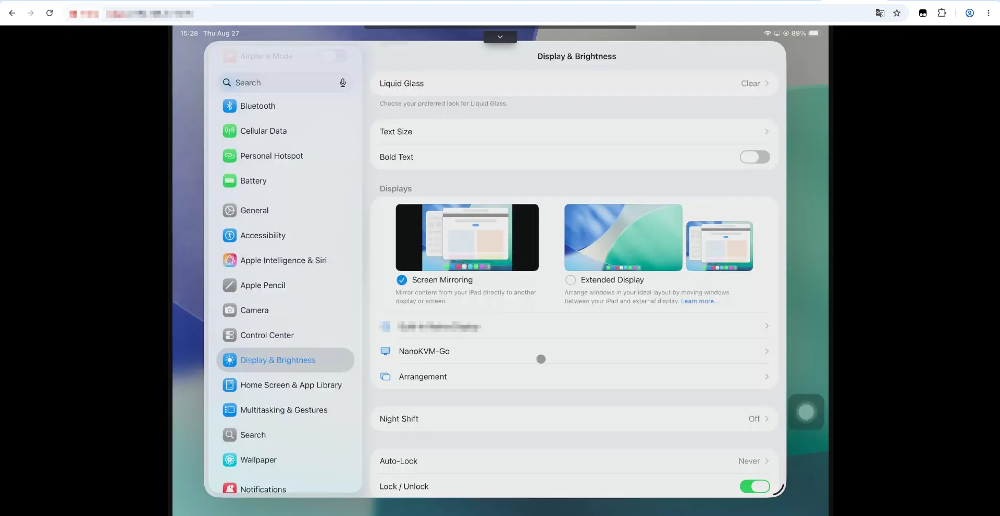
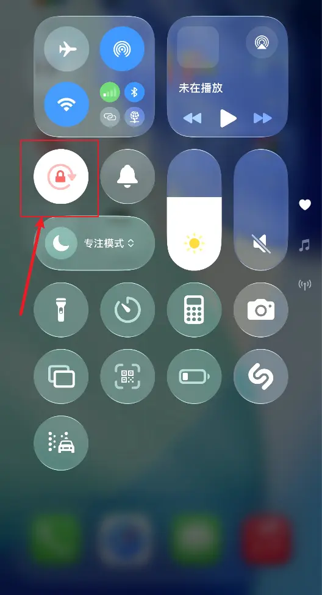

## 视频问题

### 连接到设备后显示“无视频信号”

如果 NanoKVM Go 连接到被控设备后显示“无视频信号”，请确认被控设备的 USB-C 接口**支持 USB-C DisplayPort Alt 模式（DP Alt Mode）**，并且使用的线缆是**全功能 USB-C 线**。

被控设备的 USB-C 接口必须支持 DP Alt 模式（即能通过 USB-C 口输出 DP 信号），且线缆为全功能 USB-C 数据线，NanoKVM Go 才能获取到视频信号。如果接口不支持视频输出，或使用的只是普通充电线，则无法显示画面。

### 设置 EDID 后，NanoKVM Go 屏幕上显示的分辨率与设置的对不上

如果设置完 EDID 后，**NanoKVM Go 屏幕上显示的画面分辨率**与设置的 EDID 不一致，通常是因为被控设备选择的是**缩放后的显示效果**，而不是 EDID 中声明的真实输出模式。

操作系统中看到的分辨率**不一定都代表真实的视频输出分辨率**。有些选项只是系统缩放后的显示效果，即使看起来是目标分辨率，**NanoKVM Go 屏幕上显示的画面**仍是缩放后的效果。

请按以下步骤设置**真实输出分辨率**：

1. 确认目标分辨率和刷新率组合**存在于当前 EDID 的声明列表**中。即使操作系统提供了某个分辨率，如果它不是该 EDID 声明的真实输出模式，也可能无法得到想要的效果。
2. **Windows**：使用 `设置` → `系统` → `屏幕` → `高级显示器设置` → 选择 `NanoKVM-Go` → `显示器适配器属性` → `列出所有模式`，在有效模式列表中选择**表格中列出的目标分辨率和刷新率**。
3. **macOS**：打开 `系统设置` → `显示器`，开启 `显示所有分辨率`。优先选择带有**“低分辨率”标记**且分辨率和刷新率组合存在于 EDID 列表中的选项，并确认刷新率匹配。

> 更多说明和分辨率对照表，请参考[分辨率与 EDID 设置](https://wiki.sipeed.com/hardware/zh/kvm/NanoKVM_Go/resolution.html)。修改 EDID 后，被控设备可能会短暂黑屏、重新识别显示器或重新排列窗口，这属于正常现象。

### 鼠标能动但点击程序没有反应（多显示器场景）

如果被控设备**同时连接了物理显示器和 NanoKVM Go**，在 NanoKVM 网页端控制被控设备时出现**鼠标光标能移动，但点击程序或执行操作后画面没有反应**，通常是**主屏幕设置**的问题。

被控设备有多个屏幕时，会有一个**主屏幕（Primary Display）**。如果主屏幕是那台物理显示器，而 **NanoKVM Go 只是扩展屏**，那么你点击的窗口、菜单和程序界面实际上会**出现在主屏幕（物理显示器）上**。NanoKVM Go 采集到的只是扩展屏的画面，所以这些操作产生的画面变化在 NanoKVM 网页里看不到，感觉像"点击没反应"，但鼠标光标本身是能移动的。

**解决办法：**

1. 在被控设备的系统显示设置中，把 **NanoKVM Go 设为主屏幕（Primary）**，或把两台屏幕设置为**镜像显示（Mirror）**。
2. 设置完成后，点击程序等操作产生的画面就会显示在 NanoKVM 采集的画面上。

> Windows：`设置` → `系统` → `屏幕` → 选择显示器 → 勾选"设为主显示器"。
> macOS：`系统设置` → `显示器` → 在显示器排列中设置主显示器，或使用"镜像显示器"。

### iOS 设备在视频应用播放流媒体时看不到本地视频画面

如果 iPhone/iPad 在通过视频应用（如 YouTube、Netflix 等）播放流媒体视频时，**本机屏幕上看不到视频画面（没有本地视频帧）**，这是因为 iOS 设备连接到屏幕镜像设备后，这些视频应用会**默认通过 AirPlay 将视频输出到外接设备**。

也就是说，视频画面被 AirPlay 输出到了 NanoKVM Go（屏幕镜像设备）这一侧，而 iOS 设备本机不再显示该视频的本地画面帧。这是 **iOS 系统层面的默认行为**，无法在系统中关闭或禁用。

### iPad Pro 连接后网页端仅显示扩展桌面

部分 iPad Pro 机型支持扩展显示功能，包括 12.9 英寸 iPad Pro（第 5 代及更新机型）以及 11 英寸 iPad Pro（第 3 代及更新机型）。连接 NanoKVM Go 后，iPad 可能默认使用“扩展显示器”模式，此时 NanoKVM Go 网页端采集的是扩展桌面，通常只显示桌面背景，不显示 iPad 主屏幕上的应用窗口。

如果想在 NanoKVM Go 网页端查看 iPad 的当前主屏幕内容，请按以下步骤操作：

在 iPad 上打开“设置 > 显示与亮度”

在“显示与亮度”选项中，将 NanoKVM Go 的显示模式从“扩展显示器”切换为“屏幕镜像”

切换完成后，NanoKVM Go 网页端将显示 iPad 当前的主屏幕内容

 

## 键鼠与输入问题

### 被控设备是手机，锁屏后无法显示密码输入键盘

如果被控设备是手机（苹果或安卓），当手机屏幕锁定时，NanoKVM Go 网页端可能**无法显示密码输入键盘**。此时不需要在手机上唤起键盘，可以直接用**控制端（NanoKVM 网页端）的键盘**直接输入密码。

如果手机锁屏后需要**上滑**才能到达输入密码的界面，可以先在控制端**按下空格键**（等效于上滑动作），进入密码输入界面后，再直接输入密码即可。

### 被控设备是 iPhone 时，鼠标一直处于按下（拖拽）状态

如果被控设备是 iPhone，使用鼠标控制时可能出现**鼠标一直处于按下状态**（类似一直拖拽）的效果。这是因为连接 iPhone 后未正确处理触摸手势。

请点击网页控制页面悬浮栏中的鼠标样式按钮，选择 **`修复 iPhone 拖拽`** 来修复该问题。连接 iPhone 后每次连接成功都需要点击该选项，否则可能出现鼠标一直按下的问题。

### iPhone/iPad 竖屏或横屏镜像时，鼠标指针偏离对齐

当 iPhone/iPad 以竖屏或横屏镜像显示时，即使在控制台调整了屏幕方向，**控制端的鼠标指针仍可能无法与画面精准对齐**。

这是因为 iPhone/iPad 的精确光标跟踪需要**设备陀螺仪的方向与当前显示屏幕的方向完全一致**。在远程控制过程中，系统可能无法正确检测到当前的陀螺仪状态，从而导致鼠标指针偏移。

**解决办法：**

请在 iPhone/iPad 上开启**竖排方向锁定/旋转锁定（Orientation Lock）**，确保光标追踪的准确性。

### iPad Pro 修复 iPhone 拖拽后无法控制鼠标

iPad Pro 修复 iPhone 拖拽后，有鼠标显示但是无法控制鼠标，这是由于辅助触控没有开启，具体开启方法可以通过[手机连接注意事项](https://wiki.sipeed.com/hardware/zh/kvm/NanoKVM_Go/quick_start.html#%E6%89%8B%E6%9C%BA%E8%BF%9E%E6%8E%A5%E6%B3%A8%E6%84%8F%E4%BA%8B%E9%A1%B9) 来开启

## 音频问题

### 连接 iOS 后无法调整音量

受 iOS 系统限制，一旦 iPhone/iPad 连接到被系统识别为**音频输出**的屏幕镜像设备（如 NanoKVM Go），**系统原生音量控制将不可用**。

这是 iOS 对外部音频输出设备的正常行为限制，而非 NanoKVM Go 故障。若需控制音量，请在被控设备（iPhone/iPad）或播放内容的 App 内部调整，或使用外接音频设备调节音量。

## 反馈方式

+ 若上述方法不能解决异常，请在论坛、GitHub 或 QQ 群说明您购买的型号和遇到的问题，我们会耐心解答

+ [Github issues](https://github.com/sipeed/NanoKVM-Go/issues)
+ [MaixHub 论坛](https://maixhub.com/discussion/nanokvm)
+ QQ 交流群: 703230713
