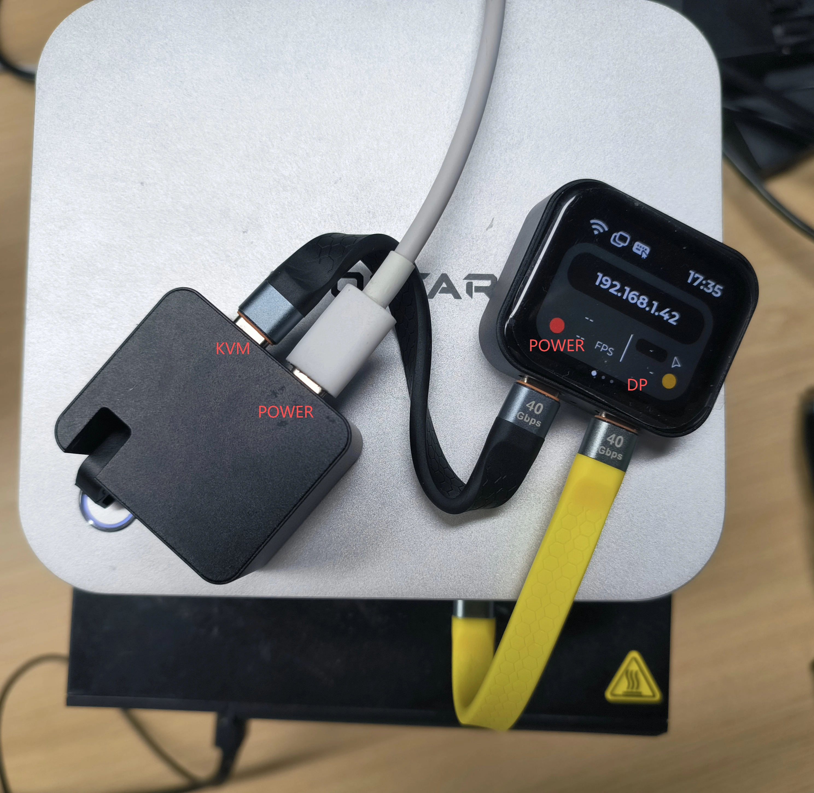
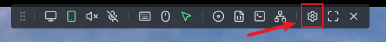
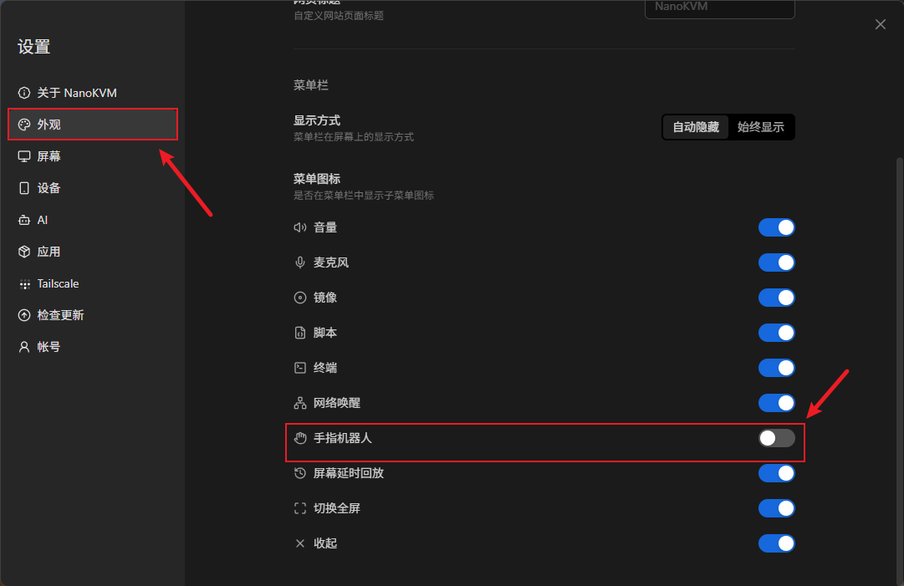
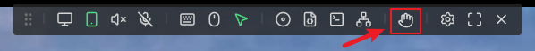
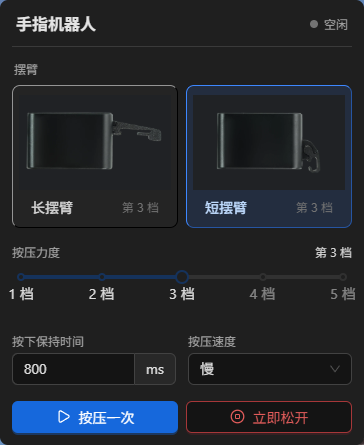

## 简介

手指机器人是 NanoKVM Go 的物理按键控制配件。将手指机器人粘贴在被控设备的物理电源键旁边后，NanoKVM Go 可以控制摆臂按下电源键，从而远程开机、关机或执行被控设备为电源键设置的其他操作。

该配件适用于被控设备已经关机、操作系统无响应，或无法通过软件方式控制电源的场景。

> 长时间按住电脑的电源键通常会触发强制关机，可能导致未保存的数据丢失。执行操作前，请确认按下保持时间和被控设备的电源键行为设置。

## 使用前准备

开始安装前，请准备：

+ NanoKVM Go；
+ 手指机器人及所需摆臂；
+ 全功能 Type-C 数据线；
+ 可以打开 NanoKVM Go 网页控制端的电脑、平板或手机。

请先确认 NanoKVM Go 已正常开机，并且网页控制端可以正常访问。

<!-- ## 认识接口

手指机器人提供以下两个接口：

+ `PWR`：连接电源线，为手指机器人供电；
+ `PWM`：连接 NanoKVM Go，接收摆臂控制信号。

TODO(image): 补充手指机器人 PWR、PWM 接口及丝印特写。建议保存为 ../../../assets/NanoKVM/go/finger_robot/nanokvm-go-finger-robot-ports.webp，并在此处插入图片。 -->

## 连接设备

按照下图连接好设备。



<!-- 连接顺序如下：

```text
电源线 → 手指机器人 PWR 接口
NanoKVM Go → 手指机器人 PWM 接口
```

具体步骤如下：

1. 将电源线连接到手指机器人的 `PWR` 接口。
2. 将手指机器人的 `PWM` 接口连接到 NanoKVM Go。
3. 检查两个接口是否插接牢固，然后为设备通电。

请按接口丝印连接线缆，不要将 `PWR` 和 `PWM` 接反。 -->

<!-- TODO(image): 补充电源线、手指机器人和 NanoKVM Go 的完整接线图，并标出 PWR、PWM 及 NanoKVM Go 连接位置。建议保存为 ../../../assets/NanoKVM/go/finger_robot/nanokvm-go-finger-robot-wiring.webp，并在此处插入图片。 -->

## 安装手指机器人

1. 根据手指机器人与电源键之间的距离和安装空间，选择长摆臂或短摆臂。
2. 将手指机器人放在被控设备的电源键旁边，调整位置，使摆臂按下时对准电源键中心。
3. 确认摆臂松开时不会持续接触或压住电源键。
4. 清洁并擦干粘贴位置，然后将手指机器人固定牢靠。
5. 固定后先使用较低的按压力度进行测试，再根据实际情况逐档调整。

<!-- TODO(image): 补充手指机器人粘贴在电脑物理电源键旁边的安装示例，并标出摆臂与按键的对准位置。建议保存为 ../../../assets/NanoKVM/go/finger_robot/nanokvm-go-finger-robot-installation.webp，并在此处插入图片。 -->

## 开启功能

1. 在浏览器中登录 NanoKVM Go 网页控制端。
2. 点击悬浮栏中的设置图标。



3. 依次进入 `设置 → 外观`。



4. 打开 `手指机器人` 开关。

开关打开后，网页控制端的悬浮栏中会显示手指机器人图标。点击该图标，即可打开手指机器人配置菜单。



## 配置与操作

手指机器人的配置选项如下图所示。



### 连接状态

菜单顶部显示手指机器人的连接状态。如果页面显示“手指机器人未连接”，请先检查接线是否正确。

连接成功后再测试按压操作。未连接时，菜单底部的操作按钮不可用。

### 选择摆臂

根据实际安装的摆臂选择 `长摆臂` 或 `短摆臂`。该选项会影响手指机器人的运动范围，必须与实际使用的摆臂一致。

切换摆臂类型后，请重新检查摆臂是否对准电源键，并从较低的按压力度开始测试。

### 调整按压行程

`按压行程` 提供 1 至 5 档。档位越高，摆臂的按压行程越大。

首次测试建议从 1 档开始。如果摆臂没有完全按下电源键，可每次提高一档并重新测试。不要直接使用过高档位，以免摆臂、按键或粘贴位置承受不必要的压力。

### 设置按下保持时间

`按下保持时间` 用于设置每次按压时摆臂保持按下状态的时长，单位为毫秒（ms）。

+ 普通短按可用于开机，或触发操作系统为电源键配置的关机、睡眠等操作；
+ 较长的保持时间可能触发被控设备强制关机。

具体行为由被控设备的硬件和操作系统设置决定。请先使用较短的保持时间测试，再按实际需要调整。

### 设置按压速度

`按压速度` 用于调整摆臂按下和松开的运动速度。首次安装或重新调整位置后，建议先选择较慢的速度，便于观察摆臂是否准确按到电源键。

### 执行按压

+ 点击 `按压一次`，手指机器人会按照当前的摆臂类型、按压力度、保持时间和按压速度完成一次按下和松开动作；
+ 点击 `立即松开`，手指机器人会结束当前按住状态并松开摆臂。当保持时间设置不合适或需要提前停止按压时，可使用此按钮。

## 首次测试

安装完成后，建议按以下顺序测试：

1. 确认菜单顶部显示手指机器人已经连接。
2. 选择与实际安装一致的摆臂类型。
3. 将按压力度设为 1 档，并选择较慢的按压速度。
4. 设置较短的按下保持时间。
5. 点击 `按压一次`，观察摆臂是否对准并完整按下电源键。
6. 如果未能触发电源键，先检查安装位置，再逐档增加按压力度。
7. 确认按压和松开均正常后，再按被控设备的实际需要调整保持时间和速度。

测试时请在设备旁观察手指机器人的动作，确认配置正确后再进行无人值守的远程操作。

## 常见问题

### 摆臂动作但没有触发电源键

+ 检查长摆臂或短摆臂选项是否与实际安装一致；
+ 检查摆臂是否对准电源键中心；
+ 确认手指机器人粘贴牢固；
+ 从低到高逐档增加按压力度，每次调整后重新测试。

### 摆臂没有及时松开

先点击 `立即松开`，然后减小按压力度或按下保持时间，并重新检查安装位置。确认摆臂能够正常松开后，再继续使用。
