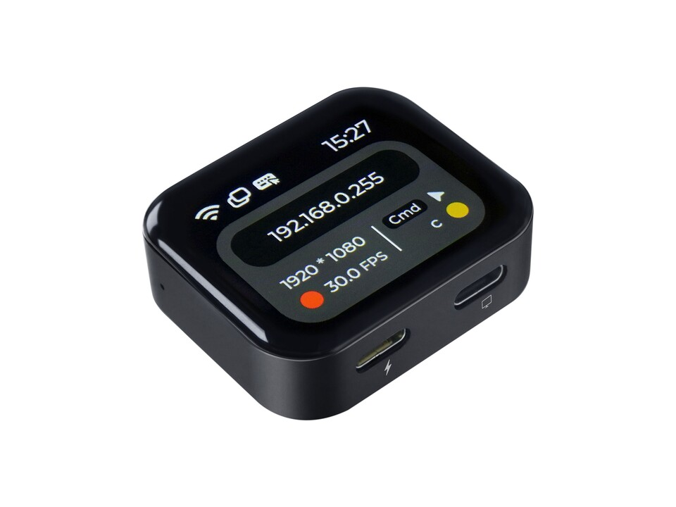

## 简介

NanoKVM Go 是 NanoKVM 系列中的便携式 IP-KVM 工具，面向随身维护、临时接入和远程运维场景。它通过 USB-C 接入被控设备，将画面查看、键鼠控制和远程访问集中到浏览器中完成。

与传统远程桌面不同，NanoKVM Go 不依赖目标主机预先安装远程软件；即使系统无法启动，也可以用于 BIOS/UEFI 设置、系统安装、启动项调整和故障排查。

## 视频演示

<iframe src="//player.bilibili.com/player.html?isOutside=true&bvid=BV1iyTq6pEsD&p=1" scrolling="no" allowfullscreen style="width:90%; max-width:960px; aspect-ratio:16/9; height:auto; border:0; display:block;margin:0 auto;"></iframe>

## 使用场景

+ 服务器管理：远程查看目标主机画面，并进行键盘、鼠标操作；
+ 远程装机：进入 BIOS/UEFI，调整启动项，配合镜像完成系统安装；
+ 故障排查：当远程桌面、SSH 或系统服务不可用时，通过硬件级画面继续维护；
+ 临时接入：小体积机身适合外出携带、现场调试和多设备轮换使用；
+ 异地访问：可配合 Tailscale 使用，无需公网 IP，也无需在路由器上配置端口转发。

## 参数

NanoKVM Go 侧面提供两个 Type-C 接口和一个复位孔。带闪电标志的是电源接口，带屏幕标志的是数据接口，中间小孔为 Reset 复位按键。

| 项目 | NanoKVM Go |
| --- | --- |
| 产品名称 | NanoKVM Go |
| 产品定位 | 便携式 IP-KVM |
| 访问方式 | 浏览器访问 |
| 数据输入接口 | USB-C × 1 |
| 数据输入协议 | DP Alt Mode |
| 电源输入接口 | USB-C × 1 |
| 电源输入协议 | USB-PD |
| 支持供电档位 | 5V⎓3A、9V⎓3A、15V⎓3A(Max) |
| 视频规格 | 3840 × 2160 @ 30Hz；3440 × 1440 @ 60Hz；2560 × 1440 @ 60Hz；1920 × 1080 @ 60Hz |
| 典型功能 | 远程视频查看、键盘与鼠标控制、基于网络的管理 |
| 远程访问 | 支持通过 Tailscale 等方式进行异地访问 |
| 工作温度 | 0°C ~ 40°C |
| 工作湿度 | ≤85%RH，非凝结 |

> NanoKVM Go 的数据接口需要被控设备的 Type-C 接口支持 DP Alt Mode 视频输出功能。仅具备充电或普通数据传输能力的 Type-C 接口，可能无法正常使用远程显示功能。

## NanoKVM Go 软硬件资料

待补充。

## 购买入口

待补充。

## 产品反馈

如果您在使用过程中有任何问题或建议，请通过以下渠道反馈：

+ [Github issues](https://github.com/sipeed/NanoKVM-Go/issues)
+ [NanoKVM GitHub 仓库](https://github.com/sipeed/NanoKVM-Go)
+ [MaixHub 论坛](https://maixhub.com/discussion/nanokvm)
+ QQ 交流群: 703230713
