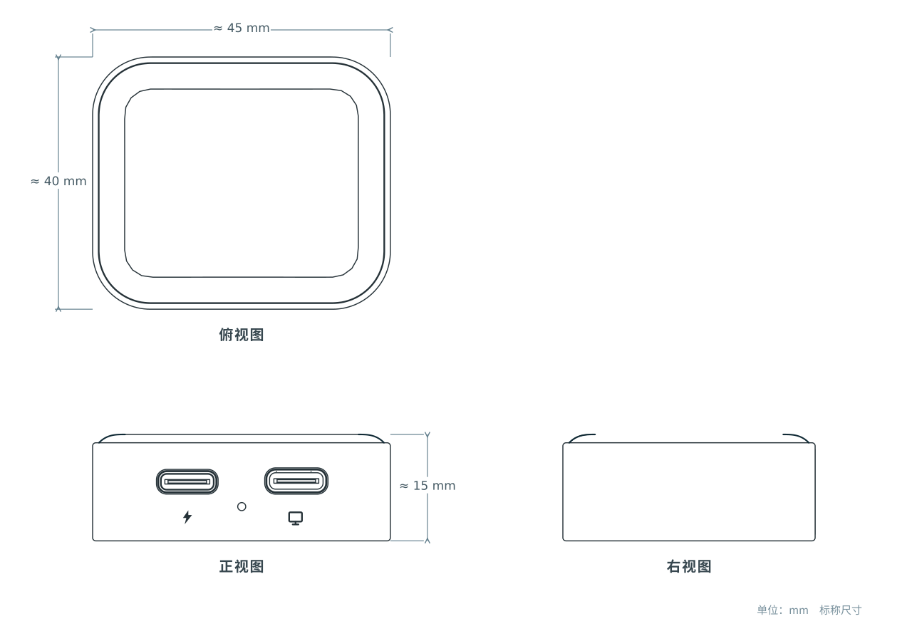

## 简介

NanoKVM Go 系列是一款针对手机、平板和便携电脑优化的掌上 USB-C KVM。完成初始网络配置后，将它连接到支持 USB-C 视频输出的设备，即可从另一台手机或电脑的浏览器中查看画面并进行点击、滑动和输入。它尤其适合帮助异地家人处理手机和平板上的设置问题，也适合随身携带进行设备维护。

与远程桌面软件不同，NanoKVM Go 从硬件层获取画面并模拟键盘、鼠标和存储设备。被控端无需预装专用驱动或远程控制客户端；即使操作系统卡死、无法联网或尚未启动，也能用于 UEFI/BIOS 设置、系统安装和故障排查。

## 视频介绍

<iframe src="https://player.bilibili.com/player.html?isOutside=true&bvid=BV1iyTq6pEsD&p=1" title="NanoKVM Go 中文产品介绍" scrolling="no" allowfullscreen style="width:100%; max-width:800px; aspect-ratio:16/9; height:auto; border:0; display:block; margin:0 auto;"></iframe>

## 使用场景

### 帮助异地家人操作手机和平板

可以将已经完成 WiFi 和远程访问配置的 NanoKVM Go 留在家中。需要帮助时，家人只需用全功能 USB-C 线将它接到手机或平板，你便可以从自己的手机或电脑浏览器中直接查看并操作设备，不必再通过电话逐步描述按钮的位置。

辅助 USB-C 接口支持 USB-PD 充电直通，可在长时间控制时继续为被控设备供电。被控端不需要安装远程控制 App，但接口必须支持视频输出；iPhone 还需要开启辅助触控，具体设置请参考[快速开始中的手机连接注意事项](./quick_start.html#%E6%89%8B%E6%9C%BA%E8%BF%9E%E6%8E%A5%E6%B3%A8%E6%84%8F%E4%BA%8B%E9%A1%B9)。

### 随身维护笔记本和迷你主机

NanoKVM Go 的机身约为 45 × 40 × 15 mm，可以随工具包携带，在 MacBook、Mac mini、Windows 笔记本、迷你主机和 Steam Deck 等设备之间快速切换。主 USB-C 接口通过一根全功能线缆同时承载视频、音频、键鼠、虚拟 U 盘和虚拟网卡，减少传统 KVM 所需的转接器和线缆。

NanoKVM Go 使用 2.4 GHz / 5 GHz 双频 WiFi 6 传输画面和控制信号。在局域网之外，可以使用内置的 Tailscale 功能建立安全连接，无需将 KVM 管理端口直接暴露到公网。详细设置请参考 [Tailscale 使用指南](./network/tailscale.html)。

### 在系统失效时继续救援

NanoKVM Go 的控制不依赖被控设备中的操作系统或网络服务。当远程桌面、SSH 或系统本身无法使用时，仍可以查看启动画面、进入 UEFI/BIOS、修改启动项，或挂载系统镜像进行安装和修复。

如果设备完全卡死，还可以连接手指机器人，从远端物理按下电源键。具体接线与操作请参考[手指机器人指南](./finger_robot.html)。

<video src="./../../../assets/NanoKVM/go/introduction/nanokvm-go-finger-robot.mp4" aria-label="通过 NanoKVM Go 和手指机器人远程按下设备电源键" style="width:100%; max-width:800px; display:block; margin:0 auto;" playsinline controls autoplay loop muted preload="metadata"></video>

### 将真实设备接入 AI Agent

NanoKVM Go 和 Go+ 都可以由用户主动开启 MCP Server。兼容 MCP 的 AI 工具可通过 NanoKVM Go 获取被控设备画面，并发送键盘和鼠标操作，相当于为 AI Agent 提供访问真实设备的“眼睛和双手”。配置方法请参考 [MCP 功能指南](./mcp.html)。

NanoKVM Go+ 进一步提供记忆织网：设备定期从变化的画面中提取文字和上下文，形成可供检索和 AI 工具调用的操作记录。该功能不是连续录像，详细工作方式、模型配置和隐私注意事项请参考[记忆织网指南](./memory_weaving.html)。

> MCP 和记忆织网均需由用户主动启用。画面可能包含账号、消息或其他敏感信息，请只在可信网络和可信 AI 工具中使用，并妥善保管 API Key。

## 型号与参数

NanoKVM Go 系列包含 **NanoKVM Go** 和 **NanoKVM Go+** 两个型号。两者拥有相同的 KVM、MCP、无线网络和扩展能力；Go+ 增加了端侧 AI 处理器、更大的内存与存储空间，以及屏幕记忆相关功能。

如果只需要远程查看和控制设备，NanoKVM Go 已经具备完整的 KVM 能力；如果希望搜索曾经出现在屏幕上的文字，或让 AI Agent 获取更连续的工作上下文，请选择 NanoKVM Go+。

| 项目 | NanoKVM Go | NanoKVM Go+ |
| --- | --- | --- |
| 适合场景 | 家庭远程协助、移动维护、远程装机、MCP 控制 | 家庭远程协助、移动维护、远程装机、MCP 控制，以及屏幕记忆、OCR 检索和工作过程回放 |
| 处理器 | 双核 Cortex-A53 | 双核 Cortex-A53 + 3.2 TOPS NPU |
| 内存 | 256 MB LPDDR4x | 512 MB LPDDR4 |
| 存储 | 16 GB | 64 GB |
| 显示屏 | 1.83 英寸彩色触摸屏 | 1.83 英寸彩色触摸屏 |
| 最大视频采集能力 | 4K @ 50 Hz；2K @ 90 Hz | 4K @ 50 Hz；2K @ 90 Hz |
| 当前内置 EDID 模式 | 3840 × 2160 @ 50 Hz；3840 × 2160 @ 30 Hz；3440 × 1440 @ 60 Hz；2560 × 1440 @ 60 Hz；1920 × 1080 @ 60 Hz | 3840 × 2160 @ 50 Hz；3840 × 2160 @ 30 Hz；3440 × 1440 @ 60 Hz；2560 × 1440 @ 60 Hz；1920 × 1080 @ 60 Hz |
| 典型视频延迟 | 约 60 ms @ 1080P60；80 ms @ 2K60；100 ms @ 4K30 | 约 60 ms @ 1080P60；80 ms @ 2K60；100 ms @ 4K30 |
| 音频 | 双向音频 | 双向音频 |
| 无线网络 | WiFi 6，2.4 GHz / 5 GHz，最高 286 Mbps | WiFi 6，2.4 GHz / 5 GHz，最高 286 Mbps |
| 远程访问 | 浏览器；内置 Tailscale | 浏览器；内置 Tailscale |
| MCP Server | 支持，由用户主动启用 | 支持，由用户主动启用 |
| 记忆织网 | — | 支持 |
| 屏幕延时回放 | — | 支持 |
| 虚拟设备 | 键盘、鼠标、U 盘和虚拟网卡 | 键盘、鼠标、U 盘和虚拟网卡 |
| 系统镜像 | 支持 ISO 挂载和远程系统安装 | 支持 ISO 挂载和远程系统安装 |
| 接口 | 1 × USB-C 数据接口（DP Alt Mode）；1 × USB-C 供电/充电接口（USB-PD） | 1 × USB-C 数据接口（DP Alt Mode）；1 × USB-C 供电/充电接口（USB-PD） |
| 手指机器人 | 支持，使用 USB-PD 供电接口上的扩展 IO | 支持，使用 USB-PD 供电接口上的扩展 IO |
| 尺寸 | 约 45 × 40 × 15 mm | 约 45 × 40 × 15 mm |
| 典型功耗（4K30） | 约 1.6 W | 约 2.0 W |
| 工作温度 | 0 °C ～ 40 °C | 0 °C ～ 40 °C |
| 工作湿度 | ≤85 %RH，非凝结 | ≤85 %RH，非凝结 |

> `4K @ 50 Hz / 2K @ 90 Hz` 表示硬件最大视频采集能力；被控设备实际可以选择的分辨率与刷新率由当前 EDID、操作系统和接口能力共同决定。当前固件内置 EDID 的最高 4K 模式为 `3840 × 2160 @ 50 Hz`，具体设置和完整模式列表请参考[分辨率与 EDID 设置](./resolution.html)。

## 兼容设备

作为被控设备，Apple 产品需使用下表列出的原生 USB-C 视频输出型号；其他设备则必须确认实际使用的 USB-C 接口支持 **DisplayPort Alt Mode**。仅支持充电或普通 USB 数据传输的接口无法输出画面。以下 Apple 型号范围根据 Apple 当前官方说明整理，后续新型号仍需以 Apple 技术规格为准。

| 设备类型 | 兼容范围与连接要求 |
| --- | --- |
| 手机 | **iPhone**：iPhone 15 全系列、iPhone 16 系列（不含 iPhone 16e）、iPhone 17 系列（不含 iPhone 17e），使用时需开启辅助触控；其他 iPhone 不能通过 USB-C 直接输出画面。**Android**：实际使用的 USB-C 接口必须支持 DisplayPort Alt Mode，部分手机首次连接时需要确认外接显示或 USB 设备权限。 |
| 平板 | **iPad Pro**：11 英寸第 1 代、12.9 英寸第 3 代及后续 USB-C 机型；**iPad Air**：第 4 代及后续；**iPad mini**：第 6 代及后续；**iPad**：第 10 代及后续。更早的 Lightning 接口 iPad 不能直接连接。Android 平板和其他平板电脑必须使用支持 DisplayPort Alt Mode 的 USB-C 接口。 |
| 笔记本 | **MacBook**：12 英寸 2015–2017；**MacBook Air**：2018 年及后续；**MacBook Pro**：2016 年及后续。Windows / Linux 笔记本必须使用支持 DisplayPort Alt Mode 的 USB-C 或 Thunderbolt 接口。 |
| 台式设备 | **iMac / iMac Pro**：2017 年及后续；**Mac mini**：2018 年及后续；**Mac Studio**：2022 年及后续；**Mac Pro**：2019 年及后续。必须连接支持 DisplayPort 输出的 Thunderbolt（USB-C）接口；部分机型上仅标为 USB-C / USB 3 的接口可能只支持数据传输。其他迷你主机和电脑必须使用支持 DisplayPort Alt Mode 的 USB-C 接口。 |
| 游戏掌机 | Steam Deck 等使用支持 DisplayPort Alt Mode 的 USB-C 接口的设备；不同系统的键鼠或触控行为可能有所区别。 |

Apple 官方资料：[iPhone USB-C 外接显示支持](https://support.apple.com/zh-cn/105099)、[iPad USB-C 外接显示支持](https://support.apple.com/zh-cn/108894)、[MacBook（2015）](https://support.apple.com/kb/SP712?locale=zh_CN)、[MacBook Air（2018）](https://support.apple.com/kb/SP783?locale=zh_CN)、[MacBook Pro（2016）](https://support.apple.com/kb/SP747?locale=zh_CN)、[iMac（2017）](https://support.apple.com/kb/SP758?locale=zh_CN)、[Mac mini（2018）](https://support.apple.com/kb/SP782?locale=zh_CN)、[Mac Studio（2022）](https://support.apple.com/kb/SP865?locale=zh_CN)、[Mac Pro（2019）](https://support.apple.com/kb/SP797?locale=zh_CN)。

控制端只需能够访问 NanoKVM Go 的网络并运行现代浏览器，可以是另一台手机、平板或电脑。连接线应使用包装内附线缆或其他支持视频传输的全功能 USB-C 线。

## 外观与尺寸

NanoKVM Go 配备 1.83 英寸触摸屏，用于显示网络、分辨率和运行状态，也可进行网络配置及部分本机操作。

机身内置磁铁，可固定在金属机箱或其他适合的金属表面上；高负载运行时，金属表面也能帮助被动散热。

## 软硬件资源

- [NanoKVM Go GitHub仓库](https://github.com/sipeed/NanoKVM-Go)

## 购买入口

- [NanoKVM Go Kickstarter 众筹页面](https://www.kickstarter.com/projects/zepan/nanokvm-go-worlds-first-ai-native-4k-usb-c-kvm?ref=2804x3)

## 产品反馈

如果您在使用过程中遇到问题或有改进建议，可以通过以下渠道反馈：

- [GitHub Issues](https://github.com/sipeed/NanoKVM-Go/issues)
- [MaixHub 论坛](https://maixhub.com/discussion/nanokvm)
- QQ 交流群：703230713
