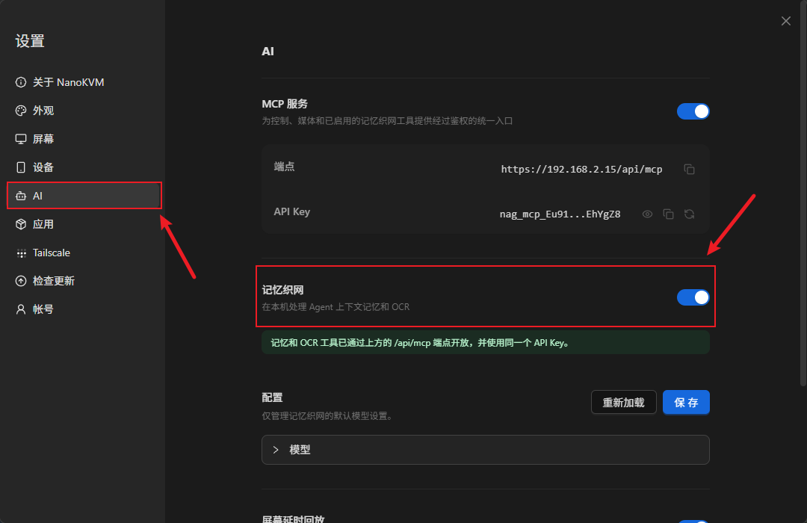
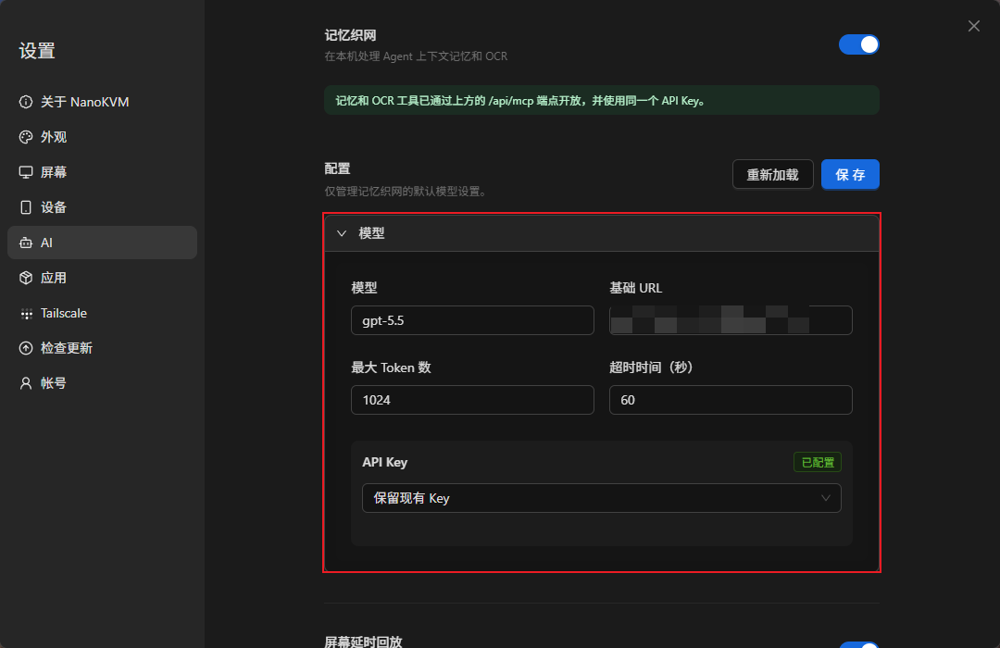
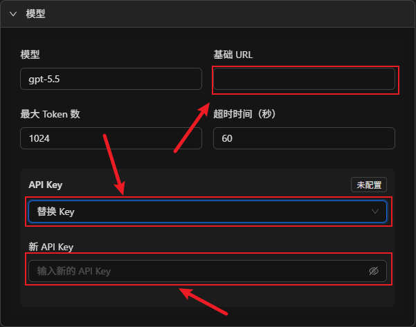
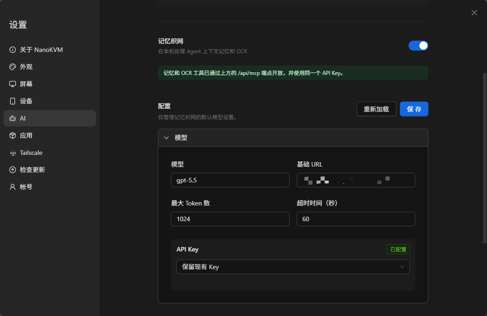

## 简介

记忆织网用于记录被控设备上的操作过程，并帮助 AI 回顾和整理这段操作。

> 记忆织网仅支持 NanoKVM Go+，NanoKVM Go 不支持该功能。

开启记忆织网后，NanoKVM Go+ 会定期检查被控设备的画面变化，识别变化画面中的文字并形成操作记录。之后可以在已经连接 NanoKVM Go MCP 的 AI 工具中提问，让 AI 说明操作过哪些内容，或者按顺序整理整个操作过程。

该功能适合以下场景：

+ 回顾刚刚完成的一系列操作；
+ 整理软件安装、系统配置或故障排查步骤；
+ 确认某段时间内打开过哪些页面、修改过哪些设置；
+ 根据实际操作过程生成步骤说明或工作记录。

> 记忆织网识别和处理的画面内容可能包含账号、聊天内容、文件名、密码、密钥等敏感信息。开始使用前，请关闭不希望被记录的页面，并确认所填写的模型服务和连接的 AI 工具均可信。

## 工作原理

记忆织网不是连续录像功能，也不会默认保存历史截图。它会定期采样被控设备画面；发现画面变化后，提取其中的文字和相关上下文，形成基于 OCR 的操作记录。NanoKVM Go+ 使用 `设置 > AI` 中配置的模型整理记忆织网内容，并通过 `/api/mcp` 端点向 AI 工具开放记忆和 OCR 工具。

```text
NanoKVM Go+ 定期采样被控设备画面
          |
          v
识别画面文字并形成操作记录
          |
          | /api/mcp
          v
AI 工具读取记录并回答问题
```

记忆和 OCR 工具与 NanoKVM Go MCP 使用相同的端点和 `API Key`。因此，使用记忆织网前，需要先按照 MCP 文档将 AI 工具连接到 NanoKVM Go+，再为记忆织网配置可用的模型。

## 使用前准备

使用记忆织网前，请先确认：

+ 使用的是 NanoKVM Go+；NanoKVM Go 不支持记忆织网，设置页面不会显示该功能；
+ NanoKVM Go+ 已正常连接被控设备；
+ NanoKVM Go+ 网页控制端可以正常显示被控设备画面；
+ NanoKVM Go+ 的系统和应用已更新到支持记忆织网的版本；
+ NanoKVM Go+ 已连接网络，并且可以访问准备使用的模型服务；
+ 已准备模型名称、基础 URL 和 API Key；
+ 控制设备上已安装支持 MCP 的 AI 工具。

如果还没有配置 NanoKVM Go MCP，请先阅读 [MCP 功能](./mcp.html)，将 NanoKVM Go MCP 添加到 AI 工具并确认连接成功，然后再继续配置记忆织网。

## 开启记忆织网并配置模型

### 开启记忆织网

1. 在浏览器地址栏输入 NanoKVM Go+ 的 IP 地址，打开网页控制端；
2. 登录 NanoKVM Go+，点击工具栏中的设置按钮；


3. 在设置页面左侧选择 `AI`；找到 `记忆织网` 并打开开关。



开启后，继续填写下方的默认模型配置。该模型用于处理记忆织网内容。

### 填写模型配置

在记忆织网开关下方填写模型配置。模型服务必须提供兼容 OpenAI Chat Completions 格式的接口：

| 配置项 | 说明 |
| --- | --- |
| `模型` | 填写模型服务提供的模型名称，必须与服务端实际支持的模型 ID 一致 |
| `基础 URL` | 填写兼容 OpenAI 接口的基础地址，例如 `https://api.openai.com/v1`。地址应在 `/chat/completions` 之前结束，不要填写完整的 `/chat/completions` 请求地址 |
| `最大 Token 数` | 限制单次模型调用使用的最大 Token 数；数值过小可能导致生成内容不完整 |
| `超时时间（秒）` | 模型请求的最长等待时间；网络较慢或模型响应较慢时可以适当增加 |
| `API Key` | 用于访问模型服务的认证凭据 |



`API Key` 下拉菜单提供以下操作：

+ `保留现有 Key`：继续使用已经保存的 Key，不修改当前配置；
+ `替换 Key`：填写并保存新的 Key；
+ `清除 Key`：删除已经保存的 Key。

首次配置时，选择 `替换 Key`，然后填写模型服务提供的 API Key。修改其他模型参数但不需要更换 Key 时，选择 `保留现有 Key` 即可。



如果已经保存过 API Key，页面会显示 `已配置`。需要更换时，选择 `替换 Key` 并填写新的 API Key。

### 保存配置

填写完成后，点击页面右上方的 `保存`。如果需要放弃尚未保存的修改并重新读取当前配置，可以点击 `重新加载`。

保存后，请确认：

+ 记忆织网开关处于开启状态；
+ 模型名称和基础 URL 填写正确；
+ API Key 显示为已配置；
+ 页面没有显示配置保存失败。

> 保存成功只表示配置已经写入 NanoKVM Go+，不代表设备已经成功连接模型服务，网页目前也不会单独测试模型连接。请继续完成下方的短操作测试，等待 1～2 分钟后再通过 AI 工具查询记录，以确认画面采集和 MCP 查询流程正常。如果模型服务提供调用日志，还可以检查是否出现来自 NanoKVM Go+ 的成功 Chat Completions 请求，以单独确认模型连接。



请注意，模型服务 API Key 与 NanoKVM Go MCP API Key 用途不同，不要混用：

| API Key | 用途 | 填写位置 |
| --- | --- | --- |
| 模型服务 API Key | 允许 NanoKVM Go+ 调用所配置的模型 | `设置 > AI > 记忆织网 > 配置` |
| NanoKVM Go MCP API Key | 允许外部 AI 工具连接 NanoKVM Go MCP | AI 工具的 MCP Server 配置 |

## 记录操作过程

模型和 MCP 配置完成后，保持记忆织网开关开启，然后像平时一样通过 NanoKVM Go+ 操作被控设备即可。

首次测试时，可以做一点简单的操作。例如，可以依次执行：

1. 打开系统设置；
2. 进入系统信息或“关于”页面；
3. 查看设备名称、系统版本等非敏感信息；
4. 返回设置首页；
5. 关闭设置并返回桌面。

这段操作包含多次明显的页面变化，但不会修改被控设备的配置，适合用来确认记忆织网是否可以正确记录和整理操作过程。

记忆织网约每 10 秒采样一次被控设备画面。采样到与上一次不同的画面后，NanoKVM Go+ 会识别画面文字并形成新的 OCR 操作记录，不需要手动截图或单独点击开始记录。

记忆织网保存的是 OCR 文字记录和整理后的记忆，不是可供回看的历史截图。纯图形、图标或没有清晰文字的变化可能无法形成有效记录。如果需要回看实际画面，请另外开启 `设置 > AI` 中的 `屏幕延时回放` 功能。

为了让后续回顾结果更清晰，建议：

+ 每完成一个关键操作后，让重要页面保持显示超过一个完整采样周期，建议等待约 15 秒；
+ 避免快速、反复切换无关页面；
+ 不要在画面中显示不希望被记录的密码、密钥或个人信息；
+ 完成记录后，如果暂时不再使用该功能，可以返回 `设置 > AI` 关闭记忆织网开关。

## 使用 AI 回顾操作过程

打开已经连接 NanoKVM Go MCP 的 AI 工具，并用自然语言询问刚才的操作过程。

例如：

```text
请使用 NanoKVM Go+ 的记忆工具，告诉我刚才操作了什么。
```

```text
请按时间顺序整理刚才的操作步骤，并说明每一步进入了哪个页面、完成了什么操作。
```

```text
根据刚才的记录，帮我整理一份可以重复执行的操作指南。
```

```text
根据刚才的记录，告诉我查看了哪些系统信息，并确认操作过程中是否修改过设置。
```

AI 工具会通过 NanoKVM Go MCP 调用记忆和 OCR 工具，并根据已保存的 OCR 操作记录和整理后的记忆回答问题。回答的详细程度会受到记录是否完整、页面文字是否清晰、模型配置以及所使用 AI 工具能力的影响。

## 确认功能正常

首次使用时，建议只执行一段包含 3～5 次明显页面变化的短操作。每个重要页面保持显示约 15 秒，然后检查：

+ `设置 > AI` 中的记忆织网开关已经开启；
+ 模型配置已经保存，API Key 显示为已配置；
+ AI 工具中的 NanoKVM Go MCP 保持已连接状态；
+ AI 能够调用记忆或 OCR 工具；
+ AI 能够说明刚才打开或操作过的页面；
+ AI 整理出的步骤顺序与实际操作基本一致；
+ 如果模型服务提供调用日志，完成操作并等待 1～2 分钟后，可以看到来自 NanoKVM Go+ 的成功 Chat Completions 请求。

## 常见问题

### 设置页面中没有记忆织网

请检查：

+ 当前设备是否为 NanoKVM Go+；NanoKVM Go 不支持记忆织网；
+ NanoKVM Go+ 的系统和应用是否已经更新到支持该功能的版本。

### 模型配置无法保存或调用失败

请检查：

+ 模型名称是否与模型服务实际支持的模型 ID 一致；
+ 模型服务是否提供兼容 OpenAI Chat Completions 格式的接口；
+ 基础 URL 是否在 `/chat/completions` 之前结束；
+ 模型服务 API Key 是否有效，是否具有对应模型的调用权限；
+ NanoKVM Go+ 是否可以访问模型服务；
+ 模型服务账号是否有可用额度；
+ 超时时间是否过短。

### AI 工具无法读取记忆织网记录

请检查：

+ 是否已经按照 [MCP 功能](./mcp.html) 完成配置；
+ NanoKVM Go MCP 是否显示为已连接；
+ MCP `端点` 和 MCP `API Key` 是否填写正确；
+ 是否误把模型服务 API Key 填入了 MCP 配置；
+ 当前 AI 工具是否允许调用 NanoKVM Go MCP 工具；
+ 记忆织网开关是否已经开启；
+ NanoKVM Go+ 系统和应用版本是否支持该功能。

### 操作后没有生成新的记录

请检查：

+ 记忆织网开关是否处于开启状态；
+ NanoKVM Go+ 网页控制端是否可以正常显示被控设备画面；
+ 操作前后页面是否有明显变化；
+ 重要页面是否保持显示超过 10 秒；
+ 页面中是否有清晰、可识别的文字；
+ 被控设备是否停留在黑屏、锁屏或无视频信号状态。

### AI 整理的步骤不完整或顺序不准确

可能的原因包括：

+ 页面切换过快，关键页面没有稳定显示；
+ 多个操作发生在同一个页面内，画面变化不明显；
+ 操作主要表现为图形或图标变化，没有可识别的文字；
+ 页面文字过小、被遮挡或画面不清晰；
+ `最大 Token 数` 设置过小，回答被提前截断；
+ 提问范围不够明确。

可以重新执行一段较短的操作，让每个关键页面保持显示约 15 秒，并在提问时明确要求 AI 按时间顺序整理。

## 隐私与安全注意事项

+ 记忆织网处理的是被控设备画面，可能包含敏感信息；
+ 从画面中识别出的文字和整理内容可能会发送到所配置的模型服务，请在使用前确认模型服务的隐私和数据保留政策；
+ 只在确有需要时开启记忆织网，使用完成后及时关闭；
+ 只将 NanoKVM Go MCP 连接到可信的 AI 工具；
+ 不要泄露模型服务 API Key 或 NanoKVM Go MCP API Key；
+ 不要将 MCP 服务直接暴露到公网；
+ 分享 AI 整理结果或操作截图前，先检查并遮盖账号、密码、密钥和个人信息。
