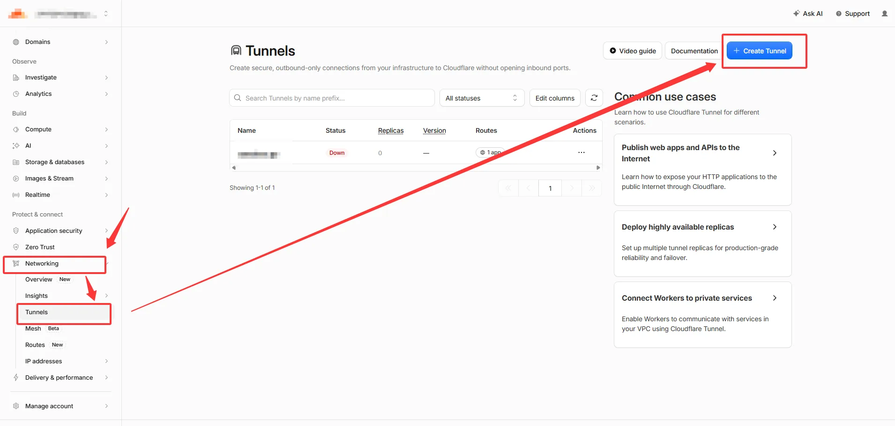
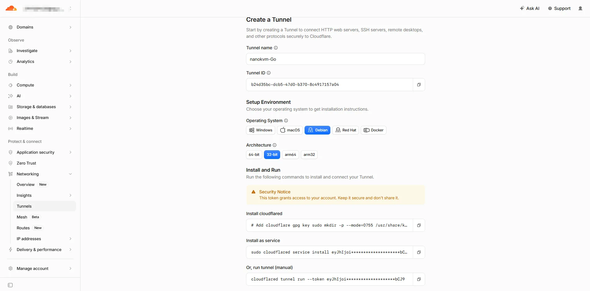
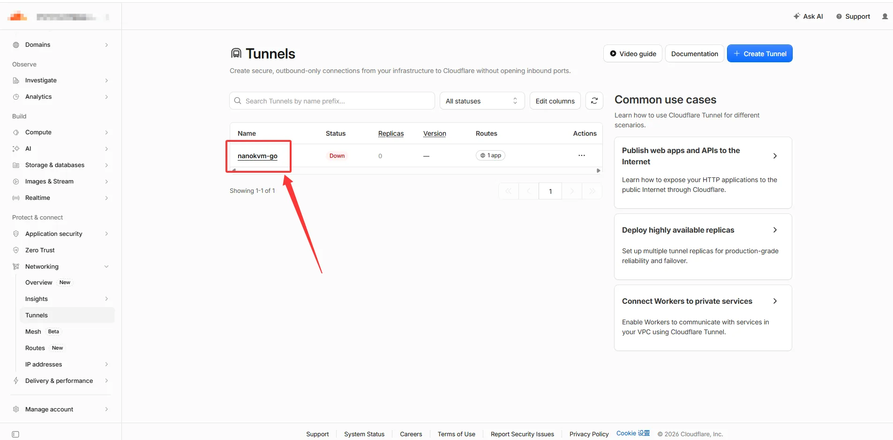
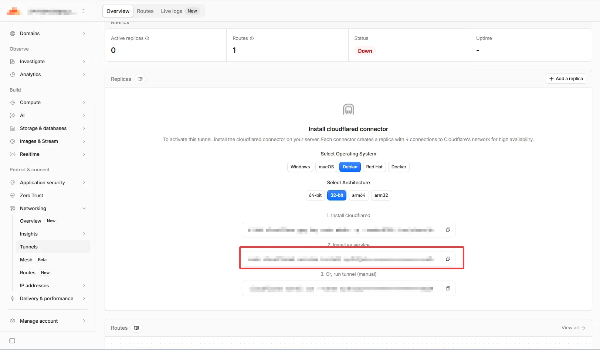
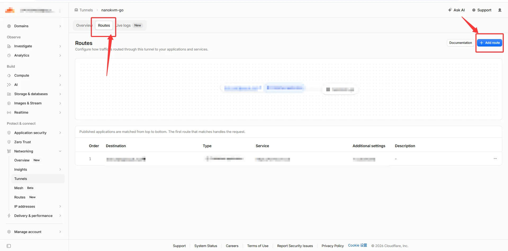
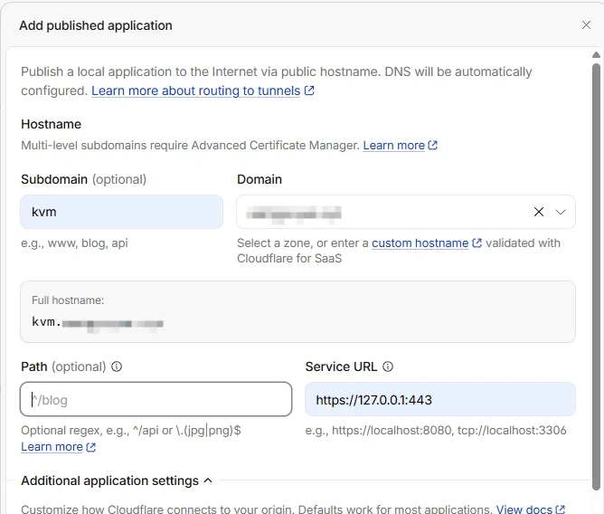
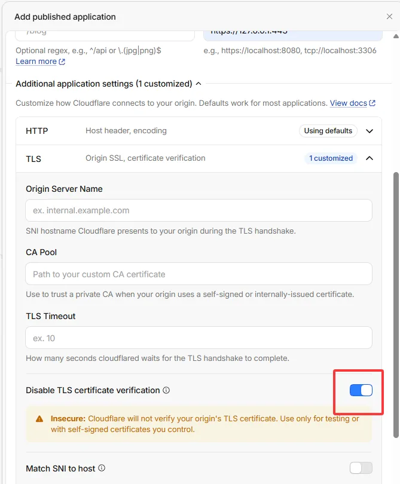

# 配置 Cloudflare Tunnel

Cloudflare Tunnel 通过运行在 NanoKVM Go 上的 `cloudflared` 主动连接 Cloudflare，使设备无需公网 IP、端口转发或入站防火墙规则即可从外网访问。
如果你完全不了解域名、DNS 的用法，建议直接**参考第二部分**；如果你已经知道如何购买域名，以及如何修改 DNS 记录，则**参考第三部分**。

>  无论选择哪种方式，都应先修改 NanoKVM Go 的默认密码。长期使用时，建议再配置 Cloudflare Access。

## 第一部分：基础配置（安装与准备）

### 使用前准备

开始配置前，请确认：

- NanoKVM Go 已连接互联网；
- 可以在局域网内正常打开 NanoKVM Go 网页控制端；
- 已开启 SSH，并知道设备的局域网 IP 和 SSH 密码；
- 可以使用 SSH 和 SCP 的电脑；
- 正式 Tunnel 用户已经准备好 Cloudflare 账号和自有域名。

### 登录 NanoKVM Go

在 Windows PowerShell 或其他终端中执行：

```bash
ssh root@192.168.255.255
```

将 `192.168.255.255` 替换为 NanoKVM Go 的实际局域网 IP。首次连接时，确认 IP 地址无误后输入 `yes` 接受设备指纹，再输入 SSH 密码。

### 安装 cloudflared

#### 下载并上传程序

在电脑上打开 [cloudflared Releases](https://github.com/cloudflare/cloudflared/releases)，下载最新的 `cloudflared-linux-armhf`，不要下载 `arm64` 或 `amd64` 版本。

PowerShell 复制到 NanoKVM Go

```bash
scp "C:\Users\你的用户名\Desktop\cloudflared-linux-armhf" root@192.168.255.255:/root/cloudflared
```

#### 安装

返回 NanoKVM Go 的 SSH 终端，执行：

```bash
install -m 0755 /root/cloudflared /usr/local/bin/cloudflared
/usr/local/bin/cloudflared --version
```

## 第二部分：免域名访问（Quick Tunnel）

Quick Tunnel 不需要 Cloudflare 账号或域名。`cloudflared` 启动后会生成一个随机的 `trycloudflare.com` 地址；进程停止后，该地址随之失效。

### 启动 Quick Tunnel

执行：

```bash
/usr/local/bin/cloudflared tunnel --no-autoupdate --protocol http2 --no-tls-verify --url https://127.0.0.1:443
```

命令会持续占用当前终端。等待日志中出现随机地址，例如：

```text
https://random-words.trycloudflare.com
```

复制完整地址到浏览器，确认能够打开 NanoKVM Go 登录页面。请勿公开该地址；随机地址本身不是访问密码。

### 停止 Quick Tunnel

返回运行 `cloudflared` 的终端，按 `Ctrl+C`。命令提示符重新出现后，Quick Tunnel 已停止，原随机地址不应再作为有效入口使用。

## 第三部分：域名访问（正式 Tunnel）

正式 Tunnel 使用固定域名，并让 `cloudflared` 随 NanoKVM Go 开机启动。本节采用 Cloudflare Dashboard 管理的 Tunnel，通过 Token 连接。

```text
外网浏览器
    │
    │ 访问 https://kvm.example.com
    ▼
Cloudflare
    │
    │ cloudflared 主动建立的出站连接
    ▼
NanoKVM Go（https://127.0.0.1:443）
```

### 将域名接入 Cloudflare

如果域名尚未接入 Cloudflare：

1. 在 Cloudflare Dashboard 中添加根域名；
2. 检查 Cloudflare 自动导入的 DNS 记录，避免误删现有的 A、CNAME、MX 或 TXT 记录；
3. 在域名注册商处，将 Nameserver 修改为 Cloudflare 为该域名分配的两条地址；
4. 等待 Cloudflare 中的域名状态变为 `Active`。

Cloudflare 分配的 Nameserver 因账号和域名而异，必须以当前 Dashboard 显示的值为准，不要照抄示例。

### 创建 Tunnel 并取得 Token

Cloudflare Dashboard 的界面可能调整，以下入口名称以当前页面为准：

1. 进入 `Networking` > `Tunnels`；



2. 创建一个 Cloudflare Tunnel；
3. 将 Tunnel 命名为容易识别的名称，例如 `nanokvm-go`；



4. 打开该 Tunnel 的 `Add a replica` 页面；



5. 复制页面提供的安装命令，从中取得以 `eyJ` 开头的 Tunnel Token。



> Tunnel Token 可以直接运行该 Tunnel。任何获得 Token 的人都可能连接到你的 Tunnel。不要把 Token、包含 Token 的命令或终端截图发送给他人；如果 Token 泄露，应立即在 Tunnel 页面轮换 Token，并更新 NanoKVM Go 上保存的 Token。

### 将 Token 保存到设备

Dashboard 给出的安装命令中，只有最后一段以 `eyJ` 开头的字符串是 Tunnel Token，前面的命令部分不要复制。

在 NanoKVM Go 的 SSH 终端中依次执行，把示例中的 `eyJ...` 替换为实际的 Token：

```bash
install -d -m 0700 /etc/cloudflared
echo 'eyJ...' > /etc/cloudflared/tunnel-token
chmod 600 /etc/cloudflared/tunnel-token
```

`install -d` 创建只有 root 能进入的目录，`echo` 通过重定向把 Token 写入文件，`chmod 600` 保证只有 root 可以读写。Token 只写入文件，不会打印到终端。

检查文件权限和字节数，不要查看文件内容：

```bash
stat -c '%a %n' /etc/cloudflared/tunnel-token
wc -c < /etc/cloudflared/tunnel-token
```

预期权限为 `600`。字节数为 Token 长度加 1（末尾换行符），正常是几百字节；如果输出 `0`，说明文件为空，需要重新写入。

### 前台测试 Tunnel 连接

执行：

```bash
/usr/local/bin/cloudflared tunnel --no-autoupdate --protocol http2 run --token-file /etc/cloudflared/tunnel-token
```

日志出现 `Registered tunnel connection` 后，表示 `cloudflared` 已连接到 Cloudflare。前台测试完成后按 `Ctrl+C` 停止进程。

此时只证明 Tunnel 连接已建立；在配置 Published application 之前，固定域名还不能访问 NanoKVM Go。

### 添加 Published application

在 Cloudflare Dashboard 中打开刚创建的 Tunnel：

1. 进入 `Routes`；



2. 选择 `Add route` > `Published application`；
3. `Subdomain` 填写计划使用的子域名，例如 `kvm`；
4. `Domain` 选择已经接入 Cloudflare 的根域名；
5. `Path` 留空；
6. `Service URL` 填写 `https://127.0.0.1:443`；



7. 展开附加应用设置，在 TLS 设置中启用 `Disable TLS certificate verification`；



8. 保存路由。

启用 `Disable TLS certificate verification` 是因为 NanoKVM Go 本地 HTTPS 服务通常使用自签名证书。该设置只影响 `cloudflared` 到本机 `127.0.0.1:443` 的连接，不会关闭浏览器与 Cloudflare 之间的 HTTPS。

### 创建 systemd 服务

在 NanoKVM Go 上创建 `/etc/systemd/system/cloudflared.service`：

```ini
[Unit]
Description=Cloudflare Tunnel for NanoKVM Go
After=network-online.target
Wants=network-online.target

[Service]
Type=simple
User=root
ExecStart=/usr/local/bin/cloudflared tunnel --no-autoupdate --protocol http2 run --token-file /etc/cloudflared/tunnel-token
Restart=always
RestartSec=5

[Install]
WantedBy=multi-user.target
```

加载服务并设置开机自动启动：

```bash
systemctl daemon-reload
systemctl enable --now cloudflared
systemctl status cloudflared --no-pager
```

当服务状态为 `active (running)`，且日志中出现 `Registered tunnel connection` 时，说明连接已建立。查看最近日志：

```bash
journalctl -u cloudflared -n 50 --no-pager
```

### 从外网访问

将电脑或手机切换到其他网络，在浏览器中访问配置的固定域名，例如：

```text
https://kvm.example.com
```

如果能够打开 NanoKVM Go 登录页面，请使用 NanoKVM Go 自身的账号和密码登录，并测试画面、键盘、鼠标和电源控制。

## 安全建议

- 为 NanoKVM Go 设置独立的强密码；
- 长期使用时，在 Cloudflare Zero Trust 中为该域名配置 Access 身份验证和允许策略；
- 不公开 Quick Tunnel 地址或正式 Tunnel 域名；
- 不要把 Tunnel Token、Cloudflare API Token 或 SSH 密码写入文档和截图；
- 定期更新 `cloudflared` 和 NanoKVM Go；
- 定期检查 Tunnel 连接、访问日志和 Cloudflare 账号成员；
- Token 泄露后立即轮换，不要只修改 NanoKVM Go 登录密码。

如果不再使用正式 Tunnel：

1. 在 Cloudflare Dashboard 中删除或停用对应的 Published application；
2. 在 NanoKVM Go 上执行 `systemctl disable --now cloudflared`；
3. 确认不再需要恢复后，再删除本地 Token 和服务文件；
4. 如果 Token 曾经泄露，在 Dashboard 中轮换 Token 并断开旧连接。

删除路由或 Token 会使原访问入口失效，操作前请确认没有其他用户或 Tunnel 副本仍在使用。