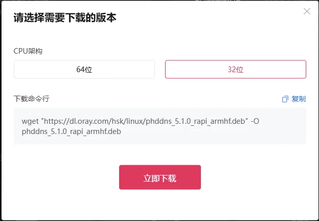
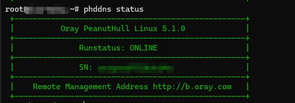
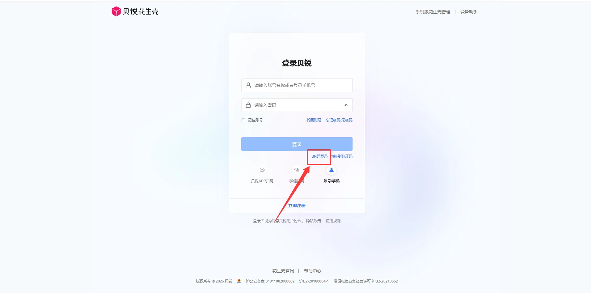
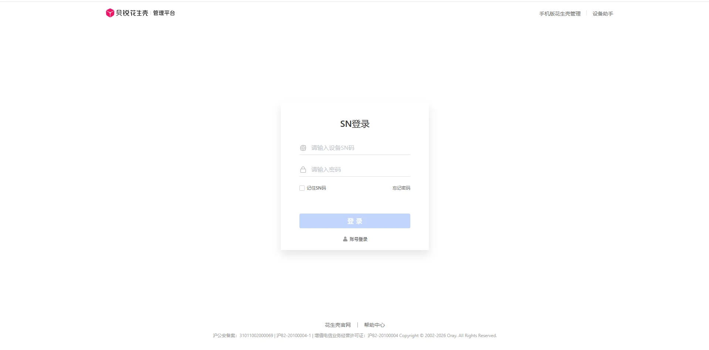
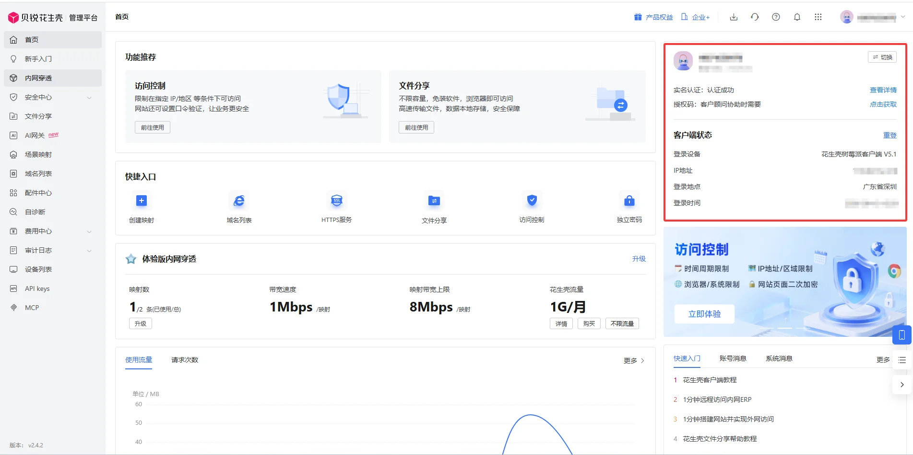
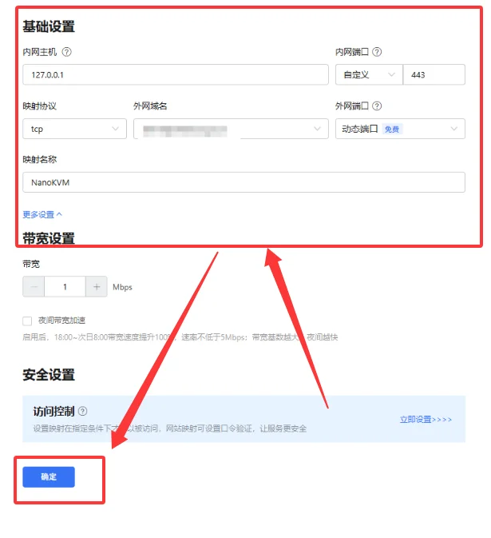
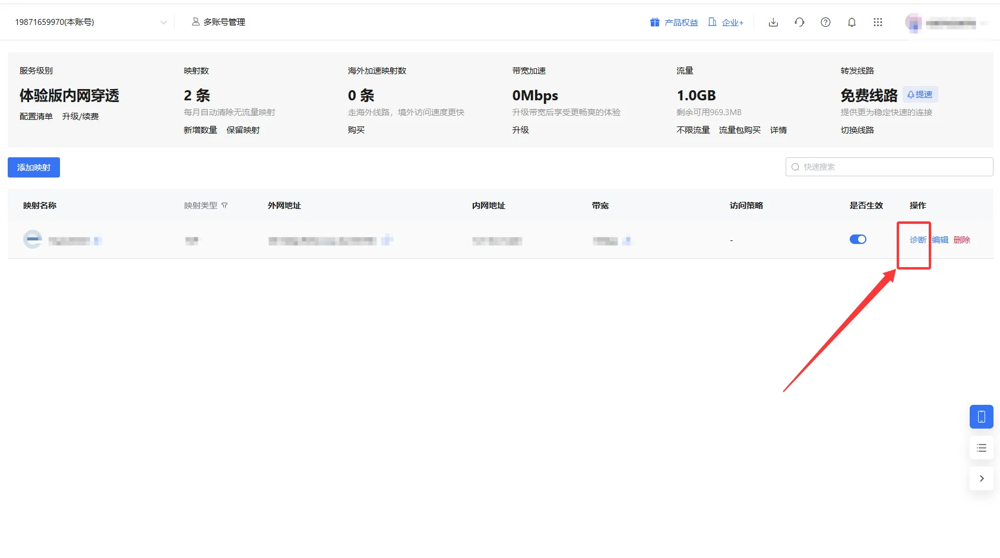
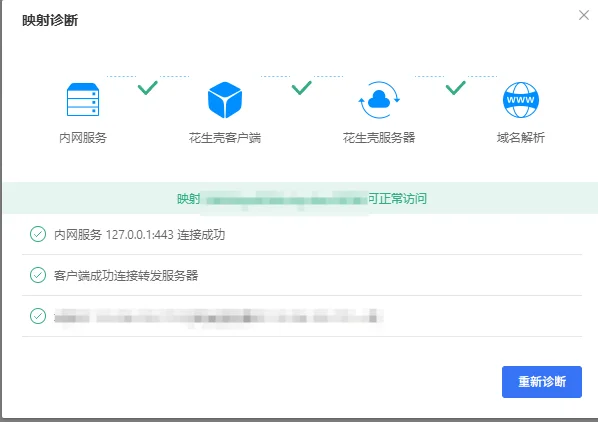
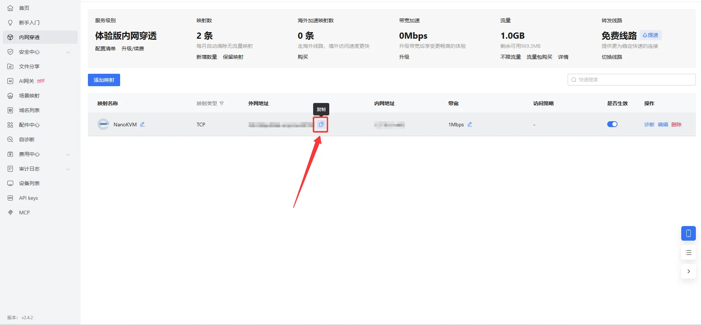

# 配置花生壳内网穿透

花生壳 PHTunnel 可以将 NanoKVM Go 的本地网页服务映射到公网。完成配置后，即使 NanoKVM Go 所在网络没有公网 IP，也可以通过花生壳分配的外网域名和端口访问设备。

```text
外网浏览器
    │
    │ 访问花生壳分配的域名和端口
    ▼
花生壳公网服务
    │
    │ PHTunnel 主动建立连接
    ▼
NanoKVM Go 本地 HTTPS 服务（127.0.0.1:443）
```

> NanoKVM Go 可以直接控制被控设备。将管理页面发布到公网前，请先修改 NanoKVM Go 的默认密码。不要公开设备 SN、设备密码或完整的外网访问地址。

## 使用前准备

开始配置前，请准备：

- 已连接互联网并可在局域网内访问的 NanoKVM Go；
- NanoKVM Go 的 SSH 登录信息；
- 与 NanoKVM Go `armhf` 架构匹配的花生壳 Linux 安装包；
- 可以使用 SSH 和 SCP 的电脑；
- 可正常登录的贝锐账号。

本文使用 `phddns_5.1.0_rapi_armhf.deb` 作为安装包示例。

## 打开 NanoKVM Go 的本地网页服务

在与 NanoKVM Go 相同局域网的电脑上打开浏览器，输入设备的局域网地址，例如：

```text
https://192.168.255.255/
```

如果能够打开 NanoKVM Go 登录页面，说明设备网络和网页服务基本正常。

> `192.168.255.255` 仅为示例地址。后续命令中的设备 IP 均应替换为 NanoKVM Go 的实际局域网 IP。

## 开启 SSH 并登录设备

登录 NanoKVM Go 网页控制端，进入 `设置` > `设备`，启用 SSH 服务。

在 Windows PowerShell 或其他终端中执行：

```bash
ssh root@192.168.255.255
```

确认 IP 地址无误后输入 `yes`，再输入 SSH 密码。输入密码时终端不会显示字符，属于正常现象。

## 安装包下载

### 上传安装包

下载好花生壳32位树莓派并放在桌面



在电脑的 PowerShell 中执行：

```powershell
scp "C:\Users\<用户名>\Desktop\phddns_5.1.0_rapi_armhf.deb" root@192.168.255.255:/root/
```

请将本地路径、安装包文件名和 NanoKVM Go 的 IP 替换为实际值。若电脑不能使用 SCP，也可以通过 WinSCP 等工具将安装包上传到设备的 `/root` 目录。

> 建议将安装包上传到 `/root`，不要放入空间可能较小且重启后会清空的 `/tmp`。

### 直接下载安装包

如果电脑无法上传安装包，也可以直接在 NanoKVM Go 的 SSH 终端中执行：

```bash
wget "https://dl.oray.com/hsk/linux/phddns_5.1.0_rapi_armhf.deb" -O /root/phddns_5.1.0_rapi_armhf.deb
```

## 安装客户端

返回 NanoKVM Go 的 SSH 终端，执行：

```bash
dpkg -i /root/phddns_5.1.0_rapi_armhf.deb
```

如果提示缺少依赖，可以在确认设备能够访问 Debian 软件源后执行：

```bash
apt-get update
apt-get -f install
dpkg -i /root/phddns_5.1.0_rapi_armhf.deb
```

安装完成后，终端通常会显示客户端状态、设备 SN、设备密码和远程管理入口。请勿将这些信息放入公开截图或聊天记录。

## 检查客户端状态

执行 `phddns status`，应显示 `ONLINE`。若未启动，执行 `systemctl enable --now phtunnel.service`。



## 验证本地 HTTPS 服务

在 NanoKVM Go 上执行：

```bash
curl -kI https://127.0.0.1:443
```

`-k` 用于忽略本地证书的信任错误，返回 `200`、`302`、`307` 等状态码即正常。若失败，用 `ss -lntp | grep -E ':(80|443)\b'` 检查实际监听端口。本文后续使用 `127.0.0.1:443`。

## 获取设备信息并绑定账号

### 获取设备 SN

花生壳客户端在本机提供管理接口。执行：

```bash
wget -qO- http://127.0.0.1:16062/ora_service/getsn; echo
```

返回内容中常见字段如下：

| 字段 | 含义 |
| --- | --- |
| `result_code` | `0` 表示接口调用成功 |
| `device_sn` | 花生壳设备 SN |
| `device_sn_pwd` | 设备登录密码 |
| `status` | `1` 表示在线，`2` 表示登录中，`3` 表示重试中，`0` 表示离线 |
| `public_ip` | 当前网络的公网出口 IP |

> 设备 SN 和设备密码属于敏感信息。不要将真实返回内容直接粘贴到公开问题或文档中。

### 绑定贝锐账号

1. 打开 [花生壳远程管理入口](http://b.oray.com)，选择设备登录-> SN 登录入口；



2. 输入刚刚的设备 SN 和设备密码；



3. 按照页面提示激活设备，并绑定到准备使用的贝锐账号；
4. 登录 [花生壳管理平台](https://console.hsk.oray.com/)，确认设备在线。



不同版本页面中的入口名称可能略有变化，请以当前页面为准。

绑定完成后，可以在 NanoKVM Go 上检查管理地址：

```bash
wget -qO- http://127.0.0.1:16062/ora_service/getmgrurl; echo
```

如果返回数据为空，通常表示设备尚未完成账号绑定。完成绑定后，重启服务并再次检查：

```bash
systemctl restart phtunnel.service
phddns status
```

> 部分账号或套餐可能限制同时在线的客户端数量。如果映射反复离线，请检查电脑、路由器、NAS 或其他设备上是否还运行着使用同一账号的花生壳客户端。

## 创建内网穿透映射

登录花生壳管理平台，进入内网穿透映射管理页面并添加映射。本文采用 TCP 透传方式，将外网端口连接到 NanoKVM Go 本机的 HTTPS 服务。

| 配置项 | 填写内容 |
| --- | --- |
| 映射名称 | `NanoKVM Go` |
| 映射协议 | `TCP` |
| 内网主机 | `127.0.0.1` |
| 内网端口 | `443` |
| 外网域名 | 选择账号下可用的域名 |
| 外网端口 | 选择平台分配或账号允许的端口 |



随后点击确认

## 检查映射并从外网访问

在内网穿透页面，管理平台提供诊断功能，请运行一次映射诊断。



诊断结果全部通过后，复制“外网地址”。



点击外网地址旁的复制图标即可复制。



随后将电脑或手机切换到其他网络，例如手机移动数据网络，在浏览器中输入刚刚复制的完整地址：

```text
https://<花生壳外网域名>:<外网端口>/
```

因为本文通过 TCP 转发 NanoKVM Go 的 HTTPS `443` 端口，所以必须保留 `https://` 和外网端口。

首次访问时，浏览器可能提示证书不受信任或域名不匹配。这是因为浏览器最终收到的是 NanoKVM Go 的本地证书，而该证书通常不是为花生壳外网域名签发的。确认访问地址确实属于自己的映射后，再根据浏览器提示决定是否继续。

## 日常使用与安全建议

- 为 NanoKVM Go 设置独立的强密码；
- 修改花生壳设备的初始密码；
- 不公开设备 SN、设备密码和完整外网地址；
- 根据账号能力启用访问控制，并尽可能限制允许访问的来源；
- 定期检查映射状态、访问日志和流量；
- 不需要远程访问时关闭映射；
- 定期更新 NanoKVM Go 和花生壳客户端。

> 花生壳隧道只负责提供网络入口，不会替代 NanoKVM Go 自身的账号认证。

## 停止使用

临时停用花生壳服务：

```bash
systemctl disable --now phtunnel.service
```

重新启用：

```bash
systemctl enable --now phtunnel.service
```

如果不再需要公网入口，还应在花生壳管理平台中停用或删除对应映射。删除映射会使原外网地址失效，操作前请确认没有其他用户仍在使用。